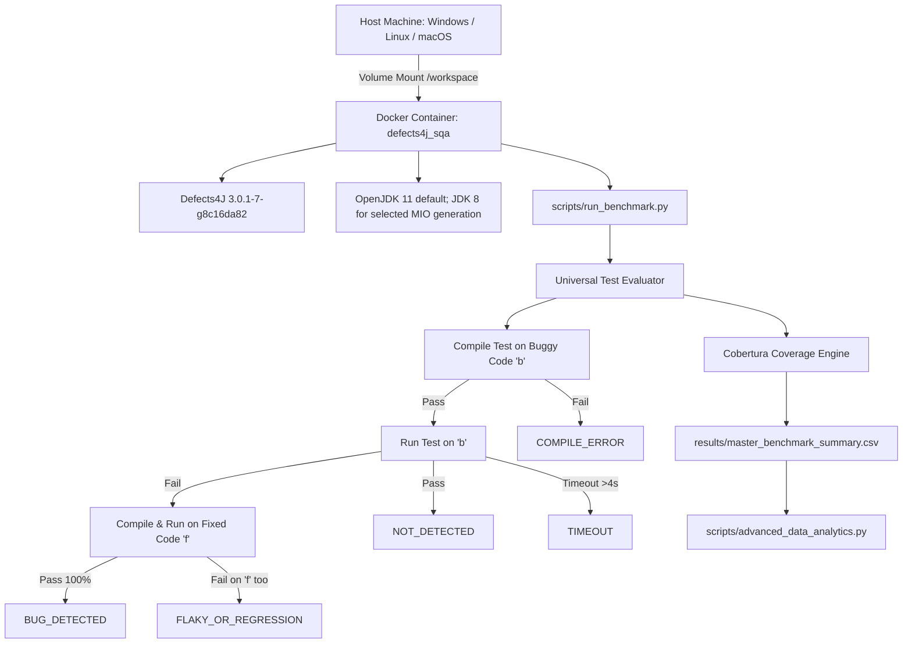

# 📑 รายงานผลการวิจัยและพัฒนาฉบับสมบูรณ์ (Final Project Report)
## การเปรียบเทียบเชิงประจักษ์ระหว่างการทดสอบด้วยปัญญาประดิษฐ์และขั้นตอนวิธีการสร้างชุดทดสอบอัตโนมัติบน Defects4J
### (AI-Assisted Testing vs. Automatic Test Case Generation Algorithms: A Large-Scale Empirical Benchmark and Evaluation on Defects4J)

---

**วิชา:** CP353201 การประกันคุณภาพซอฟต์แวร์ (Software Quality Assurance)<br>
**ภาคการศึกษา:** 1/2569<br>
**อาจารย์ประจำวิชา:** ผศ.ดร.ชิตสุธา สุ่มเล็ก<br>
**ภาควิชาวิทยาการคอมพิวเตอร์ คณะวิทยาศาสตร์ มหาวิทยาลัยขอนแก่น**

> **สถานะข้อมูล: ผลประเมินครบตาม suite ที่มีอยู่ (26 กันยายน 2026)** — ครอบคลุม 854 บั๊กใน 17 โปรเจกต์ มีผลครบ 2,768 suite evaluations และระบุ 648 ช่องที่ไม่มี suite เป็น `NO_SUITE`; ไม่มีช่อง `NOT_RUN` ค้างอยู่ (`results_complete: true`, `available_suite_evaluations_complete: true`). ตารางผลหลักสร้างจาก `results/master_benchmark_summary.csv` และสรุปสถิติอยู่ใน `results/master_descriptive_stats.json` ตัวเลข generation ของ IPO/MIO/AI รายงานแยกจากผลประเมินกลาง

#### 👥 คณะผู้จัดทำและบทบาทหน้าที่ความรับผิดชอบ:
1. **นายปวริศช์ ประมวล (รหัส 673380278-9) — Member 1:** Combinatorial Testing Lead & IPO Algorithm Specialist
2. **นายแทนคุณ พันธ์นิกุล (รหัส 673380301-0) — Member 2:** Search-Based Software Testing Lead & MIO/EvoSuite Algorithm Specialist
3. **นายธนภูมิ จันทรา (รหัส 673380272-1) — Member 3:** AI Testing Lead & Dual-Model Prompt Architecture Specialist (DeepSeek & Gemini)
4. **นายศิฆรินทร์ อุปจันทร์ (รหัส 673380292-5) — Member 4:** Infrastructure, Big Data Management & Statistical Analytics Lead (ผู้รวบรวมและจัดทำรายงานฉบับสมบูรณ์)

---

## 📌 บทคัดย่อ (Abstract)

งานนี้เปรียบเทียบ Native IPO, MIO ใน EvoSuite, DeepSeek V4 Flash และ Gemini 3.8 Flash บน Defects4J 3.0.1-7-g8c16da82 ซึ่งมี 854 active bugs จาก 17 โครงการ จัดทำผลหนึ่งรายการต่อบั๊กและเทคนิค รวม 3,416 ช่อง โดยมี suite ผ่านเกณฑ์ประเมิน 2,768 ช่อง และ 648 ช่องเป็น `NO_SUITE`. ทุกผล `BUG_DETECTED` มีหลักฐานว่า suite ทำให้ buggy version ล้มเหลวและ fixed version ผ่าน.

Coverage รวมทุก modified target class จาก aggregate summary ของ Defects4J โดยคิดผลรวม covered ÷ total ไม่ได้เฉลี่ยร้อยละรายคลาส. Gemini มี coverage เฉลี่ยสูงสุดในผลที่วัดได้ (86.24% line, 79.45% branch; n=422). Native IPO ตรวจพบ 37/257 suite (14.40%), MIO 5/834 (0.60%), DeepSeek 11/836 (1.32%) และ Gemini 107/841 (12.72%).

ผลรวมสี่เทคนิคตรวจพบ 144 บั๊กไม่ซ้ำจาก 853 บั๊กที่มีอย่างน้อยหนึ่ง suite (16.88%). สถิติ MIO budget และ AI generation นำเสนอแยกจากผล benchmark กลาง; ไม่คำนวณ token ต่อบั๊กที่ตรวจพบ เนื่องจาก generation records ไม่มี run ID ที่เชื่อมกับผล benchmark.

---

## 📑 สารบัญ (Table of Contents)
1. [บทที่ 1: บทนำ วัตถุประสงค์ และขอบเขตงานวิจัย](#บทที่-1-บทนำ-วัตถุประสงค์-และขอบเขตงานวิจัย)
2. [บทที่ 2: ขั้นตอนวิธีการสร้างกรณีทดสอบอัตโนมัติ (IPO และ MIO)](#บทที่-2-ขั้นตอนวิธีการสร้างกรณีทดสอบอัตโนมัติ-ipo-และ-mio)
3. [บทที่ 3: สถาปัตยกรรมและเทคนิคการสร้างชุดทดสอบด้วยปัญญาประดิษฐ์ (AI Testing Architecture)](#บทที่-3-สถาปัตยกรรมและเทคนิคการสร้างชุดทดสอบด้วยปัญญาประดิษฐ์-ai-testing-architecture)
4. [บทที่ 4: สถาปัตยกรรมระบบ สภาพแวดล้อม และระเบียบวิธีวิจัยเชิงประจักษ์](#บทที่-4-สถาปัตยกรรมระบบ-สภาพแวดล้อม-และระเบียบวิธีวิจัยเชิงประจักษ์)
5. [บทที่ 5: ผลการทดลองเชิงประจักษ์ การวิเคราะห์สถิติ และการอภิปรายผล](#บทที่-5-ผลการทดลองเชิงประจักษ์-การวิเคราะห์สถิติ-และการอภิปรายผล)
6. [บทที่ 6: สรุปผลการวิจัย ข้อเสนอแนะเชิงวิศวกรรม และงานวิจัยในอนาคต](#บทที่-6-สรุปผลการวิจัย-ข้อเสนอแนะเชิงวิศวกรรม-และงานวิจัยในอนาคต)
7. [เอกสารอ้างอิง (References)](#เอกสารอ้างอิง-references)

---

## บทที่ 1: บทนำ วัตถุประสงค์ และขอบเขตงานวิจัย

### 1.1 ที่มาและความสำคัญของปัญหา (Problem Statement)
การทดสอบซอฟต์แวร์ช่วยตรวจสอบพฤติกรรมของโปรแกรมและลดความเสี่ยงจากการเปลี่ยนแปลงโค้ด อย่างไรก็ตาม การสร้างชุดทดสอบที่ครอบคลุมกรณีใช้งานและตรวจจับข้อบกพร่องยังต้องอาศัยการออกแบบและตรวจสอบอย่างระมัดระวัง งานนี้ศึกษาวิธีสร้างชุดทดสอบสามแนวทาง ได้แก่:
1. **Combinatorial Interaction Testing (CIT):** การใช้ขั้นตอนวิธีทางคณิตศาสตร์ผสมผสาน เช่น **In-Parameter-Order (IPO/IPOG)** เพื่อสร้างชุดทดสอบที่ครอบคลุมทุกคู่ความสัมพันธ์ของตัวแปรนำเข้า (Pairwise / $t$-way Interactions) โดยมีขนาดของชุดทดสอบที่เล็กที่สุด
2. **Search-Based Software Testing (SBST):** การค้นหาชุดทดสอบโดยใช้เกณฑ์ fitness และงบประมาณการค้นหา เช่น **Many-Independent-Objective (MIO)** ที่ประเมินในงานนี้ผ่าน EvoSuite

อย่างไรก็ตาม ตั้งแต่ปี ค.ศ. 2023 เป็นต้นมา **โมเดลภาษาขนาดใหญ่ (Large Language Models: LLMs)** ได้ก้าวเข้ามามีบทบาทอย่างก้าวกระโดดในการเข้าใจความหมายเชิงตรรกะของโปรแกรม (Code Semantics) และสามารถสังเคราะห์ชุดทดสอบระดับหน่วย (Unit Test Suites) พร้อมข้อกำหนดการตรวจสอบ (Assertions) ที่เข้าใจบริบททางธุรกิจของโปรแกรมได้

ปัญหาสำคัญในปัจจุบันคือ: **"การใช้ LLM ชั้นนำ (DeepSeek V4 Flash และ Gemini 3.8 Flash) มีประสิทธิภาพและคุณภาพเหนือกว่าอัลกอริทึมแบบดั้งเดิม (IPO และ MIO) จริงหรือไม่ ทั้งในแง่ของความครอบคลุมรหัสคำสั่ง (Coverage), อัตราการตรวจจับข้อบกพร่องจริง (Fault Detection Rate), และความคุ้มค่าเชิงทรัพยากร (Computational & Token Economics)?"** งานวิจัยนี้จึงถูกจัดทำขึ้นเพื่อตอบคำถามดังกล่าวอย่างเป็นรูปธรรมบนคลังข้อมูลมาตรฐานสากล Defects4J (Just et al., 2014)

---

### 1.2 วัตถุประสงค์ของโครงงาน (Project Objectives)
1. เพื่อออกแบบและพัฒนาระบบประเมินมาตรฐานกลางแบบอัตโนมัติ (Universal Benchmark Pipeline) บนโครงสร้างตู้คอนเทนเนอร์ Docker ที่สามารถรันและวัดผลชุดทดสอบจากทั้ง 4 เทคนิคได้อย่างเป็นธรรม
2. เพื่อเปรียบเทียบเชิงประจักษ์ด้านความครอบคลุมรหัสคำสั่ง (Line Coverage และ Branch Coverage) ของ Target Classes บนโปรเจกต์มาตรฐาน Defects4J ทั้ง 17 โปรเจกต์
3. เพื่อศึกษาอัตราการตรวจจับข้อบกพร่องจริงในระดับบั๊ก (Bug-Level Fault Detection Rate: FDR %) โดยจำแนกพฤติกรรมความล้มเหลวออกเป็น 5 สถานะมาตรฐานวิชาการ
4. เพื่อเปรียบเทียบผลของแต่ละเทคนิคโดยแสดงจำนวนตัวอย่างและข้อจำกัดของข้อมูลที่วัดได้
5. เพื่อวิเคราะห์พฤติกรรม MIO Search Budget Saturation, ศักยภาพการผสานพลังข้าม Paradigm (Ensemble Synergy), และความคุ้มค่าเชิงเศรษฐศาสตร์ของโทเค็น AI

---

### 1.3 ขอบเขตงานวิจัย (Scope & Delimitations)
1. **คลังโปรแกรมทดสอบ (Benchmark Suite):** ใช้ **Defects4J 3.0.1-7-g8c16da82** ตาม checkout ที่ติดตั้งใน container ซึ่งประกอบด้วย **17 โครงการโอเพนซอร์สและ 854 active bugs** (Defects4J contributors, n.d.)
2. **ขอบเขตการสร้างชุดทดสอบ (Defect-Targeted Classes):** ยึดตาม `classes.modified` ที่ระบุใน Ground Truth ของแต่ละบั๊ก โดยมีคลาสเป้าหมายรวม **1,073 คลาส (577 Unique Classes)** โดยไม่ทำการสร้างชุดทดสอบกระจายไปยังคลาสภายนอกที่ไม่เกี่ยวข้องกับบั๊ก เพื่อให้เป็น Defect-Targeted Test Generation ที่เป็นธรรม
3. **การวัดผล Coverage:** ใช้ Defects4J coverage workflow และ aggregate summary สำหรับทุก modified target class; รวมจำนวน covered และ total ก่อนคำนวณเปอร์เซ็นต์
4. **เวอร์ชันภาษาและมาตรฐานการรัน:** Defects4J CLI ใช้ Java 11; มี Java 8 ติดตั้งสำหรับขั้นตอน MIO ที่กำหนดให้ใช้ JDK 8; ใช้ JUnit 4 ตาม suite ที่ส่งมอบ

---

### 1.4 คำถามวิจัย (Research Questions)
* **RQ1 (Coverage Performance):** เทคนิคใดสามารถสร้างชุดทดสอบที่บรรลุ Line Coverage และ Branch Coverage สูงที่สุดบน Target Classes ของ Defects4J?
* **RQ2 (Fault Detection Capability):** เทคนิคใดมีอัตราการตรวจจับข้อบกพร่องจริง (Bug-Level FDR %) สูงที่สุดภายใต้กฎความซื่อตรงของตัวหาร (Denominator Integrity Rule)?
* **RQ3 (Ensemble Synergy):** การผสมผสานชุดทดสอบจากต่าง Paradigm (AI + Combinatorial + SBST) สามารถตรวจจับข้อบกพร่องได้สูงกว่าการใช้เทคนิคที่ดีที่สุดเพียงเทคนิคเดียวหรือไม่?
* **RQ4 (Search Budget Scaling):** การขยาย Search Budget ของ MIO จาก 30s เป็น 60s และ 120s ก่อให้เกิดผลตอบแทนความครอบคลุมส่วนเพิ่ม (Marginal Gain) คุ้มค่าหรือไม่ และจุดอิ่มตัวของการค้นหาเกิดขึ้นที่ระดับใด?
* **RQ5 (AI Generation Effort):** บันทึกการสร้างชุดทดสอบของโมเดล AI แต่ละตัวมีจำนวนโทเค็นและเวลา generation เฉลี่ยเท่าใด เมื่อรายงานแยกจากผลตรวจจับบั๊กของ benchmark กลาง?

---

## บทที่ 2: ขั้นตอนวิธีการสร้างกรณีทดสอบอัตโนมัติ (IPO และ MIO)

### 2.1 In-Parameter-Order (IPO/IPOG) และ Combinatorial Interaction Testing (Member 1)
Combinatorial Interaction Testing ลดจำนวนกรณีทดสอบโดยกำหนดให้แต่ละคู่ค่าของพารามิเตอร์ปรากฏอย่างน้อยหนึ่งครั้งในชุดทดสอบ การครอบคลุม pairwise เป็นเกณฑ์การเลือกกรณีทดสอบและไม่ได้รับประกันว่าจะตรวจพบบั๊กทุกชนิด; งานนี้จึงวัด fault detection แยกจาก coverage ของ input combinations. การไล่ทุกค่าร่วมกันอาจมีจำนวนกรณีเพิ่มขึ้นแบบทวีคูณเมื่อจำนวนพารามิเตอร์เพิ่มขึ้น.

#### ก. ทฤษฎีขั้นตอนวิธี IPO (In-Parameter-Order)
ขั้นตอนวิธี IPO (Lei & Tai, 1998) และ IPOG (Forbes et al., 2008) แก้ปัญหานี้ด้วยการสร้างตารางการทดสอบแบบค่อยเป็นค่อยไป (Incremental Generation) โดยเริ่มสร้างความครอบคลุมจากตัวแปร 2 ตัวแรก แล้วทำการขยายแบบ 2 ทิศทาง:
1. **การขยายแนวนอน (Horizontal Growth):** เมื่อเพิ่มพารามิเตอร์ตัวใหม่ ($P_{i}$) จะทำการจับคู่ค่าของ $P_{i}$ เข้ากับแถวกรณีทดสอบเดิมที่มีอยู่แล้ว เพื่อให้ครอบคลุมคู่พารามิเตอร์ใหม่ (New Pairs) ให้ได้มากที่สุด
2. **การขยายแนวตั้ง (Vertical Growth):** หากยังมีคู่พารามิเตอร์ที่ยังไม่ถูกครอบคลุมหลงเหลืออยู่ จะทำการสร้างแถวกรณีทดสอบใหม่เพิ่มเติม (New Test Cases) และเติมค่าพารามิเตอร์ตัวอื่นด้วยกลยุทธ์ Don't Care หรือ Random Filling

```text
[พารามิเตอร์ P1, P2] ---> Horizontal Growth (จับคู่ลงแถวเดิม) ---> Vertical Growth (เพิ่มแถวใหม่เก็บตก)
```

#### ข. Native IPO ที่ใช้ในการประเมินและ PICT ในฐานะข้อมูลอ้างอิง
เทคนิค IPO ที่นำเข้าการประเมินกลางคือ Native IPO ตามชุดทดสอบใน `Combinatorial_IPO/Results/verified_suites_manifest.json`; PICT เป็นเครื่องมืออ้างอิงในงานของสาย IPO ไม่ใช่ผล IPO หลักในตารางเปรียบเทียบนี้:
* ตัวอย่าง pairwise จากเอกสารสาย IPO ใช้เพื่ออธิบายแนวคิด ไม่ใช่ผล coverage/FDR ของ benchmark กลาง
* เอกสาร baseline รอบก่อนระบุ 173 suites และ 42,398 test cases ตัวเลขนี้เป็นสถิติคนละรอบ ไม่ใช่จำนวน suite หรือผลวัดของ Native IPO ปัจจุบัน

---

### 2.2 Search-Based Software Testing และ Many-Independent-Objective (MIO) Algorithm (Member 2)
EvoSuite เป็นเครื่องมือสร้าง unit test สำหรับ Java ที่ใช้ search-based approaches (Fraser & Arcuri, 2011). ในงานนี้กำหนด algorithm เป็น MIO และ criterion เป็น `LINE:BRANCH:EXCEPTION:MUTATION` ตาม `MIO_Algorithm/Configuration/evosuite_mio_config.properties`; ผลการสร้างและผลการประเมิน suite ถูกรายงานแยกกัน.

#### ก. ทฤษฎี Many-Independent-Objective (MIO)
Arcuri (2018) นำเสนออัลกอริทึม **MIO** ซึ่งจัดการเป้าหมายการค้นหาแต่ละรายการอย่างเป็นอิสระ (**Many Independent Objectives**):
1. แต่ละเป้าหมาย (Objective $o_i$) จะมีคลังเก็บชุดทดสอบขนาดเล็กของตนเอง ($K$ solutions)
2. อัลกอริทึมจะสุ่มเลือกชุดทดสอบจากคลังที่ยังไม่บรรลุเป้าหมายมาทำการกลายพันธุ์ (Mutation) เช่น การเปลี่ยน Method Call, สลับ Argument, หรือแทรกคำสั่งใหม่
3. หากชุดทดสอบที่กลายพันธุ์มีระยะทางเข้าใกล้เป้าหมายดีขึ้น (Better Branch Distance) หรือครอบคลุมเป้าหมายใหม่สำเร็จ ชุดทดสอบนั้นจะถูกอัปเดตเข้าคลังทันที
4. มีกระบวนการสุ่มรีเซ็ตแบบ Random Insertion เพื่อป้องกันไม่ให้อัลกอริทึมติดอยู่ในหลุม Local Optima

#### ข. การวิเคราะห์ Search Budget Scaling (ข้อกำหนด 1.7)
Member 2 บันทึกการสร้างชุดทดสอบด้วย EvoSuite MIO ที่งบประมาณ 30, 60 และ 120 วินาที และใช้ seed 101, 102 และ 103 ตามสคริปต์และตารางสรุปใน `MIO_Algorithm/Result_Round2/`. แต่ละแถวเป็นสรุปคลาสและ budget; criterion `LINE;BRANCH` ให้ค่า coverage เดียว จึงรายงานเป็น coverage รวม ไม่แยก line กับ branch. ตัวเลขนี้เป็นข้อมูล generation ไม่ใช่ผล benchmark กลาง.

| Search budget | คลาส–budget records (n) | Coverage รวมเฉลี่ย ± SD ระหว่าง records | ค่า SD เฉลี่ยระหว่าง 3 seeds | เวลา generation เฉลี่ย |
| :---: | ---: | ---: | ---: | ---: |
| 30 วินาที | 1,023 | 65.73 ± 31.96% | 3.26 จุดร้อยละ | 68.29 วินาที |
| 60 วินาที | 1,015 | 68.73 ± 31.29% | 2.66 จุดร้อยละ | 90.62 วินาที |
| 120 วินาที | 989 | 70.82 ± 30.40% | 2.42 จุดร้อยละ | 194.41 วินาที |

SD ในคอลัมน์ coverage แสดงการกระจายระหว่างคลาส–budget records ไม่ใช่ SD ข้าม seed; คอลัมน์ถัดไปรายงานค่าเฉลี่ยของ SD ที่คำนวณจาก 3 seeds ต่อ record. เวลารวมมีขั้นตอน setup และ compile จึงอาจยาวกว่า search budget. ค่า p จากการทดสอบเดิมแบบไม่จับคู่ไม่ถูกใช้; การวิเคราะห์ใหม่จับคู่คลาสที่มีผลในทั้งสอง budget.

การวิเคราะห์ใหม่จับคู่ project–bug–target class ที่มีค่าทั้งสอง budget และใช้ Wilcoxon signed-rank พร้อม Holm correction. ระหว่าง 30 กับ 60 วินาทีมี 1,006 คู่ (p หลัง Holm = 3.39 × 10⁻⁸⁴, rank-biserial = −0.828); ระหว่าง 60 กับ 120 วินาทีมี 981 คู่ (p หลัง Holm = 1.54 × 10⁻⁶⁷, rank-biserial = −0.765). ค่าลบหมายถึง coverage ของ budget ยาวสูงกว่าในคู่ที่มีข้อมูลครบ.

---

## บทที่ 3: สถาปัตยกรรมและเทคนิคการสร้างชุดทดสอบด้วยปัญญาประดิษฐ์ (AI Testing Architecture)

### 3.1 สถาปัตยกรรมการยิงโมเดล AI ผ่าน KKU IntelSphere Platform (Member 3)
การสร้างชุดทดสอบใช้สคริปต์ `scripts/kku_generate.py` เรียก KKU IntelSphere API (`https://gen.ai.kku.ac.th/api/v1`) โดยใช้ model identifier `deepseek-v4-flash` และ `gemini-3.8-flash` ตามค่าเริ่มต้นในสคริปต์ งานนี้เปรียบเทียบผลของโมเดลตามป้ายชื่อดังกล่าว; repository ไม่ได้บันทึก provider model ID ต่อทุก generation record จึงไม่ระบุสถาปัตยกรรมหรือคุณสมบัติภายในเฉพาะรุ่นเกินหลักฐานที่มี.

---

### 3.2 กลยุทธ์ Prompt Engineering และ Guardrails พิเศษ
เพื่อป้องกันปัญหาคลาสสิกของ LLM ในการเขียนโค้ดเทส (เช่น การใช้ JUnit 5, การขาด Timeout, การสร้าง Assertion ขัดแย้งกับสเปกจริง, หรือการสร้าง Test Case ที่คอมไพล์ไม่ผ่าน) Member 3 ได้ออกแบบ **System Prompt พร้อม 5 Guardrails สำคัญ**:

1. **JUnit 4 Strict Compliance:** บังคับใช้เฉพาะ `org.junit.Test` และ `org.junit.Assert.*` เท่านั้น ปิดกั้นการเรียกใช้งาน JUnit 5 (`org.junit.jupiter.*`) โดยเด็ดขาด
2. **Execution Timeout Guard:** บังคับให้ทุก Method ต้องมี `@Test(timeout = 4000)` เพื่อป้องกันกรณีชุดทดสอบหลุดเข้าไปในลูปไม่รู้จบ (Infinite Loop)
3. **No External Mocking Dependencies:** ห้ามนำเข้าไลบรารีภายนอก เช่น Mockito, ByteBuddy, หรือ AssertJ ซึ่งอาจไม่มีอยู่ใน Classpath ของโปรเจกต์เวอร์ชันเก่าของ Defects4J
4. **Defect-Context Injection & Oracle Reasoning:** ป้อนข้อมูลคำอธิบายข้อผิดพลาด (`defects4j_info.txt`) หรือพฤติกรรมที่บกพร่องร่วมกับ Source Code ของ Target Class เพื่อให้ LLM ระบุ Root Cause และสร้าง Oracle Assertion ที่ตรวจจับความผิดพลาดได้ตรงเป้า
5. **Boundary Value Guardrails (BVA):** ชี้นำให้ LLM สร้างชุดทดสอบที่ทดสอบค่า Null, String ว่าง, อาร์เรย์ว่าง, ค่าขอบเขตตัวเลข (`Integer.MAX_VALUE`, `MIN_VALUE`), และค่า Floating-point พิเศษ (`NaN`, `Infinity`)

---

### 3.3 สถิติการสร้างชุดทดสอบ AI

ตารางนี้สรุป generation records จาก `results/Deepseek_vs_Gemini_Economics.csv` แยกจากจำนวน suite ที่รันใน benchmark กลาง จำนวน records ไม่ใช่จำนวน bug detections และไม่มี run ID ที่เชื่อมกับผล benchmark จึงไม่คำนวณ token ต่อบั๊กที่ตรวจพบ.

| โมเดลตามป้ายชื่อในระบบ | Generation records (n) | โทเค็นเฉลี่ยต่อ record | เวลาเฉลี่ยต่อ record |
| :--- | ---: | ---: | ---: |
| Gemini 3.8 Flash | 1,068 | 20,699.64 | 88.66 วินาที |
| DeepSeek V4 Flash | 1,069 | 20,900.15 | 295.11 วินาที |

ค่ารุ่นโมเดลอ้างตาม identifier ที่สคริปต์เรียกผ่าน KKU IntelSphere API; บันทึก generation ไม่ได้เก็บ provider model ID ต่อทุกแถว จึงไม่อ้างรายละเอียดสถาปัตยกรรมเฉพาะรุ่น.

---

## บทที่ 4: สถาปัตยกรรมระบบ สภาพแวดล้อม และระเบียบวิธีวิจัยเชิงประจักษ์

### 4.1 สถาปัตยกรรมระบบทดสอบกลางบน Docker Container (Member 4)
เพื่อควบคุมสภาพแวดล้อมและช่วยให้ทำซ้ำการประเมินได้ Member 4 จัดทำ **Dockerized Defects4J Benchmark Environment** โดยบันทึก suite hash, run ID, timestamp และ log ของแต่ละผล การใช้ container ลดความต่างของ environment แต่ไม่ได้รับประกันการทำซ้ำสมบูรณ์ในทุกระบบ:



* **Defects4J:** 3.0.1-7-g8c16da82; CLI ใช้ Java 11
* **Java SDK:** ติดตั้ง OpenJDK 8 และ 11; JDK 11 เป็นค่าเริ่มต้น และบางงาน MIO กำหนด JDK 8
* **Container:** สร้างจาก Ubuntu 20.04 พร้อมตรึง Defects4J และ PICT ด้วย commit; ไม่ต้องเตรียม image พื้นฐานเฉพาะของเครื่อง การ build ครั้งแรกต้องเชื่อมต่อเครือข่ายและดาวน์โหลด catalog ของ Defects4J ซึ่งใช้พื้นที่และเวลามาก ส่วนแพ็กเกจระบบติดตั้งจาก Ubuntu package archive
* **เครื่องมือวัดความครอบคลุม:** Cobertura CLI เชื่อมต่อผ่าน Defects4J Framework
* **ระบบจัดการความคืบหน้า (State Preservation):** พัฒนาระบบบันทึกสถานะ `progress.json` เพื่อให้สามารถหยุดและรันต่อได้แบบ Incremental Resume

---

### 4.2 ระเบียบวิธีคำนวณ Fault Detection Rate (Bug-Level FDR Formulation)
ในการศึกษาวิจัยทางวิศวกรรมซอฟต์แวร์ การวัดอัตราการตรวจจับข้อบกพร่องที่คำนวณจากสัดส่วนของ Test Case ที่เฟลไม่สามารถสะท้อนความจริงได้ เนื่องจากชุดทดสอบหนึ่งชุดอาจมี Assertion เฟลซ้ำๆ บนบั๊กเดียวกันหลายจุด งานวิจัยนี้จึงใช้ **Bug-Level Fault Detection Rate (FDR)** ซึ่งคำนวณที่ระดับ "ข้อบกพร่องจริง":

$$FDR_{\text{technique}} = \left( \frac{N_{\text{BUG\_DETECTED}}}{N_{\text{evaluated\_bugs}}} \right) \times 100\%$$

#### ก. นิยาม 5 สถานะการตรวจจับข้อบกพร่อง (Bug-Level Classification)
1. **`BUG_DETECTED` (ตรวจพบข้อบกพร่องจริง):** ชุดทดสอบเกิด Failure อย่างน้อย 1 Method บนเวอร์ชันที่มีบั๊ก (`b`) ตรงตามพฤติกรรมข้อบกพร่อง และ **ต้องผ่านการทดสอบ 100% (Pass) บนเวอร์ชันที่แก้บั๊กแล้ว (`f`)** ถือว่าระบุข้อบกพร่องได้แม่นยำ ปราศจาก False Positive ($D=1$)
2. **`NOT_DETECTED` (ไม่พบข้อบกพร่อง):** ชุดทดสอบผ่าน 100% ทั้งบนเวอร์ชัน `b` และ `f` (ชุดทดสอบไม่สามารถเข้าถึงหรือกระตุ้นตรรกะที่ผิดพลาดได้)
3. **`FLAKY_OR_REGRESSION` (ชุดทดสอบมีข้อผิดพลาด):** ชุดทดสอบเกิด Failure บนเวอร์ชัน `b` และยังคง Failure บนเวอร์ชัน `f` (เกิดจากการเขียน Assertion ขัดแย้งกับสเปกจริงของระบบ)
4. **`COMPILE_ERROR` (คอมไพล์ไม่ผ่าน):** ซอร์สโค้ดของชุดทดสอบมีข้อผิดพลาดเชิงไวยากรณ์ หรือเรียกใช้ Class/Method ที่ไม่มีอยู่จริง
5. **`TIMEOUT` (ทำงานเกินเวลา):** ชุดทดสอบใช้เวลาทำงานเกิน 4 วินาทีใน Method ใด Method หนึ่ง

#### ข. กฎความซื่อตรงของตัวหาร (Denominator Integrity Rule)
> **⚠️ หลักการวิชาการที่สำคัญ:**  
> ในการคำนวณตัวหาร $N_{\text{evaluated\_bugs}}$ บั๊กที่ชุดทดสอบเกิด `COMPILE_ERROR`, `TIMEOUT` หรือ `FLAKY_OR_REGRESSION` **จะถูกนับรวมอยู่ในตัวหารเสมอ ห้ามตัดทิ้งเด็ดขาด** ทั้งนี้เพื่อให้ตัวเลข FDR สะท้อนความเสถียรและความพร้อมใช้งานในสภาพแวดล้อมวิศวกรรมจริงของแต่ละเครื่องมือ

---

## บทที่ 5: ผลการทดลองเชิงประจักษ์ การวิเคราะห์สถิติ และการอภิปรายผล

ผล master dataset รอบสุดท้ายสร้างจากผลที่ตรวจ provenance แล้ว ไฟล์หลักคือ `results/master_benchmark_summary.csv` และสรุปสถานะคือ `results/master_descriptive_stats.json`. ชุดข้อมูลมี 3,416 แถวจาก 854 บั๊ก × 4 เทคนิค; 2,768 แถวเป็น suite evaluations ที่รันครบ และ 648 แถวเป็น `NO_SUITE`. ไม่มีผลค้างที่ `NOT_RUN`.

### 5.1 ขอบเขตและสถานะการประเมิน

ชุดข้อมูลคาดหวังมีหนึ่งแถวต่อ project, bug และ technique จาก 854 บั๊ก × 4 เทคนิค ทุกแถวจำแนกสถานะ suite และการรันแยกจากกัน NO_SUITE หมายถึงไม่มีชุดทดสอบให้รัน ไม่ใช่ผลตรวจไม่พบบั๊ก ส่วน NOT_RUN, STALE_RESULT, CHECKOUT_ERROR, INVALID_SUITE และ RUN_ERROR ต้องแก้หรือระบุเป็นงานค้างก่อนประกาศผลครบ

### 5.2 Coverage และ Fault Detection Rate

Coverage รวมทุก modified target class ตาม aggregate counts ที่ Defects4J เขียนใน summary.csv; จำนวน `n` นับเฉพาะผล `DONE` ที่มีค่าตัวเลข และ compile error ไม่ถูกแทนด้วย coverage 0%. FDR นับระดับบั๊กต่อเทคนิคโดยหารด้วยจำนวน suite ที่มีและถูกประเมิน; compile errors และ flaky/regression ยังคงอยู่ในตัวหาร. ตารางยังแสดงสัดส่วนเทียบ 854 บั๊กในแค็ตตาล็อก. `BUG_DETECTED` หมายถึง fail บน buggy และ pass บน fixed.

| เทคนิค | Suite ที่ประเมิน | Compile error | Coverage n (all target classes) | Line / Branch coverage เฉลี่ย ± SD | พบ defect | FDR ต่อ suite | พบต่อ 854 บั๊ก |
|---|---:|---:|---:|---:|---:|---:|---:|
| Native IPO | 257 | 5 | 252 | 26.76% ± 21.50 / 18.67% ± 19.33 | 37 | 14.40% | 4.33% |
| MIO (EvoSuite) | 834 | 37 | 797 | 63.85% ± 34.26 / 56.51% ± 35.94 | 5 | 0.60% | 0.59% |
| DeepSeek V4 Flash | 836 | 645 | 191 | 77.99% ± 30.88 / 70.25% ± 31.18 | 11 | 1.32% | 1.29% |
| Gemini 3.8 Flash | 841 | 419 | 422 | 86.24% ± 25.14 / 79.45% ± 26.98 | 107 | 12.72% | 12.53% |

เปรียบเทียบ line coverage ด้วย Wilcoxon signed-rank เฉพาะ project–bug ที่ทั้งสองเทคนิคมีค่าที่วัดได้ และปรับ p-value ด้วย Holm สำหรับหกคู่. ค่า paired rank-biserial เป็นบวกเมื่อเทคนิคทางซ้ายมี coverage สูงกว่า; ผลนี้เป็นการวิเคราะห์เชิงสำรวจเพราะแต่ละเทคนิคมี suite ที่วัดได้ต่างกัน.

| คู่เปรียบเทียบ | Matched N | p หลัง Holm | Paired rank-biserial |
|---|---:|---:|---:|
| Gemini – DeepSeek | 135 | 7.28×10⁻¹² | 0.830 |
| MIO – Gemini | 397 | 1.09×10⁻³² | -0.758 |
| MIO – DeepSeek | 182 | 0.0154 | -0.227 |
| MIO – IPO | 245 | 1.64×10⁻³⁸ | 0.993 |
| Gemini – IPO | 147 | 1.90×10⁻²⁴ | 1.000 |
| DeepSeek – IPO | 69 | 4.92×10⁻¹² | 1.000 |

เมื่อนับการตรวจจับแบบ union ระดับบั๊ก ทั้งสี่เทคนิคร่วมกันตรวจพบ 144 บั๊กจาก 853 บั๊กที่มี suite อย่างน้อยหนึ่งเทคนิค (16.88%); มี 648 บั๊ก–เทคนิคที่ไม่มี suite และแยกเป็น `NO_SUITE`. รายงาน analytics, Excel และกราฟถูกสร้างจาก snapshot เดียวกันใน `results/advanced_analytics_report.md`, `results/Master_Benchmark_Results.xlsx` และ `results/figure1_coverage_comparison.png` ถึง `results/figure6_ensemble_overlap.png`.

### 5.3 สถิติการสร้างชุดทดสอบและข้อจำกัด

สถิติ MIO เรื่อง budget/seed และสถิติการสร้าง IPO/AI เป็นคนละการวัดกับ coverage และ FDR จากการประเมินกลาง บันทึก AI generation ที่ไม่มี run ID ไม่ถูกนำไปคำนวณ token cost ต่อ bug ที่ตรวจพบ

### 5.4 การตรวจสอบย้อนกลับ

ทุก suite evaluation มี suite hash, run ID, timestamp, duration และ structured run log ในคอลัมน์ `Run_Log`; แถว `NO_SUITE` มีบันทึกสถานะและไม่มี suite hash ตามความหมาย ผู้ตรวจสามารถใช้ project + bug + technique ไล่กลับไปยัง log และตรวจผลบน buggy/fixed ได้

---

## บทที่ 6: สรุปผลการวิจัย ข้อเสนอแนะเชิงวิศวกรรม และงานวิจัยในอนาคต

ผลประเมินครอบคลุม suite ที่ผ่านเกณฑ์ประเมินครบแล้ว Gemini มีค่าเฉลี่ย line/branch coverage สูงสุดในผลที่วัดได้เมื่อรวม modified target classes ทุกคลาส ขณะที่ Native IPO มี FDR สูงสุดต่อ suite ที่ประเมิน. ไม่มีเทคนิคเดียวที่ดีที่สุดในทุกตัวชี้วัด MIO และ DeepSeek ตรวจพบน้อยกว่าในชุดนี้ และ DeepSeek มีสัดส่วน compile error สูง จึงควรเลือกเครื่องมือตามเป้าหมายและคำนึงถึงคุณภาพการคอมไพล์ร่วมกับ coverage/FDR

การรวมผลสี่เทคนิคตรวจพบ 144 บั๊กไม่ซ้ำ โดย Gemini มีส่วนตรวจพบเฉพาะเทคนิค 91 บั๊ก, Native IPO 27, MIO 5 และ DeepSeek 5. ตัวเลขเฉพาะเหล่านี้อธิบายความเสริมกันของเทคนิค แต่ไม่ใช่การประมาณต้นทุนต่อบั๊ก เพราะ log การสร้าง AI ยังเชื่อมกับ run ID ของ benchmark ไม่ครบ

ผลนี้จำกัดอยู่ที่ target classes ใน Defects4J และ suite ที่สมาชิกส่งมอบจริง; 648 ช่อง `NO_SUITE` ไม่ได้ถูกตีความว่าไม่พบข้อบกพร่อง ส่วน compile errors และ flaky/regression ถูกแสดงเป็นผลลัพธ์แยกและยังอยู่ในตัวหาร FDR.

การตรวจไฟล์ประกอบพบว่า 648 ช่อง `NO_SUITE` ไม่ได้หมายถึงไม่มีไฟล์ทุกกรณี: 591 ช่อง IPO และ 20 ช่อง MIO ไม่มีไฟล์ Java ในตำแหน่ง suite, 6 ช่อง IPO มีไฟล์ผู้สมัครที่ยังไม่อยู่ใน verified manifest, และ 31 ช่อง AI มีไฟล์ที่ strict target matcher ยังไม่ยอมรับ. รายละเอียดรายบั๊กและ hash อยู่ใน `results/suite_gap_audit.csv`; ไฟล์ผู้สมัครยังไม่นับเป็น suite จนกว่าเจ้าของเทคนิคจะยืนยัน.

---

## เอกสารอ้างอิง (References)
Arcuri, A. (2018). Test suite generation with the Many Independent Objective (MIO) algorithm. *Information and Software Technology, 104*, 195–206. https://doi.org/10.1016/j.infsof.2018.05.003

Defects4J contributors. (n.d.). *Defects4J (Version 3.0.1-7-g8c16da82)* [Computer software]. GitHub. https://github.com/rjust/defects4j/tree/8c16da8230843cdc918eaf4ddb449637f02b83c6

Fraser, G., & Arcuri, A. (2011). EvoSuite: Automatic test suite generation for object-oriented software. In *Proceedings of the 19th ACM SIGSOFT Symposium on the Foundations of Software Engineering* (pp. 416–419). https://doi.org/10.1145/2025113.2025179

Just, R., Jalali, D., & Ernst, M. D. (2014). Defects4J: A database of existing faults to enable controlled testing studies for Java programs. In *Proceedings of the 2014 International Symposium on Software Testing and Analysis* (pp. 437–440). https://doi.org/10.1145/2610384.2628055

Lei, Y., & Tai, K. C. (1998). In-parameter-order: A test generation strategy for pairwise testing. In *Proceedings of the 3rd IEEE High-Assurance Systems Engineering Symposium* (pp. 254–261). https://doi.org/10.1109/HASE.1998.731623
