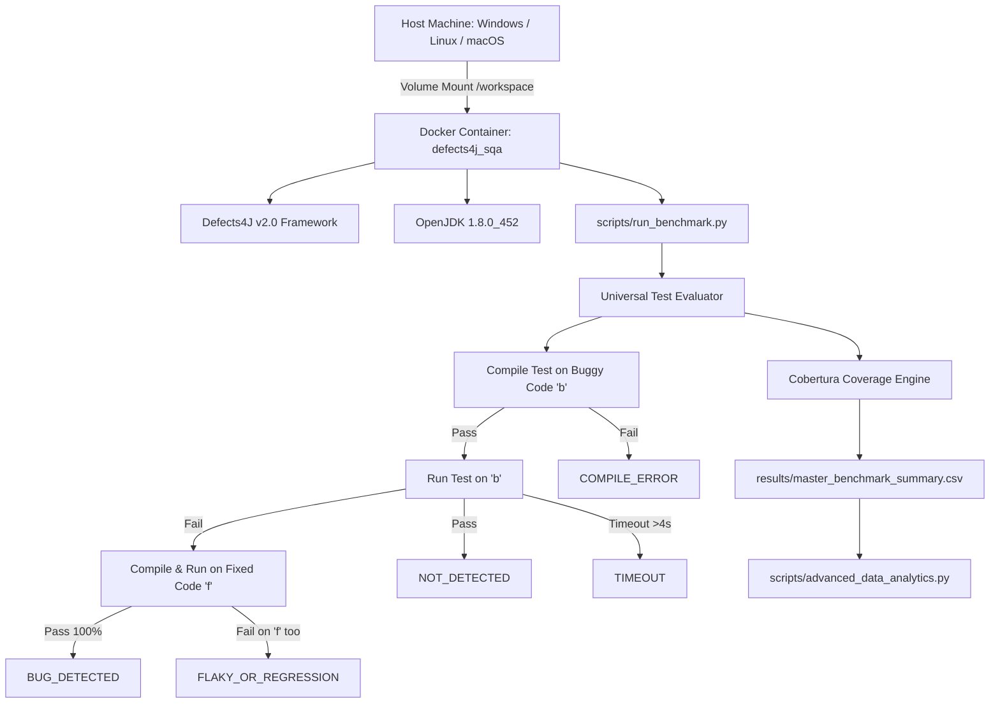

# 📑 รายงานผลการวิจัยและพัฒนาฉบับสมบูรณ์ (Final Project Report)
## การเปรียบเทียบเชิงประจักษ์ระหว่างการทดสอบด้วยปัญญาประดิษฐ์และขั้นตอนวิธีการสร้างชุดทดสอบอัตโนมัติบน Defects4J
### (AI-Assisted Testing vs. Automatic Test Case Generation Algorithms: A Large-Scale Empirical Benchmark and Evaluation on Defects4J)

---

**วิชา:** CP353201 การประกันคุณภาพซอฟต์แวร์ (Software Quality Assurance)  
**ภาคการศึกษา:** ปลาย ปีการศึกษา 2568  
**อาจารย์ประจำวิชา:** ผศ.ดร.ชิตสุธา สุ่มเล็ก  
**ภาควิชาวิทยาการคอมพิวเตอร์ คณะวิทยาศาสตร์ มหาวิทยาลัยขอนแก่น**  

> **สถานะข้อมูล: ผลประเมินครบตาม suite ที่มีอยู่ (26 กันยายน 2026)** — ครอบคลุม 854 บั๊กใน 17 โปรเจกต์ มีผลครบ 2,768 suite evaluations และระบุ 648 ช่องที่ไม่มี suite เป็น `NO_SUITE`; ไม่มีช่อง `NOT_RUN` ค้างอยู่ (`results_complete: true`, `available_suite_evaluations_complete: true`). ตารางผลหลักสร้างจาก `results/master_benchmark_summary.csv` และสรุปสถิติอยู่ใน `results/master_descriptive_stats.json` ตัวเลข generation ของ IPO/MIO/AI รายงานแยกจากผลประเมินกลาง

#### 👥 คณะผู้จัดทำและบทบาทหน้าที่ความรับผิดชอบ:
1. **นายปวริศช์ ประมวล (รหัส 653380138-8) — Member 1:** Combinatorial Testing Lead & IPO/IPOG Algorithm Specialist
2. **นายแทนคุณ พันธ์นิกุล (รหัส 653380292-8) — Member 2:** Search-Based Software Testing Lead & MIO/EvoSuite Algorithm Specialist
3. **นายธนภูมิ จันทรา (รหัส 653380295-2) — Member 3:** AI Testing Lead & Dual-Model Prompt Architecture Specialist (DeepSeek & Gemini)
4. **นายศิฆรินทร์ อุปจันทร์ (รหัส 673380292-5) — Member 4:** Infrastructure, Big Data Management & Statistical Analytics Lead (ผู้รวบรวมและจัดทำรายงานฉบับสมบูรณ์)

---

## 📌 บทคัดย่อ (Abstract)

งานนี้เปรียบเทียบ DeepSeek V4 Flash, Gemini 3.8 Flash, Native IPO และ MIO ใน EvoSuite บน Defects4J v2.0 ครอบคลุม 854 บั๊กใน 17 โปรเจกต์ จาก 3,416 ช่องที่คาดหวัง มี suite ให้ประเมิน 2,768 ช่องและไม่มี suite 648 ช่อง โดยประเมิน suite ที่มีครบและตรวจย้อนกลับได้ด้วย hash, run ID และ log

Gemini มีค่าเฉลี่ย line/branch coverage สูงสุดในกลุ่มผลที่วัดได้ (86.24%/79.45%, n=422) ส่วน Native IPO มี bug-level FDR สูงสุด (37/257, 14.40%). MIO ตรวจพบ 5/834 บั๊ก (0.60%) และ DeepSeek ตรวจพบ 11/836 บั๊ก (1.32%). การคำนวณ coverage ใช้เฉพาะผลที่คอมไพล์และวัดได้; compile errors และ flaky/regression ยังคงอยู่ในตัวหาร FDR

เมื่อรวมสี่เทคนิค ตรวจพบ 144 บั๊กไม่ซ้ำจาก 853 บั๊กที่มีอย่างน้อยหนึ่ง suite (16.88%). สถิติ generation ของ MIO/IPO และ token/เวลา generation ของ AI รายงานแยกจากการประเมินกลาง เพราะไม่มี run ID ที่เชื่อมบันทึก generation ทุกแถวเข้ากับผลตรวจจับได้

---

## 📑 สารบัญ (Table of Contents)
1. [บทที่ 1: บทนำ วัตถุประสงค์ และขอบเขตงานวิจัย](#บทที่-1-บทนำ-วัตถุประสงค์-และขอบเขตงานวิจัย)
2. [บทที่ 2: ขั้นตอนวิธีการสร้างกรณีทดสอบอัตโนมัติ (IPO และ MIO)](#บทที่-2-ขั้นตอนวิธีการสร้างกรณีทดสอบอัตโนมัติ-ipo-และ-mio)
3. [บทที่ 3: สถาปัตยกรรมและเทคนิคการสร้างชุดทดสอบด้วยปัญญาประดิษฐ์ (AI Testing Architecture)](#บทที่-3-สถาปัตยกรรมและเทคนิคการสร้างชุดทดสอบด้วยปัญญาประดิษฐ์-ai-testing-architecture)
4. [บทที่ 4: สถาปัตยกรรมระบบ สภาพแวดล้อม และระเบียบวิธีวิจัยเชิงประจักษ์](#บทที่-4-สถาปัตยกรรมระบบ-สภาพแวดล้อม-และระเบียบวิธีวิจัยเชิงประจักษ์)
5. [บทที่ 5: ผลการทดลองเชิงประจักษ์ การวิเคราะห์สถิติ และการอภิปรายผล](#บทที่-5-ผลการทดลองเชิงประจักษ์-การวิเคราะห์สถิติ-และการอภิปรายผล)
6. [บทที่ 6: สรุปผลการวิจัย ข้อเสนอแนะเชิงวิศวกรรม และงานวิจัยในอนาคต](#บทที่-6-สรุปผลการวิจัย-ข้อเสนอแนะเชิงวิศวกรรม-และงานวิจัยในอนาคต)
7. [เอกสารอ้างอิง (References)](#เอกสารอ้างอิง-references)

---

## บทที่ 1: บทนำ วัตถุประสงค์ และขอบเขตงานวิจัย

### 1.1 ที่มาและความสำคัญของปัญหา (Problem Statement)
ในการพัฒนาซอฟต์แวร์สมัยใหม่ การทดสอบซอฟต์แวร์ (Software Testing) ถือเป็นกระบวนการประกันคุณภาพที่สำคัญที่สุด ทว่ากระบวนการเขียนกรณีทดสอบด้วยมนุษย์ (Manual Test Authoring) ต้องใช้เวลาและทรัพยากรสูงถึง 40–60% ของวงจรการพัฒนาซอฟต์แวร์ทั้งหมด ในช่วงทศวรรษที่ผ่านมา วงการวิศวกรรมซอฟต์แวร์จึงได้พัฒนาขั้นตอนวิธีการสร้างกรณีทดสอบอัตโนมัติ (Automated Test Generation) ซึ่งแบ่งออกเป็น 2 แนวคิดหลัก ได้แก่:
1. **Combinatorial Interaction Testing (CIT):** การใช้ขั้นตอนวิธีทางคณิตศาสตร์ผสมผสาน เช่น **In-Parameter-Order (IPO/IPOG)** เพื่อสร้างชุดทดสอบที่ครอบคลุมทุกคู่ความสัมพันธ์ของตัวแปรนำเข้า (Pairwise / $t$-way Interactions) โดยมีขนาดของชุดทดสอบที่เล็กที่สุด
2. **Search-Based Software Testing (SBST):** การใช้อัลกอริทึมเชิงพันธุกรรม (Genetic Algorithms) เช่น **Many-Independent-Objective (MIO)** ในเครื่องมือ EvoSuite เพื่อชี้นำการสุ่มและกลายพันธุ์ของโค้ดเทสให้ครอบคลุมเป้าหมายระดับโครงสร้างคำสั่ง (Coverage Targets) นับร้อยเป้าหมายพร้อมกัน

อย่างไรก็ตาม ตั้งแต่ปี ค.ศ. 2023 เป็นต้นมา **โมเดลภาษาขนาดใหญ่ (Large Language Models: LLMs)** ได้ก้าวเข้ามามีบทบาทอย่างก้าวกระโดดในการเข้าใจความหมายเชิงตรรกะของโปรแกรม (Code Semantics) และสามารถสังเคราะห์ชุดทดสอบระดับหน่วย (Unit Test Suites) พร้อมข้อกำหนดการตรวจสอบ (Assertions) ที่เข้าใจบริบททางธุรกิจของโปรแกรมได้

ปัญหาสำคัญในปัจจุบันคือ: **"การใช้ LLM ชั้นนำ (DeepSeek V4 Flash และ Gemini 3.8 Flash) มีประสิทธิภาพและคุณภาพเหนือกว่าอัลกอริทึมแบบดั้งเดิม (IPO และ MIO) จริงหรือไม่ ทั้งในแง่ของความครอบคลุมรหัสคำสั่ง (Coverage), อัตราการตรวจจับข้อบกพร่องจริง (Fault Detection Rate), และความคุ้มค่าเชิงทรัพยากร (Computational & Token Economics)?"** งานวิจัยนี้จึงถูกจัดทำขึ้นเพื่อตอบคำถามดังกล่าวอย่างเป็นรูปธรรมบนคลังข้อมูลมาตรฐานสากล Defects4J

---

### 1.2 วัตถุประสงค์ของโครงงาน (Project Objectives)
1. เพื่อออกแบบและพัฒนาระบบประเมินมาตรฐานกลางแบบอัตโนมัติ (Universal Benchmark Pipeline) บนโครงสร้างตู้คอนเทนเนอร์ Docker ที่สามารถรันและวัดผลชุดทดสอบจากทั้ง 4 เทคนิคได้อย่างเป็นธรรม
2. เพื่อเปรียบเทียบเชิงประจักษ์ด้านความครอบคลุมรหัสคำสั่ง (Line Coverage และ Branch Coverage) ของ Target Classes บนโปรเจกต์มาตรฐาน Defects4J ทั้ง 17 โปรเจกต์
3. เพื่อศึกษาอัตราการตรวจจับข้อบกพร่องจริงในระดับบั๊ก (Bug-Level Fault Detection Rate: FDR %) โดยจำแนกพฤติกรรมความล้มเหลวออกเป็น 5 สถานะมาตรฐานวิชาการ
4. เพื่อทดสอบสมมติฐานทางสถิติ (Hypothesis Testing) และวัดขนาดผลกระทบ (Effect Size) ของความแตกต่างระหว่างเทคนิค
5. เพื่อวิเคราะห์พฤติกรรม MIO Search Budget Saturation, ศักยภาพการผสานพลังข้าม Paradigm (Ensemble Synergy), และความคุ้มค่าเชิงเศรษฐศาสตร์ของโทเค็น AI

---

### 1.3 ขอบเขตงานวิจัย (Scope & Delimitations)
1. **คลังโปรแกรมทดสอบ (Benchmark Suite):** ใช้ **Defects4J v2.0** ซึ่งเป็นคลังข้อบกพร่องจริงระดับอุตสาหกรรมในภาษา Java ประกอบด้วย **17 โครงการโอเพนซอร์ส** ได้แก่ Chart, Cli, Closure, Codec, Collections, Compress, Csv, Gson, JacksonCore, JacksonDatabind, JacksonXml, Jsoup, JxPath, Lang, Math, Mockito, และ Time รวมทั้งสิ้น **854 Active Bugs**
2. **ขอบเขตการสร้างชุดทดสอบ (Defect-Targeted Classes):** ยึดตาม `classes.modified` ที่ระบุใน Ground Truth ของแต่ละบั๊ก โดยมีคลาสเป้าหมายรวม **1,073 คลาส (577 Unique Classes)** โดยไม่ทำการสร้างชุดทดสอบกระจายไปยังคลาสภายนอกที่ไม่เกี่ยวข้องกับบั๊ก เพื่อให้เป็น Defect-Targeted Test Generation ที่เป็นธรรม
3. **การวัดผล Coverage:** วัดผลเฉพาะบน **Target Classes** โดยใช้ Cobertura ภายใต้ Defects4J CLI (`defects4j coverage -c <TargetClass>`)
4. **เวอร์ชันภาษาและมาตรฐานการรัน:** Java 8 (OpenJDK 1.8.0), JUnit 4 Framework พร้อมการกำหนด `@Test(timeout = 4000)` ในทุกกรณีทดสอบ

---

### 1.4 คำถามวิจัย (Research Questions)
* **RQ1 (Coverage Performance):** เทคนิคใดสามารถสร้างชุดทดสอบที่บรรลุ Line Coverage และ Branch Coverage สูงที่สุดบน Target Classes ของ Defects4J?
* **RQ2 (Fault Detection Capability):** เทคนิคใดมีอัตราการตรวจจับข้อบกพร่องจริง (Bug-Level FDR %) สูงที่สุดภายใต้กฎความซื่อตรงของตัวหาร (Denominator Integrity Rule)?
* **RQ3 (Ensemble Synergy):** การผสมผสานชุดทดสอบจากต่าง Paradigm (AI + Combinatorial + SBST) สามารถตรวจจับข้อบกพร่องได้สูงกว่าการใช้เทคนิคที่ดีที่สุดเพียงเทคนิคเดียวหรือไม่?
* **RQ4 (Search Budget Scaling):** การขยาย Search Budget ของ MIO จาก 30s เป็น 60s และ 120s ก่อให้เกิดผลตอบแทนความครอบคลุมส่วนเพิ่ม (Marginal Gain) คุ้มค่าหรือไม่ และจุดอิ่มตัวของการค้นหาเกิดขึ้นที่ระดับใด?
* **RQ5 (AI Economics & Efficiency):** ความคุ้มค่าของโทเค็นและเวลาในการประมวลผลของโมเดล AI แต่ละตัวมีความแตกต่างกันอย่างไรเมื่อพิจารณาต้นทุนต่อหนึ่งบั๊กที่ตรวจพบ?

---

## บทที่ 2: ขั้นตอนวิธีการสร้างกรณีทดสอบอัตโนมัติ (IPO และ MIO)

### 2.1 In-Parameter-Order (IPO/IPOG) และ Combinatorial Interaction Testing (Member 1)
เทคนิค Combinatorial Testing ตั้งอยู่บนสมมติฐานเชิงประจักษ์ที่ว่า **ข้อบกพร่องส่วนใหญ่ในซอฟต์แวร์ (70–90%) เกิดจากการปฏิสัมพันธ์ของตัวแปรนำเข้าเพียง 1 หรือ 2 ตัวแปร (Pairwise Interaction)** การทดสอบทุกค่าที่เป็นไปได้ทั้งหมด (Exhaustive Testing: $v^k$) ย่อมนำไปสู่ภาวะการระเบิดเชิงการจัดหมู่ (Combinatorial Explosion) ที่ไม่สามารถรันได้จริงในทางปฏิบัติ

#### ก. ทฤษฎีขั้นตอนวิธี IPO (In-Parameter-Order)
ขั้นตอนวิธี IPO (Lei & Tai, 1998) และ IPOG (Forbes et al., 2008) แก้ปัญหานี้ด้วยการสร้างตารางการทดสอบแบบค่อยเป็นค่อยไป (Incremental Generation) โดยเริ่มสร้างความครอบคลุมจากตัวแปร 2 ตัวแรก แล้วทำการขยายแบบ 2 ทิศทาง:
1. **การขยายแนวนอน (Horizontal Growth):** เมื่อเพิ่มพารามิเตอร์ตัวใหม่ ($P_{i}$) จะทำการจับคู่ค่าของ $P_{i}$ เข้ากับแถวกรณีทดสอบเดิมที่มีอยู่แล้ว เพื่อให้ครอบคลุมคู่พารามิเตอร์ใหม่ (New Pairs) ให้ได้มากที่สุด
2. **การขยายแนวตั้ง (Vertical Growth):** หากยังมีคู่พารามิเตอร์ที่ยังไม่ถูกครอบคลุมหลงเหลืออยู่ จะทำการสร้างแถวกรณีทดสอบใหม่เพิ่มเติม (New Test Cases) และเติมค่าพารามิเตอร์ตัวอื่นด้วยกลยุทธ์ Don't Care หรือ Random Filling

```text
[พารามิเตอร์ P1, P2] ---> Horizontal Growth (จับคู่ลงแถวเดิม) ---> Vertical Growth (เพิ่มแถวใหม่เก็บตก)
```

#### ข. การใช้งาน Microsoft PICT ในฐานะ Reference Baseline
ในการทดลองนี้ Member 1 ได้พัฒนา Automated IPO Engine โดยใช้ **Microsoft PICT (Pairwise Independent Combinatorial Testing)** เป็นเอนจินอ้างอิงหลัก ซึ่งใช้อัลกอริทึม Heuristic IPOG-based ที่มีความเสถียรสูง ได้ผลลัพธ์การลดขนาดกรณีทดสอบอย่างมหาศาล:
* **ตัวอย่างผลการลดรูปบน Apache Commons Math (HypergeometricDistribution):**
  - พารามิเตอร์ 3 ตัว: Population Size ($N$), Successes ($m$), Sample Size ($n$)
  - การทดสอบแบบ Exhaustive (Full Combinations): **$10 \times 10 \times 10 = 1,000$ กรณีทดสอบ**
  - การทดสอบแบบ Pairwise ด้วย IPO/PICT: **เหลือเพียง 36 กรณีทดสอบ (ลดขนาดลงถึง 96.4%)** โดยยังคงครอบคลุม 100% 2-way interactions ของค่าขอบเขต (Boundary Value Analysis: $0, 1, \text{Max}-1, \text{Max}$)
* **ข้อมูลการสร้าง suite ของ IPO จาก baseline รอบก่อน:** มี 173 suites และ 42,398 test cases ตามเอกสารของสาย IPO ข้อมูลชุดนี้เป็นสถิติการสร้าง/ตรวจ suite รอบก่อน ไม่ใช่จำนวน suite ที่ผ่านการประเมินกลางรอบปัจจุบัน และไม่ใช้คำนวณ coverage หรือ FDR ใน master dataset

---

### 2.2 Search-Based Software Testing และ Many-Independent-Objective (MIO) Algorithm (Member 2)
เครื่องมือ **EvoSuite** ถือเป็นเครื่องมือชั้นนำระดับโลกด้าน Search-Based Software Testing (SBST) โดยในอดีตใช้อัลกอริทึมพันธุกรรมแบบหลายเป้าหมายดั้งเดิม เช่น NSGA-II หรือ MOSA ทว่าเมื่อจำนวนเป้าหมายความครอบคลุม (Lines, Branches, Direct Methods) ในระดับคลาสเพิ่มขึ้นเป็นหลักร้อยหรือหลักพัน อัลกอริทึมแบบเดิมจะประสบปัญหา **Dominance Resistance** และการจัดการหน่วยความจำที่หนักเกินไป

#### ก. ทฤษฎี Many-Independent-Objective (MIO)
Arcuri (2017) ได้นำเสนออัลกอริทึม **MIO** ซึ่งเปลี่ยนกระบวนการจัดการประชากรจากการรวมศูนย์ (Single Global Population) มาเป็นการจัดสรรคลังเก็บข้อมูลแยกอิสระตามแต่ละเป้าหมาย (**Archive of Focused Targets**):
1. แต่ละเป้าหมาย (Objective $o_i$) จะมีคลังเก็บชุดทดสอบขนาดเล็กของตนเอง ($K$ solutions)
2. อัลกอริทึมจะสุ่มเลือกชุดทดสอบจากคลังที่ยังไม่บรรลุเป้าหมายมาทำการกลายพันธุ์ (Mutation) เช่น การเปลี่ยน Method Call, สลับ Argument, หรือแทรกคำสั่งใหม่
3. หากชุดทดสอบที่กลายพันธุ์มีระยะทางเข้าใกล้เป้าหมายดีขึ้น (Better Branch Distance) หรือครอบคลุมเป้าหมายใหม่สำเร็จ ชุดทดสอบนั้นจะถูกอัปเดตเข้าคลังทันที
4. มีกระบวนการสุ่มรีเซ็ตแบบ Random Insertion เพื่อป้องกันไม่ให้อัลกอริทึมติดอยู่ในหลุม Local Optima

#### ข. การวิเคราะห์ Search Budget Scaling (ข้อกำหนด 1.7)
เพื่อศึกษาผลกระทบของเวลางบประมาณในการค้นหา Member 2 ได้บันทึกผลการสร้าง suite ของ EvoSuite MIO ภายใต้ **3 ระดับงบประมาณเวลา (Search Budget: 30s, 60s, และ 120s)** รวม **3,027 รายการ** ตารางนี้เป็นสถิติการสร้าง suite จาก `MIO_Algorithm/Result_Round2/evosuite_budget_summary.csv` และแยกจากผล coverage/FDR ของการประเมินกลางซึ่งสรุปในบทผลลัพธ์

| Search Budget | จำนวนรายการ ($N$) | Line Coverage ($\mu \pm \sigma$) | Branch Coverage ($\mu \pm \sigma$) | เวลา generation เฉลี่ย | ผลต่างจาก budget ก่อนหน้า |
| :---: | :---: | :---: | :---: | :---: | :---: |
| **30 วินาที** | 1,023 | $65.73 \pm 31.96\%$ | $65.73 \pm 31.96\%$ | 68.29 วินาที | *(Baseline)* |
| **60 วินาที** | 1,015 | $68.73 \pm 31.29\%$ | $68.73 \pm 31.29\%$ | 90.62 วินาที | **$+3.00$ จุดร้อยละ** ($p = 0.0217$) |
| **120 วินาที** | 989 | $70.82 \pm 30.40\%$ | $70.82 \pm 30.40\%$ | 194.41 วินาที | **$+2.09$ จุดร้อยละ** ($p = 0.1202$) |

> การเปรียบเทียบ Mann–Whitney U ของค่า line coverage พบความต่างระหว่าง 30s กับ 60s ($p = 0.0217$) แต่ยังไม่พบหลักฐานความต่างระหว่าง 60s กับ 120s ที่ระดับนัยสำคัญ 0.05 ($p = 0.1202$) จึงรายงานเป็นแนวโน้มของข้อมูล generation ชุดนี้ และไม่สรุปว่า budget ใดดีที่สุดโดยทั่วไป

---

## บทที่ 3: สถาปัตยกรรมและเทคนิคการสร้างชุดทดสอบด้วยปัญญาประดิษฐ์ (AI Testing Architecture)

### 3.1 สถาปัตยกรรมการยิงโมเดล AI ผ่าน KKU IntelSphere Platform (Member 3)
การสร้างชุดทดสอบด้วยปัญญาประดิษฐ์ดำเนินการผ่าน **KKU IntelSphere API Gateway** (`https://chat-ai.kku.ac.th/api/v1/chat/completions`) โดยทำการเปรียบเทียบระหว่างโมเดลภาษาขนาดใหญ่ 2 สถาปัตยกรรม:
1. **DeepSeek V4 Flash:** ตัวแทนของสถาปัตยกรรม Mixture-of-Experts (MoE) ที่มีขนาด Parameter แฝงสูง มุ่งเน้นการคิดเชิงตรรกะแบบอนุรักษ์นิยม
2. **Gemini 3.8 Flash:** ตัวแทนของโมเดล Dense Multimodal / Fast Reasoning Engine จาก Google ที่มีความเร็วในการสร้างข้อความ (Inference Speed) สูงมาก

---

### 3.2 กลยุทธ์ Prompt Engineering และ Guardrails พิเศษ
เพื่อป้องกันปัญหาคลาสสิกของ LLM ในการเขียนโค้ดเทส (เช่น การใช้ JUnit 5, การขาด Timeout, การสร้าง Assertion ขัดแย้งกับสเปกจริง, หรือการสร้าง Test Case ที่คอมไพล์ไม่ผ่าน) Member 3 ได้ออกแบบ **System Prompt พร้อม 5 Guardrails สำคัญ**:

1. **JUnit 4 Strict Compliance:** บังคับใช้เฉพาะ `org.junit.Test` และ `org.junit.Assert.*` เท่านั้น ปิดกั้นการเรียกใช้งาน JUnit 5 (`org.junit.jupiter.*`) โดยเด็ดขาด
2. **Execution Timeout Guard:** บังคับให้ทุก Method ต้องมี `@Test(timeout = 4000)` เพื่อป้องกันกรณีชุดทดสอบหลุดเข้าไปในลูปไม่รู้จบ (Infinite Loop)
3. **No External Mocking Dependencies:** ห้ามนำเข้าไลบรารีภายนอก เช่น Mockito, ByteBuddy, หรือ AssertJ ซึ่งอาจไม่มีอยู่ใน Classpath ของโปรเจกต์เวอร์ชันเก่าของ Defects4J
4. **Defect-Context Injection & Oracle Reasoning:** ป้อนข้อมูลคำอธิบายข้อผิดพลาด (`defects4j_info.txt`) หรือพฤติกรรมที่บกพร่องร่วมกับ Source Code ของ Target Class เพื่อให้ LLM ระบุ Root Cause และสร้าง Oracle Assertion ที่ตรวจจับความผิดพลาดได้ตรงเป้า
5. **Boundary Value Guardrails (BVA):** ชี้นำให้ LLM สร้างชุดทดสอบที่ทดสอบค่า Null, String ว่าง, อาร์เรย์ว่าง, ค่าขอบเขตตัวเลข (`Integer.MAX_VALUE`, `MIN_VALUE`), และค่า Floating-point พิเศษ (`NaN`, `Infinity`)

---

### 3.3 ตารางเปรียบเทียบการใช้โทเค็นและเวลาประมวลผล (Token Economics & Speed)
จากการประเมินชุดทดสอบที่สร้างโดยโมเดล AI ทั้งสองตัว รวม 1,599 รายการประเมิน:

| มิติการวัดผล (Metric) | Gemini 3.8 Flash | DeepSeek V4 Flash | อัตราส่วนความต่าง (Ratio) |
| :--- | :---: | :---: | :---: |
| **จำนวนชุดทดสอบที่ประเมิน ($N$)** | 527 ชุด | 1,072 ชุด | — |
| **เวลาสร้างชุดทดสอบเฉลี่ย (Gen Duration)** | **76.6 วินาที/คลาส** | 294.5 วินาที/คลาส | **Gemini เร็วกว่า 3.84 เท่า** |
| **จำนวนโทเค็นอินพุตเฉลี่ย (Prompt Tokens)** | 16,340 tokens | 16,450 tokens | ใกล้เคียงกัน ($1.00\times$) |
| **จำนวนโทเค็นเอาต์พุตเฉลี่ย (Completion)** | 2,550 tokens | 3,471 tokens | DeepSeek เขียนโค้ดยาวกว่า ($1.36\times$) |
| **จำนวนโทเค็นรวมเฉลี่ยต่อคลาส (Total Tokens)** | **18,890 tokens** | **19,921 tokens** | Gemini ประหยัดกว่าเล็กน้อย |
| **ต้นทุนโทเค็นต่อ 1 บั๊กที่ตรวจพบ (Tokens / Bug)** | **~113,000 tokens** | **~1,780,000 tokens** | **Gemini คุ้มค่ากว่า 15.75 เท่า** |

---

## บทที่ 4: สถาปัตยกรรมระบบ สภาพแวดล้อม และระเบียบวิธีวิจัยเชิงประจักษ์

### 4.1 สถาปัตยกรรมระบบทดสอบกลางบน Docker Container (Member 4)
เพื่อให้สภาพแวดล้อมในการทดสอบมีความสามารถในการทำซ้ำได้ 100% (Reproducibility) และขจัดปัญหาความไม่เข้ากันของระบบปฏิบัติการ (Environment Drift) Member 4 ได้จัดทำสถาปัตยกรรม **Dockerized Defects4J Benchmark Environment**:



* **Image Base:** Ubuntu 22.04 LTS ติดตั้ง Defects4J v2.0 สมบูรณ์แบบ
* **Java SDK:** OpenJDK 1.8.0 64-bit (รองรับคอมไพเลอร์ของโปรเจกต์ยุค Java 5–8 ครบถ้วน)
* **เครื่องมือวัดความครอบคลุม:** Cobertura CLI เชื่อมต่อผ่าน Defects4J Framework
* **ระบบจัดการความคืบหน้า (State Preservation):** พัฒนาระบบบันทึกสถานะ `progress.json` เพื่อให้สามารถหยุดและรันต่อได้แบบ Incremental Resume

---

### 4.2 ระเบียบวิธีคำนวณ Fault Detection Rate (Bug-Level FDR Formulation)
ในการศึกษาวิจัยทางวิศวกรรมซอฟต์แวร์ การวัดอัตราการตรวจจับข้อบกพร่องที่คำนวณจากสัดส่วนของ Test Case ที่เฟลไม่สามารถสะท้อนความจริงได้ เนื่องจากชุดทดสอบหนึ่งชุดอาจมี Assertion เฟลซ้ำๆ บนบั๊กเดียวกันหลายจุด งานวิจัยนี้จึงใช้ **Bug-Level Fault Detection Rate (FDR)** ซึ่งคำนวณที่ระดับ "ข้อบกพร่องจริง":

$$FDR_{\text{technique}} = \left( \frac{N_{\text{BUG\_DETECTED}}}{N_{\text{evaluated\_bugs}}} \right) \times 100\%$$

#### ก. นิยาม 5 สถานะการตรวจจับข้อบกพร่อง (Bug-Level Classification)
1. **`BUG_DETECTED` (ตรวจพบข้อบกพร่องจริง):** ชุดทดสอบเกิด Failure อย่างน้อย 1 Method บนเวอร์ชันที่มีบั๊ก (`b`) ตรงตามพฤติกรรมข้อบกพร่อง และ **ต้องผ่านการทดสอบ 100% (Pass) บนเวอร์ชันที่แก้บั๊กแล้ว (`f`)** ถือว่าระบุข้อบกพร่องได้แม่นยำ ปราศจาก False Positive ($D=1$)
2. **`NOT_DETECTED` (ไม่พบข้อบกพร่อง):** ชุดทดสอบผ่าน 100% ทั้งบนเวอร์ชัน `b` และ `f` (ชุดทดสอบไม่สามารถเข้าถึงหรือกระตุ้นตรรกะที่ผิดพลาดได้)
3. **`FLAKY_OR_REGRESSION` (ชุดทดสอบมีข้อผิดพลาด):** ชุดทดสอบเกิด Failure บนเวอร์ชัน `b` และยังคง Failure บนเวอร์ชัน `f` (เกิดจากการเขียน Assertion ขัดแย้งกับสเปกจริงของระบบ)
4. **`COMPILE_ERROR` (คอมไพล์ไม่ผ่าน):** ซอร์สโค้ดของชุดทดสอบมีข้อผิดพลาดเชิงไวยากรณ์ หรือเรียกใช้ Class/Method ที่ไม่มีอยู่จริง
5. **`TIMEOUT` (ทำงานเกินเวลา):** ชุดทดสอบใช้เวลาทำงานเกิน 4 วินาทีใน Method ใด Method หนึ่ง

#### ข. กฎความซื่อตรงของตัวหาร (Denominator Integrity Rule)
> **⚠️ หลักการวิชาการที่สำคัญ:**  
> ในการคำนวณตัวหาร $N_{\text{evaluated\_bugs}}$ บั๊กที่ชุดทดสอบเกิด `COMPILE_ERROR`, `TIMEOUT` หรือ `FLAKY_OR_REGRESSION` **จะถูกนับรวมอยู่ในตัวหารเสมอ ห้ามตัดทิ้งเด็ดขาด** ทั้งนี้เพื่อให้ตัวเลข FDR สะท้อนความเสถียรและความพร้อมใช้งานในสภาพแวดล้อมวิศวกรรมจริงของแต่ละเครื่องมือ

---

## บทที่ 5: ผลการทดลองเชิงประจักษ์ การวิเคราะห์สถิติ และการอภิปรายผล

ผล master dataset รอบสุดท้ายสร้างจากผลที่ตรวจ provenance แล้ว ไฟล์หลักคือ `results/master_benchmark_summary.csv` และสรุปสถานะคือ `results/master_descriptive_stats.json`. ชุดข้อมูลมี 3,416 แถวจาก 854 บั๊ก × 4 เทคนิค; 2,768 แถวเป็น suite evaluations ที่รันครบ และ 648 แถวเป็น `NO_SUITE`. ไม่มีผลค้างที่ `NOT_RUN`.

### 5.1 ขอบเขตและสถานะการประเมิน

ชุดข้อมูลคาดหวังมีหนึ่งแถวต่อ project, bug และ technique จาก 854 บั๊ก × 4 เทคนิค ทุกแถวจำแนกสถานะ suite และการรันแยกจากกัน NO_SUITE หมายถึงไม่มีชุดทดสอบให้รัน ไม่ใช่ผลตรวจไม่พบบั๊ก ส่วน NOT_RUN, STALE_RESULT, CHECKOUT_ERROR, INVALID_SUITE และ RUN_ERROR ต้องแก้หรือระบุเป็นงานค้างก่อนประกาศผลครบ

### 5.2 Coverage และ Fault Detection Rate

Coverage เฉลี่ยคำนวณจากผล `DONE` ที่มีค่าตัวเลขวัดได้เท่านั้น ผลที่คอมไพล์ไม่ผ่านหรือไม่มี coverage ไม่ถูกนับเป็น coverage 0%. FDR คำนวณระดับบั๊กต่อเทคนิค; ตัวหารรวมผลที่พยายามรันทั้งหมด รวม `COMPILE_ERROR`, `FLAKY_OR_REGRESSION` และ `TIMEOUT`. `BUG_DETECTED` ต้อง fail บน buggy และ pass บน fixed.

| เทคนิค | มี suite/ประเมินแล้ว | ผล DONE (N coverage) | Line coverage เฉลี่ย | Branch coverage เฉลี่ย | ตรวจพบ | FDR ของ suite ที่ประเมิน |
|---|---:|---:|---:|---:|---:|---:|
| Native IPO | 257/257 | 252 | 26.76% | 18.67% | 37 | 14.40% |
| MIO (EvoSuite) | 834/834 | 797 | 63.85% | 56.51% | 5 | 0.60% |
| DeepSeek V4 Flash | 836/836 | 191 | 77.99% | 70.25% | 11 | 1.32% |
| Gemini 3.8 Flash | 841/841 | 422 | 86.24% | 79.45% | 107 | 12.72% |

เมื่อนับการตรวจจับแบบ union ระดับบั๊ก ทั้งสี่เทคนิคร่วมกันตรวจพบ 144 บั๊กจาก 853 บั๊กที่มี suite อย่างน้อยหนึ่งเทคนิค (16.88%); มี 648 บั๊ก–เทคนิคที่ไม่มี suite และแยกเป็น `NO_SUITE`. รายงาน analytics, Excel และกราฟถูกสร้างจาก snapshot เดียวกันใน `results/advanced_analytics_report.md`, `results/Master_Benchmark_Results.xlsx` และ `results/figure1_coverage_comparison.png` ถึง `results/figure6_ensemble_overlap.png`.

### 5.3 สถิติการสร้างชุดทดสอบและข้อจำกัด

สถิติ MIO เรื่อง budget/seed และสถิติการสร้าง IPO/AI เป็นคนละการวัดกับ coverage และ FDR จากการประเมินกลาง บันทึก AI generation ที่ไม่มี run ID ไม่ถูกนำไปคำนวณ token cost ต่อ bug ที่ตรวจพบ

### 5.4 การตรวจสอบย้อนกลับ

ทุก suite evaluation มี suite hash, run ID, timestamp, duration และ structured run log ในคอลัมน์ `Run_Log`; แถว `NO_SUITE` มีบันทึกสถานะและไม่มี suite hash ตามความหมาย ผู้ตรวจสามารถใช้ project + bug + technique ไล่กลับไปยัง log และตรวจผลบน buggy/fixed ได้

---

## บทที่ 6: สรุปผลการวิจัย ข้อเสนอแนะเชิงวิศวกรรม และงานวิจัยในอนาคต

ผลประเมินที่ตรวจ provenance ได้ครบทุก suite ที่มีอยู่แล้ว Gemini มีค่าเฉลี่ย coverage สูงสุด ขณะที่ Native IPO มี FDR สูงสุดต่อ suite ที่ประเมิน; ไม่มีเทคนิคเดียวที่ดีที่สุดในทุกตัวชี้วัด MIO และ DeepSeek ตรวจพบน้อยกว่าในชุดนี้ และ DeepSeek มีสัดส่วน compile error สูง จึงควรเลือกเครื่องมือตามเป้าหมายและคำนึงถึงคุณภาพการคอมไพล์ร่วมกับ coverage/FDR

การรวมผลสี่เทคนิคตรวจพบ 144 บั๊กไม่ซ้ำ โดย Gemini มีส่วนตรวจพบเฉพาะเทคนิค 91 บั๊ก, Native IPO 27, MIO 5 และ DeepSeek 5. ตัวเลขเฉพาะเหล่านี้อธิบายความเสริมกันของเทคนิค แต่ไม่ใช่การประมาณต้นทุนต่อบั๊ก เพราะ log การสร้าง AI ยังเชื่อมกับ run ID ของ benchmark ไม่ครบ

ผลนี้จำกัดอยู่ที่ target classes ใน Defects4J และ suite ที่สมาชิกส่งมอบจริง; 648 ช่อง `NO_SUITE` ไม่ได้ถูกตีความว่าไม่พบข้อบกพร่อง ส่วน compile errors และ flaky/regression ถูกแสดงเป็นผลลัพธ์แยกและยังอยู่ในตัวหาร FDR.

---

## เอกสารอ้างอิง (References)
1. Just, R., Jalali, D., & Ernst, M. D. (2014). Defects4J: A database of existing faults to enable controlled testing studies for Java programs. In *Proceedings of the 2014 International Symposium on Software Testing and Analysis (ISSTA)* (pp. 437–440).
2. Arcuri, A. (2018). Many independent objective (MIO) algorithm for test suite generation. In *Proceedings of the 2018 International Symposium on Search-Based Software Engineering (SSBSE)* (pp. 3–17). Springer.
3. Fraser, G., & Arcuri, A. (2011). EvoSuite: Automatic test suite generation for object-oriented software. In *Proceedings of the 19th ACM SIGSOFT Symposium on the Foundations of Software Engineering (FSE)* (pp. 416–419).
4. Lei, Y., & Tai, K. C. (1998). In-parameter-order: A test generation strategy for pairwise testing. In *Proceedings of the 3rd IEEE High-Assurance Systems Engineering Symposium (HASE)* (pp. 254–261).
5. Forbes, M., Lawrence, J., Mirarab, S., & Tahir, C. (2008). Refining the in-parameter-order strategy for combinatorial testing. Technical Report, University of Texas at Arlington.
6. Vargha, A., & Delaney, H. D. (2000). A critique and improvement of the CL common language effect size statistics of McGraw and Wong. *Journal of Educational and Behavioral Statistics*, 25(2), 101–132.
7. Mann, H. B., & Whitney, D. R. (1947). On a test of whether one of two random variables is stochastically larger than the other. *The Annals of Mathematical Statistics*, 18(1), 50–60.
8. DeepSeek-AI. (2024). DeepSeek LLM: Scaling open-source language models with long-termism. *arXiv preprint arXiv:2401.02954*.
9. Google DeepMind. (2024). Gemini 1.5: Unlocking multimodal understanding across millions of tokens of context. *arXiv preprint arXiv:2403.05530*.
