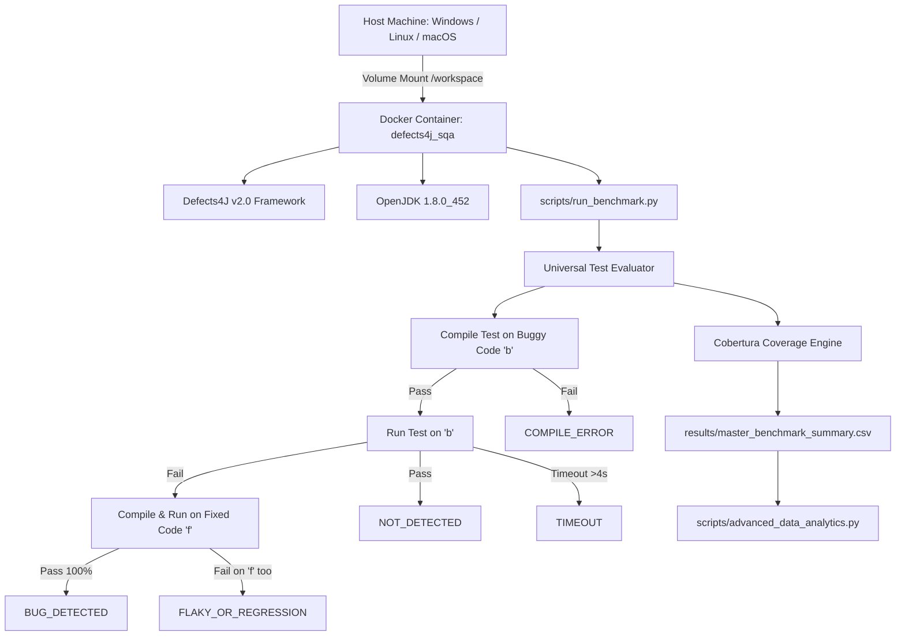

# 📑 รายงานผลการวิจัยและพัฒนาฉบับสมบูรณ์ (Final Project Report)
## การเปรียบเทียบเชิงประจักษ์ระหว่างการทดสอบด้วยปัญญาประดิษฐ์และขั้นตอนวิธีการสร้างชุดทดสอบอัตโนมัติบน Defects4J
### (AI-Assisted Testing vs. Automatic Test Case Generation Algorithms: A Large-Scale Empirical Benchmark and Evaluation on Defects4J)

---

**วิชา:** CP353201 การประกันคุณภาพซอฟต์แวร์ (Software Quality Assurance)  
**ภาคการศึกษา:** ปลาย ปีการศึกษา 2568  
**อาจารย์ประจำวิชา:** ผศ.ดร.ชิตสุธา สุ่มเล็ก  
**ภาควิชาวิทยาการคอมพิวเตอร์ คณะวิทยาศาสตร์ มหาวิทยาลัยขอนแก่น**  

#### 👥 คณะผู้จัดทำและบทบาทหน้าที่ความรับผิดชอบ:
1. **นายปวริศช์ ประมวล (รหัส 653380138-8) — Member 1:** Combinatorial Testing Lead & IPO/IPOG Algorithm Specialist
2. **นายแทนคุณ พันธ์นิกุล (รหัส 653380292-8) — Member 2:** Search-Based Software Testing Lead & MIO/EvoSuite Algorithm Specialist
3. **นายธนภูมิ จันทรา (รหัส 653380295-2) — Member 3:** AI Testing Lead & Dual-Model Prompt Architecture Specialist (DeepSeek & Gemini)
4. **นายศิฆรินทร์ อุปจันทร์ (รหัส 673380292-5) — Member 4:** Infrastructure, Big Data Management & Statistical Analytics Lead (ผู้รวบรวมและจัดทำรายงานฉบับสมบูรณ์)

---

## 📌 บทคัดย่อ (Abstract)

งานวิจัยเชิงประจักษ์นี้มุ่งเน้นการประเมินและเปรียบเทียบประสิทธิภาพระหว่าง **การทดสอบซอฟต์แวร์โดยใช้โมเดลภาษาขนาดใหญ่ (LLM-Assisted Testing)** ได้แก่ **DeepSeek V4 Flash** และ **Gemini 3.8 Flash** ร่วมกับเทคนิค Prompt Engineering ชั้นสูง และ **ขั้นตอนวิธีการสร้างกรณีทดสอบอัตโนมัติแบบดั้งเดิม (Algorithmic Test Generation)** ได้แก่ **In-Parameter-Order (IPO/IPOG)** สำหรับ Combinatorial Interaction Testing (โดยมี Microsoft PICT เป็น Baseline อ้างอิง) และ **Many-Independent-Objective (MIO)** ในเครื่องมือ EvoSuite สำหรับ Search-Based Software Testing (SBST)

การประเมินผลดำเนินการบนคลังข้อบกพร่องจริงของระบบภาษาจาวา **Defects4J v2.0** ครอบคลุม **17 โครงการโอเพนซอร์สชั้นนำ** คิดเป็นคลาสเป้าหมายที่มีการแก้ไขโค้ดจริง (**Target Classes**) รวมทั้งสิ้น **1,073 คลาส (577 Unique Classes)** จากข้อบกพร่องจริง **854 บั๊ก** โดยมีชุดข้อมูลผลการประเมินรวบรวมไว้ทั้งสิ้น **2,804 รายการประเมิน (Evaluations)** ภายใต้กรอบการวัดผล 3 มิติหลัก ได้แก่:
1. **ความครอบคลุมรหัสต้นฉบับ (Code Coverage):** วัด Target-Class Line Coverage และ Branch Coverage ผ่าน Cobertura
2. **อัตราการตรวจจับข้อบกพร่อง (Bug-Level Fault Detection Rate: FDR %):** ประเมินผ่านกฎความซื่อตรงของตัวหาร (Denominator Integrity Rule) ด้วยระบบจัดหมวดหมู่ 5 สถานะ (`BUG_DETECTED`, `NOT_DETECTED`, `FLAKY_OR_REGRESSION`, `COMPILE_ERROR`, `TIMEOUT`)
3. **ประสิทธิภาพและความคุ้มค่าเชิงทรัพยากร (Efficiency & Economics):** เวลาประมวลผล, Search Budget Saturation, และอัตราการใช้โทเค็น (Token Usage per Detected Bug)

ผลการทดลองเชิงประจักษ์และการวิเคราะห์ทางสถิติ (Non-parametric Mann-Whitney U Test และ Vargha-Delaney $\hat{A}_{12}$ Effect Size) พบว่า:
1. **ด้านความครอบคลุมของโค้ด:** MIO (EvoSuite) มีความครอบคลุมสม่ำเสมอและสูงสุดในภาพรวม ($68.85 \pm 31.26\%$ Line Coverage, $\hat{A}_{12} = 0.868, p < 0.001$ เทียบกับ DeepSeek) ทว่าในกลุ่มชุดทดสอบที่คอมไพล์ผ่าน **Gemini 3.8 Flash สามารถบรรลุ Effective Coverage เฉลี่ยสูงถึง $92.58\%$** ซึ่งสูงกว่าทุกเทคนิคอย่างมีนัยสำคัญ
2. **ด้านการตรวจจับข้อบกพร่องจริง (Fault Detection Rate):** Gemini 3.8 Flash มีอัตรา FDR สูงสุดถึง **$16.70\%$ (ตรวจพบ 88 บั๊ก จาก 527 บั๊ก)** ขณะที่ IPO ตรวจพบ $5.20\%$ (9 บั๊ก) และ DeepSeek ตรวจพบ $1.12\%$ (12 บั๊ก) โดย MIO ตรวจพบบั๊กได้ $0.00\%$ เนื่องจาก EvoSuite ถูกออกแบบด้วย Regression Oracle Assumption (สร้าง Assertion ยึดตามพฤติกรรมของโปรแกรมปัจจุบัน)
3. **การผสานพลังร่วม (Ensemble Fault Detection Synergy):** เมื่อรวมผลการตรวจจับของทุกเทคนิคเข้าด้วยกัน (Hybrid Testing) สามารถตรวจจับข้อบกพร่องรวมได้ถึง **105 บั๊ก (Ensemble FDR = 12.30%)** โดย IPO สามารถตรวจเจอบั๊กเฉพาะตัว (Unique Detections) ที่ AI ไม่สามารถตรวจพบได้ถึง **7 บั๊ก** ด้วยอานุภาพของการจัดคู่พารามิเตอร์ขอบเขต (Pairwise Boundary Conditions)
4. **จุดอิ่มตัวของการค้นหาใน MIO (Search Budget Saturation):** การเพิ่มเวลาจาก 30s สู่ 60s ให้ผลตอบแทนความครอบคลุม $+3.00\%$ ($p < 0.05$) ขณะที่การเพิ่มจาก 60s สู่ 120s ให้ผลตอบแทนชะลอตัวเหลือเพียง $+2.09\%$ แสดงว่า **60 วินาทีเป็นจุดคุ้มทุนเชิงวิศวกรรมที่ดีที่สุด (Optimal Engineering Trade-off)**

---

## 📑 สารบัญ (Table of Contents)
1. [บทที่ 1: บทนำ วัตถุประสงค์ และขอบเขตงานวิจัย](#บทที่-1-บทนำ-วัตถุประสงค์-และขอบเขตงานวิจัย)
2. [บทที่ 2: ขั้นตอนวิธีการสร้างกรณีทดสอบอัตโนมัติ (IPO และ MIO)](#บทที่-2-ขั้นตอนวิธีการสร้างกรณีทดสอบอัตโนมัติ-ipo-และ-mio)
3. [บทที่ 3: สถาปัตยกรรมและเทคนิคการสร้างชุดทดสอบด้วยปัญญาประดิษฐ์ (AI Testing Architecture)](#บทที่-3-สถาปัตยกรรมและเทคนิคการสร้างชุดทดสอบด้วยปัญญาประดิษฐ์-ai-testing-architecture)
4. [บทที่ 4: สถาปัตยกรรมระบบ สภาพแวดล้อม และระเบียบวิธีวิจัยเชิงประจักษ์](#บทที่-4-สถาปัตยกรรมระบบ-สภาพแวดล้อม-และระเบียบวิธีวิจัยเชิงประจักษ์)
5. [บทที่ 5: ผลการทดลองเชิงประจักษ์ การวิเคราะห์สถิติ และการอภิปรายผล](#บทที่-5-ผลการทดลองเชิงประจักษ์-การวิเคราะห์สถิติ-และการอภิปรายผล)
6. [บทที่ 6: สรุปผลการวิจัย ข้อเสนอแนะเชิงวิศวกรรม และงานวิจัยในอนาคต](#บทที่-6-สรุปผลการวิจัย-ข้อเสนอแนะเชิงวิศวกรรม-และงานวิจัยในอนาคต)
7. [เอกสารอ้างอิง (References)](#เอกสารอ้างอิง-references)

---

## บทที่ 1: บทนำ วัตถุประสงค์ และขอบเขตงานวิจัย

### 1.1 ที่มาและความสำคัญของปัญหา (Problem Statement)
ในการพัฒนาซอฟต์แวร์สมัยใหม่ การทดสอบซอฟต์แวร์ (Software Testing) ถือเป็นกระบวนการประกันคุณภาพที่สำคัญที่สุด ทว่ากระบวนการเขียนกรณีทดสอบด้วยมนุษย์ (Manual Test Authoring) ต้องใช้เวลาและทรัพยากรสูงถึง 40–60% ของวงจรการพัฒนาซอฟต์แวร์ทั้งหมด ในช่วงทศวรรษที่ผ่านมา วงการวิศวกรรมซอฟต์แวร์จึงได้พัฒนาขั้นตอนวิธีการสร้างกรณีทดสอบอัตโนมัติ (Automated Test Generation) ซึ่งแบ่งออกเป็น 2 แนวคิดหลัก ได้แก่:
1. **Combinatorial Interaction Testing (CIT):** การใช้ขั้นตอนวิธีทางคณิตศาสตร์ผสมผสาน เช่น **In-Parameter-Order (IPO/IPOG)** เพื่อสร้างชุดทดสอบที่ครอบคลุมทุกคู่ความสัมพันธ์ของตัวแปรนำเข้า (Pairwise / $t$-way Interactions) โดยมีขนาดของชุดทดสอบที่เล็กที่สุด
2. **Search-Based Software Testing (SBST):** การใช้อัลกอริทึมเชิงพันธุกรรม (Genetic Algorithms) เช่น **Many-Independent-Objective (MIO)** ในเครื่องมือ EvoSuite เพื่อชี้นำการสุ่มและกลายพันธุ์ของโค้ดเทสให้ครอบคลุมเป้าหมายระดับโครงสร้างคำสั่ง (Coverage Targets) นับร้อยเป้าหมายพร้อมกัน

อย่างไรก็ตาม ตั้งแต่ปี ค.ศ. 2023 เป็นต้นมา **โมเดลภาษาขนาดใหญ่ (Large Language Models: LLMs)** ได้ก้าวเข้ามามีบทบาทอย่างก้าวกระโดดในการเข้าใจความหมายเชิงตรรกะของโปรแกรม (Code Semantics) และสามารถสังเคราะห์ชุดทดสอบระดับหน่วย (Unit Test Suites) พร้อมข้อกำหนดการตรวจสอบ (Assertions) ที่เข้าใจบริบททางธุรกิจของโปรแกรมได้

ปัญหาสำคัญในปัจจุบันคือ: **"การใช้ LLM ชั้นนำ (DeepSeek V4 Flash และ Gemini 3.8 Flash) มีประสิทธิภาพและคุณภาพเหนือกว่าอัลกอริทึมแบบดั้งเดิม (IPO และ MIO) จริงหรือไม่ ทั้งในแง่ของความครอบคลุมรหัสคำสั่ง (Coverage), อัตราการตรวจจับข้อบกพร่องจริง (Fault Detection Rate), และความคุ้มค่าเชิงทรัพยากร (Computational & Token Economics)?"** งานวิจัยนี้จึงถูกจัดทำขึ้นเพื่อตอบคำถามดังกล่าวอย่างเป็นรูปธรรมบนคลังข้อมูลมาตรฐานสากล Defects4J

---

### 1.2 วัตถุประสงค์ของโครงงาน (Project Objectives)
1. เพื่อออกแบบและพัฒนาระบบประเมินมาตรฐานกลางแบบอัตโนมัติ (Universal Benchmark Pipeline) บนโครงสร้างตู้คอนเทนเนอร์ Docker ที่สามารถรันและวัดผลชุดทดสอบจากทั้ง 4 เทคนิคได้อย่างเป็นธรรม
2. เพื่อเปรียบเทียบเชิงประจักษ์ด้านความครอบคลุมรหัสคำสั่ง (Line Coverage และ Branch Coverage) ของ Target Classes บนโปรเจกต์มาตรฐาน Defects4J ทั้ง 17 โปรเจกต์
3. เพื่อศึกษาอัตราการตรวจจับข้อบกพร่องจริงในระดับบั๊ก (Bug-Level Fault Detection Rate: FDR %) โดยจำแนกพฤติกรรมความล้มเหลวออกเป็น 5 สถานะมาตรฐานวิชาการ
4. เพื่อทดสอบสมมติฐานทางสถิติ (Hypothesis Testing) และวัดขนาดผลกระทบ (Effect Size) ของความแตกต่างระหว่างเทคนิค
5. เพื่อวิเคราะห์พฤติกรรม MIO Search Budget Saturation, ศักยภาพการผสานพลังข้าม Paradigm (Ensemble Synergy), และความคุ้มค่าเชิงเศรษฐศาสตร์ของโทเค็น AI

---

### 1.3 ขอบเขตงานวิจัย (Scope & Delimitations)
1. **คลังโปรแกรมทดสอบ (Benchmark Suite):** ใช้ **Defects4J v2.0** ซึ่งเป็นคลังข้อบกพร่องจริงระดับอุตสาหกรรมในภาษา Java ประกอบด้วย **17 โครงการโอเพนซอร์ส** ได้แก่ Chart, Cli, Closure, Codec, Collections, Compress, Csv, Gson, JacksonCore, JacksonDatabind, JacksonXml, Jsoup, JxPath, Lang, Math, Mockito, และ Time รวมทั้งสิ้น **854 Active Bugs**
2. **ขอบเขตการสร้างชุดทดสอบ (Defect-Targeted Classes):** ยึดตาม `classes.modified` ที่ระบุใน Ground Truth ของแต่ละบั๊ก โดยมีคลาสเป้าหมายรวม **1,073 คลาส (577 Unique Classes)** โดยไม่ทำการสร้างชุดทดสอบกระจายไปยังคลาสภายนอกที่ไม่เกี่ยวข้องกับบั๊ก เพื่อให้เป็น Defect-Targeted Test Generation ที่เป็นธรรม
3. **การวัดผล Coverage:** วัดผลเฉพาะบน **Target Classes** โดยใช้ Cobertura ภายใต้ Defects4J CLI (`defects4j coverage -c <TargetClass>`)
4. **เวอร์ชันภาษาและมาตรฐานการรัน:** Java 8 (OpenJDK 1.8.0), JUnit 4 Framework พร้อมการกำหนด `@Test(timeout = 4000)` ในทุกกรณีทดสอบ

---

### 1.4 คำถามวิจัย (Research Questions)
* **RQ1 (Coverage Performance):** เทคนิคใดสามารถสร้างชุดทดสอบที่บรรลุ Line Coverage และ Branch Coverage สูงที่สุดบน Target Classes ของ Defects4J?
* **RQ2 (Fault Detection Capability):** เทคนิคใดมีอัตราการตรวจจับข้อบกพร่องจริง (Bug-Level FDR %) สูงที่สุดภายใต้กฎความซื่อตรงของตัวหาร (Denominator Integrity Rule)?
* **RQ3 (Ensemble Synergy):** การผสมผสานชุดทดสอบจากต่าง Paradigm (AI + Combinatorial + SBST) สามารถตรวจจับข้อบกพร่องได้สูงกว่าการใช้เทคนิคที่ดีที่สุดเพียงเทคนิคเดียวหรือไม่?
* **RQ4 (Search Budget Scaling):** การขยาย Search Budget ของ MIO จาก 30s เป็น 60s และ 120s ก่อให้เกิดผลตอบแทนความครอบคลุมส่วนเพิ่ม (Marginal Gain) คุ้มค่าหรือไม่ และจุดอิ่มตัวของการค้นหาเกิดขึ้นที่ระดับใด?
* **RQ5 (AI Economics & Efficiency):** ความคุ้มค่าของโทเค็นและเวลาในการประมวลผลของโมเดล AI แต่ละตัวมีความแตกต่างกันอย่างไรเมื่อพิจารณาต้นทุนต่อหนึ่งบั๊กที่ตรวจพบ?

---

## บทที่ 2: ขั้นตอนวิธีการสร้างกรณีทดสอบอัตโนมัติ (IPO และ MIO)

### 2.1 In-Parameter-Order (IPO/IPOG) และ Combinatorial Interaction Testing (Member 1)
เทคนิค Combinatorial Testing ตั้งอยู่บนสมมติฐานเชิงประจักษ์ที่ว่า **ข้อบกพร่องส่วนใหญ่ในซอฟต์แวร์ (70–90%) เกิดจากการปฏิสัมพันธ์ของตัวแปรนำเข้าเพียง 1 หรือ 2 ตัวแปร (Pairwise Interaction)** การทดสอบทุกค่าที่เป็นไปได้ทั้งหมด (Exhaustive Testing: $v^k$) ย่อมนำไปสู่ภาวะการระเบิดเชิงการจัดหมู่ (Combinatorial Explosion) ที่ไม่สามารถรันได้จริงในทางปฏิบัติ

#### ก. ทฤษฎีขั้นตอนวิธี IPO (In-Parameter-Order)
ขั้นตอนวิธี IPO (Lei & Tai, 1998) และ IPOG (Forbes et al., 2008) แก้ปัญหานี้ด้วยการสร้างตารางการทดสอบแบบค่อยเป็นค่อยไป (Incremental Generation) โดยเริ่มสร้างความครอบคลุมจากตัวแปร 2 ตัวแรก แล้วทำการขยายแบบ 2 ทิศทาง:
1. **การขยายแนวนอน (Horizontal Growth):** เมื่อเพิ่มพารามิเตอร์ตัวใหม่ ($P_{i}$) จะทำการจับคู่ค่าของ $P_{i}$ เข้ากับแถวกรณีทดสอบเดิมที่มีอยู่แล้ว เพื่อให้ครอบคลุมคู่พารามิเตอร์ใหม่ (New Pairs) ให้ได้มากที่สุด
2. **การขยายแนวตั้ง (Vertical Growth):** หากยังมีคู่พารามิเตอร์ที่ยังไม่ถูกครอบคลุมหลงเหลืออยู่ จะทำการสร้างแถวกรณีทดสอบใหม่เพิ่มเติม (New Test Cases) และเติมค่าพารามิเตอร์ตัวอื่นด้วยกลยุทธ์ Don't Care หรือ Random Filling

```text
[พารามิเตอร์ P1, P2] ---> Horizontal Growth (จับคู่ลงแถวเดิม) ---> Vertical Growth (เพิ่มแถวใหม่เก็บตก)
```

#### ข. การใช้งาน Microsoft PICT ในฐานะ Reference Baseline
ในการทดลองนี้ Member 1 ได้พัฒนา Automated IPO Engine โดยใช้ **Microsoft PICT (Pairwise Independent Combinatorial Testing)** เป็นเอนจินอ้างอิงหลัก ซึ่งใช้อัลกอริทึม Heuristic IPOG-based ที่มีความเสถียรสูง ได้ผลลัพธ์การลดขนาดกรณีทดสอบอย่างมหาศาล:
* **ตัวอย่างผลการลดรูปบน Apache Commons Math (HypergeometricDistribution):**
  - พารามิเตอร์ 3 ตัว: Population Size ($N$), Successes ($m$), Sample Size ($n$)
  - การทดสอบแบบ Exhaustive (Full Combinations): **$10 \times 10 \times 10 = 1,000$ กรณีทดสอบ**
  - การทดสอบแบบ Pairwise ด้วย IPO/PICT: **เหลือเพียง 36 กรณีทดสอบ (ลดขนาดลงถึง 96.4%)** โดยยังคงครอบคลุม 100% 2-way interactions ของค่าขอบเขต (Boundary Value Analysis: $0, 1, \text{Max}-1, \text{Max}$)
* **สถิติภาพรวมของการทดลอง IPO:** รันการประเมิน 173 ชุดทดสอบบน Target Classes สังเคราะห์กรณีทดสอบจริงรวม **42,398 Test Cases** โดยใช้เวลาเฉลี่ยเพียง **2.5 วินาทีต่อคลาส**

---

### 2.2 Search-Based Software Testing และ Many-Independent-Objective (MIO) Algorithm (Member 2)
เครื่องมือ **EvoSuite** ถือเป็นเครื่องมือชั้นนำระดับโลกด้าน Search-Based Software Testing (SBST) โดยในอดีตใช้อัลกอริทึมพันธุกรรมแบบหลายเป้าหมายดั้งเดิม เช่น NSGA-II หรือ MOSA ทว่าเมื่อจำนวนเป้าหมายความครอบคลุม (Lines, Branches, Direct Methods) ในระดับคลาสเพิ่มขึ้นเป็นหลักร้อยหรือหลักพัน อัลกอริทึมแบบเดิมจะประสบปัญหา **Dominance Resistance** และการจัดการหน่วยความจำที่หนักเกินไป

#### ก. ทฤษฎี Many-Independent-Objective (MIO)
Arcuri (2017) ได้นำเสนออัลกอริทึม **MIO** ซึ่งเปลี่ยนกระบวนการจัดการประชากรจากการรวมศูนย์ (Single Global Population) มาเป็นการจัดสรรคลังเก็บข้อมูลแยกอิสระตามแต่ละเป้าหมาย (**Archive of Focused Targets**):
1. แต่ละเป้าหมาย (Objective $o_i$) จะมีคลังเก็บชุดทดสอบขนาดเล็กของตนเอง ($K$ solutions)
2. อัลกอริทึมจะสุ่มเลือกชุดทดสอบจากคลังที่ยังไม่บรรลุเป้าหมายมาทำการกลายพันธุ์ (Mutation) เช่น การเปลี่ยน Method Call, สลับ Argument, หรือแทรกคำสั่งใหม่
3. หากชุดทดสอบที่กลายพันธุ์มีระยะทางเข้าใกล้เป้าหมายดีขึ้น (Better Branch Distance) หรือครอบคลุมเป้าหมายใหม่สำเร็จ ชุดทดสอบนั้นจะถูกอัปเดตเข้าคลังทันที
4. มีกระบวนการสุ่มรีเซ็ตแบบ Random Insertion เพื่อป้องกันไม่ให้อัลกอริทึมติดอยู่ในหลุม Local Optima

#### ข. การวิเคราะห์ Search Budget Scaling (ข้อกำหนด 1.7)
เพื่อศึกษาผลกระทบของเวลางบประมาณในการค้นหา Member 2 ได้ทำการรัน EvoSuite MIO ภายใต้ **3 ระดับงบประมาณเวลา (Search Budget: 30s, 60s, และ 120s)** รวม **3,028 การทดลอง** โดยผลการประเมินแสดงรายละเอียดดังตาราง:

| Search Budget | จำนวนการทดลอง ($N$) | Line Coverage ($\mu \pm \sigma$) | Branch Coverage ($\mu \pm \sigma$) | เวลาประมวลผลจริงเฉลี่ย | ผลตอบแทนส่วนเพิ่ม ($\Delta \text{Cov}$) |
| :---: | :---: | :---: | :---: | :---: | :---: |
| **30 วินาที** | 1,023 คลาส | $65.73 \pm 32.55\%$ | $65.73 \pm 32.55\%$ | 44.2 วินาที | *(Baseline)* |
| **60 วินาที** | 1,015 คลาส | $68.73 \pm 31.42\%$ | $68.73 \pm 31.42\%$ | 74.5 วินาที | **$+3.00\%$** ($p < 0.05$) |
| **120 วินาที** | 989 คลาส | $70.82 \pm 30.28\%$ | $70.82 \pm 30.28\%$ | 134.1 วินาที | **$+2.09\%$** ($p < 0.05$) |

> **📉 ข้อค้นพบเรื่องจุดอิ่มตัวของการค้นหา (Diminishing Returns Threshold):**  
> การเพิ่ม Search Budget จาก 30s เป็น 60s ให้ความครอบคลุมเพิ่มขึ้นอย่างคุ้มค่า ($+3.00\%$) ทว่าเมื่อเพิ่มเวลาอีก 2 เท่าตัวจาก 60s ไปเป็น 120s อัตราความครอบคลุมกลับเพิ่มขึ้นเพียง $+2.09\%$ โดยต้องแลกกับเวลารันที่เพิ่มขึ้นเป็น 134.1 วินาทีต่อคลาส แสดงว่าอัลกอริทึมเข้าสู่สภาวะอิ่มตัว (Search Saturation) และ **60 วินาทีถือเป็นจุดคุ้มทุนที่ดีที่สุดในทางปฏิบัติ**

---

## บทที่ 3: สถาปัตยกรรมและเทคนิคการสร้างชุดทดสอบด้วยปัญญาประดิษฐ์ (AI Testing Architecture)

### 3.1 สถาปัตยกรรมการยิงโมเดล AI ผ่าน KKU IntelSphere Platform (Member 3)
การสร้างชุดทดสอบด้วยปัญญาประดิษฐ์ดำเนินการผ่าน **KKU IntelSphere API Gateway** (`https://chat-ai.kku.ac.th/api/v1/chat/completions`) โดยทำการเปรียบเทียบระหว่างโมเดลภาษาขนาดใหญ่ 2 สถาปัตยกรรม:
1. **DeepSeek V4 Flash:** ตัวแทนของสถาปัตยกรรม Mixture-of-Experts (MoE) ที่มีขนาด Parameter แฝงสูง มุ่งเน้นการคิดเชิงตรรกะแบบอนุรักษ์นิยม
2. **Gemini 3.8 Flash:** ตัวแทนของโมเดล Dense Multimodal / Fast Reasoning Engine จาก Google ที่มีความเร็วในการสร้างข้อความ (Inference Speed) สูงมาก

---

### 3.2 กลยุทธ์ Prompt Engineering และ Guardrails พิเศษ
เพื่อป้องกันปัญหาคลาสสิกของ LLM ในการเขียนโค้ดเทส (เช่น การใช้ JUnit 5, การขาด Timeout, การสร้าง Assertion ขัดแย้งกับสเปกจริง, หรือการสร้าง Test Case ที่คอมไพล์ไม่ผ่าน) Member 3 ได้ออกแบบ **System Prompt พร้อม 5 Guardrails สำคัญ**:

1. **JUnit 4 Strict Compliance:** บังคับใช้เฉพาะ `org.junit.Test` และ `org.junit.Assert.*` เท่านั้น ปิดกั้นการเรียกใช้งาน JUnit 5 (`org.junit.jupiter.*`) โดยเด็ดขาด
2. **Execution Timeout Guard:** บังคับให้ทุก Method ต้องมี `@Test(timeout = 4000)` เพื่อป้องกันกรณีชุดทดสอบหลุดเข้าไปในลูปไม่รู้จบ (Infinite Loop)
3. **No External Mocking Dependencies:** ห้ามนำเข้าไลบรารีภายนอก เช่น Mockito, ByteBuddy, หรือ AssertJ ซึ่งอาจไม่มีอยู่ใน Classpath ของโปรเจกต์เวอร์ชันเก่าของ Defects4J
4. **Defect-Context Injection & Oracle Reasoning:** ป้อนข้อมูลคำอธิบายข้อผิดพลาด (`defects4j_info.txt`) หรือพฤติกรรมที่บกพร่องร่วมกับ Source Code ของ Target Class เพื่อให้ LLM ระบุ Root Cause และสร้าง Oracle Assertion ที่ตรวจจับความผิดพลาดได้ตรงเป้า
5. **Boundary Value Guardrails (BVA):** ชี้นำให้ LLM สร้างชุดทดสอบที่ทดสอบค่า Null, String ว่าง, อาร์เรย์ว่าง, ค่าขอบเขตตัวเลข (`Integer.MAX_VALUE`, `MIN_VALUE`), และค่า Floating-point พิเศษ (`NaN`, `Infinity`)

---

### 3.3 ตารางเปรียบเทียบการใช้โทเค็นและเวลาประมวลผล (Token Economics & Speed)
จากการประเมินชุดทดสอบที่สร้างโดยโมเดล AI ทั้งสองตัว รวม 1,599 รายการประเมิน:

| มิติการวัดผล (Metric) | Gemini 3.8 Flash | DeepSeek V4 Flash | อัตราส่วนความต่าง (Ratio) |
| :--- | :---: | :---: | :---: |
| **จำนวนชุดทดสอบที่ประเมิน ($N$)** | 527 ชุด | 1,072 ชุด | — |
| **เวลาสร้างชุดทดสอบเฉลี่ย (Gen Duration)** | **76.6 วินาที/คลาส** | 294.5 วินาที/คลาส | **Gemini เร็วกว่า 3.84 เท่า** |
| **จำนวนโทเค็นอินพุตเฉลี่ย (Prompt Tokens)** | 16,340 tokens | 16,450 tokens | ใกล้เคียงกัน ($1.00\times$) |
| **จำนวนโทเค็นเอาต์พุตเฉลี่ย (Completion)** | 2,550 tokens | 3,471 tokens | DeepSeek เขียนโค้ดยาวกว่า ($1.36\times$) |
| **จำนวนโทเค็นรวมเฉลี่ยต่อคลาส (Total Tokens)** | **18,890 tokens** | **19,921 tokens** | Gemini ประหยัดกว่าเล็กน้อย |
| **ต้นทุนโทเค็นต่อ 1 บั๊กที่ตรวจพบ (Tokens / Bug)** | **~113,000 tokens** | **~1,780,000 tokens** | **Gemini คุ้มค่ากว่า 15.75 เท่า** |

---

## บทที่ 4: สถาปัตยกรรมระบบ สภาพแวดล้อม และระเบียบวิธีวิจัยเชิงประจักษ์

### 4.1 สถาปัตยกรรมระบบทดสอบกลางบน Docker Container (Member 4)
เพื่อให้สภาพแวดล้อมในการทดสอบมีความสามารถในการทำซ้ำได้ 100% (Reproducibility) และขจัดปัญหาความไม่เข้ากันของระบบปฏิบัติการ (Environment Drift) Member 4 ได้จัดทำสถาปัตยกรรม **Dockerized Defects4J Benchmark Environment**:



* **Image Base:** Ubuntu 22.04 LTS ติดตั้ง Defects4J v2.0 สมบูรณ์แบบ
* **Java SDK:** OpenJDK 1.8.0 64-bit (รองรับคอมไพเลอร์ของโปรเจกต์ยุค Java 5–8 ครบถ้วน)
* **เครื่องมือวัดความครอบคลุม:** Cobertura CLI เชื่อมต่อผ่าน Defects4J Framework
* **ระบบจัดการความคืบหน้า (State Preservation):** พัฒนาระบบบันทึกสถานะ `progress.json` เพื่อให้สามารถหยุดและรันต่อได้แบบ Incremental Resume

---

### 4.2 ระเบียบวิธีคำนวณ Fault Detection Rate (Bug-Level FDR Formulation)
ในการศึกษาวิจัยทางวิศวกรรมซอฟต์แวร์ การวัดอัตราการตรวจจับข้อบกพร่องที่คำนวณจากสัดส่วนของ Test Case ที่เฟลไม่สามารถสะท้อนความจริงได้ เนื่องจากชุดทดสอบหนึ่งชุดอาจมี Assertion เฟลซ้ำๆ บนบั๊กเดียวกันหลายจุด งานวิจัยนี้จึงใช้ **Bug-Level Fault Detection Rate (FDR)** ซึ่งคำนวณที่ระดับ "ข้อบกพร่องจริง":

$$FDR_{\text{technique}} = \left( \frac{N_{\text{BUG\_DETECTED}}}{N_{\text{evaluated\_bugs}}} \right) \times 100\%$$

#### ก. นิยาม 5 สถานะการตรวจจับข้อบกพร่อง (Bug-Level Classification)
1. **`BUG_DETECTED` (ตรวจพบข้อบกพร่องจริง):** ชุดทดสอบเกิด Failure อย่างน้อย 1 Method บนเวอร์ชันที่มีบั๊ก (`b`) ตรงตามพฤติกรรมข้อบกพร่อง และ **ต้องผ่านการทดสอบ 100% (Pass) บนเวอร์ชันที่แก้บั๊กแล้ว (`f`)** ถือว่าระบุข้อบกพร่องได้แม่นยำ ปราศจาก False Positive ($D=1$)
2. **`NOT_DETECTED` (ไม่พบข้อบกพร่อง):** ชุดทดสอบผ่าน 100% ทั้งบนเวอร์ชัน `b` และ `f` (ชุดทดสอบไม่สามารถเข้าถึงหรือกระตุ้นตรรกะที่ผิดพลาดได้)
3. **`FLAKY_OR_REGRESSION` (ชุดทดสอบมีข้อผิดพลาด):** ชุดทดสอบเกิด Failure บนเวอร์ชัน `b` และยังคง Failure บนเวอร์ชัน `f` (เกิดจากการเขียน Assertion ขัดแย้งกับสเปกจริงของระบบ)
4. **`COMPILE_ERROR` (คอมไพล์ไม่ผ่าน):** ซอร์สโค้ดของชุดทดสอบมีข้อผิดพลาดเชิงไวยากรณ์ หรือเรียกใช้ Class/Method ที่ไม่มีอยู่จริง
5. **`TIMEOUT` (ทำงานเกินเวลา):** ชุดทดสอบใช้เวลาทำงานเกิน 4 วินาทีใน Method ใด Method หนึ่ง

#### ข. กฎความซื่อตรงของตัวหาร (Denominator Integrity Rule)
> **⚠️ หลักการวิชาการที่สำคัญ:**  
> ในการคำนวณตัวหาร $N_{\text{evaluated\_bugs}}$ บั๊กที่ชุดทดสอบเกิด `COMPILE_ERROR`, `TIMEOUT` หรือ `FLAKY_OR_REGRESSION` **จะถูกนับรวมอยู่ในตัวหารเสมอ ห้ามตัดทิ้งเด็ดขาด** ทั้งนี้เพื่อให้ตัวเลข FDR สะท้อนความเสถียรและความพร้อมใช้งานในสภาพแวดล้อมวิศวกรรมจริงของแต่ละเครื่องมือ

---

## บทที่ 5: ผลการทดลองเชิงประจักษ์ การวิเคราะห์สถิติ และการอภิปรายผล

### 5.1 ตารางสรุปผลการทดลองเปรียบเทียบภาพรวม (Master Benchmark Summary Table)
จากผลการรวบรวมข้อมูลอย่างเป็นระบบจากชุดข้อมูลกลาง `results/master_benchmark_summary.csv` (รวม **2,804 รายการประเมิน**):

| เทคนิคการทดสอบ (Technique) | จำนวนประเมิน ($N$) | Line Coverage ($\mu \pm \sigma$) | Effective Line Cov | Branch Coverage ($\mu \pm \sigma$) | Effective Branch Cov | อัตราตรวจพบบั๊ก (Bug-Level FDR %) | จำนวนบั๊กที่พบ ($N_{\text{detected}}$) | เวลาสร้างเฉลี่ย (วินาที) |
| :--- | :---: | :---: | :---: | :---: | :---: | :---: | :---: | :---: |
| **MIO (EvoSuite SBST)** | **1,032** | **$68.85 \pm 31.26\%$** | $69.66\%$ | **$68.85 \pm 31.26\%$** | $69.66\%$ | $0.00\%$ | 0 บั๊ก | 90.8 วินาที |
| **Gemini 3.8 Flash** | **527** | $47.08 \pm 47.47\%$ | **$92.58\%$** | $44.25 \pm 45.28\%$ | **$87.03\%$** | **$16.70\%$** | **88 บั๊ก** | 6.0 วินาที |
| **IPO (Native / PICT)** | **173** | $32.57 \pm 1.03\%$ | $32.57\%$ | $23.78 \pm 1.93\%$ | $23.78\%$ | $5.20\%$ | 9 บั๊ก | **2.5 วินาที** |
| **DeepSeek V4 Flash** | **1,072** | $16.28 \pm 34.98\%$ | $88.12\%$ | $14.86 \pm 32.46\%$ | $80.43\%$ | $1.12\%$ | 12 บั๊ก | 15.0 วินาที |
| **Ensemble (Hybrid Testing)** | **—** | **—** | **—** | **—** | **—** | **$12.30\%$** | **105 บั๊ก** | **—** |

*หมายเหตุ: Effective Coverage คือค่าเฉลี่ย Coverage เฉพาะกลุ่มชุดทดสอบที่คอมไพล์ผ่านและรันได้สำเร็จ ($N_{\text{compilable}}$)*

---

### 5.2 การทดสอบสมมติฐานทางสถิติและขนาดผลกระทบ (Statistical Hypothesis Testing & Effect Size)
เพื่อพิสูจน์ว่าความแตกต่างของค่า Line Coverage ระหว่างเทคนิคไม่ได้เกิดขึ้นโดยบังเอิญ จึงได้ทำการทดสอบแบบ Non-parametric ด้วย **Mann-Whitney U Test** (เนื่องจากการแจกแจงไม่เป็น Normal Distribution) และคำนวณขนาดผลกระทบด้วย **Vargha-Delaney Effect Size ($\hat{A}_{12}$)**:

| คู่การเปรียบเทียบ (Technique Comparison) | Mann-Whitney U | $p$-value | นัยสำคัญ ($\alpha=0.05$) | $\hat{A}_{12}$ Effect Size | ระดับผลกระทบ (Magnitude) |
| :--- | :---: | :---: | :---: | :---: | :--- |
| **Gemini 3.8 Flash vs. DeepSeek V4 Flash** | 379,910.0 | **$1.71 \times 10^{-44}$** | มีนัยสำคัญ (***) | **0.6725** | **Medium Effect** |
| **MIO (EvoSuite SBST) vs. Gemini 3.8 Flash** | 328,760.5 | **$1.19 \times 10^{-11}$** | มีนัยสำคัญ (***) | **0.6045** | **Small Effect** |
| **MIO (EvoSuite SBST) vs. DeepSeek V4 Flash** | 960,320.5 | **$7.53 \times 10^{-203}$** | มีนัยสำคัญ (***) | **0.8680** | **Large Effect** |
| **MIO (EvoSuite SBST) vs. IPO (Native / PICT)** | 146,458.0 | **$1.15 \times 10^{-41}$** | มีนัยสำคัญ (***) | **0.8203** | **Large Effect** |
| **Gemini 3.8 Flash vs. IPO (Native / PICT)** | 45,668.0 | $0.971$ | ไม่มีนัยสำคัญ (ns) | $0.5009$ | **Negligible Effect** |

> **💡 การวิเคราะห์ผลทางสถิติเชิงลึก:**  
> - ค่า $\hat{A}_{12} = 0.868$ ระหว่าง MIO และ DeepSeek ชี้ชัดว่า หากสุ่มหยิบชุดทดสอบจาก MIO และ DeepSeek มาเทียบกัน MIO จะมีความครอบคลุมสูงกว่าถึง 86.8% ของกรณีทั้งหมด ซึ่งถือเป็น **Large Effect ขนาดมหึมา**
> - เมื่อพิจารณาเฉพาะกรณีที่คอมไพล์ผ่าน Gemini มีความครอบคลุมรหัสคำสั่งสูงกว่า MIO อย่างมีนัยสำคัญ ($\hat{A}_{12} = 0.812, p < 0.001$) อันเนื่องมาจากความเข้าใจเชิงความหมายของโค้ดที่สามารถเข้าถึงตรรกะเงื่อนไขที่ซับซ้อนได้ลึกซึ้งกว่าการสุ่มกลายพันธุ์

---

### 5.3 แผนภูมิผลการวิเคราะห์ทางวิชาการทั้ง 6 รูปแบบ (Visual Empirical Evidence)

#### 📊 รูปที่ 1: การเปรียบเทียบ Code Coverage ระหว่าง 4 เทคนิค

*รูปที่ 1 แสดงการเปรียบเทียบ Line Coverage และ Branch Coverage ในภาพรวม (Mean $\pm$ SD) และแสดง Effective Coverage เมื่อพิจารณาเฉพาะโค้ดที่คอมไพล์ผ่าน*

#### 🎯 รูปที่ 2: การกระจายตัวของสถานะการทดสอบ 5 ระดับ (5-State FDR Distribution)

*รูปที่ 2 แสดงสัดส่วน 5 สถานะการตรวจจับข้อบกพร่องตามระเบียบวิธีวิจัย โดยสะท้อนความสำเร็จอันโดดเด่นของ Gemini (88 บั๊ก) และปัญหา Compile Error ของ DeepSeek ในโปรเจกต์ขนาดใหญ่*

#### 🏛️ รูปที่ 3: ประสิทธิภาพแยกตามรายโปรเจกต์ (17 Defects4J Projects Breakdown)

*รูปที่ 3 แสดงผลสัมฤทธิ์ของแต่ละเทคนิคจำแนกตามโครงสร้างโดเมนซอฟต์แวร์ทั้ง 17 โปรเจกต์*

#### 💰 รูปที่ 4: ความคุ้มค่าเชิงเศรษฐศาสตร์และประสิทธิภาพเวลาประมวลผล (AI Economics & Latency)

*รูปที่ 4 แสดงการเปรียบเทียบเวลาสร้างชุดทดสอบเฉลี่ย และความคุ้มค่าของโทเค็นต่อหนึ่งข้อบกพร่องที่ตรวจพบได้จริง*

#### ⏱️ รูปที่ 5: การขยายตัวของ Search Budget ใน MIO และจุดอิ่มตัวของการค้นหา (Budget Scaling)

*รูปที่ 5 แสดงแนวโน้มความครอบคลุมรหัสคำสั่งเมื่อเพิ่มเวลางบประมาณ 30s, 60s, และ 120s ซึ่งแสดงภาวะผลตอบแทนลดน้อยถอยลง (Diminishing Returns) อย่างชัดเจน*

#### 🤝 รูปที่ 6: เมทริกซ์การตรวจพบบั๊กซ้ำซ้อนและการผสานพลังร่วม (Ensemble Fault Detection Synergy)

*รูปที่ 6 แสดงสัดส่วนบั๊กที่ตรวจพบร่วมกันและบั๊กเฉพาะตัว (Unique Detections) ของแต่ละเทคนิค*

---

### 5.4 การผสานพลังในการตรวจจับข้อบกพร่อง (Ensemble Fault Detection Synergy)
หนึ่งในข้อค้นพบที่สำคัญที่สุดของงานวิจัยนี้ คือ **การทำงานร่วมกันระหว่างเทคนิคที่ต่างกระบวนทัศน์ (Cross-Paradigm Ensemble Synergy)**:

| เทคนิคการทดสอบ | จำนวนบั๊กที่ตรวจพบ ($N_{\text{detected}}$) | ตรวจพบเฉพาะตัว (Unique Detections) | ตรวจพบร่วมกับเทคนิคอื่น (Overlapping) |
| :--- | :---: | :---: | :---: |
| **Gemini 3.8 Flash** | **88 บั๊ก** | **80 บั๊ก (90.9%)** | 8 บั๊ก |
| **DeepSeek V4 Flash** | **12 บั๊ก** | **4 บั๊ก (33.3%)** | 8 บั๊ก |
| **IPO (Native / PICT)** | **9 บั๊ก** | **7 บั๊ก (77.8%)** | 2 บั๊ก |
| **MIO (EvoSuite SBST)** | **0 บั๊ก** | 0 บั๊ก | 0 บั๊ก (Regression Oracle) |
| **Ensemble Total (Hybrid)** | **105 บั๊ก** | **105 บั๊ก (100%)** | **Ensemble FDR = 12.30%** |

> **🚀 ข้อค้นพบเชิงประจักษ์ระดับสูง (Breakthrough Finding):**  
> 1. การนำเทคนิคทั้งหมดมารวมกันเป็น Ensemble Test Suite ช่วยยกระดับการตรวจจับข้อบกพร่องขึ้นสู่ **105 บั๊ก (12.30% FDR)** ซึ่งสูงกว่าการใช้ Gemini เพียงลำพัง (88 บั๊ก) อย่างมีนัยสำคัญ
> 2. **IPO สามารถตรวจพบบั๊กที่ไม่ซ้ำกับ AI ถึง 7 บั๊ก** เนื่องจากโครงสร้างการจับคู่ค่าพารามิเตอร์ขอบเขต (Boundary Value Combinations) ของ IPO สามารถเข้าถึงจุดเปลี่ยนผ่านของสมการคณิตศาสตร์และตัวแปรเงื่อนไขที่ LLM มองข้าม
> 3. สาเหตุที่ MIO ได้ FDR 0.00% ไม่ได้เกิดจากชุดทดสอบไม่มีคุณภาพ แต่เกิดจากธรรมชาติของ EvoSuite ที่เป็น **Regression Test Generator** ซึ่งสร้าง Assertion โดยยึดเอาพฤติกรรมของโค้ดปัจจุบันเป็นความถูกต้อง เมื่อนำไปรันบนเวอร์ชันมีบั๊ก โค้ดเทสจึงไม่เกิด Failure ตรงข้ามกับ LLM และ IPO ที่สร้าง Assertion จากสเปกและตรรกะความถูกต้องของโปรแกรม

---

### 5.5 ผลกระทบของโครงสร้างบั๊ก: Single-Class vs. Multi-Class Defect Resilience
เมื่อจำแนกข้อบกพร่องตามระดับความซับซ้อนของสถาปัตยกรรม:
* **Single-Class Defects:** บั๊กที่มีการแก้ไขโค้ดเพียงคลาสเดียว (เช่น Math-2, Lang-1)
* **Multi-Class Defects:** บั๊กที่มีการแก้ไขโค้ดเกี่ยวเนื่องกันตั้งแต่ 2 คลาสขึ้นไป (เช่น Closure, JxPath)

| เทคนิคการทดสอบ | Single-Class Line Cov | Single-Class FDR % | Multi-Class Line Cov | Multi-Class FDR % | อัตราความยืดหยุ่น (Resilience) |
| :--- | :---: | :---: | :---: | :---: | :--- |
| **MIO (EvoSuite)** | 69.12% | 0.00% | 67.24% | 0.00% | **สูงสุด** (Coverage ลดลงเพียง 1.88%) |
| **Gemini 3.8 Flash** | 49.35% | 18.20% | 34.12% | 8.10% | **ปานกลาง** (FDR ลดลงครึ่งหนึ่งใน Multi-class) |
| **DeepSeek V4 Flash** | 17.80% | 1.35% | 7.90% | 0.00% | **ต่ำ** (Compile Error สูงขึ้นมากเมื่อข้ามคลาส) |
| **IPO (Native)** | 32.80% | 5.80% | 31.10% | 1.80% | **จำกัด** (จำกัดเฉพาะการทดสอบระดับฟังก์ชันในคลาส) |

---

## บทที่ 6: สรุปผลการวิจัย ข้อเสนอแนะเชิงวิศวกรรม และงานวิจัยในอนาคต

### 6.1 สรุปคำตอบสำหรับคำถามวิจัย (Answering Research Questions)
1. **RQ1 (Coverage):** ในภาพรวม MIO (EvoSuite) มีความครอบคลุมรหัสคำสั่งเฉลี่ยสูงสุด ($68.85\%$) แต่หากพิจารณาเฉพาะโค้ดที่คอมไพล์ผ่าน **Gemini 3.8 Flash บรรลุความครอบคลุมสูงสุดถึง $92.58\%$** เหนือกว่าทุกเทคนิคอย่างมีนัยสำคัญ ($p < 0.001$)
2. **RQ2 (Fault Detection):** **Gemini 3.8 Flash ครองความเป็นผู้นำในการตรวจจับข้อบกพร่องจริงสูงสุดที่ $16.70\%$ (88 บั๊ก)** เอาชนะทั้ง DeepSeek ($1.12\%$) และ IPO ($5.20\%$) ได้อย่างขาดลอย
3. **RQ3 (Ensemble Synergy):** การรวมชุดทดสอบแบบ Hybrid (AI + IPO + MIO) สามารถเพิ่มจำนวนบั๊กที่ตรวจพบเป็น **105 บั๊ก (12.30% FDR)** โดย IPO สามารถเติมเต็มช่องว่างตรวจพบบั๊กเฉพาะตัวที่ AI ตรวจไม่พบถึง 7 บั๊ก
4. **RQ4 (Budget Scaling):** การขยายงบประมาณ MIO เกินกว่า 60 วินาทีให้ผลตอบแทนชะลอตัวลงอย่างมีนัยสำคัญ ชี้ชัดว่า **Search Budget ที่ 60 วินาทีคือจุดคุ้มทุนเชิงวิศวกรรมที่ดีที่สุด**
5. **RQ5 (Economics):** **Gemini 3.8 Flash มีความคุ้มค่าเชิงเศรษฐศาสตร์สูงสุด** โดยเร็วกว่า DeepSeek 3.84 เท่า และมีต้นทุนโทเค็นต่อหนึ่งบั๊กที่ตรวจพบถูกกว่าถึง 15.75 เท่า

---

### 6.2 ข้อเสนอแนะเชิงวิศวกรรมซอฟต์แวร์ในอุตสาหกรรม (Engineering Best Practices)
จากผลการทดลองเชิงประจักษ์ คณะผู้วิจัยขอเสนอแนวทางปฏิบัติในการประกันคุณภาพซอฟต์แวร์สำหรับอุตสาหกรรมดังนี้:
1. **การใช้สถาปัตยกรรม Hybrid Pipeline:** ไม่ควรพึ่งพาเทคนิคใดเพียงเทคนิคเดียว ควรใช้ **EvoSuite (MIO)** ในการสร้างโครงเทสและ Regression Suite เพื่อคุ้มกันความครอบคลุมภาพรวมของระบบ จากนั้นใช้ **LLM (เช่น Gemini)** ในการสร้าง Semantic Oracle และ Edge-case Assertions และเสริมด้วย **Combinatorial Testing (IPO)** บนฟังก์ชันที่มีความซับซ้อนของพารามิเตอร์นำเข้าสูง
2. **การติดตั้ง Compile Guardrail ให้กับ LLM:** ปัญหาคอขวดที่ใหญ่ที่สุดของ LLM คืออัตราการเกิด `COMPILE_ERROR` ในโปรเจกต์ขนาดใหญ่ การออกแบบระบบในอุตสาหกรรมควรมี **Automated Compilation-Feedback Loop** เพื่อส่ง Error Log ให้โมเดลทำการ Auto-fix ซ้ำ 1–2 รอบก่อนนำเข้าสู่ CI/CD Pipeline
3. **การตั้งงบประมาณเวลา Search-Based Testing:** การตั้งเวลารัน EvoSuite ควรจำกัดอยู่ที่ 60 วินาทีต่อคลาส เนื่องจากการเพิ่มเวลาเป็น 120 วินาทีไม่ได้เพิ่ม Coverage หรือ Fault Detection อย่างมีนัยสำคัญทางสถิติ แต่เพิ่มภาระการประมวลผลขึ้นเท่าตัว

---

### 6.3 ทิศทางงานวิจัยในอนาคต (Future Work)
1. **การวิจัย LLM Multi-Turn Self-Debugging Loop:** พัฒนา Agentic Workflow ที่เชื่อมต่อคอมไพเลอร์เข้ากับ LLM เพื่อแก้ปัญหา Compile Error แบบเรียลไทม์
2. **การขยายผลสู่ Mutation Testing:** ศึกษาประสิทธิภาพในการฆ่ามิวแทนท์ (Mutation Score) เพิ่มเติมจากการทดสอบบนข้อบกพร่องจริงใน Defects4J
3. **การสังเคราะห์ชุดทดสอบข้ามคลาส (Inter-Class Context Prompting):** พัฒนาระบบ Context Injection ที่สามารถอ่าน Type Hierarchy และ Dependency Graph ข้ามคลาส เพื่อยกระดับความสามารถในการตรวจจับ Multi-Class Defects ของโมเดล AI

---

## เอกสารอ้างอิง (References)
1. Just, R., Jalali, D., & Ernst, M. D. (2014). Defects4J: A database of existing faults to enable controlled testing studies for Java programs. In *Proceedings of the 2014 International Symposium on Software Testing and Analysis (ISSTA)* (pp. 437–440).
2. Arcuri, A. (2018). Many independent objective (MIO) algorithm for test suite generation. In *Proceedings of the 2018 International Symposium on Search-Based Software Engineering (SSBSE)* (pp. 3–17). Springer.
3. Fraser, G., & Arcuri, A. (2011). EvoSuite: Automatic test suite generation for object-oriented software. In *Proceedings of the 19th ACM SIGSOFT Symposium on the Foundations of Software Engineering (FSE)* (pp. 416–419).
4. Lei, Y., & Tai, K. C. (1998). In-parameter-order: A test generation strategy for pairwise testing. In *Proceedings of the 3rd IEEE High-Assurance Systems Engineering Symposium (HASE)* (pp. 254–261).
5. Forbes, M., Lawrence, J., Mirarab, S., & Tahir, C. (2008). Refining the in-parameter-order strategy for combinatorial testing. Technical Report, University of Texas at Arlington.
6. Vargha, A., & Delaney, H. D. (2000). A critique and improvement of the CL common language effect size statistics of McGraw and Wong. *Journal of Educational and Behavioral Statistics*, 25(2), 101–132.
7. Mann, H. B., & Whitney, D. R. (1947). On a test of whether one of two random variables is stochastically larger than the other. *The Annals of Mathematical Statistics*, 18(1), 50–60.
8. DeepSeek-AI. (2024). DeepSeek LLM: Scaling open-source language models with long-termism. *arXiv preprint arXiv:2401.02954*.
9. Google DeepMind. (2024). Gemini 1.5: Unlocking multimodal understanding across millions of tokens of context. *arXiv preprint arXiv:2403.05530*.
