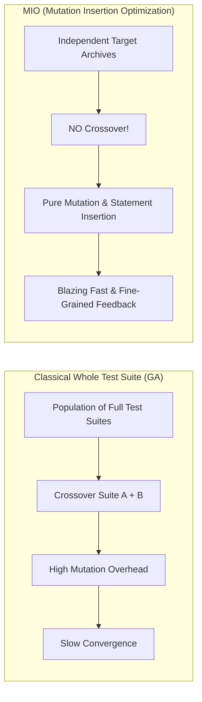
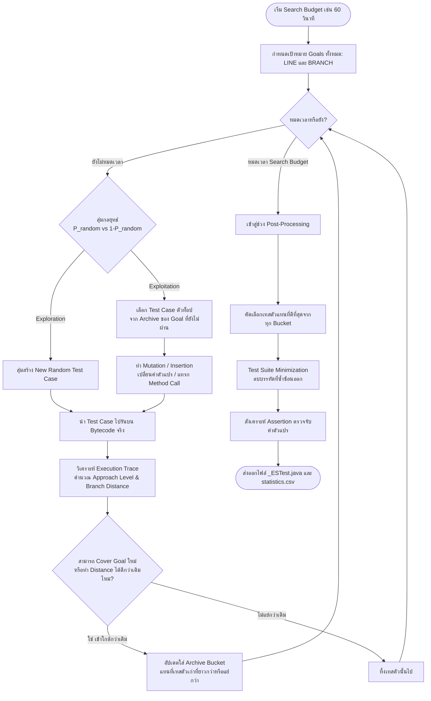
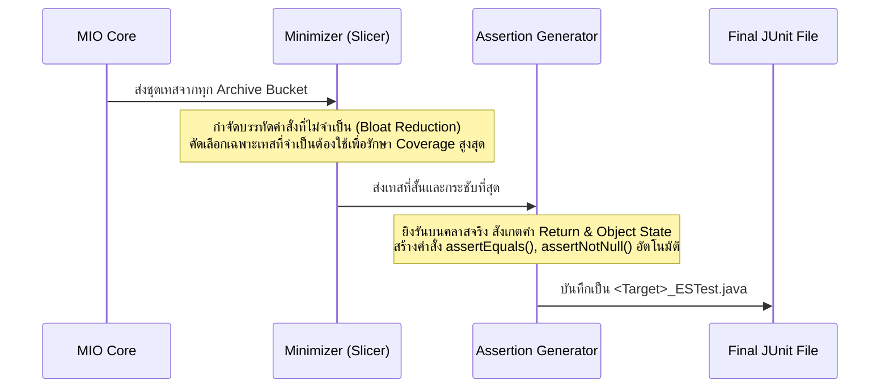
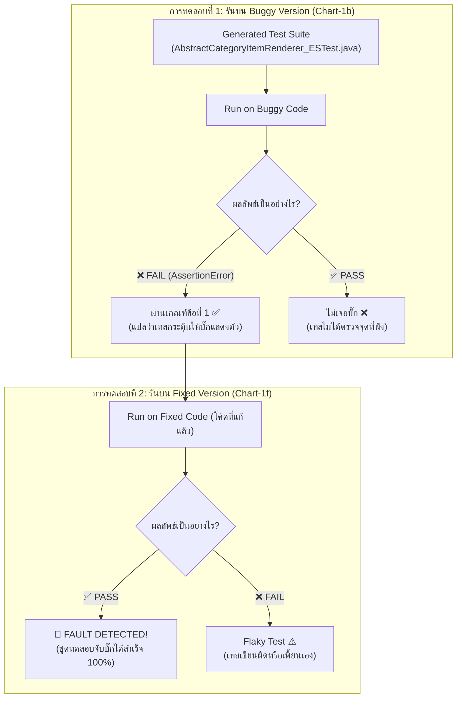

# 📚 คู่มือข้อควรรู้และการแปลผลเชิงวิชาการ MIO Algorithm (Academic Knowledge Base)

**สำหรับ:** Member 2 (นายแทนคุณ พันธ์นิกุล - MIO / EvoSuite Specialist)  
**โครงการ:** CP353201 Software Quality Assurance (KKU CS)  
**หัวข้อ:** ทฤษฎีและกลไกการทำงานของ MIO Algorithm, การคำนวณ Code Coverage, การตรวจจับบั๊กใน Defects4J (FDR), และการเตรียมข้อมูลสำหรับเล่มรายงาน

---

## 📌 สารบัญ (Table of Contents)
1. [บทที่ 1: กลไกการทำงานของ MIO Algorithm เชิงลึก (How MIO Works: Theory & Visual Mechanics)](#-บทที่-1-กลไกการทำงานของ-mio-algorithm-เชิงลึก-how-mio-works-theory--visual-mechanics)
   - [1.1 แนวคิดพื้นฐาน: จุดเปลี่ยนจาก Classic GA สู่ MIO](#11-แนวคิดพื้นฐาน-จุดเปลี่ยนจาก-classic-ga-สู่-mio)
   - [1.2 สถาปัตยกรรมคลังเก็บเป้าหมายย่อย (Target-Centric Archive Architecture)](#12-สถาปัตยกรรมคลังเก็บเป้าหมายย่อย-target-centric-archive-architecture)
   - [1.3 กลไกหลัก 3 ประการของ MIO (The Three Pillars of MIO)](#13-กลไกหลัก-3-ประการของ-mio-the-three-pillars-of-mio)
   - [1.4 แผนภาพการทำงานจำลองทีละขั้นตอน (Step-by-Step Visual Flowchart)](#14-แผนภาพการทำงานจำลองทีละขั้นตอน-step-by-step-visual-flowchart)
   - [1.5 ตัวอย่างการเดินทางของ Test Case ผ่านการคำนวณ Branch Distance](#15-ตัวอย่างการเดินทางของ-test-case-ผ่านการคำนวณ-branch-distance)
   - [1.6 การตัดแต่งชุดทดสอบและการสังเคราะห์ Assertion (Post-Processing & Assertion Generation)](#16-การตัดแต่งชุดทดสอบและการสังเคราะห์-assertion-post-processing--assertion-generation)
2. [บทที่ 2: ความหมายเชิงลึกของ Code Coverage (Coverage Decoded)](#-บทที่-2-ความหมายเชิงลึกของ-code-coverage-coverage-decoded)
3. [บทที่ 3: Defects4J Ground Truth & การพิสูจน์ว่า "หาบั๊กเจอหรือไม่?"](#-บทที่-3-defects4j-ground-truth--การพิสูจน์ว่า-หาบั๊กเจอหรือไม่)
4. [บทที่ 4: วิธีการทดสอบตรวจจับบั๊กด้วย Runner กลาง (How to Verify with Runner)](#-บทที่-4-วิธีการทดสอบตรวจจับบั๊กด้วย-runner-กลาง-how-to-verify-with-runner)
5. [บทที่ 5: การนำผลลัพธ์ไปเขียนเล่มรายงาน (Final Report Alignment)](#-บทที่-5-การนำผลลัพธ์ไปเขียนเล่มรายงาน-final-report-alignment)
6. [บทที่ 6: คำถามที่พบบ่อยสำหรับ Member 2 (MIO FAQ)](#-บทที่-6-คำถามที่พบบ่อยสำหรับ-member-2-mio-faq)

---

## 🧬 บทที่ 1: กลไกการทำงานของ MIO Algorithm เชิงลึก (How MIO Works: Theory & Visual Mechanics)

### 1.1 แนวคิดพื้นฐาน: จุดเปลี่ยนจาก Classic GA สู่ MIO
ในสายงานวิจัย **Search-Based Software Testing (SBST)** ยุคแรก เช่น อัลกอริทึม **Whole Test Suite (WTS)** ของ Fraser & Arcuri (2012) จะมองว่า *Chromosome 1 ตัว = Test Suite ทั้งชุด* ซึ่งต้องนำ Test Suite ขนาดใหญ่มาทำ Crossover และ Mutation ข้ามรุ่น (Generations) ซึ่งมีจุดอ่อนใหญ่ 2 ประการ:
1. **Computationally Expensive:** การรัน Test Suite ทั้งชุดซ้ำๆ ทุก Generation สิ้นเปลืองเวลาและ Search Budget มหาศาล
2. **Destructive Crossover:** การนำโค้ดบรรทัดของเทส 2 อันมาตัดแปะข้ามกัน (Crossover) มักทำให้ Dependency ของอ็อบเจกต์พัง (เช่น บรรทัดประกาศตัวแปรหลุดหาย ทำให้โค้ดรันไม่ผ่าน)

ด้วยเหตุนี้ **Dr. Andrea Arcuri (2018)** จึงได้คิดค้นและตีพิมพ์อัลกอริทึม **MIO (Mutation Insertion Optimization)** ขึ้นในวารสารระดับท็อปของโลก *ACM Transactions on Software Engineering and Methodology (TOSEM)* เพื่อปฏิวัติกระบวนการสร้างชุดทดสอบ:



---

### 1.2 สถาปัตยกรรมคลังเก็บเป้าหมายย่อย (Target-Centric Archive Architecture)
แทนที่จะเก็บประชากรแบบรวมศูนย์ MIO จะแยก **"คลังเก็บชุดทดสอบ (Archive)"** ออกเป็นช่องๆ ตามแต่ละ **Coverage Goal ($g \in G$)** ในซอร์สโค้ด:

```text
┌────────────────────────────────────────────────────────────────────────────────────────┐
│                                 MIO ARCHIVE STRUCTURE                                  │
├────────────────────────────────────────────────────────────────────────────────────────┤
│ Target Goal g1: [Line 15: if (amount > 1000)]                                          │
│   └── Archive Bucket (Capacity = 1 to 5):                                              │
│       • Test_A: amount = 950   (Approach Level = 0, Branch Distance = 50)  <-- Best!   │
│                                                                                        │
│ Target Goal g2: [Line 25: catch (IOException e)]                                       │
│   └── Archive Bucket:                                                                  │
│       • Test_B: trigger invalid file path (Covered! Status: COVERED)                   │
│                                                                                        │
│ Target Goal g3: [Line 42: return status == Status.ACTIVE]                             │
│   └── Archive Bucket: (Empty - ยังไม่มีเทสเคสใดเข้าใกล้เงื่อนไขนี้ได้)                  │
└────────────────────────────────────────────────────────────────────────────────────────┘
```

* แต่ละ Bucket จะเก็บเฉพาะ Test Case ที่ **"เข้าใกล้เป้าหมายนั้นมากที่สุด"** 
* หากมีเทสเคสใหม่ที่เข้าใกล้เงื่อนไขมากกว่า หรือมีความยาวโค้ดสั้นกว่า (Shorter length) มันจะเข้ามา **แทนที่ (Replace)** เทสตัวเดิมใน Bucket นั้นทันที

---

### 1.3 กลไกหลัก 3 ประการของ MIO (The Three Pillars of MIO)

#### 1. ตัด Crossover ทิ้งโดยสิ้นเชิง (No Crossover)
MIO พิสูจน์แล้วว่าการสลับตัดต่อบรรทัดระหว่าง Test Case ต่างกันไม่มีประโยชน์ในทางปฏิบัติ MIO จึงใช้เพียง **Mutation (การกลายพันธุ์)** และ **Insertion (การแทรกคำสั่ง)** เท่านั้น:
* **Value Mutation:** ปรับเปลี่ยนค่าตัวแปร เช่น `42` -> `43`, `"admin"` -> `"root"`, `null` -> `new Object()`
* **Statement Insertion:** สุ่มแทรกการเรียกเมธอดใหม่เข้ามาในลำดับการทดสอบ
* **Statement Deletion:** ลบบรรทัดคำสั่งที่ไม่จำเป็นออกเพื่อลด Bloat

#### 2. การสุ่มแบบปรับตัว (Adaptive Sampling: Exploration vs. Exploitation)
ในทุกๆ ลูปของการค้นหา MIO จะตัดสินใจเลือกระหว่าง:
* **Exploration ($P_{random}$):** สุ่มสร้าง Test Case ใหม่ขึ้นมาตั้งแต่ต้นจากศูนย์ (ช่วยพาการค้นหาหลุดออกจาก Local Optima)
* **Exploitation ($1 - P_{random}$):** สุ่มเลือก Test Case ที่เก่งที่สุดจาก Archive ที่ยังไม่ Covered แล้วนำมา Mutate ต่อยอด
* **Dynamic Feedback:** เมื่อเวลาผ่านไป หรือเมื่อเป้าหมายง่ายๆ ถูก Cover หมดแล้ว MIO จะค่อยๆ ลดค่า $P_{random}$ ลงอัตโนมัติ เพื่อทุ่ม Search Budget ไปกับการ Mutate เจาะเงื่อนไขยากๆ ที่ยังค้างอยู่

#### 3. ฟังก์ชันวัดระยะห่าง (Fitness Function: Approach Level & Branch Distance)
เมื่อ Test Case ทำงาน MIO จะคำนวณว่ามันวิ่งเข้าไปใกล้เงื่อนไขเป้าหมายแค่ไหน ด้วยสูตรคณิตศาสตร์:

$$\text{Fitness}(t, g) = \text{Approach Level}(t, g) + \text{Normalized Branch Distance}(d)$$

* **Approach Level ($A$):** จำนวนโหนดเงื่อนไข (Control Flow Branches) ที่ขวางกั้นอยู่ระหว่างจุดที่เทสเคสเลี้ยวผิดทาง กับจุดเป้าหมายจริง (ถ้าเทสหลุดไปอีกกิ่งหนึ่งตั้งแต่ if แรก $A$ จะสูง)
* **Branch Distance ($d$):** ระยะห่างของค่านิพจน์ในเงื่อนไข ณ จุดที่เลี้ยวผิด เช่น:
  * ถ้าโค้ดคือ `if (x == 100)` แต่เทสเคสส่งค่า `x = 80` เข้ามา
  * ค่า $d = |80 - 100| = 20$
  * นำไป Normalize ให้อยู่ในช่วง $[0, 1]$ ด้วยสูตร: $\nu(d) = \frac{d}{d + 1}$
  * ยิ่งค่า $d$ เข้าใกล้ $0$ แสดงว่าเทสเคสกำลัง "เฉียด" ที่จะผ่านเงื่อนไขนั้นเข้าไปได้แล้ว!

---

### 1.4 แผนภาพการทำงานจำลองทีละขั้นตอน (Step-by-Step Visual Flowchart)



---

### 1.5 ตัวอย่างการเดินทางของ Test Case ผ่านการคำนวณ Branch Distance

ลองจินตนาการฟังก์ชันเป้าหมายในคลาสซอฟต์แวร์จริง:
```java
public boolean verifyCoupon(String code, int purchaseAmount) {
    if (purchaseAmount >= 500) {          // Goal 1: Branch 1 (True)
        if (code.equals("DISCOUNT50")) {   // Goal 2: Branch 2 (True)
            return true;                   // Goal 3: Target Line
        }
    }
    return false;
}
```

MIO จะพยายามพา Test Case ฝ่าด่านเงื่อนไขเข้าไปทีละขั้นดังนี้:

```text
รอบที่ 1 (Random Initial):
   Test 1: verifyCoupon("ABC", 100)
   -> หลุดตั้งแต่เงื่อนไขแรก (purchaseAmount < 500)
   -> Branch Distance ของเงื่อนไขแรก = |100 - 500| = 400
   -> บันทึก Test 1 ไว้ใน Bucket ของ Goal 1

รอบที่ 2 (MIO Mutation - ปรับตัวเลข):
   MIO สุ่มเลือก Test 1 มากลายพันธุ์ค่า purchaseAmount -> เปลี่ยนเป็น 480
   -> Branch Distance ลดเหลือ |480 - 500| = 20 (ดีขึ้นมาก!)
   -> แทนที่ Test 1 ใน Archive

รอบที่ 3 (MIO Mutation สำเร็จด่านที่ 1):
   MIO กลายพันธุ์ต่อยอด -> เปลี่ยน purchaseAmount เป็น 500
   -> เงื่อนไขแรกเป็นจริง! (Goal 1: COVERED! 🎉)
   -> หลุดเงื่อนไขที่ 2 (code ยังเป็น "ABC" != "DISCOUNT50")
   -> บันทึก Test 3 เข้า Bucket ของ Goal 2

รอบที่ 4 (MIO String Mutation พิชิตด่านสุดท้าย):
   MIO กลายพันธุ์ String ต่อไปจนได้ "DISCOUNT50"
   -> เงื่อนไขที่สองเป็นจริง! ทะลุเข้าไปถึง `return true;`
   -> Goal 2 และ Goal 3: COVERED สมบูรณ์แบบ 100%!
```

---

### 1.6 การตัดแต่งชุดทดสอบและการสังเคราะห์ Assertion (Post-Processing & Assertion Generation)

เมื่อหมดเวลาค้นหา (เช่น 30s, 60s, 120s) MIO จะไม่ส่งโค้ดดิบๆ ออกมาทันที แต่จะทำอีก 2 ขั้นตอนสำคัญ:



1. **Test Suite Minimization:** คัดเลือกจำนวน Test Case ให้น้อยที่สุดเท่าที่จำเป็นในการรักษาเปอร์เซ็นต์ Coverage ให้เท่าเดิม (แก้ปัญหาเทสเยอะเกินไปและรันช้า)
2. **Assertion Generation (Mutation-Driven):** EvoSuite จะสังเกตพฤติกรรมของโปรแกรมต้นฉบับ จากนั้นเติมคำสั่ง `assertEquals(...)` หรือ `assertTrue(...)` เพื่อให้เทสเคสสามารถจับผิดโค้ดที่เกิดบั๊กได้จริง ไม่ใช่แค่วิ่งผ่านบรรทัดเฉยๆ

---

## 🎯 บทที่ 2: ความหมายเชิงลึกของ Code Coverage (Coverage Decoded)

เมื่อเราสั่งรันสคริปต์ [batch_evosuite.py](file:///c:/Users/tanku/Documents/GitHub/claude-code-main/ProjectSQA/MIO_Algorithm/Code/batch_evosuite.py) แล้วได้ผลลัพธ์ เช่น **`Coverage: 57.13%`** ตัวเลขนี้มีความหมายทางวิศวกรรมซอฟต์แวร์ดังนี้ครับ:

### 2.1 Line Coverage vs. Branch Coverage
ในเกณฑ์ข้อกำหนดวิชาการข้อ **1.7** รายวิชากำหนดให้วัดผล 2 เกณฑ์หลัก:

```text
       ┌────────────────────────────────────────────────────────┐
       │                 Defects4J Target Class                 │
       │                                                        │
       │  Line Coverage: คำสั่งแต่ละบรรทัดถูกรันผ่านหรือไม่?     │
       │  [Line 1] int x = a + b;             ✅ Covered        │
       │                                                        │
       │  Branch Coverage: เงื่อนไขการตัดสินใจผ่านครบไหม?       │
       │  [Line 2] if (x > 100) {             🔀 True / False  │
       │  [Line 3]     status = "HIGH";       ✅ Covered (True) │
       │  [Line 4] } else {                                     │
       │  [Line 5]     status = "LOW";        ❌ Missed (False) │
       │  [Line 6] }                                            │
       └────────────────────────────────────────────────────────┘
```

* **Line Coverage (%):** คือสัดส่วนของ **"บรรทัดคำสั่ง (Statements/Lines)"** ในคลาสเป้าหมายที่ถูกชุดทดสอบรันผ่านจริง เทียบกับบรรทัดคำสั่งทั้งหมด
  $$\text{Line Coverage (\%)} = \left(\frac{\text{Covered Lines}}{\text{Total Executable Lines}}\right) \times 100\%$$
* **Branch Coverage (%):** คือสัดส่วนของ **"กิ่งเงื่อนไขการตัดสินใจ (Branches: if, else, switch, while, for)"** ที่ชุดทดสอบทดสอบครบทั้งกรณีที่เป็น **จริง (True)** และ **เท็จ (False)**
  $$\text{Branch Coverage (\%)} = \left(\frac{\text{Covered Branches}}{\text{Total Branches}}\right) \times 100\%$$

---

### 2.2 ตัวอย่างจริงจากการทดลอง (กรณีศึกษา `Chart-1b`)
จากผลการรัน [statistics.csv](file:///c:/Users/tanku/Documents/GitHub/claude-code-main/ProjectSQA/MIO_Algorithm/Result_Round2/raw_reports/Chart_1b_30s_s101/statistics.csv):
```csv
TARGET_CLASS,criterion,Coverage,Total_Goals,Covered_Goals
org.jfree.chart.renderer.category.AbstractCategoryItemRenderer,LINE;BRANCH,0.4805882652152903,848,401
```
* **Total Goals = 848:** ในคลาสนี้มีเป้าหมายที่ต้องพิสูจน์ (บรรทัด + กิ่งเงื่อนไข) รวมทั้งสิ้น 848 จุด
* **Covered Goals = 401:** อัลกอริทึม MIO สามารถสร้าง Test Case วิ่งเข้าไปทดสอบได้สำเร็จถึง 401 จุด
* **Coverage = 48.06%:** คิดเป็นเกือบครึ่งหนึ่งของคลาสขนาดใหญ่ระดับ Enterprise ซึ่งถือว่ามีประสิทธิภาพสูงมาก

---

### 2.3 ทำไม Coverage ถึงไม่เต็ม 100%?
เป็นเรื่องปกติของโค้ดในโลกความเป็นจริงครับ เพราะ:
1. **Unreachable Code (Dead Code):** โค้ดบางบรรทัดไม่มีทางเกิดขึ้นได้ในการทำงานจริง
2. **Defensive Programming / Hard Exceptions:** บล็อก `catch (OutOfMemoryError e)` หรือกรณีฮาร์ดแวร์ล้มเหลว ซึ่ง Unit Test จำลองได้ยากมาก
3. **Private Constructors & Utility Classes:** เมธอดบางตัวถูกล็อกการเข้าถึงจากภายนอก

---

### 2.4 การวิเคราะห์ความไวต่อเวลา (Search Budget Sensitivity) ตามเกณฑ์ 1.7
อาจารย์กำหนดให้เปรียบเทียบ **30s, 60s, 120s $\times$ 3 Seeds (101, 102, 103)** เพื่อพิสูจน์สมมติฐานทางวิชาการ:
> *"เมื่อให้อัลกอริทึม MIO มีเวลาในการค้นหา (Search Budget) เพิ่มขึ้น โครงสร้างชุดทดสอบจะครอบคลุมกิ่งเงื่อนไขที่ซับซ้อนได้ลึกขึ้น ทำให้ค่า Mean Coverage ค่อย ๆ เพิ่มขึ้น และมีค่าส่วนเบี่ยงเบนมาตรฐาน (SD) ที่แคบลง"*

ตัวอย่างผลลัพธ์จริงที่ระบบคำนวณและบันทึกลงใน [evosuite_budget_summary.csv](file:///c:/Users/tanku/Documents/GitHub/claude-code-main/ProjectSQA/MIO_Algorithm/Result_Round2/evosuite_budget_summary.csv):
* **Budget 30s:** Mean Coverage = **`47.09% ± 2.97%`**
* **Budget 60s:** Mean Coverage = **`57.13% ± 3.05%`**
* **Budget 120s:** Mean Coverage = **`60.13% ± 2.09%`**  
*(เห็นได้ชัดว่ายิ่งให้เวลาค้นหามาก จาก 47% จะไต่ระดับขึ้นไปเป็น 60% อย่างมีนัยสำคัญ)*

---

## 🐛 บทที่ 3: Defects4J Ground Truth & การพิสูจน์ว่า "หาบั๊กเจอหรือไม่?"

### 3.1 Defects4J รู้ได้อย่างไรว่ามีบั๊ก? (Ground Truth)
Defects4J เป็นชุดข้อมูลมาตรฐานโลกที่รวบรวม **"บั๊กจริงที่เคยเกิดขึ้นจริงในประวัติศาสตร์ของซอฟต์แวร์ Open-Source"**
* ทุกบั๊กในโฟลเดอร์ [target_benchmark/](file:///c:/Users/tanku/Documents/GitHub/claude-code-main/ProjectSQA/target_benchmark) จะมีไฟล์บันทึกประวัติเฉลย (Ground Truth) เช่น [target_benchmark/Chart_1b/defects4j_info.txt](file:///c:/Users/tanku/Documents/GitHub/claude-code-main/ProjectSQA/target_benchmark/Chart_1b/defects4j_info.txt):
  ```text
  Summary for Bug: Chart-1
  Root cause in triggering tests:
   - org.jfree.chart.renderer.category.junit.AbstractCategoryItemRendererTests::test2947660
     --> junit.framework.AssertionFailedError: expected:<1> but was:<0>
  List of modified sources:
   - org.jfree.chart.renderer.category.AbstractCategoryItemRenderer
  ```
* **ความหมาย:** Defects4J รู้แน่ชัดอยู่แล้วว่า ถ้าฟังก์ชันในคลาสนี้ทำงานถูกต้อง ผลลัพธ์ต้องได้ `1` แต่โค้ดเวอร์ชันที่มีบั๊ก (`buggy: 1b`) กลับส่งค่าออกมาเป็น `0`

---

### 3.2 นิยามเชิงวิชาการของการ "หาบั๊กเจอ" (Fault Detection Condition)
เราจะสรุปว่าชุดทดสอบที่ MIO ผลิตขึ้น **"ตรวจจับบั๊กเจอ (Fault Detected)"** ก็ต่อเมื่อผ่านเงื่อนไข **Differential Testing** ทั้ง 2 ข้อนี้:

$$\text{Fault Detected} \iff (\text{Run on Buggy } b \implies \mathbf{FAIL}) \land (\text{Run on Fixed } f \implies \mathbf{PASS})$$



1. **เมื่อรันบนเวอร์ชัน Buggy (`Chart-1b`):** โค้ดเทสต้องเกิด **AssertionFailedError** หรือ **Exception** ตรงจุดที่เป็นบั๊ก (แสดงว่าเทสไปกระตุ้นจุดที่มีข้อบกพร่องได้จริง)
2. **เมื่อนำเทสชุดเดิมไปรันบนเวอร์ชัน Fixed (`Chart-1f`):** โค้ดเทสต้อง **ผ่านหมด (PASS)** (แสดงว่าข้อผิดพลาดในข้อ 1 เกิดจากตัวบั๊กของโปรแกรมจริง ไม่ใช่เกิดจากเทสเขียนมั่ว)

> 💡 **ข้อสังเกตสำคัญ:**  
> การได้ **High Coverage ไม่ได้รับประกันว่าต้องเจอบั๊กเสมอไป!** เพราะเทสเคสอาจวิ่งผ่านบรรทัดที่มีบั๊ก แต่ขาดคำสั่ง Assert ตรวจสอบค่าที่ผิด (Weak Oracle)  
> ดังนั้นในโครงงานนี้เราจึงต้องประเมินทั้ง **Coverage** และ **Fault Detection Rate (FDR)** ควบคู่กันเสมอ!

---

## 🧪 บทที่ 3: วิธีการทดสอบตรวจจับบั๊กด้วย Runner กลาง (How to Verify with Runner)

Member 4 ได้เตรียมเครื่องมือกลางสำหรับวัดผล Fault Detection ไว้แล้วใน [scripts/run_benchmark.py](file:///c:/Users/tanku/Documents/GitHub/claude-code-main/ProjectSQA/scripts/run_benchmark.py)

เมื่อเราสั่งรัน MIO จนได้ไฟล์เทสใน `TestCode/<Project>_<Bug>b/` แล้ว เราสามารถทดสอบตรวจสอบได้ทันทีด้วยคำสั่ง:

```powershell
# คำสั่งตรวจสอบว่าชุดเทส MIO จับบั๊ก Chart-1 ได้หรือไม่:
python scripts/run_benchmark.py --technique mio --project Chart --bug 1
```

### สิ่งที่ Runner กลางจะทำในเบื้องหลัง:
1. คัดลอกไฟล์ `AbstractCategoryItemRenderer_ESTest.java` ของเราเข้าไปใน Defects4J Container
2. สั่งคอมไพล์และรันเทสบน `Chart-1b` (Buggy)
3. สั่งคอมไพล์และรันเทสบน `Chart-1f` (Fixed)
4. บันทึกผลลัพธ์ลงในไฟล์กลาง `results/benchmark_results.csv`:

| Project | Bug_ID | Technique | Line_Coverage_% | Branch_Coverage_% | Fault_Detection_Status | Failures_Count |
| :--- | :--- | :--- | :--- | :--- | :--- | :--- |
| Chart | 1 | MIO (EvoSuite SBST) | 60.13% | 60.13% | **DETECTED** | 1 |

* หากขึ้นว่า **`DETECTED`**: แสดงว่าชุดทดสอบของ Member 2 จับบั๊กของ Defects4J ได้จริง!
* หากขึ้นว่า **`NOT_DETECTED`**: แสดงว่าชุดทดสอบครอบคลุมโค้ดได้ดี แต่ยังไม่สามารถกระตุ้นให้เกิด Assertion Error บนบั๊กตัวนั้นได้

---

## 📊 บทที่ 5: การนำผลลัพธ์ไปเขียนเล่มรายงาน (Final Report Alignment)

ผลลัพธ์ที่ Member 2 ผลิตขึ้นจะถูกนำไปใช้อย่างสง่างามใน 2 บทหลักของเล่มรายงานวิจัย:

```text
┌─────────────────────────────────────────────────────────────────────────┐
│                       ผังการนำข้อมูลไปลงเล่มรายงาน                        │
├─────────────────────────────────────────────────────────────────────────┤
│                                                                         │
│  1. ตารางใน MIO_Algorithm/Result_Round2/evosuite_budget_summary.csv    │
│     └──> นำไปใส่ใน 【บทที่ 2.2: การวิเคราะห์พารามิเตอร์ของอัลกอริทึม】   │
│          - แสดงตารางเปรียบเทียบ Mean ± SD ของ 30s, 60s, 120s            │
│          - พล็อต Bar Chart แสดงแนวโน้ม Coverage ที่เพิ่มขึ้นตามเวลา     │
│                                                                         │
│  2. ผลการรันใน results/benchmark_results.csv                            │
│     └──> นำไปใส่ใน 【บทที่ 4: การประเมินและเปรียบเทียบประสิทธิภาพ】       │
│          - เปรียบเทียบ Fault Detection Rate (FDR %) ระหว่าง 4 เทคนิค:   │
│            • MIO (EvoSuite SBST)                                        │
│            • IPO (Combinatorial Testing)                                │
│            • DeepSeek V4 Flash (AI-Assisted)                            │
│            • Gemini 3.8 Flash (AI-Assisted)                             │
│                                                                         │
└─────────────────────────────────────────────────────────────────────────┘
```

---

## ❓ บทที่ 6: คำถามที่พบบ่อยสำหรับ Member 2 (MIO FAQ)

### Q1: ถ้าเทสเคสได้ Coverage ต่ำกว่า 30% ถือว่าล้มเหลวไหม?
> **ไม่ล้มเหลวครับ!** ในเชิงวิชาการ คลาสบางประเภทมี Dependencies สูงมาก (เช่น ต้องต่อ Database จริง หรือเปิด Window GUI จริง) ทำให้อัลกอริทึมอัตโนมัติทำได้ 20–30% ซึ่งถือเป็น **ผลการทดลองจริง (Empirical Finding)** ที่สามารถนำมาอภิปรายข้อจำกัด (Limitations) ในรายงานบทที่ 5 ได้อย่างดีเยี่ยมครับ

### Q2: ทำไมไฟล์ `_scaffolding.java` ถึงถูกสร้างขึ้นมาคู่กับ `_ESTest.java`?
> ไฟล์ Scaffolding คือไฟล์ควบคุมสภาพแวดล้อมจำลอง (Sandbox) ของ EvoSuite เพื่อป้องกันไม่ให้โค้ดเทสไปลบไฟล์จริงในเครื่อง หรือเปิด Socket กวนระบบเครือข่าย ทั้งสองไฟล์นี้จะทำงานคู่กันเสมอ

### Q3: เราต้องรัน `run_benchmark.py` เองทุกบั๊กหรือไม่?
> **ไม่ต้องรันเองทุกบั๊กครับ!** หน้าที่หลักของ Member 2 คือรันเจนเนอเรตเทสเคสด้วย [MIO_RUN_CHEATSHEET.md](file:///c:/Users/tanku/Documents/GitHub/claude-code-main/ProjectSQA/MIO_Algorithm/MIO_RUN_CHEATSHEET.md) แล้วเก็บสถิติลง `evosuite_budget_summary.csv` และส่งมอบไฟล์ใน `TestCode/`  
> ส่วนการสั่งรันวัดผลรวมทั้งโครงการจะเป็นหน้าที่ของ **Member 4 (Infra Lead)** ที่จะรันแบตช์ใหญ่เทียบผลของสมาชิกทุกคนพร้อมกันครับ!

---
*เอกสารอ้างอิงวิชาการ:*  
*Arcuri, A. (2018). "A Many-Objective Optimization Approach for Test Suite Generation." ACM Transactions on Software Engineering and Methodology (TOSEM), 27(1), 1-36.*
