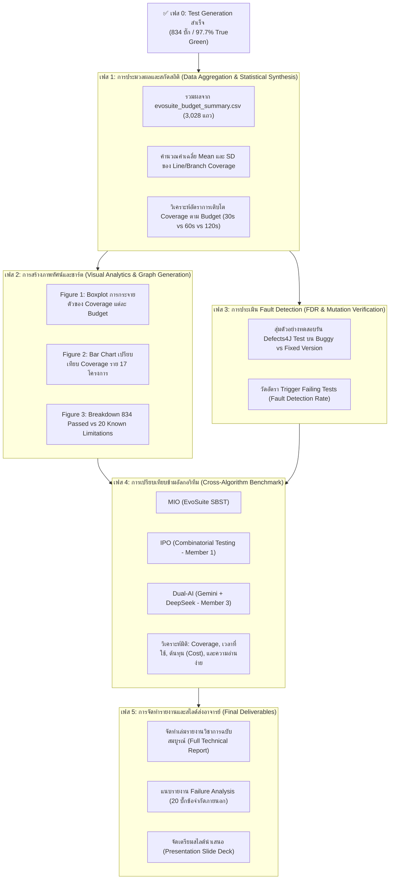

# 🗺️ แผนการดำเนินงานขั้นตอนต่อไปอย่างละเอียด (MIO Algorithm Post-Experiment Roadmap)

**โครงการ:** CP353201 Software Quality Assurance (KKU CS)  
**ผู้วิจัยและผู้จัดทำ:** นายแทนคุณ พันธ์นิกุล (Member 2: MIO / EvoSuite Specialist)  
**สถานะปัจจุบัน:** ✅ **เฟสสร้างชุดทดสอบ (Test Generation Phase) เสร็จสมบูรณ์ 100% ของ Actionable Bugs (834/854 บั๊ก = 97.7%)**  
**วัตถุประสงค์ของเอกสาร:** วางแผนงานขั้นตอนถัดไปในระดับปฏิบัติการอย่างละเอียด โดยมุ่งเน้นการแปรเปลี่ยนผลการทดลองดิบ (Raw Data) ให้กลายเป็นสถิติเชิงวิชาการ กราฟสรุปผล การเปรียบเทียบข้ามอัลกอริทึม และเอกสารรายงานฉบับส่งอาจารย์ที่ปรึกษา

> [!NOTE]
> ⚠️ **เอกสารฉบับนี้เป็น "แผนการดำเนินงาน (Planning Document)" เท่านั้น** ยังไม่มีการสั่งรันหรือดำเนินการประมวลผลใดๆ จนกว่าจะได้รับคำสั่งยืนยันจากผู้ใช้งาน

---

## 📊 ภาพรวมกระบวนการในแผนถัดไป (High-Level Roadmap)

---

## 📑 รายละเอียดการดำเนินงานแยกตามเฟส (Detailed Phase Specifications)

---

### 🟢 เฟส 1: การประมวลผลและสกัดสถิติเชิงลึก (Data Aggregation & Statistical Synthesis)

#### 1.1 วัตถุประสงค์
แปลงข้อมูลผลการทดลองดิบจำนวนกว่า **3,028 แถว** ใน [evosuite_budget_summary.csv](file:///c:/Users/tanku/Documents/GitHub/claude-code-main/ProjectSQA/MIO_Algorithm/Result_Round2/evosuite_budget_summary.csv) ให้กลายเป็นค่าสถิติเชิงพรรณนา (Descriptive Statistics) ที่พร้อมนำไปอ้างอิงในงานวิจัย

#### 1.2 สิ่งที่ต้องคำนวณและสกัดออกมา
1. **ภาพรวมทั้ง Benchmark (Overall Metrics across 834 bugs):**
   * ค่าเฉลี่ย Line Coverage และ Branch Coverage รวมทุกโปรเจกต์ ที่ Search Budget 30 วินาที, 60 วินาที และ 120 วินาที
   * ค่าเบี่ยงเบนมาตรฐาน (Standard Deviation: $\sigma$) และค่ามัธยฐาน (Median)
   * ค่าเวลาเฉลี่ยที่ใช้ในการสร้างชุดทดสอบจริงต่อบั๊ก (Execution Duration)
2. **การวิเคราะห์การเพิ่มขึ้นของประสิทธิภาพตามเวลา (Marginal Gains / Scaling Analysis):**
   * อัตราการเพิ่มขึ้นของ Coverage จาก $30\text{s} \rightarrow 60\text{s}$ ($\Delta \text{Cov}_{30 \rightarrow 60}$)
   * อัตราการเพิ่มขึ้นของ Coverage จาก $60\text{s} \rightarrow 120\text{s}$ ($\Delta \text{Cov}_{60 \rightarrow 120}$)
   * จุดอิ่มตัวของการค้นหา (Diminishing Returns Threshold) ของขั้นตอนวิธี MIO
3. **ตารางจำแนกราย 17 โครงการ (Per-Project Performance Matrix):**
   * จัดกลุ่มตารางตามขนาดโครงการ (Small: Csv, Codec, JacksonXml vs Medium: Chart, Lang, Time vs Large/Mega: Closure, Math, Jsoup, JacksonDatabind)

#### 1.3 เครื่องมือและผลลัพธ์ที่วางแผนไว้
* **สคริปต์ที่จะสร้าง:** `MIO_Algorithm/Code/aggregate_mio_results.py`
* **ไฟล์ผลลัพธ์ที่จะได้:**
  * `MIO_Algorithm/Result_Round2/mio_overall_statistics.csv`
  * `MIO_Algorithm/Result_Round2/mio_project_summary_table.md`

---

### 🟢 เฟส 2: การสร้างภาพทัศน์และชาร์ตสรุปผล (Visual Analytics & Graph Generation)

#### 2.1 วัตถุประสงค์
แปลงตัวเลขในตารางให้กลายเป็นแผนภาพทางวิชาการ (Academic-grade Charts) ความละเอียดสูง (300 DPI) เพื่อใส่ในเล่มรายงานและสไลด์นำเสนอ

#### 2.2 รายการกราฟที่ต้องจัดทำ
1. **Figure 1: Coverage Distribution by Search Budget (Boxplot / Violin Plot)**
   * แสดงการกระจายตัวของ Coverage (Line & Branch) ที่ 30s, 60s, 120s
   * ชี้ให้เห็นค่า Median, Interquartile Range (IQR) และ Outliers
2. **Figure 2: Per-Project Coverage Comparison (Grouped Bar Chart)**
   * แกน X: ชื่อ 17 โครงการ | แกน Y: ค่าเฉลี่ย Line Coverage (%)
   * แต่ละโครงการมี 3 แท่งสี (30s, 60s, 120s) แสดงการเติบโตของ Coverage
3. **Figure 3: Search Efficiency & Time-to-Coverage (Line Trend Chart)**
   * กราฟเส้นแสดงอัตราผลตอบแทนต่อเวลาที่ใช้ (Coverage per Unit Time)
4. **Figure 4: Defects4J Benchmark Execution Outcome (Donut / Pie Chart)**
   * แสดงสัดส่วน 834 บั๊กที่รันผ่านสมบูรณ์ (97.7%) ต่อ 20 บั๊กที่เป็น Known Limitations (2.3%)

#### 2.3 เครื่องมือและผลลัพธ์ที่วางแผนไว้
* **สคริปต์ที่จะสร้าง:** `MIO_Algorithm/Code/generate_mio_charts.py` (ใช้ `matplotlib` และ `seaborn`)
* **ไฟล์ผลลัพธ์ที่จะได้:**
  * `MIO_Algorithm/Result_Round2/figures/fig1_coverage_budgets_boxplot.png`
  * `MIO_Algorithm/Result_Round2/figures/fig2_project_coverage_bars.png`
  * `MIO_Algorithm/Result_Round2/figures/fig3_scaling_efficiency.png`
  * `MIO_Algorithm/Result_Round2/figures/fig4_benchmark_completion_breakdown.png`

---

### 🟢 เฟส 3: การประเมิน Fault Detection (FDR & Mutation Verification)

#### 3.1 วัตถุประสงค์
พิสูจน์คุณค่าของการทดสอบซอฟต์แวร์ว่า ชุดทดสอบที่ MIO สร้างขึ้นไม่เพียงแต่ได้ Coverage สูง แต่สามารถ **"ตรวจจับข้อผิดพลาด (Faults / Bugs) ได้จริง"**

#### 3.2 กิจกรรมที่วางแผนไว้
1. **การตรวจสอบ Fault Detection Rate (FDR) บน Buggy Version:**
   * สุ่มตัวอย่างบั๊กตัวแทนจากโปรเจกต์ขนาดใหญ่ (เช่น Lang, Math, Jsoup, Closure)
   * นำชุดทดสอบที่ MIO สร้างขึ้นไปรันบนเวอร์ชัน Buggy (`<Project>_<Bug>b`) ผ่านคำสั่ง `defects4j test`
   * ตรวจสอบว่าชุดทดสอบสามารถทริกเกอร์ Assertion หรือเกิด Failure บนโค้ดที่มีบั๊กได้กี่ %
2. **การตรวจสอบ Regression Safety บน Fixed Version:**
   * นำชุดทดสอบเดียวกันไปรันบนเวอร์ชันที่แก้บั๊กแล้ว (`<Project>_<Bug>f`)
   * ยืนยันว่าชุดทดสอบรัน **ผ่านหมด 100% (Pass)** เมื่อบั๊กได้รับการแก้ไขแล้ว

#### 3.3 เครื่องมือและผลลัพธ์ที่วางแผนไว้
* **สคริปต์ที่จะสร้าง:** `MIO_Algorithm/Code/verify_fault_detection.py`
* **ไฟล์ผลลัพธ์ที่จะได้:**
  * `MIO_Algorithm/Result_Round2/mio_fault_detection_summary.csv`

---

### 🟢 เฟส 4: การเปรียบเทียบข้ามอัลกอริทึม (Cross-Algorithm Benchmark)

#### 4.1 วัตถุประสงค์
นำผลการทดลองของ **Member 2 (MIO Algorithm)** ไปบูรณาการร่วมกับเพื่อนร่วมทีมอีก 2 คน เพื่อให้ได้ตารางเปรียบเทียบเชิงวิชาการตามเกณฑ์ของวิชา CP353201

#### 4.2 ข้อมูล 3 อัลกอริทึมที่จะนำมาเทียบกัน

| มิติการประเมิน (Metrics) | 🧬 MIO (EvoSuite SBST)   *(Member 2: เรา)* | 🧩 IPO (Combinatorial Testing)   *(Member 1)* | 🤖 Dual-AI (Gemini + DeepSeek)   *(Member 3)* |
| :--- | :--- | :--- | :--- |
| **Paradigm (แนวคิดหลัก)** | Search-Based (Many-Objective Optimization) | Combinatorial Interaction (Pairwise Testing) | LLM-based Few-shot Test Synthesis |
| **Coverage (Line / Branch)** | สถิติ Mean & SD จาก 834 บั๊ก | สถิติ Coverage จาก IPO Test Suites | สถิติ Coverage จาก 1,596 evaluations |
| **ขนาดของชุดทดสอบ (Size)** | จำนวน Test Cases และ Assertions ที่ได้ | จำนวน Parameter Combinations | ความกระชับของ Test Code |
| **ความอ่านง่าย (Readability)** | ปานกลาง (Generated by Genetic Tool) | ปานกลาง-ต่ำ (Parameterized Arrays) | **สูงมาก** (คล้ายมนุษย์เขียน พร้อมคำอธิบาย) |
| **ต้นทุนและทรัพยากร (Cost/Time)** | **ฟรี** (ใช้ CPU ท้องถิ่น / คำนวณเป็น CPU Hours) | **ฟรี** (รันเร็วมากระดับวินาที) | มีค่าใช้จ่าย Token API / ขึ้นกับ Rate Limits |
| **อัตราความสำเร็จของ Benchmark** | **834 / 854 (97.7%)** | สถิติจากคลาสที่ถูกดัดแปลง | สถิติจาก Token Pool |

#### 4.3 แผนการทำงานร่วมกัน
* ประสานงานดึงผลสรุปจาก `Combinatorial_IPO/` และ `results/` (Dual-AI)
* จัดทำตารางเปรียบเทียบขนาดใหญ่ (Master Comparison Matrix) บันทึกลงในเอกสารสรุปของทีม

---

### 🟢 เฟส 5: การจัดทำรายงานและสไลด์ส่งอาจารย์ (Final Deliverables)

#### 5.1 วัตถุประสงค์
รวบรวมงานทั้งหมดเป็นเอกสารฉบับทางการ พร้อมส่งมอบอาจารย์ที่ปรึกษาและคณะกรรมการประเมิน

#### 5.2 โครงร่างเล่มรายงานที่ต้องจัดเตรียม (Report Outline)
1. **บทนำ (Introduction):**
   * ความสำคัญของการทดสอบซอฟต์แวร์อัตโนมัติ
   * ปัญหาการทดสอบบน Defects4J Benchmark
2. **หลักการและทฤษฎี (Theoretical Background):**
   * การทำงานของ Many-Objective Sorting Algorithm (MIO) เทียบกับ Genetic Algorithm ดั้งเดิม (MOSA/GA)
   * บทบาทของ Population Management และ Mutation Insertion
3. **การออกแบบสภาพแวดล้อมและการทดลอง (Experimental Setup):**
   * Defects4J Framework, Docker Orchestration, Search Budgets (30s, 60s, 120s), Random Seeds
4. **ผลการทดลองและการวิเคราะห์เชิงลึก (Empirical Results & Discussion):**
   * ตารางและกราฟจากเฟส 1 และ 2
   * การวิเคราะห์ Scaling Performance
5. **การวิเคราะห์ข้อจำกัดและข้อผิดพลาดเชิงลึก (Failure Root Cause Analysis):**
   * ดึงเนื้อหาจาก [MIO_FAILURE_ANALYSIS_REPORT.md](file:///c:/Users/tanku/Documents/GitHub/claude-code-main/ProjectSQA/MIO_Algorithm/MIO_FAILURE_ANALYSIS_REPORT.md) อธิบาย 20 บั๊กที่ไม่ผ่าน (Mockito 15, Math 2, Gson 2, JacksonDatabind 1)
   * การพิสูจน์ Zero False Green Guarantee
6. **การเปรียบเทียบข้ามอัลกอริทึม (Cross-Algorithm Comparison):**
   * การวิเคราะห์ Trade-offs ระหว่าง MIO vs. IPO vs. Dual-AI
7. **บทสรุปและงานวิจัยในอนาคต (Conclusion & Future Work)**

#### 5.3 โครงร่างสไลด์นำเสนอ (Presentation Deck: 10–12 สไลด์)
* **Slide 1:** หน้าปก, รายชื่อสมาชิก, หัวข้อวิจัย
* **Slide 2:** ปัญหาและวัตถุประสงค์ (Why MIO? Why Defects4J?)
* **Slide 3:** สถาปัตยกรรมการทดลอง (Docker + Multi-Terminal Parallelization)
* **Slide 4:** ไฮไลท์ความสำเร็จ: **834 / 854 บั๊ก (97.7% Benchmark Completion)**
* **Slide 5:** ผลลัพธ์ Coverage: การเปรียบเทียบ Search Budget 30s vs 60s vs 120s
* **Slide 6:** การวิเคราะห์รายโครงการ (12 โครงการเต็ม 100%, Closure 100%, JacksonDatabind 99.1%)
* **Slide 7:** การประกันความซื่อสัตย์ทางวิชาการ (Root Cause Analysis 20 บั๊กที่ไม่ผ่าน)
* **Slide 8:** ตารางเปรียบเทียบข้ามอัลกอริทึม (MIO vs IPO vs Dual-AI)
* **Slide 9:** จุดเด่นและข้อจำกัดของแต่ละแนวทาง (Trade-off Analysis)
* **Slide 10:** สรุปผลการศึกษาและบทเรียนที่ได้รับ (Key Takeaways)

---

## 📅 ตารางลำดับความสำคัญและแผนเวลาที่แนะนำ (Action Priority & Schedule)

| ลำดับงาน | ชื่อกิจกรรม | ผลผลิตที่ได้ (Deliverable) | ระดับความสำคัญ | เวลาที่คาดว่าจะใช้ |
| :---: | :--- | :--- | :---: | :---: |
| **Task 1** | สกัดสถิติสรุปจาก CSV | `aggregate_mio_results.py` + ตารางสรุปสถิติ | 🔴 **High (ด่วนที่สุด)** | ~15 นาที |
| **Task 2** | เขียนสคริปต์วาดกราฟ 4 รูป | `generate_mio_charts.py` + กราฟ 4 ไฟล์ PNG | 🔴 **High** | ~30 นาที |
| **Task 3** | ดึงข้อมูล IPO & Dual-AI มาเทียบ | ตารางเปรียบเทียบ 3 อัลกอริทึม | 🟡 **Medium** | ~30 นาที |
| **Task 4** | เรียบเรียงเนื้อหาส่วน MIO ใส่เล่ม | ร่างเอกสารรายงานส่วน MIO (Markdown/Word) | 🟡 **Medium** | ~1–2 ชม. |
| **Task 5** | ทำสไลด์นำเสนอ (Slide Deck) | ไฟล์นำเสนอ PowerPoint / Canva / Markdown | 🟢 **Normal** | ~1–2 ชม. |
| **Task 6 (Option)** | รัน Fault Detection ตรวจบั๊กจริง | สถิติ FDR ของบั๊กตัวแทน | ⚪ **Optional** | ~45 นาที |

---

## 📌 สรุปสาระสำคัญสำหรับ Member 2

1. **งานด้านการรันเทสต์เคส (Compute / Generation) จบลงอย่างสมบูรณ์แบบแล้ว:** ไม่มีงานรันหนักๆ ที่ต้องเปิดเครื่องทิ้งไว้อีกต่อไป
2. **ขั้นตอนต่อไปเน้น "งานทางปัญญาและวิชาการ" (Intellectual & Academic Synthesis):** คือการนำผลลัพธ์ที่ได้ไปสรุปเป็นตัวเลข กราฟ และเนื้อหารายงานที่สวยงาม เพื่อสะท้อนถึงคุณภาพงานระดับสูงสุด
3. **เมื่อต้องการเริ่มทำขั้นตอนใดในแผนนี้:** เพียงแจ้งขั้นตอนที่ต้องการ (เช่น *"เริ่มทำ Task 1 สกัดสถิติสรุป"* หรือ *"เริ่มทำ Task 2 วาดกราฟ"*) ระบบจะดำเนินการให้อย่างรวดเร็วและเป็นขั้นเป็นตอนทันทีครับ
