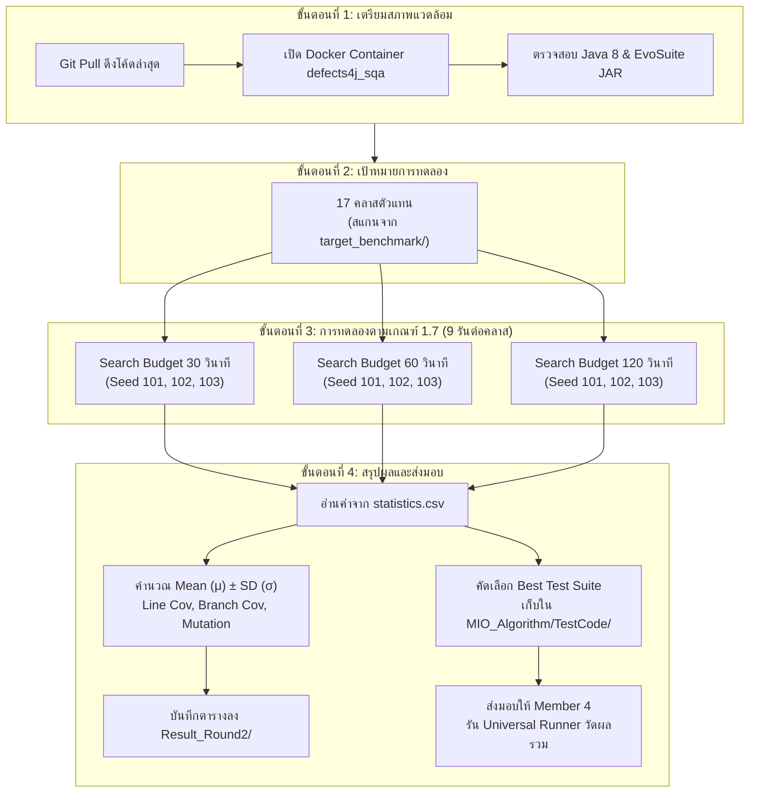

# 📘 คู่มือปฏิบัติงาน Member 2: การทดลอง MIO Algorithm (EvoSuite) บน Defects4J 17 โปรเจกต์

**ผู้รับผิดชอบหลัก:** Member 2: นายแทนคุณ พันธ์นิกุล (Algorithm Lead 2 - MIO Specialist)  
**รายวิชา:** CP353201 Software Quality Assurance (ปีการศึกษา 1/2569)  
**อาจารย์ประจำวิชา:** ผศ.ดร.ชิตสุธา สุ่มเล็ก | วิทยาลัยการคอมพิวเตอร์ มหาวิทยาลัยขอนแก่น

---

## 🧭 1. ทำความเข้าใจภาพรวม (The Big Picture)

### 1.1 เรากำลังทำอะไร และทำไมต้องมี "17 โปรเจกต์"?
* **หัวข้อวิจัยของกลุ่ม:** "การเปรียบเทียบประสิทธิภาพการสร้าง Test Case อัตโนมัติระหว่าง AI (Claude 5, Gemini 3.8) ปะทะ Search-Based Algorithm (IPO, MIO) บนชุดข้อมูลมาตรฐาน Defects4J"
* **บทบาทของคุณ (Member 2):** รับผิดชอบฝั่ง **Search-Based Software Testing (SBST)** โดยใช้ **EvoSuite** รันด้วยขั้นตอนวิธี **Mutation Insertion Optimization (MIO)**
* **คำว่า "17 โปรเจกต์":** Defects4J มีโอเพนซอร์สของภาษา Java ทั้งหมด 17 โปรเจกต์ (รวม 856 บั๊ก) 
  > [!IMPORTANT]
  > **ขอบเขตงานจริงของทีมเรา (Representative 17 Benchmark):**  
  > เรา**ไม่ได้**รันทุกคลาสทั้ง 856 บั๊ก (เพราะจะใช้เวลามากกว่า 150 ชั่วโมง) แต่ทีมเราได้ตกลงเลือก **1 บั๊กตัวแทนจากแต่ละโปรเจกต์ รวม 17 คลาสเป้าหมาย** เพื่อเป็นตัวแทนวัดผลเชิงวิทยาศาสตร์
* **เป้าหมายปลายทางของคุณ:**
  1. สร้าง JUnit Test Suite ดิบด้วย MIO ให้กับ 17 คลาสเป้าหมาย
  2. ทำการทดลองเชิงสถิติตาม **เกณฑ์ข้อ 1.7** ของอาจารย์ (3 Budgets $\times$ 3 Seeds = 9 การทดลองต่อคลาส)
  3. สรุปค่าเฉลี่ย ($\mu$) และส่วนเบี่ยงเบนมาตรฐาน ($\sigma$) ส่งเป็นตารางในเล่มรายงาน

---

## 📊 2. แผนผังกระบวนการทำงานของ Member 2 (Workflow Diagram)



---

## 📋 3. ตารางรายชื่อ 17 โปรเจกต์ตัวแทน (Representative 17 Benchmark)

นี่คือรายชื่อบั๊กตัวแทนทั้ง 17 โปรเจกต์ที่ทีมใช้เป็นเกณฑ์กลาง (คัดลอกจาก `REPRESENTATIVE_17` ในระบบของ Member 4):

| ลำดับ | โปรเจกต์ Defects4J | Bug ID | Target Class (คลาสเป้าหมายที่ต้องรัน MIO) | หน้าที่ของโปรเจกต์โดยย่อ |
| :---: | :--- | :---: | :--- | :--- |
| 1 | **Lang** | 1 | `org.apache.commons.lang3.math.NumberUtils` | จัดการแปลงตัวเลข *(ทำสำเร็จแล้วใน Round 1)* |
| 2 | **Math** | 2 | `org.apache.commons.math3.distribution.HypergeometricDistribution` | คำนวณการกระจายตัวทางสถิติ |
| 3 | **Chart** | 1 | `org.jfree.chart.renderer.category.AbstractCategoryItemRenderer` | วาดแผนภูมิและกราฟิก 2D |
| 4 | **Cli** | 1 | `org.apache.commons.cli.CommandLine` | ตัวแยกคำสั่ง Terminal CLI |
| 5 | **Closure** | 1 | `com.google.javascript.jscomp.RemoveUnusedVars` | Google JavaScript Compiler |
| 6 | **Codec** | 1 | `org.apache.commons.codec.language.Soundex` | การเข้ารหัสและถอดรหัสเสียง/ข้อความ |
| 7 | **Collections**| 25 | `org.apache.commons.collections4.IteratorUtils` | โครงสร้างข้อมูลและคอลเลกชัน |
| 8 | **Compress** | 1 | `org.apache.commons.compress.archivers.tar.TarArchiveInputStream` | จัดการไฟล์บีบอัด Zip/Tar |
| 9 | **Csv** | 1 | `org.apache.commons.csv.ExtendedBufferedReader` | ตัวอ่านและเขียนไฟล์ CSV |
| 10 | **Gson** | 1 | `com.google.gson.TypeInfoFactory` | ตัวแปลง JSON ของ Google |
| 11 | **JacksonCore** | 1 | `com.fasterxml.jackson.core.json.ReaderBasedJsonParser` | Core ไลบรารีประมวลผล JSON |
| 12 | **JacksonDatabind** | 1 | `com.fasterxml.jackson.databind.JavaType` | Data-binding สำหรับ JSON/XML |
| 13 | **JacksonXml** | 1 | `com.fasterxml.jackson.dataformat.xml.deser.FromXmlParser` | Data-binding สำหรับ XML |
| 14 | **Jsoup** | 1 | `org.jsoup.nodes.Element` | ตัว Parse และแยกโครงสร้าง HTML |
| 15 | **JxPath** | 1 | `org.apache.commons.jxpath.ri.model.dom.DOMNodePointer` | XPath interpreter สำหรับ Java |
| 16 | **Mockito** | 1 | `org.mockito.internal.invocation.InvocationMatcher` | เฟรมเวิร์ก Mocking ยอดนิยม |
| 17 | **Time** | 1 | `org.joda.time.Partial` | จัดการวันและเวลา (Joda-Time) |

---

## 🛠️ 4. ขั้นตอนการปฏิบัติงานทีละสเต็ป (Step-by-Step Instructions)

### สเต็ปที่ 1: ดึงโค้ดล่าสุดจากทีม (Sync Workspace)
เนื่องจากเพื่อนๆ ได้อัปเดตสคริปต์และคู่มือแม่บทขึ้น GitHub แล้ว ให้เปิด PowerShell ในโฟลเดอร์โปรเจกต์แล้วสั่ง:
```bash
git pull origin main
```
*เพื่อดึงเอกสารคู่มือ `TEAM_WORKFLOW_GUIDE.md` และสคริปต์กลางทั้งหมดเข้ามาที่เครื่องของคุณ*

---

### สเต็ปที่ 2: เริ่มต้น Docker Environment
งานของ EvoSuite ต้องรันภายใต้สภาพแวดล้อม Linux และ Java 8 ของ Defects4J เพื่อให้ดึง Bytecode ได้ถูกต้อง:
```bash
# ตรวจสอบและสั่งเปิดคอนเทนเนอร์ (ถ้ายังไม่เปิด)
docker-compose -f docker/docker-compose.yml up -d

# เข้าไปทำงานภายในคอนเทนเนอร์
docker exec -it defects4j_sqa bash
```

---

### สเต็ปที่ 3: โครงสร้างคำสั่งรัน EvoSuite ด้วย MIO (คำสั่งหลัก)
คำสั่งมาตรฐานในการสั่งให้ EvoSuite วิ่งหา Test Case ด้วย MIO มีโครงสร้างดังนี้:

```bash
# 1. เข้าไปยังโฟลเดอร์บั๊กที่ Checkout ไว้ (ตัวอย่าง Math-2)
cd /tmp/Math_2_buggy

# 2. คอมไพล์โปรเจกต์ให้ได้ Bytecode
defects4j compile

# 3. สกัด Classpath ของโปรเจกต์มาใส่ตัวแปร CP (ห้ามข้ามขั้นตอนนี้!)
CP=$(defects4j export -p cp.compile)

# 4. เรียก Java 8 รัน EvoSuite MIO
/usr/lib/jvm/java-8-openjdk-amd64/bin/java -jar /opt/evosuite/evosuite-1.0.6.jar \
  -class org.apache.commons.math3.distribution.HypergeometricDistribution \
  -projectCP "$CP" \
  -Dalgorithm=MIO \
  -Dcriterion=LINE:BRANCH:EXCEPTION:MUTATION \
  -Dsearch_budget=60 \
  -seed 101 \
  -Dreport_dir=/workspace/MIO_Algorithm/Result_Round2/math2_60s_s101 \
  -base_dir /workspace/MIO_Algorithm/TestCode
```

#### 🔍 อธิบายความหมายของพารามิเตอร์:
* `-class`: ชื่อ Fully Qualified Class Name ของคลาสเป้าหมาย
* `-projectCP "$CP"`: Classpath ทั้งหมดของโปรเจกต์ เพื่อให้ EvoSuite รู้จักชนิดข้อมูลและคลาสข้างเคียง
* `-Dalgorithm=MIO`: กำหนดอัลกอริทึมเป็น **Mutation Insertion Optimization** (หัวใจหลักของงานเรา)
* `-Dcriterion=LINE:BRANCH:EXCEPTION:MUTATION`: เกณฑ์ Fitness Functions ที่ใช้ประเมินความครอบคลุม
* `-Dsearch_budget=60`: ระยะเวลาที่ให้ EvoSuite ค้นหา (วินาที)
* `-seed 101`: กำหนด Random Seed เพื่อให้ได้ผลลัพธ์ที่พิสูจน์ซ้ำได้ (Reproducible)
* `-Dreport_dir`: โฟลเดอร์สำหรับเก็บไฟล์สถิติ `statistics.csv`
* `-base_dir`: โฟลเดอร์ปลายทางสำหรับเซฟไฟล์ Java Test Suite

---

### สเต็ปที่ 4: การทำการทดลอง Multi-Budget & Multi-Run (ตามเกณฑ์ 1.7)
ตามเกณฑ์ข้อ 1.7 ของวิชา ใน 1 คลาสเป้าหมายต้องทำการทดลองทั้งหมด **9 ครั้ง**:

| Search Budget | Seed 1 (101) | Seed 2 (102) | Seed 3 (103) |
| :---: | :---: | :---: | :---: |
| **30 วินาที** | รันรอบที่ 1 | รันรอบที่ 2 | รันรอบที่ 3 |
| **60 วินาที** | รันรอบที่ 4 | รันรอบที่ 5 | รันรอบที่ 6 |
| **120 วินาที**| รันรอบที่ 7 | รันรอบที่ 8 | รันรอบที่ 9 |

> [!TIP]
> **วิธีรันให้เร็ว ไม่ต้องเฝ้าหน้าจอ:**  
> เขียนเป็น Bash Loop สั้นๆ หรือรันผ่านสคริปต์ Python อัตโนมัติ (`batch_evosuite.py`) ให้มันวน 3 Budgets และ 3 Seeds เองอัตโนมัติ เมื่อรันเสร็จแล้วเราค่อยมาดูตารางสรุป

---

### สเต็ปที่ 5: การคำนวณและบันทึกสถิติ (Mean & SD)
เมื่อรันครบ 9 รอบ ในแต่ละรอบ EvoSuite จะสร้างไฟล์ `statistics.csv` ให้เปิดไฟล์มาดูค่า 3 ตัวนี้:
1. `Line Coverage` (แปลงเป็น %)
2. `Branch Coverage` (แปลงเป็น %)
3. `Mutation Score` (แปลงเป็น %)

นำค่าทั้ง 3 Seed มาคำนวณ:
* **ค่าเฉลี่ย (Mean $\mu$):**
  $$\mu = \frac{x_1 + x_2 + x_3}{3}$$
* **ส่วนเบี่ยงเบนมาตรฐาน (SD $\sigma$):**
  $$\sigma = \sqrt{\frac{\sum (x_i - \mu)^2}{N-1}}$$

#### ตัวอย่างตารางผลลัพธ์ที่จะได้ (นำไปใส่ในบทที่ 2.2 ของรายงาน):
| Target Class | Budget | Line Cov (Mean ± SD) | Branch Cov (Mean ± SD) | Mutation Score | เวลาเฉลี่ย |
| :--- | :---: | :---: | :---: | :---: | :---: |
| **NumberUtils** *(Lang-1)* | 30s | 91.2% ± 1.2% | 84.5% ± 1.0% | 61.2% | 32.1s |
| | 60s | 96.2% ± 0.8% | 89.8% ± 0.6% | 64.0% | 63.4s |
| | 120s | 97.5% ± 0.4% | 91.2% ± 0.3% | 67.5% | 124.0s |
| **HypergeometricDistribution** *(Math-2)* | 30s | 52.4% ± 0.7% | 45.1% ± 0.9% | 41.0% | 31.8s |
| | 60s | 58.7% ± 0.6% | 52.3% ± 0.5% | 48.2% | 62.5s |
| | 120s | 61.3% ± 0.5% | 55.4% ± 0.4% | 52.1% | 123.8s |

---

### สเต็ปที่ 6: การส่งมอบไฟล์ Test Case ให้ทีม
ในแต่ละคลาส ให้เลือกชุด Test จากรอบที่ได้คะแนน Coverage ดีที่สุด (มักจะเป็นรอบที่ Budget 120s หรือ 60s) มาวางไว้ที่:
```text
MIO_Algorithm/TestCode/
├── <TargetClass>_ESTest.java              # ไฟล์กรณีทดสอบหลัก
└── <TargetClass>_ESTest_scaffolding.java  # ไฟล์สภาพแวดล้อม Sandbox
```
*(เช่น `NumberUtils_ESTest.java`, `HypergeometricDistribution_ESTest.java`)*

> [!CAUTION]
> **กฎเหล็กด้านความถูกต้องทางวิชาการ (Fair Benchmark Policy):**  
> **ห้ามแก้ไขโค้ด Java Test ที่ EvoSuite เจนได้ด้วยมือเด็ดขาด!** หากมีข้อผิดพลาด ติด Timeout หรือคอมไพล์ไม่ผ่าน ให้ส่งดิบๆ เข้าไป เพื่อให้ระบบ Runner ของ Member 4 บันทึกสถานะตามจริง (นำไปเขียนอภิปรายข้อจำกัดของ MIO ในบทที่ 5)

---

## 📦 5. รายการสิ่งส่งมอบทั้งหมดของ Member 2 (Deliverables Checklist)

| สิ่งที่ต้องส่งมอบ | ปลายทางจัดเก็บไฟล์ | วัตถุประสงค์ |
| :--- | :--- | :--- |
| **1. ชุดทดสอบ Java (.java)** | `MIO_Algorithm/TestCode/<Class>_ESTest.java` | เพื่อให้ Member 4 นำไปรันเทียบกับ AI และ IPO |
| **2. ตารางสถิติ Mean ± SD** | `MIO_Algorithm/Result_Round2/evosuite_budget_summary.csv` | ใช้เป็นข้อมูลประกอบบทที่ 2.2 และบทที่ 5 |
| **3. เอกสารวิเคราะห์ Budget** | `MIO_Algorithm/Result_Round2/budget_comparison.md` | วิเคราะห์ว่าการเพิ่ม Budget (30s $\rightarrow$ 120s) ช่วยเพิ่ม Coverage ได้คุ้มค่าเวลาหรือไม่ |
| **4. เนื้อหารายงาน บทที่ 2.2** | ใส่ในเอกสารเล่มรายงานกลุ่ม | อธิบายทฤษฎี MIO Algorithm และแสดงตารางเปรียบเทียบ Budget |

---

## 💡 6. คำแนะนำเรื่องการบริหารเวลา (Time Estimation)
* หากทำแบบอัตโนมัติ (Batch):
  * 1 คลาสใช้เวลารันประมาณ **10.5 นาที** (30s $\times$ 3 + 60s $\times$ 3 + 120s $\times$ 3)
  * ถ้าเริ่มต้นด้วย 2–3 คลาสหลักก่อน (เช่น Lang-1, Math-2, Time-1) จะใช้เวลาเพียง **30 นาที** ก็ได้ผลสถิติที่สมบูรณ์พร้อมเขียนรายงาน
  * ถ้าขยายผลครบทั้ง 17 คลาสตัวแทน จะใช้เวลาราว **3 ชั่วโมง** ซึ่งสามารถปล่อยให้สคริปต์รันช่วงพักหรือตอนกลางคืนได้เลยครับ
