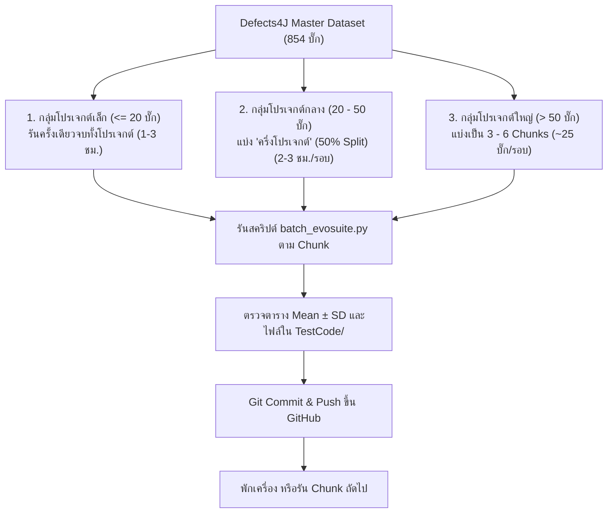
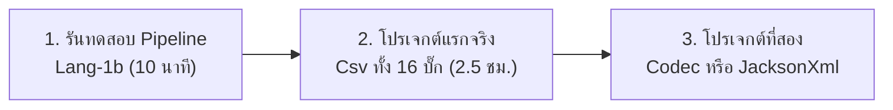

# 📋 Workflow การทำงานสำหรับ MIO Algorithm (All-Bugs & All-Classes Master Plan)

**โครงการ:** CP353201 Software Quality Assurance  
**ผู้รับผิดชอบ:** Member 2: นายแทนคุณ พันธ์นิกุล (MIO / EvoSuite Specialist)  
**เป้าหมาย:** สร้างชุดทดสอบด้วย EvoSuite (MIO Algorithm) ครอบคลุม **ทุกโปรเจกต์ ทุกคลาสใน Defects4J (854 บั๊ก / 1,073 คลาส)** ตามข้อกำหนดของอาจารย์

---

## 🧭 1. วิเคราะห์โจทย์: "รันทีละตัว" vs "รันทีละครึ่งโปรเจกต์" แบบไหนดีกว่า?

ตามเกณฑ์ข้อ 1.7 ของวิชา การทดสอบ 1 บั๊กจะต้องรัน **9 ครั้ง** (Budget 30s, 60s, 120s $\times$ 3 Seeds 101, 102, 103)  
* ใช้เวลาราว **~10.5 นาทีต่อ 1 บั๊ก**
* บั๊กทั้งหมด 854 บั๊ก $\times$ 10.5 นาที = **~150–180 ชั่วโมง**

### การเปรียบเทียบรูปแบบการทำงาน:

| รูปแบบ | ข้อดี | ข้อเสีย | ความเหมาะสม |
| :--- | :--- | :--- | :---: |
| **A. รันทีละตัว (Single-Bug)** | ละเอียด ปลอดภัย ไม่กินเครื่อง | ต้องพิมพ์สั่ง 854 ครั้ง เสียเวลาเฝ้าหน้าจออย่างมาก | ❌ ไม่เหมาะกับ 854 ตัว (เหมาะเฉพาะดีบัก) |
| **B. รันรวดเดียวทั้ง 17 โปรเจกต์** | ไม่ต้องคอยกดสั่ง | เครื่องร้อนจัด Docker เสี่ยงค้าง ถ้าพังกลางคันจะเสียเวลาฟรี | ❌ อันตราย ห้ามทำ |
| **C. รันแบบแบ่งก้อน (Adaptive Chunking / ครึ่งโปรเจกต์) [แนะนำ]** | • ควบคุมเวลารอบละ 2–3 ชม.<br>• ตรวจงานและ Push ขึ้น Git ได้เป็นระยะ<br>• เครื่องได้พักระบายความร้อน | ต้องสั่งรันเป็นก้อนๆ ตามตารางคิว | ✅ **ดีที่สุดและปลอดภัยที่สุด** |

---

## 🎯 2. กลยุทธ์การแบ่งก้อนงาน (Chunking Strategy ตามขนาดโปรเจกต์)

เราจะไม่แบ่งแบบตายตัว แต่จะแบ่งตาม **ขนาดจริงของแต่ละโปรเจกต์** เพื่อให้แต่ละรอบใช้เวลาไม่เกิน 2–3 ชั่วโมง:



### รายละเอียดการแบ่งกลุ่มงาน 17 โปรเจกต์:

#### 🟢 กลุ่มที่ 1: โปรเจกต์ขนาดเล็ก (รันครั้งเดียวจบทั้งโปรเจกต์: 1–3 ชั่วโมง)
* **JacksonXml:** 6 บั๊ก (~1 ชม.)
* **Csv:** 16 บั๊ก (~2.5 ชม.)
* **Codec:** 18 บั๊ก (~3 ชม.)
* **Gson:** 18 บั๊ก (~3 ชม.)

#### 🟡 กลุ่มที่ 2: โปรเจกต์ขนาดกลาง (แบ่ง "ครึ่งโปรเจกต์" 50% Split: 2–3 ชั่วโมงต่อรอบ)
* **JxPath (22 บั๊ก):** แบ่ง 2 รอบ (รอบ 1: บั๊ก 1–11, รอบ 2: บั๊ก 12–22)
* **Chart (26 บั๊ก):** แบ่ง 2 รอบ (รอบ 1: บั๊ก 1–13, รอบ 2: บั๊ก 14–26)
* **JacksonCore (26 บั๊ก):** แบ่ง 2 รอบ (รอบ 1: บั๊ก 1–13, รอบ 2: บั๊ก 14–26)
* **Time (26 บั๊ก):** แบ่ง 2 รอบ (รอบ 1: บั๊ก 1–13, รอบ 2: บั๊ก 14–26) *(ข้าม 21b ที่ไม่มีใน D4J)*
* **Collections (28 บั๊ก):** แบ่ง 2 รอบ (รอบ 1: บั๊ก 1–14, รอบ 2: บั๊ก 15–28)
* **Mockito (38 บั๊ก):** แบ่ง 2 รอบ (รอบ 1: บั๊ก 1–19, รอบ 2: บั๊ก 20–38)
* **Cli (39 บั๊ก):** แบ่ง 2 รอบ (รอบ 1: บั๊ก 1–20, รอบ 2: บั๊ก 21–39)
* **Compress (47 บั๊ก):** แบ่ง 2 รอบ (รอบ 1: บั๊ก 1–24, รอบ 2: บั๊ก 25–47)

#### 🔴 กลุ่มที่ 3: โปรเจกต์ขนาดใหญ่ (แบ่งเป็น 3–6 ก้อนย่อย ก้อนละ ~25–30 บั๊ก)
* **Lang (61 บั๊ก):** แบ่ง 2 ก้อน (1–30, 31–61)
* **Jsoup (93 บั๊ก):** แบ่ง 3 ก้อน (1–31, 32–62, 63–93)
* **Math (106 บั๊ก):** แบ่ง 4 ก้อน (1–26, 27–53, 54–80, 81–106)
* **JacksonDatabind (110 บั๊ก):** แบ่ง 4 ก้อน (1–28, 29–55, 56–82, 83–110)
* **Closure (174 บั๊ก):** แบ่ง 6 ก้อน (ก้อนละประมาณ 29 บั๊ก)

---

## 🔄 3. ขั้นตอนปฏิบัติงานทีละสเต็ป (Detailed Step-by-Step Procedure)

ในแต่ละรอบที่เราจะรัน ให้ปฏิบัติตาม 5 สเต็ปง่ายๆ ดังนี้:

### สเต็ป 0: ตรวจสอบความพร้อมของสภาพแวดล้อม (Environment Check)
เปิด Docker Desktop แล้วตรวจสอบว่าคอนเทนเนอร์ `defects4j_sqa` กำลังทำงาน:
```powershell
docker ps
# ถ้ายังไม่เปิดคอนเทนเนอร์: docker start defects4j_sqa
```

### สเต็ป 1: ตรวจสอบเป้าหมายล่วงหน้าด้วย Dry Run (Preview Targets)
ก่อนจะเริ่มรันจริง แนะนำให้ใส่ `--dry-run` เพื่อดูรายชื่อคลาสที่จะถูกรันก่อน:
```powershell
# ตัวอย่างดูคลาสที่จะรันในโปรเจกต์ Csv
python MIO_Algorithm/Code/batch_evosuite.py --project Csv --dry-run
```

### สเต็ป 2: สั่งรันตาม Chunk ที่กำหนด (Execution)
สั่งรันสคริปต์ตามก้อนงาน โดยระบุโปรเจกต์และช่วงบั๊ก:
```powershell
# ตัวอย่างที่ 1: รันโปรเจกต์ Csv ทั้งหมด (16 บั๊ก) รวดเดียว
python MIO_Algorithm/Code/batch_evosuite.py --project Csv

# ตัวอย่างที่ 2: รัน Chart ครึ่งแรก (บั๊ก 1 ถึง 13)
python MIO_Algorithm/Code/batch_evosuite.py --project Chart --start-bug 1 --end-bug 13

# ตัวอย่างที่ 3: รัน Chart ครึ่งหลัง (บั๊ก 14 ถึง 26)
python MIO_Algorithm/Code/batch_evosuite.py --project Chart --start-bug 14 --end-bug 26
```

#### ⚡ เคล็ดลับลดเวลา 50%: เปิด 2 Terminal รันคู่ขนาน (Multi-Terminal Concurrency)
คุณสามารถเปิด **PowerShell 2 หน้าต่างพร้อมกัน** เพื่อรันคนละครึ่งโปรเจกต์พร้อมกันได้เลย ระบบได้รับการป้องกันเรื่อง Race Condition ไว้แล้ว:
* **Terminal 1:** `python MIO_Algorithm/Code/batch_evosuite.py --project Chart --start-bug 1 --end-bug 13`
* **Terminal 2:** `python MIO_Algorithm/Code/batch_evosuite.py --project Chart --start-bug 14 --end-bug 26`
*(ระบบจะแยกโฟลเดอร์ทำงานใน Docker และผสาน Checkpoint ลงดิสก์อัตโนมัติ ไม่มีการเขียนทับกันแน่นอน)*

*(หน้าจอ Terminal จะแสดงความคืบหน้าแต่ละ Seed: Coverage %, ระยะเวลาที่ใช้ และสรุป Mean ± SD ให้อัตโนมัติ)*

### สเต็ป 3: ตรวจสอบความสมบูรณ์ของผลลัพธ์ (Quality & Sanity Check)
เมื่อสคริปต์แจ้งว่า Completed ให้เปิดตรวจสอบไฟล์ 2 จุดหลัก:
1. **ไฟล์ตารางสรุปสถิติ:** `MIO_Algorithm/Result_Round2/evosuite_budget_summary.csv`
   - ตรวจว่ามีแถวใหม่เพิ่มขึ้นมาพร้อมค่า `Line_Cov_Mean_%`, `Line_Cov_SD_%` และเวลา
2. **โฟลเดอร์ไฟล์โค้ดเทส:** `MIO_Algorithm/TestCode/<Project>_<BugID>b/`
   - ตรวจว่ามีทั้ง `<TargetClass>_ESTest.java` และ `<TargetClass>_ESTest_scaffolding.java` ครบถ้วน
3. **ไฟล์ Checkpoint:** `MIO_Algorithm/progress_mio.json`
   - ระบบจะจำว่าคลาสนี้ทำเสร็จแล้ว ไม่ต้องกลัวหาย

### สเต็ป 4: ทำการ Commit & Push ขึ้น GitHub ทันที (Save Progress to Cloud)
เมื่อผลลัพธ์ถูกต้อง ให้ Push ข้อมูลขึ้น Git ทันทีเพื่อความปลอดภัย:
```powershell
git add MIO_Algorithm/Result_Round2/evosuite_budget_summary.csv
git add MIO_Algorithm/progress_mio.json
git add MIO_Algorithm/TestCode/
git commit -m "feat(mio): complete batch experiments for <Project> bugs <start>-<end>"
git push origin main
```

### สเต็ป 5: พักเครื่องระบายความร้อน หรือทำ Chunk ถัดไป (Cooldown & Continue)
* ปิด Terminal หรือพักเครื่องสัก 5–10 นาทีเพื่อระบายความร้อน
* เมื่อพร้อมทำต่อ เพียงเลือกคำสั่งสำหรับ Chunk ถัดไป

---

## 📁 4. โครงสร้างการจัดเก็บผลลัพธ์ใน `Result_Round2/` (แยกกันอย่างไร ไม่ให้มั่วซั่ว?)

หลายคนอาจสงสัยว่ามีตั้ง 17 โปรเจกต์ แต่โฟลเดอร์มีแค่ `Result_Round2` แล้วข้อมูลจะปนกันหรือไม่? **คำตอบคือ แยกกันเป็นระเบียบ 100% ดังนี้:**

```text
MIO_Algorithm/Result_Round2/
├── evosuite_budget_summary.csv    # 📄 ตาราง Master รวมทุกโปรเจกต์ (มีคอลัมน์ Project กำกับทุกแถว)
├── budget_comparison.md           # 📄 เอกสารวิเคราะห์สรุปสำหรับเล่มรายงานบทที่ 2.2
└── raw_reports/                   # 📁 โฟลเดอร์เก็บรายงานดิบ statistics.csv แยกรายรัน
    ├── Csv_1b_30s_s101/           # แยกตามชื่อโปรเจกต์_บั๊ก_budget_seed
    ├── Csv_1b_30s_s102/
    ├── Lang_1b_30s_s101/
    ├── Math_2b_60s_s102/
    └── ...
```

### 1. ตารางรวม `evosuite_budget_summary.csv`
เป็นไฟล์ CSV แผ่นเดียวที่ทำหน้าที่เป็น Master Summary Table โดยมี **คอลัมน์แรกคือ `Project`** (เช่น `Csv`, `Chart`, `Lang`, `Math`) ตามด้วย `Bug_ID`, `Target_Class`, และ `Budget_Sec`
* **ไม่มั่วซั่วแน่นอน:** คุณสามารถเปิดไฟล์นี้ใน Excel แล้วกด Filter ตามชื่อโปรเจกต์ เพื่อดูเฉพาะ `Csv` หรือเฉพาะ `Chart` ได้ทันที
* เหมาะอย่างยิ่งสำหรับการนำไปพล็อตกราฟเปรียบเทียบในเล่มรายงาน

### 2. พฤติกรรมเมื่อรันซ้ำ / รันใหม่ (Rerun & Overwrite Behavior)
* **กรณีรันคำสั่งเดิมซ้ำ (โดยไม่ใส่ `--force`):**  
  ระบบจะอ่าน `progress_mio.json` แล้วแจ้งว่า `>> Budget Xs already completed. Skipping...` **จะไม่รันซ้ำ และจะไม่เพิ่มแถวซ้ำลงใน CSV เด็ดขาด**
* **กรณีต้องการรันใหม่จริงๆ (ใส่ flag `--force`):**  
  เช่น `python MIO_Algorithm/Code/batch_evosuite.py --project Csv --bug 1 --force`  
  ระบบจะรันใหม่ และทำการ **อัปเดตทับแถวเดิม (In-Place Update)** ใน `evosuite_budget_summary.csv` ให้ทันที ไม่สร้างแถวเบิ้ลมั่วซั่วแน่นอน!

---

## 🛡️ 5. ข้อดีของ Workflow นี้
1. **ไม่เสี่ยงงานหาย:** มีการ Push ขึ้น GitHub ทุกๆ 2–3 ชั่วโมง
2. **เครื่องปลอดภัย:** ไม่ต้องเปิดคอมรันต่อเนื่องเป็นสัปดาห์
3. **ตรวจสอบง่าย:** สมาชิกทุกคนเห็น progress ที่ชัดเจนผ่าน `evosuite_budget_summary.csv`
4. **รองรับอาจารย์ตรวจ:** ได้ข้อมูลครอบคลุมทั้งโปรเจกต์ตามที่อาจารย์ต้องการอย่างเป็นรูปธรรม

---

## 🚀 6. จุดเริ่มต้นที่แนะนำ: เราควรเริ่มยังไงดี? (Recommended Starting Action)

ถ้าถามว่า **"เราควรจะเริ่มกดรันตรงไหนก่อนดี?"** นี่คือแผนเริ่มต้นที่ปลอดภัยและแนะนำให้ทำตามลำดับนี้ครับ:



### 📍 ด่านที่ 1: รันพิสูจน์ Pipeline ด้วย `Lang-1b` (ใช้เวลา ~10 นาที)
* **ทำไมต้องเริ่มตัวนี้:** `Lang-1b` (`NumberUtils`) เป็นบั๊กที่คุ้นเคยที่สุด เพื่อทดสอบว่า Docker, สคริปต์, การคำนวณสถิติ, และการเซฟไฟล์เทสเข้า `TestCode/` ทำงานลื่นไหล 100%
* **คำสั่งที่ใช้:**
  ```powershell
  python MIO_Algorithm/Code/batch_evosuite.py --project Lang --bug 1
  ```
* เมื่อเสร็จแล้ว ให้ลอง Commit & Push ขึ้น GitHub เพื่อยืนยันว่าครบวงจร

### 📍 ด่านที่ 2: เริ่มต้นโปรเจกต์แรกแบบเต็มตัวด้วย `Csv` ทั้งหมด 16 บั๊ก (ใช้เวลา ~2.5 ชม.)
* **ทำไมต้องเลือก Csv เป็นโปรเจกต์แรก:** 
  1. `Csv` เป็นไลบรารีขนาดเล็ก ซอร์สโค้ดไม่ซับซ้อน EvoSuite ทำงานไวมาก
  2. มีทั้งหมดเพียง 16 บั๊ก (17 คลาส) สามารถสั่งรันทีเดียวจบทั้งโปรเจกต์ได้โดยไม่ต้องแบ่งครึ่ง
  3. เมื่อรันเสร็จ คุณจะได้ตัวเลขสถิติและชุดเทสทันที **16 บั๊ก** ไปใส่ในรายงานอย่างรวดเร็ว (Quick Win)
* **คำสั่งที่ใช้:**
  ```powershell
  # 1. เช็ครายชื่อคลาสก่อน
  python MIO_Algorithm/Code/batch_evosuite.py --project Csv --dry-run

  # 2. สั่งรันจริง
  python MIO_Algorithm/Code/batch_evosuite.py --project Csv
  ```

### 📍 ด่านที่ 3: ดำเนินการต่อตามกลุ่มโปรเจกต์ขนาดเล็ก
เมื่อ `Csv` เสร็จเรียบร้อย ให้ต่อด้วยโปรเจกต์ขนาดเล็กตัวอื่นๆ ในกลุ่มสีเขียว:
1. `JacksonXml` (6 บั๊ก: ~1 ชม.) $\rightarrow$ `python MIO_Algorithm/Code/batch_evosuite.py --project JacksonXml`
2. `Codec` (18 บั๊ก: ~3 ชม.) $\rightarrow$ `python MIO_Algorithm/Code/batch_evosuite.py --project Codec`
3. `Gson` (18 บั๊ก: ~3 ชม.) $\rightarrow$ `python MIO_Algorithm/Code/batch_evosuite.py --project Gson`

> 💡 **ข้อแนะนำ:** คุณสามารถเริ่มจาก **ด่านที่ 1 (`Lang-1b`)** ตอนนี้ได้เลย เพื่อดูผลลัพธ์แรกด้วยตาตัวเองครับ!

