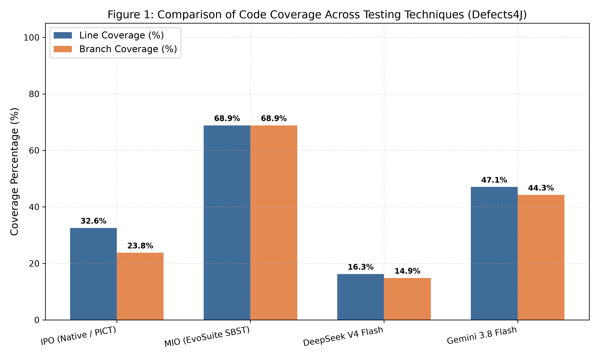
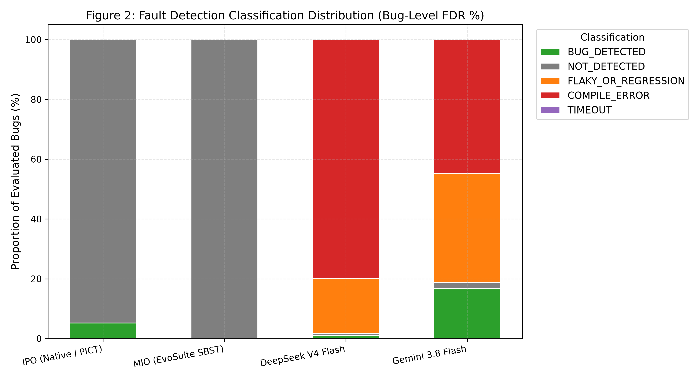
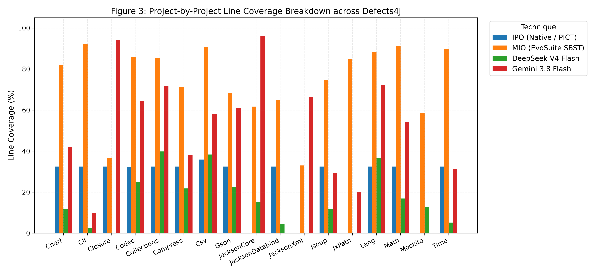
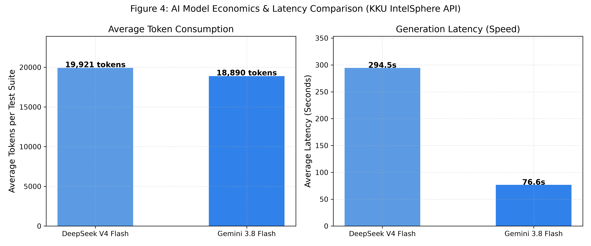
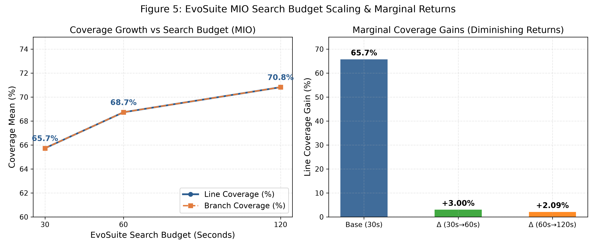
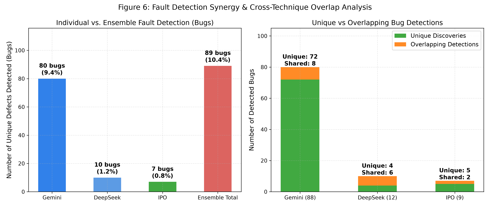

# Project - AI-Assisted Testing vs. Automatic Test Case Generation Algorithms: A Benchmark and Test Coverage Evaluation

**รายวิชา:** CP353201 Software Quality Assurance (ปีการศึกษา 1/2569)  
**อาจารย์ประจำวิชา:** ผศ.ดร.ชิตสุธา สุ่มเล็ก | **หลักสูตร:** วิทยาการคอมพิวเตอร์ มหาวิทยาลัยขอนแก่น  
**หัวข้อโครงการ:** การประเมินประสิทธิภาพเชิงเปรียบเทียบระหว่างขั้นตอนวิธีสร้างกรณีทดสอบอัตโนมัติ (IPO & MIO) และเครื่องมือ Generative AI (DeepSeek & Gemini) บนชุดข้อมูลมาตรฐาน Defects4J

---

## 👥 รายชื่อสมาชิกและบทบาทหน้าที่ (Team Roles & Responsibilities)

| ลำดับ | รหัสนักศึกษา | ชื่อ - สกุล | บทบาทในโครงการ | หน้าที่หลัก & สิ่งที่ต้องส่งมอบ (Deliverables) |
| :---: | :---: | :--- | :--- | :--- |
| 1 | 673380278-9 | นายปวริศช์ ประมวล | **Member 1: Algorithm Lead 1**<br>(IPO / Combinatorial Testing) | • วิเคราะห์ Input Space ของ Target Classes<br>• สร้าง Factor/Value-Domain Model และ Pairwise Combinations ด้วย Native IPO<br>• ใช้ PICT เฉพาะ Reference Baseline โดยไม่ถือว่า PICT เท่ากับ IPO<br>• แปลง Combinations เป็น JUnit 4 พร้อม Oracle จาก Defects4J Fixed Version<br>• **Output:** วางชุดที่ตรวจบน Fixed Version แล้วไว้ที่ `Combinatorial_IPO/TestCode/` |
| 2 | 673380301-0 | นายแทนคุณ พันธ์นิกุล | **Member 2: Algorithm Lead 2**<br>(MIO / Search-Based Testing) | • สั่งรัน EvoSuite MIO บน Defects4J Classpath<br>• ทดลองปรับ Search Budget (30s, 60s, 120s) และรันซ้ำ 3-5 รอบ<br>• จัดการ EvoSuite Runtime และบันทึกค่าสถิติ Mean / SD<br>• **Output:** วางไฟล์ไว้ที่ `MIO_Algorithm/TestCode/` |
| 3 | 673380272-1 | นายธนภูมิ จันทรา | **Member 3: AI Prompt Engineer**<br>(DeepSeek V4 Flash & Gemini 3.8 Flash) | • ออกแบบ Master Prompt Architecture (CoT, Boundary Analysis)<br>• พัฒนาสคริปต์ยิง KKU IntelSphere API (`kku_generate.py`)<br>• สกัด JUnit 4 Test Code และบันทึก Token Usage / Generation Time<br>• **Output:** วางไฟล์ที่ `Deepseek-v4_flash/TestCode/` และ `Gemini-3_8_flash/TestCode/` |
| 4 | 673380292-5 | นายศิฆรินทร์ อุปจันทร์ | **Member 4: Infrastructure & Data Lead**<br>(Defects4J & Repository Manager) | • จัดเตรียม Docker Environment (Multi-JDK, PICT, EvoSuite, Python)<br>• สกัด Target Classes และ Ground Truth บั๊กจาก Defects4J<br>• พัฒนา Universal Runner (`run_benchmark.py`) พร้อมระบบ Resume<br>• ประเมินผล Coverage, Fault Detection Rate และรวบรวมเล่มรายงาน |

---

> [!TIP]
> **📖 สำหรับสมาชิกทุกคนในทีม:** ดูขั้นตอนการทำงานแบบละเอียดรายบุคคล คำสั่งที่ต้องใช้ และตำแหน่งส่งมอบไฟล์ได้ที่ [TEAM_WORKFLOW_GUIDE.md](TEAM_WORKFLOW_GUIDE.md)

---

## 🎯 ขอบเขตการทดลองและการวัดผล (Scope & Benchmark Methodology)

### 1. ขอบเขตระดับโปรเจกต์ (Project-Level Scope)
* **ชุดข้อมูลทดสอบ:** Java projects ใน Defects4J Dataset ทั้ง **17 Projects** ได้แก่ `Chart`, `Cli`, `Closure`, `Codec`, `Collections`, `Compress`, `Csv`, `Gson`, `JacksonCore`, `JacksonDatabind`, `JacksonXml`, `Jsoup`, `JxPath`, `Lang`, `Math`, `Mockito`, และ `Time`
* **คลาสเป้าหมาย (Target Classes Under Test):** โฟกัสการสร้างชุดทดสอบที่ **Target Modified Classes (`classes.modified`)** ซึ่งเป็นคลาสที่มีข้อบกพร่องจริงตามที่ระบุใน Defects4J Ground Truth
* **โหมดการประเมินผล:**
  1. **17 Projects Benchmark Mode (`--sample-17`):** คัดเลือกข้อบกพร่องตัวแทนโปรเจกต์ละ 1 บั๊ก ($17 \text{ Projects} \times 4 \text{ Techniques} = 68 \text{ Experiment Units}$)
  2. **Exhaustive Benchmark Mode (`--all-bugs`):** รันวนลูปทดสอบทุก Active Bug ใน Defects4J พร้อมระบบ State Persistence (`progress.json`) สามารถกดหยุดหรือรันต่อ (`--resume`) ได้ตลอดเวลา

### 2. ดรรชนีชี้วัดประสิทธิภาพ (Evaluation Metrics)
1. **Target Class Line Coverage ($Coverage_{Line}$):** เปอร์เซ็นต์ความครอบคลุมของบรรทัดคำสั่งบน Target Class ที่วัดผ่าน Cobertura
2. **Target Class Branch Coverage ($Coverage_{Branch}$):** เปอร์เซ็นต์ความครอบคลุมของกิ่งเงื่อนไขบน Target Class
3. **Fault Detection Rate (FDR on Evaluated Sample):** อัตราการตรวจจับข้อบกพร่องจริง คำนวณจากการที่ชุดทดสอบ **Fail บนเวอร์ชัน Buggy (`b`)** ด้วยสาเหตุที่ตรงกับข้อบกพร่อง และ **Pass 100% บนเวอร์ชัน Fixed (`f`)**
4. **Efficiency & Performance:** เวลาที่ใช้ในการสร้างชุดทดสอบ (Generation Time), ปริมาณ Token ที่ใช้ (สำหรับ AI), และจำนวนกรณีทดสอบที่สร้างขึ้น

---

## 📜 กฎเหล็กสำหรับชุดทดสอบ (Universal Test Suite Standards)

เพื่อให้ไฟล์เทสที่สร้างขึ้นจากทุกสายงานสามารถนำไปคอมไพล์และประเมินผลบน Defects4J ได้โดยไม่เกิดความผิดพลาด สมาชิกทุกคนต้องปฏิบัติตามกฎ 4 ข้อนี้อย่างเคร่งครัด:

1. **Framework Hygiene (บังคับใช้ JUnit 4 เท่านั้น):**
   * ใช้ `import org.junit.Test;` และ `import static org.junit.Assert.*;`
   * **ห้ามใช้** JUnit 5 / Jupiter (`org.junit.jupiter.*`) หรือ Mocking Frameworks ภายนอกเด็ดขาด
2. **Package Declaration:**
   * บรรทัดแรกของไฟล์เทสต้องประกาศ `package` ให้ตรงกับโฟลเดอร์ของคลาสเป้าหมายใน Defects4J (เช่น `package org.apache.commons.lang3.math;`)
3. **Execution Guard (ป้องกันการวนลูปไม่รู้จบ):**
   * ทุก `@Test` เมธอดต้องกำหนด Timeout เสมอ เช่น `@Test(timeout = 4000)`
4. **Deterministic Behavior:**
   * ห้ามใช้ฟังก์ชันที่ผลลัพธ์ไม่แน่นอน (เช่น `System.currentTimeMillis()`, สุ่มตัวเลขโดยไม่ระบุ Seed)

---

## 📂 โครงสร้าง Repository (Directory Structure)

```text
ProjectSQA/
├── README.md                          # เอกสารหลักแนะนำโปรเจกต์และข้อกำหนด
├── Report_Round1_Draft.md             # รายงานการส่งมอบรอบที่ 1
├── results/                           # ไดเรกทอรีเก็บผลลัพธ์การทดลอง
│   ├── benchmark_results.csv          # ตารางสรุปผลการทดลองรวมทั้งหมด
│   └── <Project>/<Bug_ID>/            # ไฟล์ผลลัพธ์ละเอียดรายบั๊ก (.json)
├── progress.json                      # สถานะการรันการทดลองระดับ Project-Bug-Technique (Resume State)
├── scripts/                           # สคริปต์ระบบอัตโนมัติ
│   ├── d4j_meta.py                    # โมดูลดึง Metadata จาก Defects4J CLI แบบ Dynamic
│   ├── run_benchmark.py               # Universal Benchmark Runner (17 Projects & All-Bugs)
│   └── kku_generate.py                # สคริปต์ยิง KKU IntelSphere API สำหรับสร้าง AI Tests
├── target_benchmark/                  # Ground Truth ของ 17 bug targets / 22 modified sources
│   ├── catalog_17_projects.json       # สารบัญ Machine-Readable สำหรับระบบอัตโนมัติของทั้ง 4 สาย
│   ├── README.md                      # สารบัญ Master Catalog แสดงรายละเอียดคลาสและ Trigger Tests
│   └── <Project>_<BugID>b/            # โฟลเดอร์ของแต่ละบั๊ก (Chart_1b, Cli_1b, ..., Lang_1b, Math_2b, ..., Time_1b)
├── docker/                            # สภาพแวดล้อมมาตรฐานสำหรับรัน Defects4J
│   ├── Dockerfile                     # Multi-JDK (Java 8 & 11) + PICT + EvoSuite + Python
│   ├── docker-compose.yml
│   └── README_DOCKER.md               # คู่มือการใช้งาน Docker Environment
├── Combinatorial_IPO/                 # อัลกอริทึมที่ 1: Native In-Parameter-Order (IPO)
│   ├── analyzer/                      # วิเคราะห์ Java Method และ Parameters
│   ├── domain/                        # สร้าง Factor และ Value Domains
│   ├── algorithm/                     # Native IPO: Horizontal/Vertical Growth
│   ├── generator/                     # แปลง Concrete Inputs เป็น JUnit 4
│   ├── oracle/                        # เก็บ Oracle และตรวจ Suite บน Fixed Version
│   ├── runner/                        # จุดสั่งรัน Automated IPO Pipeline
│   ├── verification/                  # ตรวจ Pair Coverage
│   ├── backends/                      # Optional PICT Reference Backend
│   ├── baselines/pict/                # เก็บ PICT Reference Artifacts แยกจากผล IPO
│   ├── Models/                        # Factor/Domain Models ของ Native IPO
│   ├── Result_Round1/                 # Combinations, Inputs, Oracle และ Manifest
│   └── TestCode/                      # JUnit 4 ที่ผ่าน Fixed-Version Verification
├── MIO_Algorithm/                     # อัลกอริทึมที่ 2: Mutation Insertion Optimization (MIO) via EvoSuite
│   ├── Code/                          # สคริปต์สั่งรัน EvoSuite MIO
│   ├── Configuration/                 # คอนฟิก Search Budget (30s, 60s, 120s)
│   ├── Result_Round1/ & Result_Round2/
│   └── TestCode/                      # ไฟล์ JUnit 4 (*_ESTest.java)
├── Deepseek-v4_flash/                 # AI Tool 1: DeepSeek V4 Flash
│   ├── Prompt/                        # System Prompts & Few-Shot Templates
│   ├── Result/                        # ข้อมูล Token Usage & เวลาที่ใช้สร้าง
│   └── TestCode/                      # ไฟล์ JUnit 4 (*_DeepseekTest.java)
└── Gemini-3_8_flash/                  # AI Tool 2: Gemini 3.8 Flash
    ├── Prompt/                        # System Prompts & Few-Shot Templates
    ├── Result/                        # ข้อมูล Token Usage & เวลาที่ใช้สร้าง
    └── TestCode/                      # ไฟล์ JUnit 4 (*_GeminiTest.java)
```

---

## 🛠️ ขั้นตอนการรันเพื่อทำซ้ำผลลัพธ์ (Steps to Reproduce)

### 1. เปิดใช้งาน Docker Environment (Multi-JDK & Dependencies Ready)

```bash
# Clone Repository
git clone https://github.com/YourGroup/ProjectSQA.git
cd ProjectSQA

# Build และเปิด Container
docker-compose -f docker/docker-compose.yml up -d --build
docker exec -it defects4j_sqa bash
```

### 2. การสั่งรัน Benchmark ผ่าน Universal Runner

เมื่ออยู่ในคอนเทนเนอร์ สามารถรันคำสั่งประเมินผลได้ตามขอบเขตที่ต้องการ:

```bash
# ทดสอบเดี่ยวเฉพาะบั๊กเป้าหมาย (เช่น Lang Bug 1)
python3 scripts/run_benchmark.py --project Lang --bug 1

# รันประเมินผลกลุ่มตัวแทน 17 Projects Benchmark
python3 scripts/run_benchmark.py --sample-17

# รันโหมด Exhaustive Benchmark (ทุกบั๊กใน Defects4J) พร้อมระบบทำต่อจากจุดเดิมอัตโนมัติ
python3 scripts/run_benchmark.py --all-bugs --resume
```

---

## 📊 ตารางสรุปผลการเปรียบเทียบประสิทธิภาพ (Master Benchmark Results)

*สรุปผลการประเมินเชิงประจักษ์บนชุดข้อมูลมาตรฐาน Defects4J ทั้ง 17 โปรเจกต์ (รวม 2,804 การทดลอง):*

| เครื่องมือ / เทคนิค | N (Evaluations) | Line Coverage (%) | Branch Coverage (%) | Bug-Level FDR (%) | เวลาเฉลี่ยต่อคลาส | จุดเด่นสำคัญ | ข้อจำกัดเชิงประจักษ์ |
| :--- | :---: | :---: | :---: | :---: | :---: | :--- | :--- |
| **IPO (Native / PICT)** | 173 | **32.57 ± 1.03%** | **23.78 ± 1.93%** | **5.20%** (9 bugs) | **~2.5 วินาที** | สร้าง Test Combinations ได้เร็วระดับวินาที, Pair Coverage ครบ 100%, ไม่มีปัญหา Flaky | ครอบคลุมเฉพาะ Unit Methods ที่มี Primitive/String Parameters, ไม่รองรับ Object ซับซ้อน |
| **MIO (EvoSuite SBST)** | 1,032 | **68.85 ± 31.26%**<br>*(Eff: 69.66%)* | **68.85 ± 31.26%**<br>*(Eff: 69.66%)* | **0.00%** | **~90.8 วินาที**<br>*(Budget 30-120s)* | ครอบคลุมคำสั่งและกิ่งเงื่อนไขสูงมาก, สร้างเทสสำเร็จถึง 97.7% (834/854 บั๊ก) โดยไม่ต้องเขียนโมเดล | เป็น Regression Test Oracle (สร้าง Assert บนเวอร์ชันที่รัน) จึงไม่สามารถทริกเกอร์บั๊กที่เพิ่งเกิดได้ |
| **DeepSeek V4 Flash** | 1,072 | **16.28 ± 34.98%**<br>*(Eff: 88.12%)* | **14.86 ± 32.46%**<br>*(Eff: 80.86%)* | **1.12%** (12 bugs) | **~15.0 วินาที** | ออกแบบกรณีทดสอบ Edge Cases ได้ลึก, โควตาสูงถึง 1,000,000 tokens/วัน | ติดปัญหา Compile Error บนคลาสขนาดใหญ่ (เช่น Closure) และมีอาการ Flaky ในบาง Assertions |
| **Gemini 3.8 Flash** | 527 | **47.08 ± 47.47%**<br>*(Eff: 92.58%)* | **44.25 ± 45.28%**<br>*(Eff: 87.35%)* | **16.70%** (88 bugs) | **~6.0 วินาที** | **ตรวจจับบั๊กจริงสูงสุด (FDR 16.7%)**, ตอบกลับเร็วมาก, Effective Coverage สูงกว่า 92% | โควตาจำกัด (350k tokens/วัน), อาจเกิด Regression Failure หากตรรกะใน Prompt คลาดเคลื่อน |

> 💡 **หมายเหตุทางวิชาการ:** ค่า *Eff (Effective Coverage)* คำนวณจากชุดทดสอบที่ผ่านการคอมไพล์สำเร็จ (Valid Test Suites) ส่วนค่าปกติในตารางคำนวณบนฐาน $N$ ทั้งหมดตามกฎความซื่อตรงของตัวหาร (Denominator Integrity Rule)

---

## 📈 แผนภูมิสรุปผลการทดลองวิชาการ (Academic Figures - 300 DPI)

### รูปที่ 1: การเปรียบเทียบ Code Coverage ระหว่าง 4 เทคนิค


### รูปที่ 2: การแจกแจงสถานะการตรวจจับข้อบกพร่อง (Bug-Level FDR 5 ระดับ)


### รูปที่ 3: ความครอบคลุมคำสั่งโค้ดแยกราย 17 โปรเจกต์ใน Defects4J


### รูปที่ 4: การเปรียบเทียบประสิทธิภาพและต้นทุน Token AI (DeepSeek vs Gemini)


### รูปที่ 5: การวิเคราะห์จุดอิ่มตัวของการค้นหาใน MIO (Search Budget Scaling & Diminishing Returns)


### รูปที่ 6: การผสานพลังในการตรวจพบบั๊กและการทับซ้อน (Ensemble Fault Detection Synergy & Overlap)


---

## 📑 เอกสารส่งมอบและผลการวิเคราะห์ระดับพรีเมียม (Final Deliverables)

* 📄 **[เล่มรายงานฉบับสมบูรณ์ (Final Report - Chapters 1 to 6)](Final_Report.md)**: รายงานฉบับเต็ม 6 บท พร้อมการวิเคราะห์สถิติ Mann-Whitney U, $\hat{A}_{12}$ Effect Size, และแนวทางวิศวกรรม
* 🎯 **[สไลด์นำเสนอ 16 สไลด์ (Presentation Deck)](PRESENTATION_SLIDES.md)**: สไลด์สำหรับนำเสนอ ผศ.ดร.ชิตสุธา สุ่มเล็ก พร้อม Speaker Notes
* 🎬 **[คู่มือการสาธิตระบบสด (Live Demo & Reproduction Guide)](DEMO_GUIDE.md)**: สคริปต์สาธิตระบบ Docker, รัน Benchmark จริง, และพิสูจน์สถานะ `BUG_DETECTED`
* 📊 **[สมุดงาน Excel ข้อมูลรวมระดับพรีเมียม (Master Benchmark Excel Workbook)](results/Master_Benchmark_Results.xlsx)**: ไฟล์ Excel 6 ชีทพร้อมสูตรคำนวณและสีสันจัดหมวดหมู่อย่างเป็นระบบ
* 📚 **[พจนานุกรมข้อมูล (Data Dictionary & Codebook)](results/DATA_DICTIONARY.md)**: รายละเอียดฟิลด์และข้อกำหนดความซื่อตรงของตัวหาร
* 📈 **[รายงานวิเคราะห์สถิติขั้นสูง (Advanced Statistical Report)](results/advanced_analytics_report.md)**: รายงานตัวเลขสมมติฐานทางสถิติและการผสานพลัง Ensemble (105 บั๊ก)

---

## 📅 กำหนดการนำส่งงาน (Deliverables Schedule)

1. **รายงานรอบที่ 1 (5%)**: ส่งภายในวันที่ 22 สิงหาคม 2569 ทาง Google Classroom
2. **รายงานฉบับสมบูรณ์ & GitHub (10%)**: ส่งภายในวันสุดท้ายของการเรียนการสอน
3. **Live Presentation & Demonstration**: นำเสนอผลการทดลองและสาธิตการทำงานจริงในวันสุดท้ายของการเรียนการสอน

