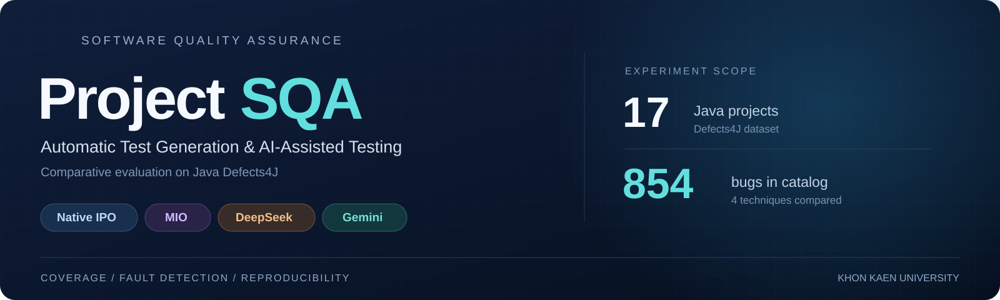
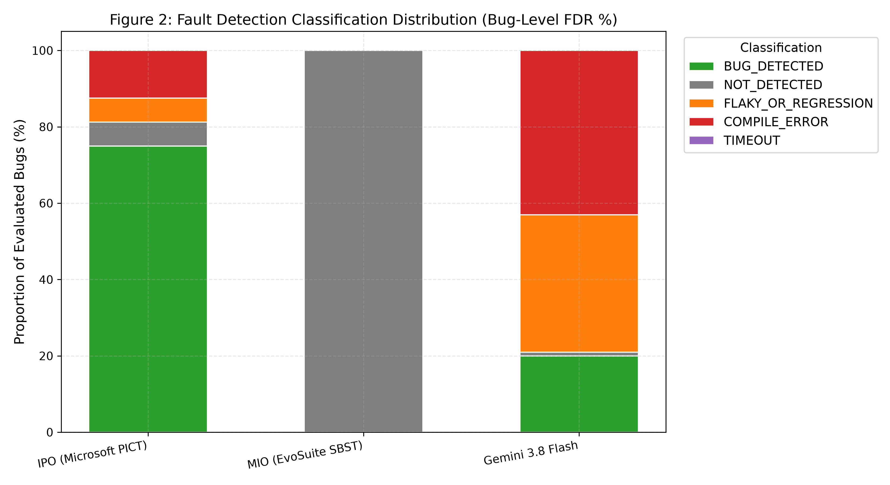
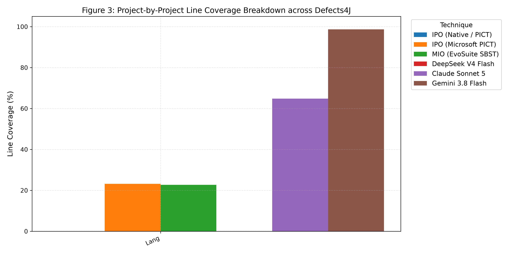
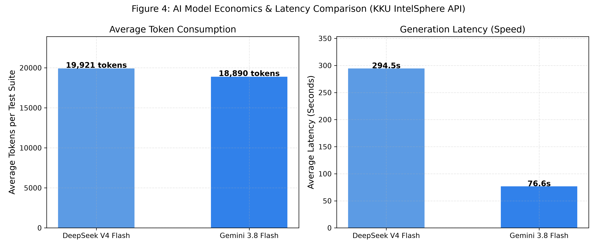
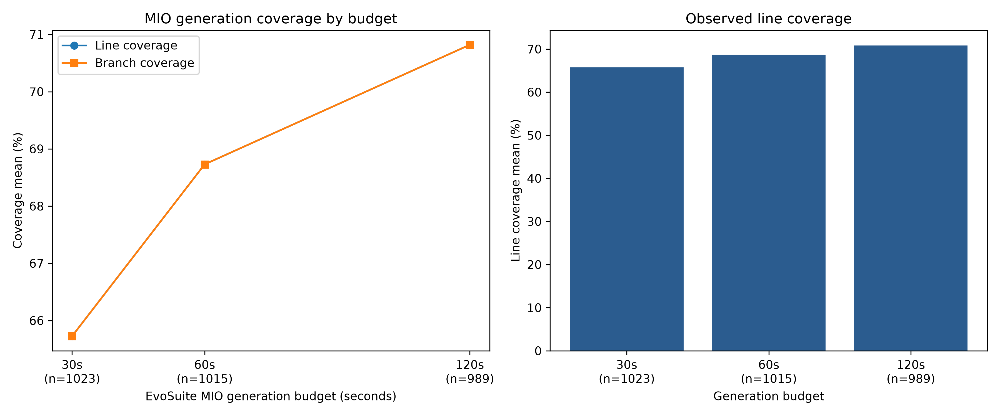
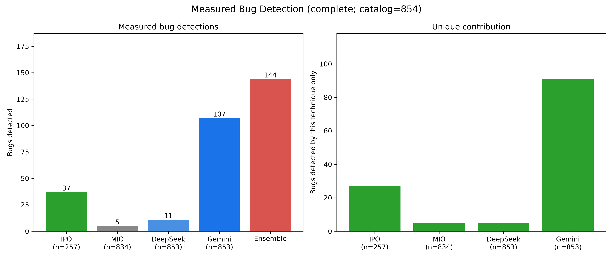

<div align="center">

<h3>การเปรียบเทียบการสร้างชุดทดสอบอัตโนมัติและชุดทดสอบจาก AI</h3>

[**อ่านรายงาน PDF**](docs/final/SQA_Final_Report.pdf) · [**เปิดสไลด์ Canva**](https://canva.link/43hoh5a4r15c15e) · [**คู่มือเดโม**](docs/demo/DEMO_GUIDE.md) · [**ดูข้อมูลผลทดลอง**](results/master_benchmark_summary.csv)

</div>

---

**รายวิชา** CP353201 Software Quality Assurance · ภาคการศึกษา 1/2569 · Sec 1<br>
**อาจารย์ประจำวิชา** ผศ.ดร.ชิตสุธา สุ่มเล็ก<br>
**หลักสูตร** วิทยาการคอมพิวเตอร์ มหาวิทยาลัยขอนแก่น

## สมาชิกผู้จัดทำ

| สมาชิก | ชื่อ–นามสกุล | รหัสนักศึกษา | Section |
|:---:|---|:---:|:---:|
| 1 | นายปวริศช์ ประมวล | 673380278-9 | Sec 1 |
| 2 | นายแทนคุณ พันธ์นิกุล | 673380301-0 | Sec 1 |
| 3 | นายธนภูมิ จันทรา | 673380272-1 | Sec 1 |
| 4 | นายศิฆรินทร์ อุปจันทร์ | 673380292-5 | Sec 1 |

**การแบ่งงาน:** Member 1 — Native IPO · Member 2 — MIO/EvoSuite · Member 3 — AI suites · Member 4 — ตัวรันกลางและวิเคราะห์ผล<br>
รายละเอียดหน้าที่และการส่งมอบ: [คู่มือการทำงานของทีม](docs/team/TEAM_WORKFLOW_GUIDE.md)

---

[เอกสารส่งมอบ](#deliverables) · [ภาพรวม](#overview) · [ผลทดลอง](#results) · [กราฟทั้ง 6 รูป](#figures) · [ทำซ้ำผลทดลอง](#reproduce) · [โครงสร้างไฟล์](#structure)

<a id="deliverables"></a>

## เอกสารสำหรับอ่านและนำเสนอ

| เอกสาร | เปิดอ่าน / ดาวน์โหลด | ใช้สำหรับ |
|---|---|---|
| **รายงานฉบับส่งหลัก** | [PDF](docs/final/SQA_Final_Report.pdf) · [DOCX](docs/final/SQA_Final_Report.docx) | เนื้อหารายงานฉบับสมบูรณ์ |
| **สไลด์ SQA Research Keynote** | [Canva](https://canva.link/43hoh5a4r15c15e) · [PDF](docs/presentation/SQA%20Research%20Keynote.pdf) | เปิดนำเสนอใน Canva ตามสิทธิ์การเข้าถึง หรือใช้ PDF สำรอง |
| **คู่มือเดโม** | [DEMO_GUIDE.md](docs/demo/DEMO_GUIDE.md) | เตรียมเครื่อง รัน suite จริงทั้ง 4 เทคนิค และเปิดหลักฐานสำรอง |
| ข้อมูลผลทดลอง | [CSV](results/master_benchmark_summary.csv) · [Excel](results/Master_Benchmark_Results.xlsx) · [Data dictionary](results/DATA_DICTIONARY.md) | ตรวจตัวเลขและความหมายของแต่ละช่องข้อมูล |
| เอกสารประกอบ | [รายงาน Markdown](docs/reports/Final_Report.md) · [บทพูดและเวลา](docs/presentation/PRESENTATION_SLIDES.md) | อ่านรายละเอียดบน GitHub และเตรียมการนำเสนอ |
| สไลด์ PowerPoint | [SQA_Presentation_10min.pptx](docs/presentation/SQA_Presentation_10min.pptx) | ชุดสไลด์เพิ่มเติมพร้อม speaker notes |
| ข้อกำหนดรายวิชา | [Assignment PDF](docs/reference/SQA_Project_2026_Assignment.pdf) | ตรวจรายการส่งงานและเกณฑ์การนำเสนอ |

**รายงานฉบับส่งหลักคือ DOCX และ PDF ใน `docs/final/`** ส่วน Markdown เป็นเอกสารประกอบบน GitHub

---

<a id="overview"></a>

## ภาพรวมโครงการ

โครงการนี้เปรียบเทียบชุดทดสอบจากอัลกอริทึมและ AI รวม 4 เทคนิคบน Defects4J โดยใช้ตัวรันกลางวัด **line coverage**, **branch coverage** และ **fault detection** จากการรัน suite เดียวกันบนเวอร์ชัน buggy และ fixed ผลการประเมินเชื่อมโยงกับ test code, suite hash และ run logs เพื่อให้ตรวจสอบย้อนกลับได้

| เทคนิค | วิธีสร้างชุดทดสอบ | Source / Prompt / Configuration |
|---|---|---|
| **Native IPO** | สร้างชุดค่าทดสอบแบบ pairwise จาก factor/value models และตรวจยืนยัน suite | [Combinatorial_IPO](Combinatorial_IPO/) |
| **MIO / EvoSuite** | ค้นหาชุดทดสอบด้วย search budgets 30/60/120 วินาที และ seeds 101/102/103 | [MIO_Algorithm](MIO_Algorithm/) |
| **DeepSeek V4 Flash** | สร้าง JUnit suites จาก prompt และบริบทของโค้ดเป้าหมาย | [Deepseek-v4_flash](Deepseek-v4_flash/) |
| **Gemini 3.8 Flash** | สร้าง JUnit suites จาก prompt และบริบทของโค้ดเป้าหมาย | [Gemini-3_8_flash](Gemini-3_8_flash/) |

**ลำดับการทดลอง:** สร้าง suite → ตรวจรายการและ hash → รัน buggy/fixed → วัด coverage และจำแนกสถานะ → รวมผลใน master dataset

---

<a id="results"></a>

## ผลการทดลองโดยสรุป

**Snapshot: 26 กันยายน 2026** — อ้างอิง [สถิติเชิงพรรณนา](results/master_descriptive_stats.json) และ [master dataset](results/master_benchmark_summary.csv)

| โครงการ Java | บั๊กใน catalog | คู่บั๊ก–เทคนิค | มี suite และพยายามประเมิน | ไม่มี suite |
|---:|---:|---:|---:|---:|
| **17** | **854** | **3,416** | **2,797** | **619** |

ทุกคู่ใน catalog มีสถานะบันทึกแล้ว แต่ผลที่มีสถานะครบไม่ได้หมายความว่าทุกคู่มี suite หรือรันสำเร็จ

### ความสามารถในการตรวจพบบั๊ก

| เทคนิค | พยายามประเมิน (บั๊ก) | Compile error | ตรวจพบ (บั๊ก) | FDR / ที่พยายามประเมิน | FDR / catalog 854 |
|---|---:|---:|---:|---:|---:|
| Native IPO | 257 | 5 | 37 | **14.40%** | 4.33% |
| MIO / EvoSuite | 834 | 37 | 5 | 0.60% | 0.59% |
| DeepSeek V4 Flash | 853 | 661 | 11 | 1.29% | 1.29% |
| Gemini 3.8 Flash | 853 | 429 | **107** | 12.54% | **12.53%** |

FDR นับระดับบั๊กต่อเทคนิค: ต้องมี test fail บน buggy และผ่านการตรวจบน fixed ตามกติกาของ runner ตัวหารที่พยายามประเมินรวม `DONE + COMPILE_ERROR + TIMEOUT` และไม่รวม `NO_SUITE`

### ความครอบคลุมของโค้ด

| เทคนิค | จำนวนบั๊กที่วัด coverage ได้ (n) | Line coverage เฉลี่ย | Branch coverage เฉลี่ย |
|---|---:|---:|---:|
| Native IPO | 252 | 26.76% | 18.67% |
| MIO / EvoSuite | 797 | 63.85% | 56.51% |
| DeepSeek V4 Flash | 192 | 78.02% | 70.22% |
| Gemini 3.8 Flash | 424 | **86.29%** | **79.54%** |

ค่า coverage เฉลี่ยใช้เฉพาะรายการที่วัดได้บน modified target classes; compile error และค่าที่วัดไม่ได้ไม่ถูกแทนด้วยศูนย์ จำนวนตัวอย่างของแต่ละเทคนิคต่างกัน จึงต้องอ่านค่าเฉลี่ยร่วมกับ n, compile error และ suite ที่ขาด

**ข้อค้นพบ:** Gemini ตรวจพบจำนวนบั๊กมากที่สุดในผลชุดนี้ ส่วน IPO มี FDR ต่อรายการที่พยายามประเมินสูงที่สุด การเปรียบเทียบนี้ใช้ชุดบั๊กที่มี suite ของแต่ละเทคนิคซึ่งมีขนาดและองค์ประกอบต่างกัน ค่า coverage สูงจึงต้องพิจารณาร่วมกับ assertions และผล buggy/fixed

### สถานะการประเมินทั้งหมด

| สถานะ | จำนวนคู่ | ความหมายโดยสรุป |
|---|---:|---|
| `BUG_DETECTED` | 160 | ผ่านเกณฑ์ตรวจพบบั๊กของ runner |
| `NOT_DETECTED` | 711 | รันได้ แต่ไม่แยก buggy/fixed ตามเกณฑ์ตรวจพบ |
| `FLAKY_OR_REGRESSION` | 794 | ผลบน fixed ไม่ผ่านเงื่อนไขรับรองการตรวจพบ; ป้ายนี้ไม่ยืนยันว่า flaky ทุกกรณี |
| `COMPILE_ERROR` | 1,132 | การคอมไพล์ไม่ผ่าน |
| `NO_SUITE` | 619 | ไม่มี suite ที่ส่งเข้าประเมิน |

จำนวน `BUG_DETECTED` 160 คู่เป็นผลรวมข้ามเทคนิค บั๊กเดียวกันอาจถูกตรวจพบโดยหลายเทคนิค จึงไม่ใช่จำนวนบั๊กไม่ซ้ำ

---

<a id="figures"></a>

## แผนภูมิผลการทดลอง

### Coverage และสถานะผลประเมิน


**รูปที่ 1 — Line และ branch coverage:** คำนวณเฉพาะรายการที่วัดได้ จำนวนตัวอย่างระบุในตารางด้านบน



**รูปที่ 2 — สถานะผลประเมินแยกตามเทคนิค:** รวมรายการที่คอมไพล์ไม่ผ่านและไม่มี suite

### Coverage รายโครงการและต้นทุนการสร้างชุดทดสอบ



**รูปที่ 3 — Line coverage แยก 17 โครงการ:** ไม่นับค่าที่วัดไม่ได้เป็นศูนย์



**รูปที่ 4 — Token และเวลา generation ของ AI:** เป็นสถิติขั้นตอนสร้าง suite แยกจาก coverage และ FDR ของ benchmark

### Search budget และการตรวจพบบั๊กร่วมกัน



**รูปที่ 5 — ผลของ search budget ต่อ MIO:** เป็นผล generation ตาม budget และ seed ที่บันทึกไว้



**รูปที่ 6 — ผลตรวจพบทับซ้อน:** รวมผลตรวจพบจากการประเมินเดิม ไม่ใช่การรัน ensemble suite ใหม่

---

## หลักฐานและการตรวจสอบย้อนกลับ

| แหล่งข้อมูล | รายละเอียด |
|---|---|
| [Master benchmark CSV](results/master_benchmark_summary.csv) | สถานะและผลวัดหนึ่งแถวต่อคู่บั๊ก–เทคนิค |
| [สถิติเชิงพรรณนา JSON](results/master_descriptive_stats.json) | จำนวน suite, ผลประเมิน, FDR และ coverage |
| [รายงานวิเคราะห์สถิติ](results/advanced_analytics_report.md) | ตารางเปรียบเทียบและการวิเคราะห์เพิ่มเติม |
| [บัญชี suite](results/suite_inventory.csv) | suite ที่พบพร้อม hash สำหรับตรวจสอบย้อนกลับ |
| [บัญชีช่อง NO_SUITE](results/suite_gap_audit.csv) | รายละเอียด suite ที่ขาดและสถานะไฟล์ candidate |

หากมีการเพิ่มหรือแก้ suite ให้รัน benchmark และสร้าง CSV, Excel, JSON, รายงาน analytics และกราฟใหม่จาก snapshot เดียวกันก่อนอ้างตัวเลข.

---

## ขอบเขตและวิธีประเมินผล

### ชุดข้อมูลและขอบเขต

- ใช้ Java projects 17 โครงการใน Defects4J: `Chart`, `Cli`, `Closure`, `Codec`, `Collections`, `Compress`, `Csv`, `Gson`, `JacksonCore`, `JacksonDatabind`, `JacksonXml`, `Jsoup`, `JxPath`, `Lang`, `Math`, `Mockito` และ `Time`.
- Catalog ครอบคลุม 854 บั๊ก โดยประเมิน 4 เทคนิค จึงมี 3,416 คู่บั๊ก–เทคนิคในตารางผลหลัก.
- ขอบเขต coverage คือ modified target classes (`classes.modified`) ของแต่ละบั๊ก.
- `--sample-17` ใช้บั๊กตัวแทนหนึ่งรายการต่อโครงการ รวม 68 คู่บั๊ก–เทคนิค; `--all-bugs` ใช้ catalog ทั้งหมด.
- โหมด `--resume` อ่าน checkpoint `progress.json` ใน workspace ปัจจุบัน ไฟล์นี้สร้างโดย runner และไม่ถูกติดตามใน Git; ใช้ workspace เดิมเมื่อต้องการทำคิวต่อ.

### ตัวชี้วัด

- **Line coverage** และ **branch coverage** วัดบน modified target classes ด้วยเครื่องมือที่เชื่อมกับ Defects4J. คำนวณค่าเฉลี่ยจากผลที่วัด coverage ได้เท่านั้น; compile errors และค่าที่วัดไม่ได้ไม่ถูกนับเป็นศูนย์.
- **Fault Detection Rate (FDR)** นับระดับบั๊ก ตรวจพบเมื่อมี test อย่างน้อยหนึ่งรายการ fail บนเวอร์ชัน buggy และผ่านบนเวอร์ชัน fixed. รายงานทั้งตัวหารจากรายการที่พยายามประเมินและจาก catalog 854 บั๊ก.
- **Generation metrics** เช่น เวลาและ token ใช้บรรยายขั้นตอนสร้าง suite และแยกจากผล benchmark เว้นแต่มี run identity ที่เชื่อมโยงกันได้.
- ผล `NO_SUITE` หมายถึงไม่มี suite ที่ส่งเข้าประเมิน ไม่ใช่ผลการทดสอบที่ผ่านหรือตรวจไม่พบบั๊ก.

---

## ข้อกำหนดของ test suites

เพื่อให้ runner ประเมินชุดทดสอบได้ แต่ละ suite ควรเป็นไปตามข้อกำหนดต่อไปนี้:

1. ใช้ JUnit 4 ซึ่งเป็นรูปแบบที่ Defects4J projects ในการทดลองรองรับ.
2. ประกาศ Java package ให้ตรงกับ target package ของโปรเจกต์.
3. กำหนด timeout ให้ test ที่อาจใช้เวลานาน เพื่อป้องกันการค้างระหว่างประเมิน.
4. ควบคุม random seed และหลีกเลี่ยงการพึ่งพาเวลา ระบบ หรือสถานะภายนอกที่ทำให้ผลทดสอบไม่สม่ำเสมอ.

---

<a id="reproduce"></a>

## วิธีทำซ้ำผลการทดลอง

### สิ่งที่ต้องเตรียม

- Git และ Docker Desktop หรือ Docker Engine พร้อม Docker Compose
- Python 3 บน host สำหรับสร้างตารางสรุปและกราฟ
- พื้นที่ดิสก์และเครือข่ายสำหรับ build Docker image และ checkout Defects4J projects

### 1. ดาวน์โหลด repository และเริ่ม environment

```bash
git clone https://github.com/Bigzzz0/ProjectSQA.git
cd ProjectSQA

docker compose -f docker/docker-compose.yml up -d --build
docker exec defects4j_sqa defects4j info -p Math -b 2
```

คำสั่ง `defects4j info` ใช้ตรวจว่า container และ Defects4J พร้อมใช้งาน

### 2. รัน benchmark

คำสั่งต่อไปนี้รันจาก PowerShell หรือ terminal ที่ root ของ repository:

```powershell
# ประเมิน Lang-1 ด้วยทุกเทคนิค
docker exec defects4j_sqa python3 /workspace/scripts/run_benchmark.py --project Lang --bug 1

# ประเมินบั๊กตัวแทนหนึ่งรายการต่อโครงการ
docker exec defects4j_sqa python3 /workspace/scripts/run_benchmark.py --sample-17

# ประเมิน catalog ทั้งหมดและทำต่อจาก checkpoint ใน workspace เดิม
docker exec defects4j_sqa python3 /workspace/scripts/run_benchmark.py --all-bugs --resume

# ตรวจรายการส่งมอบของ Member 3 ก่อนประเมิน
docker exec defects4j_sqa python3 /workspace/scripts/run_member3_delivery.py --dry-run
```

`progress.json` เป็น checkpoint ในเครื่องและถูก Git มองข้าม หากย้ายเครื่องหรือ clone ใหม่ ให้ตรวจผลและ run records ก่อนเริ่มคิวใหม่

### 3. สร้างตารางสรุปและกราฟ

ทำขั้นตอนนี้บน host หลัง benchmark หยุดหรือเสร็จแล้ว:

```powershell
python -m venv .venv
.\.venv\Scripts\python.exe -m pip install -r requirements-analysis.txt
.\.venv\Scripts\python.exe scripts/reclassify_fault_detection.py --apply
.\.venv\Scripts\python.exe scripts/consolidate_master_results.py
.\.venv\Scripts\python.exe scripts/audit_suite_gaps.py
.\.venv\Scripts\python.exe scripts/advanced_data_analytics.py
.\.venv\Scripts\python.exe scripts/plot_results.py
```

---

<a id="structure"></a>

## โครงสร้าง repository

```text
ProjectSQA/
├── README.md                     # ภาพรวมโครงการและคู่มือเริ่มต้น
├── Combinatorial_IPO/            # Native IPO, models, suites และผล generation
├── MIO_Algorithm/                # MIO/EvoSuite, configurations และ suites
├── Deepseek-v4_flash/            # Prompts, generation records และ suites
├── Gemini-3_8_flash/             # Prompts, generation records และ suites
├── target_benchmark/             # Bug catalog และ modified target classes
├── results/                      # Master data, run records, reports และ figures
├── scripts/                      # Benchmark runner และสคริปต์วิเคราะห์ผล
├── docker/                       # Dockerfile, Compose และ environment guide
├── docs/
│   ├── final/                    # รายงาน DOCX/PDF ฉบับส่ง
│   ├── reports/                  # รายงาน Markdown และเอกสารรอบก่อน
│   ├── presentation/             # สไลด์ PDF, PowerPoint และบทพูด
│   ├── demo/                     # คู่มือสาธิตและทำซ้ำ
│   ├── team/                     # คู่มือทำงานและการส่งมอบ
│   └── reference/                # โจทย์และเอกสารอ้างอิง
├── archive/                      # ไฟล์ legacy ที่ไม่ใช้เป็นผลปัจจุบัน
├── tests/                        # Tests ของ project tooling
└── requirements-analysis.txt    # Dependencies สำหรับวิเคราะห์ผลบน host
```

---

## การส่งงาน

ส่งรายงานฉบับสมบูรณ์ ผลการทดลอง source code, test code, prompts, configurations และเอกสารประกอบผ่าน GitHub และ Google Classroom ตาม [โจทย์รายวิชา](docs/reference/SQA_Project_2026_Assignment.pdf) การนำเสนอและเดโมควรใช้ตัวเลขจาก snapshot เดียวกับรายงาน และระบุให้ชัดว่าแสดงผลสดหรือผลที่บันทึกไว้ก่อนหน้า
