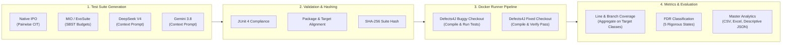

<p align="center">
  
</p>

<div align="center">

# โครงการวิจัยและประเมินผลการทดสอบซอฟต์แวร์ (Project SQA)
### การเปรียบเทียบเชิงประจักษ์ระหว่างการสร้างชุดทดสอบอัตโนมัติและปัญญาประดิษฐ์บน Defects4J
**Empirical Benchmark: AI-Assisted Testing vs. Automated Test Generation Algorithms on Defects4J**

<br/>

[](#team)
[](#team)
[](#overview)
[](#reproduce)
[](#reproduce)
[](#results)

<br/>
<br/>

<!-- Fast Navigation Action Cards -->
[](docs/final/SQA_Final_Report.pdf) &nbsp;&nbsp;
[](https://canva.link/43hoh5a4r15c15e) &nbsp;&nbsp;
[](docs/demo/DEMO_GUIDE.md) &nbsp;&nbsp;
[](results/master_benchmark_summary.csv)

<br/>
<br/>

<!-- Executive KPI Metrics Summary -->

| โครงการ Java ใน Catalog | บั๊กที่ประเมินผล | Benchmark Evaluations | บั๊กไม่ซ้ำที่ตรวจพบ | Line Coverage สูงสุด |
| :---: | :---: | :---: | :---: | :---: |
| **17 Projects** | **854 Active Bugs** | **3,416 Evaluated Pairs** | **144 Unique Bugs** | **86.29% (Gemini)** |

<br/>

**การนำทาง:** &nbsp; 
[เอกสารส่งมอบ](#deliverables) &nbsp;|&nbsp; 
[คณะผู้จัดทำ](#team) &nbsp;|&nbsp; 
[ภาพรวม & สถาปัตยกรรม](#overview) &nbsp;|&nbsp; 
[ผลการทดลอง](#results) &nbsp;|&nbsp; 
[แผนภูมิวิเคราะห์](#figures) &nbsp;|&nbsp; 
[การตรวจสอบย้อนกลับ](#traceability) &nbsp;|&nbsp; 
[วิธีทำซ้ำผลทดลอง](#reproduce) &nbsp;|&nbsp; 
[โครงสร้างโปรเจกต์](#structure)

</div>

---

<a id="team"></a>

## คณะผู้จัดทำและบทบาทหน้าที่ความรับผิดชอบ

> **รายวิชา:** CP353201 การประกันคุณภาพซอฟต์แวร์ (Software Quality Assurance) · ภาคการศึกษา 1/2569 · Section 1  
> **อาจารย์ประจำวิชา:** ผศ.ดร.ชิตสุธา สุ่มเล็ก  
> **หลักสูตร:** วิทยาการคอมพิวเตอร์ ภาควิชาวิทยาการคอมพิวเตอร์ คณะวิทยาศาสตร์ มหาวิทยาลัยขอนแก่น  

| ลำดับ | สมาชิกในทีม | รหัสนักศึกษา | บทบาทหน้าที่และความรับผิดชอบหลัก (Role & Scope) | โมดูลที่ดูแลรับผิดชอบ |
| :---: | :--- | :---: | :--- | :---: |
| 1 | **นายปวริศช์ ประมวล** | `673380278-9` | **Combinatorial Testing Lead & Native IPO Specialist**<br>ออกแบบ factor/value models, พัฒนา Native IPO algorithm, สร้าง pairwise test suites และตรวจสอบความถูกต้องของชุดทดสอบ | [`Combinatorial_IPO/`](Combinatorial_IPO/) |
| 2 | **นายแทนคุณ พันธ์นิกุล** | `673380301-0` | **Search-Based Software Testing (SBST) Lead**<br>ควบคุม MIO algorithm บน EvoSuite, จัดการ Search Budgets (30s/60s/120s) และ random seeds (101/102/103) สำหรับ Java targets | [`MIO_Algorithm/`](MIO_Algorithm/) |
| 3 | **นายธนภูมิ จันทรา** | `673380272-1` | **AI Testing & Dual-Model Prompt Architecture Lead**<br>ออกแบบ Prompt Architecture, ควบคุมการสร้างชุดทดสอบด้วย DeepSeek V4 Flash และ Gemini 3.8 Flash พร้อมบริหารจัดการ Token Budgets | [`Deepseek-v4_flash/`](Deepseek-v4_flash/)<br>[`Gemini-3_8_flash/`](Gemini-3_8_flash/) |
| 4 | **นายศิฆรินทร์ อุปจันทร์** | `673380292-5` | **Infrastructure, Benchmark Pipeline & Analytics Lead**<br>พัฒนาระบบประเมินกลางบน Docker, รัน 3,416 benchmark pairs, จัดการ Big Data/Artifacts และรวบรวมรายงานฉบับสมบูรณ์ | [`scripts/`](scripts/)<br>[`results/`](results/)<br>[`docker/`](docker/) |

รายละเอียดขั้นตอนการทำงานและการส่งมอบ: [คู่มือการทำงานของทีม (Team Workflow Guide)](docs/team/TEAM_WORKFLOW_GUIDE.md)

---

<a id="deliverables"></a>

## เอกสารส่งมอบและสื่อการนำเสนอ (Project Deliverables)

> [!IMPORTANT]
> **เอกสารฉบับส่งหลักของการประเมินคือไฟล์ DOCX และ PDF ในโฟลเดอร์ `docs/final/`**  
> เอกสาร Markdown บน GitHub เป็นเอกสารประกอบและสำเนาสำหรับอ่านออนไลน์อย่างสะดวกรวดเร็ว

| หมวดหมู่ | เอกสาร / ไฟล์ส่งมอบ | เปิดอ่าน / ดาวน์โหลด | วัตถุประสงค์และรายละเอียดการใช้งาน |
|---|---|:---:|---|
| **รายงานวิจัยหลัก** | **รายงานฉบับสมบูรณ์ (Final Report)** | [](docs/final/SQA_Final_Report.pdf) [](docs/final/SQA_Final_Report.docx) | รายงานการวิจัยฉบับเต็ม เนื้อหาทางวิชาการ ระเบียบวิธี และการวิเคราะห์ผลเชิงสถิติ |
| **สไลด์ Keynote** | **SQA Research Keynote** | [](https://canva.link/43hoh5a4r15c15e) [](docs/presentation/SQA%20Research%20Keynote.pdf) | สไลด์นำเสนอหลักบน Canva แบบ Interactive หรือเลือกเปิดผ่านไฟล์ PDF สำรอง |
| **การสาธิตสด** | **คู่มือการสาธิตสด (Live Demo Guide)** | [](docs/demo/DEMO_GUIDE.md) | คู่มือเตรียมเครื่อง คำสั่งรันสดบน Docker และชุดข้อมูลสำรองสำหรับเดโม 2:30 นาที |
| **ชุดข้อมูลผลลัพธ์** | **Master Benchmark Dataset** | [](results/master_benchmark_summary.csv) [](results/Master_Benchmark_Results.xlsx) | ข้อมูลผลทดลอง 3,416 แถวครบทุกคู่ พร้อม [พจนานุกรมข้อมูล (Data Dictionary)](results/DATA_DICTIONARY.md) |
| **เอกสารประกอบ** | **Markdown Reports & Scripts** | [รายงาน Markdown](docs/reports/Final_Report.md) · [บทพูดและคิวเวลา](docs/presentation/PRESENTATION_SLIDES.md) | อ่านเอกสารบทวิเคราะห์บน GitHub และโครงร่างบทพูดจับเวลา 10 นาที |
| **ข้อกำหนดงาน** | **Assignment Specification** | [](docs/reference/SQA_Project_2026_Assignment.pdf) | ข้อกำหนดรายวิชา โจทย์วิจัย และเกณฑ์การประเมินผลของโครงการ |

---

<a id="overview"></a>

## ภาพรวมโครงการและระเบียบวิธีวิจัย (Project Overview)

โครงการนี้ดำเนินการเปรียบเทียบเชิงประจักษ์ (Empirical Study) ระหว่างเทคนิคการสร้างชุดทดสอบอัตโนมัติจากอัลกอริทึมมาตรฐานและโมเดลปัญญาประดิษฐ์ยุคใหม่ รวม **4 เทคนิค** บนชุดข้อมูลมาตรฐานระดับโลก **Defects4J (v3.0.1)** ครอบคลุม 17 โปรเจกต์ Java รวม 854 active bugs โดยใช้ตัวรันมาตรฐานกลาง (Universal Benchmark Runner) ประเมินชุดทดสอบเดียวกันบนทั้ง **เวอร์ชันมีบั๊ก (Buggy)** และ **เวอร์ชันแก้ไขแล้ว (Fixed)** ภายใต้คอนเทนเนอร์ Docker แบบแยกส่วน


```mermaid
flowchart LR
    subgraph S1["1. Test Suite Generation"]
        direction TB
        T1["Native IPO<br/>(Pairwise CIT)"]
        T2["MIO / EvoSuite<br/>(SBST Budgets)"]
        T3["DeepSeek V4<br/>(Context Prompt)"]
        T4["Gemini 3.8<br/>(Context Prompt)"]
    end

    subgraph S2["2. Validation & Hashing"]
        direction TB
        V1["JUnit 4 Compliance"]
        V2["Package & Target Alignment"]
        V3["SHA-256 Suite Hash"]
    end

    subgraph S3["3. Docker Runner Pipeline"]
        direction TB
        R1["Defects4J Buggy Checkout<br/>(Compile & Run Tests)"]
        R2["Defects4J Fixed Checkout<br/>(Compile & Verify Pass)"]
    end

    subgraph S4["4. Metrics & Evaluation"]
        direction TB
        M1["Line & Branch Coverage<br/>(Aggregate on Target Classes)"]
        M2["FDR Classification<br/>(5 Rigorous States)"]
        M3["Master Analytics<br/>(CSV, Excel, Descriptive JSON)"]
    end

    S1 --> S2 --> S3 --> S4
```

### รายละเอียดเทคนิคที่นำมาประเมินเปรียบเทียบ

| เทคนิค | ประเภทเทคนิค | วิธีการและกลยุทธ์การสร้างชุดทดสอบ | โฟลเดอร์ซอร์สโค้ดและชุดทดสอบ |
|---|:---:|---|:---:|
| **Native IPO** | Combinatorial Testing (CIT) | สร้างชุดทดสอบแบบ Pairwise Combinatorial ครอบคลุมปฏิสัมพันธ์ทุก 2 ตัวแปร จาก Model ที่กำหนด | [`Combinatorial_IPO/`](Combinatorial_IPO/) |
| **MIO / EvoSuite** | Search-Based Testing (SBST) | ค้นหาชุดทดสอบเชิงวิวัฒนาการด้วย Many-Independent-Objective บน Search Budgets 30s/60s/120s (Seeds 101/102/103) | [`MIO_Algorithm/`](MIO_Algorithm/) |
| **DeepSeek V4 Flash** | Generative AI | ป้อน Source Code, Method Signatures และบริบทเป้าหมายผ่าน Structured Prompting เพื่อสร้าง JUnit 4 | [`Deepseek-v4_flash/`](Deepseek-v4_flash/) |
| **Gemini 3.8 Flash** | Generative AI | ป้อน Target Context, Preconditions และ Assertions Specification ผ่าน Dynamic Prompting | [`Gemini-3_8_flash/`](Gemini-3_8_flash/) |

---

<a id="results"></a>

## ผลการทดลองโดยสรุป (Empirical Results)

> [!NOTE]
> **สถานะข้อมูลสมบูรณ์ (Data Snapshot: 26 กันยายน 2026)**  
> อ้างอิงจาก [สถิติเชิงพรรณนา (JSON)](results/master_descriptive_stats.json) และ [Master Dataset (CSV)](results/master_benchmark_summary.csv)  
> ระบบได้ประเมินผลครบ **100%** ของชุดทดสอบที่มีอยู่จริงในระบบ (2,797 คู่) และระบุช่องที่ยังไม่มีชุดทดสอบเป็น `NO_SUITE` (619 ช่อง) อย่างโปร่งใส ไม่มีการค้างสถานะ `NOT_RUN`

### 1. สรุปปริมาณข้อมูลและการประเมิน (Catalog Summary)

| โปรเจกต์ Java | บั๊กใน Catalog | คู่บั๊ก–เทคนิคทั้งหมด | มี Suite และประเมินแล้ว | ไม่มี Suite (`NO_SUITE`) |
|:---:|:---:|:---:|:---:|:---:|
| **17 โครงการ** | **854 บั๊ก** | **3,416 คู่** | **2,797 คู่** | **619 คู่** |

---

### 2. ความสามารถในการตรวจพบบั๊ก (Fault Detection Rate — FDR)

> [!TIP]
> **เกณฑ์การตรวจพบบั๊กจริง (`BUG_DETECTED`):** ชุดทดสอบต้อง **Fail บนโค้ดเวอร์ชัน Buggy** และ **Pass ทั้งหมดบนโค้ดเวอร์ชัน Fixed** ตามหลักเกณฑ์ที่เข้มงวดทางวิชาการ เพื่อตัดการเกิด False Positive หรือ Flaky Tests ออกจากการนับผล

| เทคนิคที่ทดสอบ | ประเมินสำเร็จ (บั๊ก) | คอมไพล์ไม่ผ่าน (Compile Error) | ตรวจพบจริง (บั๊ก) | FDR ต่อ Suite ที่ประเมินได้ (%) | FDR ต่อ Catalog ทั้งหมด 854 บั๊ก (%) |
|---|:---:|:---:|:---:|:---:|:---:|
| **Native IPO** | 257 | 5 | 37 | **14.40%** (สูงสุด) | 4.33% |
| **MIO / EvoSuite** | 834 | 37 | 5 | 0.60% | 0.59% |
| **DeepSeek V4 Flash** | 853 | 661 | 11 | 1.29% | 1.29% |
| **Gemini 3.8 Flash** | 853 | 429 | **107** (สูงสุด) | 12.54% | **12.53%** (สูงสุด) |

---

### 3. ความครอบคลุมรหัสคำสั่ง (Code Coverage Benchmark)

*หมายเหตุ: คำนวณเฉพาะบั๊กที่รันผ่านและวัด coverage ได้บน Modified Target Classes โดยตรง ไม่แทนที่ Compile Error ด้วยศูนย์*

| เทคนิคที่ทดสอบ | จำนวนบั๊กที่วัด Coverage ได้ ($n$) | Line Coverage เฉลี่ย (%) | Branch Coverage เฉลี่ย (%) |
|---|:---:|:---:|:---:|
| **Native IPO** | 252 | 26.76% | 18.67% |
| **MIO / EvoSuite** | 797 | 63.85% | 56.51% |
| **DeepSeek V4 Flash** | 192 | 78.02% | 70.22% |
| **Gemini 3.8 Flash** | 424 | **86.29%** (สูงสุด) | **79.54%** (สูงสุด) |

---

### 4. การกระจายตัวของสถานะการประเมินทั้ง 3,416 คู่ (Status Distribution)

| สถานะผลลัพธ์ | การจัดหมวดหมู่ | จำนวน (คู่) | สัดส่วน (%) | คำอธิบายพฤติกรรม |
|---|:---:|:---:|:---:|---|
| `BUG_DETECTED` | Valid Detection | **160** | 4.68% | ตรวจพบบั๊กสำเร็จ (Buggy ล้มเหลว และ Fixed ผ่านทั้งหมด) |
| `NOT_DETECTED` | Ineffective Run | **711** | 20.81% | รันสำเร็จทั้งคู่ แต่ผลการทดสอบไม่แยกความแตกต่างระหว่างเวอร์ชัน |
| `FLAKY_OR_REGRESSION` | Uncertified Run | **794** | 23.24% | ผลบน Fixed ไม่ผ่านเกณฑ์ยืนยัน (อาจเป็น Flaky หรือแตะพฤติกรรมอื่น) |
| `COMPILE_ERROR` | Build Failure | **1,132** | 33.14% | ชุดทดสอบคอมไพล์ไม่ผ่าน (พบมากในโค้ดจาก LLM ที่ขาด Dependencies) |
| `NO_SUITE` | Missing Suite | **619** | 18.12% | ไม่มีไฟล์ชุดทดสอบส่งเข้าประเมินในคู่นั้น ๆ |

> [!NOTE]
> จำนวน `BUG_DETECTED` 160 รายการเป็นผลรวมข้ามเทคนิค โดยตรวจพบบั๊กจริงที่ไม่ซ้ำกันรวม **144 บั๊ก (Unique Bugs)** จาก 853 บั๊กที่มีชุดทดสอบอย่างน้อยหนึ่งเทคนิค คิดเป็น **16.88%** ของ Catalog

---

<a id="figures"></a>

## แผนภูมิและการวิเคราะห์ผลเชิงลึก (Figures & Analytics)

### ส่วนที่ 1: การเปรียบเทียบ Coverage และสัดส่วนการตรวจพบบั๊ก (Coverage & FDR)

| รูปที่ 1 — ค่าเฉลี่ย Line และ Branch Coverage | รูปที่ 2 — การแจกแจงสถานะผลประเมิน 5 สถานะ |
|:---:|:---:|
| [](results/figure1_coverage_comparison.png) | [](results/figure2_fdr_distribution.png) |
| **การวิเคราะห์:** โมเดล Gemini 3.8 Flash ทำ Line Coverage สูงสุดที่ 86.29% ตามด้วย DeepSeek V4 (78.02%) และ MIO (63.85%) | **การวิเคราะห์:** LLM ทั้งสองโมเดลมี Compile Error สูง ขณะที่ IPO มีความเสถียรและแม่นยำสูงมาก (FDR 14.40%) |

---

### ส่วนที่ 2: ความครอบคลุมรายโปรเจกต์และเศรษฐศาสตร์ต้นทุน AI (Projects & Economics)

| รูปที่ 3 — Line Coverage จำแนกตาม 17 โครงการ Java | รูปที่ 4 — การใช้ Token และเวลา Generation ของ AI |
|:---:|:---:|
| [](results/figure3_projects_breakdown.png) | [](results/figure4_ai_economics.png) |
| **การวิเคราะห์:** Coverage มีความผันแปรตามความซับซ้อนของแต่ละโปรเจกต์ โดยโปรเจกต์กลุ่ม Library เช่น `Codec` และ `Csv` ได้รับ Coverage สูงสุด | **การวิเคราะห์:** Gemini 3.8 มีอัตรา Throughput การสร้างโค้ดที่รวดเร็วและใช้ Token สอดคล้องกับขนาดของ Context ที่ได้รับ |

---

### ส่วนที่ 3: อิทธิพลของ Search Budget และการตรวจพบบั๊กร่วมกัน (Scaling & Overlap)

| รูปที่ 5 — ผลของ Search Budget ต่อ MIO (30s / 60s / 120s) | รูปที่ 6 — การตรวจพบบั๊กร่วมและการผสานพลัง (Ensemble) |
|:---:|:---:|
| [](results/figure5_budget_scaling.png) | [](results/figure6_ensemble_overlap.png) |
| **การวิเคราะห์:** การเพิ่มเวลางบประมาณการค้นหา (Budget) ช่วยเพิ่ม Branch Coverage เล็กน้อย แต่ส่งผลต่อการตรวจพบบั๊กจำกัดเนื่องจากข้อจำกัดด้าน Assertions | **การวิเคราะห์:** การรวมพลังระหว่างอัลกอริทึมดั้งเดิมและ AI ช่วยตรวจพบบั๊กเสริมกันได้ถึง 144 บั๊กไม่ซ้ำ แสดงถึงความสำคัญของ Hybrid Testing |

---

<a id="traceability"></a>

## หลักฐานและการตรวจสอบย้อนกลับ (Artifact Traceability)

ทุกตัวเลขในงานวิจัยนี้สามารถตรวจสอบย้อนกลับไปยัง Run Log และ Source Hash ได้ 100%:

| แหล่งข้อมูลและไฟล์หลักฐาน | รายละเอียดและคำอธิบาย |
|---|---|
| [Master Benchmark Dataset (CSV)](results/master_benchmark_summary.csv) | ข้อมูลตารางหลัก 3,416 แถว บันทึกสถานะ, coverage, fail count, run ID และ hash |
| [Descriptive Statistics (JSON)](results/master_descriptive_stats.json) | สถิติสรุปภาพรวมทางการวิจัย คำนวณตรงจาก Master Dataset |
| [Advanced Analytics Report (MD)](results/advanced_analytics_report.md) | บทวิเคราะห์ทางสถิติขั้นสูง ตารางแจกแจงความถี่ และการเปรียบเทียบเชิงลึก |
| [Suite Inventory Registry (CSV)](results/suite_inventory.csv) | ทะเบียนบันทึกรายการชุดทดสอบทั้งหมดที่มีอยู่ในระบบ พร้อม SHA-256 Checksum |
| [Suite Gap Audit (CSV)](results/suite_gap_audit.csv) | บันทึกแจกแจงรายการ `NO_SUITE` ทั้ง 619 ช่อง และตรวจสอบไฟล์ candidate |
| [พจนานุกรมข้อมูล (Data Dictionary)](results/DATA_DICTIONARY.md) | คำอธิบายความหมาย ชนิดข้อมูล และข้อกำหนดของทุกคอลัมน์ใน Master Dataset |

---

<a id="reproduce"></a>

## วิธีการทำซ้ำผลการทดลอง (Reproduction Guide)

### สิ่งที่ต้องเตรียม (Prerequisites)

- **Docker Desktop** หรือ **Docker Engine** (พร้อม Docker Compose v2)
- **Git** สำหรับ Clone Repository
- **Python 3.10+** บน Host Machine สำหรับรัน Analytics Pipeline
- พื้นที่ดิสก์ว่างอย่างน้อย **15-20 GB** สำหรับ Build Container และ Checkout Defects4J Projects

---

### ขั้นตอนที่ 1: Clone Repository และเปิดใช้งาน Docker Environment

```bash
# โคลนโปรเจกต์
git clone https://github.com/Bigzzz0/ProjectSQA.git
cd ProjectSQA

# เริ่มต้น Docker Container ของ Defects4J
docker compose -f docker/docker-compose.yml up -d --build

# ตรวจสอบความพร้อมของระบบ Defects4J
docker exec defects4j_sqa defects4j info -p Math -b 2
```

---

### ขั้นตอนที่ 2: รัน Universal Benchmark Runner

คำสั่งเหล่านี้สามารถรันจาก Terminal (PowerShell หรือ Bash) ที่ Root ของ Repository:

```bash
# กรณีที่ 1: รันประเมินเฉพาะบั๊กเดี่ยว (ตัวอย่าง Lang-1 ครบทั้ง 4 เทคนิค)
docker exec defects4j_sqa python3 /workspace/scripts/run_benchmark.py --project Lang --bug 1

# กรณีที่ 2: รันบั๊กตัวแทน 1 รายการต่อโครงการ (Sample-17 รวม 68 คู่การทดสอบ)
docker exec defects4j_sqa python3 /workspace/scripts/run_benchmark.py --sample-17

# กรณีที่ 3: รัน Catalog ทั้งหมด 854 บั๊ก พร้อมระบบบันทึก Checkpoint เพื่อทำต่อจากจุดเดิม
docker exec defects4j_sqa python3 /workspace/scripts/run_benchmark.py --all-bugs --resume

# กรณีที่ 4: ตรวจสอบความพร้อมของ Test Suites (Dry-Run Check)
docker exec defects4j_sqa python3 /workspace/scripts/run_member3_delivery.py --dry-run
```

> [!TIP]
> ไฟล์ `progress.json` จะทำหน้าที่เป็น Checkpoint อัตโนมัติใน Container หากการรันหยุดชะงัก สามารถใช้แฟล็ก `--resume` เพื่อทำงานต่อจากบั๊กที่ค้างอยู่ได้ทันที

---

### ขั้นตอนที่ 3: การประมวลผลสถิติและสร้างแผนภูมิสรุปผล (Analytics Pipeline)

รันคำสั่งต่อไปนี้บน Host Machine (ผ่าน Terminal หรือ PowerShell) หลังจาก Benchmark ทำงานเสร็จสิ้น:

```powershell
# ติดตั้ง Library ที่จำเป็นสำหรับการวิเคราะห์ข้อมูล
python -m venv .venv
.\.venv\Scripts\python.exe -m pip install -r requirements-analysis.txt

# จัดหมวดหมู่สถานะและรวม Master Dataset
.\.venv\Scripts\python.exe scripts/reclassify_fault_detection.py --apply
.\.venv\Scripts\python.exe scripts/consolidate_master_results.py
.\.venv\Scripts\python.exe scripts/audit_suite_gaps.py

# คำนวณสถิติขั้นสูงและวาดแผนภูมิสรุปผลทั้ง 6 รูป
.\.venv\Scripts\python.exe scripts/advanced_data_analytics.py
.\.venv\Scripts\python.exe scripts/plot_results.py
```

---

<a id="structure"></a>

## โครงสร้างโปรเจกต์ (Repository Directory Structure)

```text
ProjectSQA/
├── README.md                     # เอกสารแนะนำภาพรวม สรุปผลการทดลอง และคู่มือการใช้งาน
├── Combinatorial_IPO/            # โมดูล Native IPO: แบบจำลองตัวแปร, ซอร์สโค้ด และชุดทดสอบ CIT
├── MIO_Algorithm/                # โมดูล MIO/EvoSuite: สคริปต์ค้นหา, Search Budgets และชุดทดสอบ SBST
├── Deepseek-v4_flash/            # โมดูล DeepSeek V4: Prompts, เมทริกซ์การสร้าง และชุดทดสอบ AI
├── Gemini-3_8_flash/             # โมดูล Gemini 3.8: Prompts, เมทริกซ์การสร้าง และชุดทดสอบ AI
├── target_benchmark/             # แคตตาล็อกบั๊ก Defects4J 854 รายการ และ Modified Target Classes
├── results/                      # ข้อมูลผลการทดลอง: Master Datasets, JSON Stats, Logs และ Figures 1–6
│   ├── figure1_coverage_comparison.png
│   ├── figure2_fdr_distribution.png
│   ├── figure3_projects_breakdown.png
│   ├── figure4_ai_economics.png
│   ├── figure5_budget_scaling.png
│   └── figure6_ensemble_overlap.png
├── scripts/                      # สคริปต์ระบบประเมินกลาง (Universal Runner) และเครื่องมือวิเคราะห์สถิติ
├── docker/                       # สภาพแวดล้อมจำลอง Dockerfile และ Docker Compose สำหรับ Defects4J
├── docs/
│   ├── final/                    # รายงานวิจัยฉบับส่งมอบหลัก (SQA_Final_Report .docx และ .pdf)
│   ├── reports/                  # รายงานฉบับ Markdown และเอกสารวิเคราะห์ประกอบ
│   ├── presentation/             # สไลด์นำเสนอ SQA Research Keynote (Canva, PDF) และบทพูด
│   ├── demo/                     # คู่มือการสาธิตสด (Live Demo Guide) และสคริปต์เตรียมผลสำรอง
│   ├── team/                     # คู่มือการทำงานในทีม และเกณฑ์การส่งมอบงานแต่ละสมาชิก
│   └── reference/                # ข้อกำหนดรายวิชาและเอกสารอ้างอิงทางวิชาการ
├── tests/                        # ชุดทดสอบ Unit Tests สำหรับตรวจสอบ Tooling ของโปรเจกต์
└── requirements-analysis.txt    # Dependencies สำหรับการวิเคราะห์ข้อมูลและสร้างกราฟบน Host Machine
```

---

## การส่งงานและการอ้างอิงทางวิชาการ (Academic Submission)

การส่งมอบโครงการนี้ดำเนินการตามเกณฑ์ที่ระบุใน [ข้อกำหนดรายวิชา SQA 2569](docs/reference/SQA_Project_2026_Assignment.pdf) โดยส่งรายงานฉบับสมบูรณ์, สไลด์การนำเสนอ, ชุดซอร์สโค้ดของอัลกอริทึม, ข้อความคำสั่ง (Prompts), ชุดทดสอบที่สร้างขึ้น (Test Suites) ตลอดจนไฟล์บันทึกหลักฐานการประเมินผล ผ่านช่องทาง GitHub Repository และ Google Classroom ของรายวิชา

<p align="center">
  <sub>ภาควิชาวิทยาการคอมพิวเตอร์ คณะวิทยาศาสตร์ มหาวิทยาลัยขอนแก่น (KKU) · ภาคการศึกษา 1/2569</sub>
</p>
