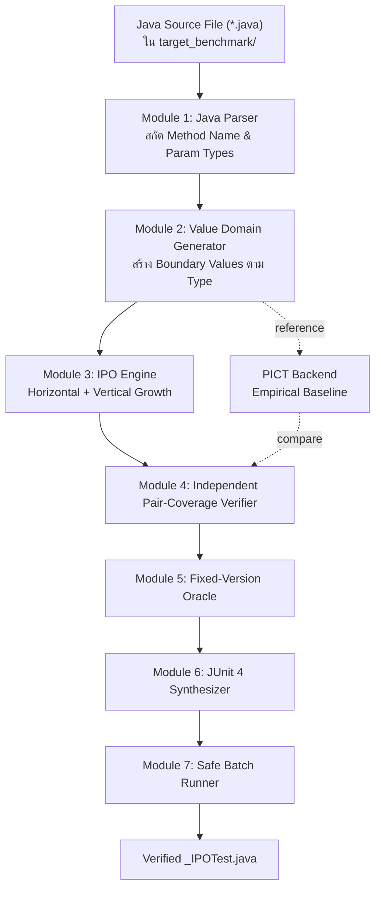
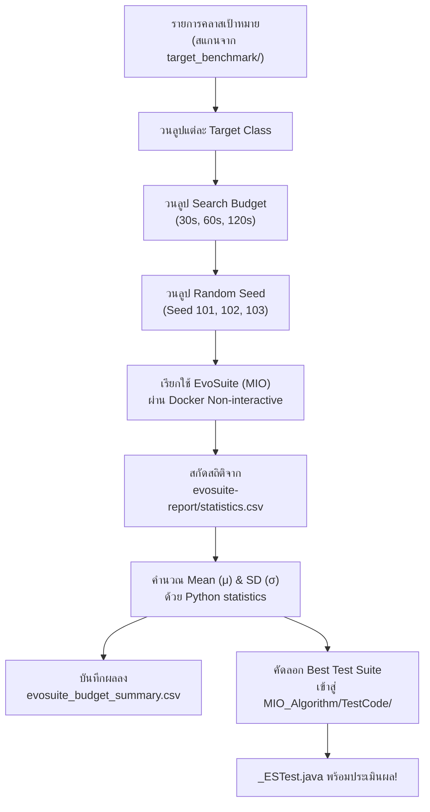
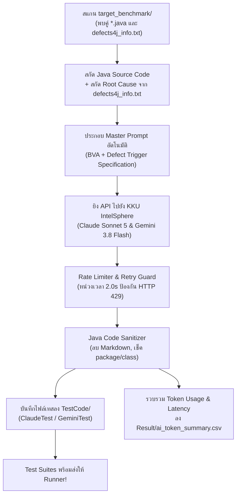
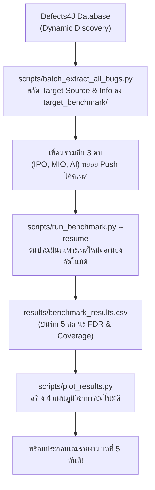
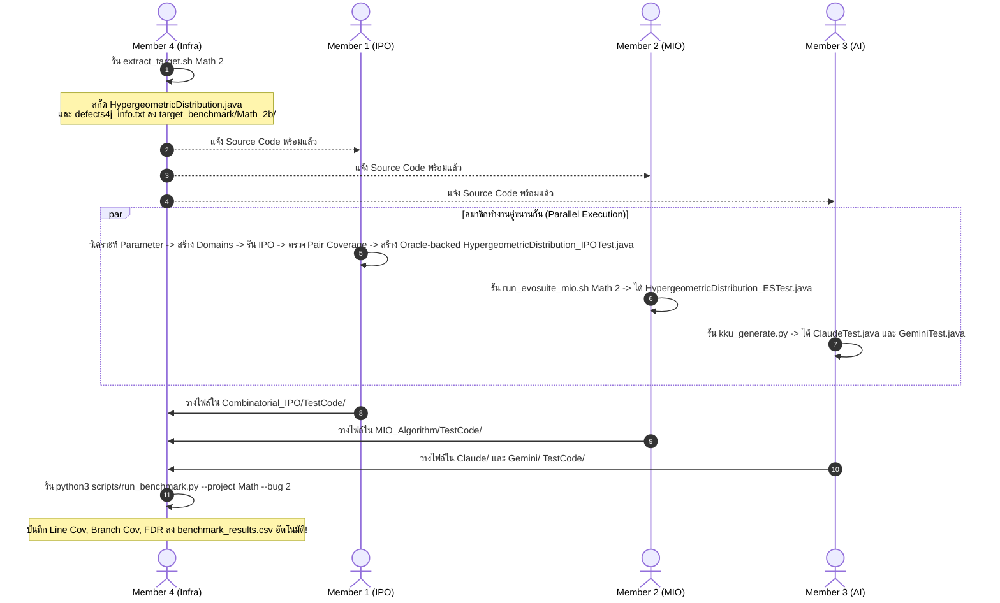

# 🚀 คู่มือปฏิบัติการฉบับสมบูรณ์สำหรับสมาชิกทุกคน (Team Master Action Plan)

**โครงการ:** CP353201 Software Quality Assurance (Final Submission)  
**ชื่อโครงงาน:** AI-Assisted Testing vs. Automatic Test Case Generation Algorithms: A Benchmark and Test Coverage Evaluation on Defects4J  
**อาจารย์ประจำวิชา:** ผศ.ดร.ชิตสุธา สุ่มเล็ก  
**ภาควิชาวิทยาการคอมพิวเตอร์ คณะวิทยาศาสตร์ มหาวิทยาลัยขอนแก่น**  

---

## 📌 สารบัญหลัก (Table of Contents)
1. [การเตรียมสภาพแวดล้อมและภาพรวมระบบ (Setup & System Architecture)](#1-การเตรียมสภาพแวดล้อมและภาพรวมระบบ-setup--system-architecture)
2. [กฎเหล็กกลางที่ทุกคนต้องปฏิบัติตาม (Universal Test Standards)](#2-กฎเหล็กกลางที่ทุกคนต้องปฏิบัติตาม-universal-test-standards)
   - [2.1 ขอบเขตการทดสอบและการวัดผล Coverage (Scope Specification)](#21-ขอบเขตการทดสอบและการวัดผล-coverage-scope-specification-defect-targeted-vs-project-wide)
   - [2.2 คลังข้อมูลมาตรฐาน 17 คลาสตัวแทนจาก 17 โปรเจกต์ (17-Project Representative Benchmark Suite)](#22-คลังข้อมูลมาตรฐาน-17-คลาสตัวแทนจาก-17-โปรเจกต์-the-17-project-representative-benchmark-suite)
3. [Member 1: นายปวริศช์ ประมวล (IPO / Combinatorial Specialist)](#3-member-1-นายปวริศช์-ประมวล-ipo--combinatorial-specialist)
   - [💡 วิธีสร้างระบบ Automated IPO Engine (พิมพ์เขียวสำหรับ Member 1)](#-วิธีสร้างระบบ-automated-ipo-engine-พิมพ์เขียวแบบละเอียดสำหรับ-member-1)
4. [Member 2: นายแทนคุณ พันธ์นิกุล (MIO / EvoSuite Specialist)](#4-member-2-นายแทนคุณ-พันธ์นิกุล-mio--evosuite-specialist)
   - [💡 วิธีสร้างระบบ Automated Batch Runner (พิมพ์เขียวสำหรับ Member 2)](#-วิธีสร้างระบบ-automated-batch-runner-สำหรับ-member-2-mio--evosuite-specialist)
5. [Member 3: นายธนภูมิ จันทรา (AI Prompt Engineer - Claude & Gemini)](#5-member-3-นายธนภูมิ-จันทรา-ai-prompt-engineer---claude--gemini)
   - [💡 วิธีสร้างระบบ Automated Batch Pipeline (พิมพ์เขียวสำหรับ Member 3)](#-วิธีสร้างระบบ-automated-batch-pipeline-สำหรับ-member-3-claude--gemini-ai)
6. [Member 4: นายศิฆรินทร์ อุปจันทร์ (Infra & Data Analysis Lead)](#6-member-4-นายศิฆรินทร์-อุปจันทร์-infra--data-analysis-lead)
   - [💡 วิธีทำระบบ Automated Continuous Benchmark & Auto-Plotting (สำหรับ Member 4)](#-วิธีทำระบบ-automated-continuous-benchmark--auto-plotting-สำหรับ-member-4)
7. [ตัวอย่างการทำงานร่วมกันแบบครบวงจร (End-to-End Walkthrough: กรณี Math-2)](#7-ตัวอย่างการทำงานร่วมกันแบบครบวงจร-end-to-end-walkthrough-กรณี-math-2)
8. [ระบบ Dynamic All-Bugs และการวัดผล Fault Detection Rate (FDR)](#8-ระบบ-dynamic-all-bugs-และการวัดผล-fault-detection-rate-fdr)
   - [8.3 ระเบียบวิธีการคำนวณ Fault Detection Rate (Bug-Level FDR)](#-83-ระเบียบวิธีการคำนวณ-fault-detection-rate-bug-level-fdr-formulation)
9. [แผนผังการเขียนเล่มรายงานฉบับสมบูรณ์ (Final Report Alignment)](#9-แผนผังการเขียนเล่มรายงานฉบับสมบูรณ์-final-report-alignment)
10. [Checklist ติดตามความคืบหน้าสู่การส่งมอบงาน (Progress Tracker)](#10-checklist-ติดตามความคืบหน้าสู่การส่งมอบงาน-progress-tracker)

---

## 1. การเตรียมสภาพแวดล้อมและภาพรวมระบบ (Setup & System Architecture)

### 💻 สิ่งที่สมาชิกแต่ละคนต้องมีบนเครื่องของตนเอง:
| สมาชิก | โปรแกรมที่ต้องมีบนเครื่อง | คำสั่งตรวจสอบความพร้อม |
| :--- | :--- | :--- |
| **Member 1 (IPO)** | Git, Python 3.8+, (หรือใช้ Docker ก็ได้) | `git --version` และ `python --version` |
| **Member 2 (MIO)** | Git, Docker Desktop (เพื่อรัน EvoSuite ใน Container) | `docker ps` |
| **Member 3 (AI)** | Git, Python 3.8+ (ยิง KKU API ได้จาก Windows/Mac ทันที) | `python --version` |
| **Member 4 (Infra)** | Git, Docker Desktop, Python 3.8+ | `docker ps` และ `python --version` |

### 🔄 เริ่มต้นทำงาน: ดึงโค้ดล่าสุดจาก GitHub
เปิด Terminal (PowerShell หรือ Bash) ที่โฟลเดอร์โปรเจกต์ แล้วสั่ง:
```bash
git pull origin main
```

### 📁 ผังโฟลเดอร์หลักของโปรเจกต์ (Project Directory Structure):
```text
ProjectSQA/
├── target_benchmark/          # โฟลเดอร์เก็บ Source Code และ Ground Truth ของบั๊กที่สกัดมา
│   └── Lang_1b/               # ตัวอย่าง: Source code และ defects4j_info.txt ของ Lang-1
├── Combinatorial_IPO/         # งานของ Member 1 (IPO Specialist)
│   ├── Models/                # เก็บไฟล์โมเดลพารามิเตอร์ (.txt) แยกตามคลาส
│   ├── Result_Round1/         # เก็บตาราง Combinations (.txt) และสถิติการลดรูป
│   └── TestCode/              # ปลายทางส่งมอบ: <Class>_IPOTest.java
├── MIO_Algorithm/             # งานของ Member 2 (MIO Specialist)
│   ├── Code/                  # สคริปต์อัตโนมัติ run_evosuite_mio.sh
│   ├── Result_Round1/         # เก็บสถิติ Mean +- SD (Search Budget 30s, 60s, 120s)
│   └── TestCode/              # ปลายทางส่งมอบ: <Class>_ESTest.java (Raw Suite ดิบ)
├── Claude-sonnet_5/           # งานของ Member 3 (AI Lead - Claude)
│   ├── Result/                # บันทึกสถิติ Token Usage และเวลาประมวลผล
│   └── TestCode/              # ปลายทางส่งมอบ: <Class>ClaudeTest.java
├── Gemini-3_8_flash/          # งานของ Member 3 (AI Lead - Gemini)
│   ├── Result/                # บันทึกสถิติ Token Usage และเวลาประมวลผล
│   └── TestCode/              # ปลายทางส่งมอบ: <Class>GeminiTest.java
├── scripts/                   # เครื่องมือกลางของ Member 4
│   ├── kku_generate.py        # สคริปต์ยิง KKU IntelSphere API
│   ├── run_benchmark.py       # Universal Runner วัด Coverage & Fault Detection
│   └── batch_extract_all_bugs.py # สคริปต์สกัดข้อมูลบั๊กทั้งหมดใน Defects4J
├── results/                   # โฟลเดอร์เก็บผลลัพธ์ Benchmark รวม
│   └── benchmark_results.csv  # ตารางผลลัพธ์รวมทุกโปรเจกต์
└── TEAM_WORKFLOW_GUIDE.md     # คู่มือแม่บทฉบับนี้
```

---

## 2. กฎเหล็กกลางที่ทุกคนต้องปฏิบัติตาม (Universal Test Standards)

เพื่อให้ Runner กลาง (`run_benchmark.py`) นำชุดทดสอบของทุกคนไปคอมไพล์และวัดผลบน Defects4J ได้โดยไม่พัง **โค้ดเทสของทุกคนต้องปฏิบัติตามกฎ 5 ข้อนี้อย่างเคร่งครัด:**

1. **ใช้ JUnit 4 เท่านั้น (ห้ามใช้ JUnit 5 / Jupiter เด็ดขาด):**
   - ✅ ถูกต้อง:
     ```java
     import org.junit.Test;
     import static org.junit.Assert.*;
     ```
   - ❌ ห้ามใช้: `import org.junit.jupiter.api.Test;` (Defects4J ไม่รองรับ จะเกิด Compile Error)
2. **ใส่ Timeout Guard ในทุก Method เสมอ:**
   - ✅ ถูกต้อง: `@Test(timeout = 4000)`
   - ❌ ห้ามเขียน `@Test` โดดๆ เพราะถ้าเทสติด Infinite Loop ระบบจะค้างทั้ง Pipeline
3. **บรรทัดแรกของไฟล์ต้องประกาศ Package ตรงกับ Target Class:**
   - ตัวอย่าง: หาก Target Class คือ `org.apache.commons.math3.distribution.HypergeometricDistribution`  
     บรรทัดที่ 1 ของไฟล์เทสต้องเป็น:
     ```java
     package org.apache.commons.math3.distribution;
     ```
4. **มาตรฐานการตั้งชื่อ Class และชื่อไฟล์ (Strict Naming Convention):**
   | เครื่องมือ | ชื่อไฟล์ Java (File Name) | การประกาศคลาส (Class Declaration) |
   | :--- | :--- | :--- |
   | **IPO** | `<TargetClass>_IPOTest.java` | `public class <TargetClass>_IPOTest` |
   | **MIO** | `<TargetClass>_ESTest.java` | `public class <TargetClass>_ESTest` |
   | **Claude** | `<TargetClass>ClaudeTest.java` | `public class <TargetClass>ClaudeTest` |
   | **Gemini** | `<TargetClass>GeminiTest.java` | `public class <TargetClass>GeminiTest` |
5. **ห้ามใช้ External Library ภายนอก:**
   - ห้าม import `org.mockito.*`, `org.assertj.*` หรือ dependencies อื่นที่ไม่ได้อยู่ในโปรเจกต์เป้าหมาย ให้ใช้ Standard Java และ Standard JUnit Assertions เท่านั้น

### 2.1 ขอบเขตการทดสอบและการวัดผล Coverage (Scope Specification: Defect-Targeted vs. Project-Wide)

> **🎯 ข้อตกลงทางวิชาการร่วมกัน:**  
> 1. **`classes.modified` = Defect-Targeted Classes (ไม่ใช่ทุกคลาสของทั้งโปรเจกต์):**  
>    Defects4J ระบุ `classes.modified` เพื่อบอกว่าในการแก้บั๊กนั้นๆ นักพัฒนาได้ทำการแก้ไข Source Code ที่คลาสใดบ้าง การทดลองของทีมเรามุ่งเน้น **"Defect-Targeted Test Generation"** เพื่อประเมินความสามารถในการสร้างชุดทดสอบเพื่อตรวจจับบั๊กและครอบคลุมตรรกะเฉพาะจุด ดังนั้น สมาชิกทุกคนจะสร้าง Test Suite เจาะจงเฉพาะคลาสที่ระบุใน `classes.modified` เท่านั้น **ไม่ต้องสร้างเทสให้กับทุกคลาสในโปรเจกต์** (เช่น Apache Commons Lang มีเป็นร้อยคลาส เราจะทำเฉพาะคลาสเป้าหมาย เช่น `NumberUtils` สำหรับ Lang-1)
>    ```text
>    Defects4J Bug (เช่น Lang-1)
>          ↓
>    classes.modified
>          ↓
>    Target Classes (เช่น NumberUtils)
>          ↓
>    IPO / MIO / Claude / Gemini Test Suites
>    ```
> 2. **Target Class Coverage Scope (ขอบเขตการวัด Coverage):**  
>    ค่า Line Coverage และ Branch Coverage ที่รายงานในตารางเปรียบเทียบหลักของงานวิจัยนี้ คือ **"Target Class Coverage"** (วัดเฉพาะบน Target Class ผ่าน flag `-c <target_class>` ใน Cobertura) ซึ่งเป็นตัวชี้วัดที่สะท้อนคุณภาพที่แท้จริงของแต่ละเทคนิคได้อย่างเป็นธรรม  
> 3. **การรายงาน Project-Wide Coverage (หากมี):**  
>    หากในรายงานหรือการนำเสนอต้องการกล่าวถึง Project-Wide Coverage จะต้องแยกรายงานเป็นตัวชี้วัดเสริม (Secondary Metric) และระบุขอบเขตให้ชัดเจนในบทที่ 5 ว่าค่า Project-wide coverage ย่อมมีค่าต่ำกว่า Target Class Coverage เสมอ เนื่องจากเราไม่ได้กระจายการสร้างชุดทดสอบไปยังคลาสอื่นๆ ที่ไม่เกี่ยวข้องกับ Defect

### 2.2 คลังข้อมูลมาตรฐาน 17 คลาสตัวแทนจาก 17 โปรเจกต์ (The 17-Project Representative Benchmark Suite)

> **🎯 Single Source of Truth:** ไฟล์คอนฟิกกลาง [`target_benchmark/catalog_17_projects.json`](target_benchmark/catalog_17_projects.json)  
> **📦 สถานะคลัง Source Code:** Member 4 ได้ทำการ Checkout และสกัดไฟล์ Java Source Code พร้อม Ground Truth (`defects4j_info.txt`) ของทั้ง 17 คลาสมาใส่ไว้ใน [`target_benchmark/`](target_benchmark/) ครบถ้วนแล้ว 100% เพื่อนทุกคนสามารถสั่ง `git pull` แล้วนำไปใช้งานได้ทันที!

Defects4J v2.0.0 ประกอบด้วย 17 โปรเจกต์ รวม 835 บั๊ก ทีมของเราเลือกใช้ยุทธศาสตร์ **"1 คลาสตัวแทน ต่อ 1 โปรเจกต์" (The Golden 17 Benchmark)** เพื่อให้การประเมินผลมีความหลากหลายครอบคลุมครบทุกโดเมนซอฟต์แวร์ และทุกคนในทีมสามารถทำการทดลองเสร็จสิ้นได้จริงตามกำหนดเวลา:

| # | Project ID | โดเมนของซอฟต์แวร์ | Bug ID | คลาสตัวแทนเป้าหมาย (Target Class Under Test) | Ground Truth Trigger Test | โฟลเดอร์ใน `target_benchmark/` |
| :-: | :--- | :--- | :-: | :--- | :--- | :--- |
| 1 | **Chart** | Graphic & Chart Rendering | `1b` | `org.jfree.chart.renderer.category.AbstractCategoryItemRenderer` | `AbstractCategoryItemRendererTests::test2947660` | `Chart_1b/` |
| 2 | **Cli** | Command-line Argument Parser | `1b` | `org.apache.commons.cli.CommandLine` | `CommandLineTest::testBuilder` | `Cli_1b/` |
| 3 | **Closure** | Compiler AST Optimization | `1b` | `com.google.javascript.jscomp.RemoveUnusedVars` | `RemoveUnusedVarsTest::testIssue168b` | `Closure_1b/` |
| 4 | **Codec** | Phonetic & String Encoding | `1b` | `org.apache.commons.codec.language.Soundex` | `SoundexTest::testLocaleIndependence` | `Codec_1b/` |
| 5 | **Collections** | Data Structures & Collections | `25b` | `org.apache.commons.collections4.IteratorUtils` | `IteratorUtilsTest::testCollIterator` | `Collections_25b/` |
| 6 | **Compress** | Binary Archive & Compression | `1b` | `org.apache.commons.compress.archivers.cpio.CpioArchiveOutputStream` | `CpioTestCase::testCpioUnarchive` | `Compress_1b/` |
| 7 | **Csv** | Delimited Text Parser & Buffer | `1b` | `org.apache.commons.csv.ExtendedBufferedReader` | `CSVParserTest::testBackslashEscaping` | `Csv_1b/` |
| 8 | **Gson** | JSON Serialization & Reflection | `1b` | `com.google.gson.TypeInfoFactory` | `TypeHierarchyAdapterTest::testTypeHierarchy` | `Gson_1b/` |
| 9 | **JacksonCore** | High-Speed JSON Tokenizer | `1b` | `com.fasterxml.jackson.core.io.NumberInput` | `TestNumberInput::testParseBigDecimal` | `JacksonCore_1b/` |
| 10 | **JacksonDatabind**| Object Mapping & Introspection | `1b` | `com.fasterxml.jackson.databind.ser.BeanPropertyWriter` | `TestTypeFactory::testNullType` | `JacksonDatabind_1b/` |
| 11 | **JacksonXml** | Streaming XML Data Binding | `1b` | `com.fasterxml.jackson.dataformat.xml.deser.FromXmlParser` | `TestXmlTokenStream::testRootAttributes` | `JacksonXml_1b/` |
| 12 | **Jsoup** | HTML Parsing & DOM Tree | `1b` | `org.jsoup.nodes.Document` | `ElementTest::testSetHtmlTitle` | `Jsoup_1b/` |
| 13 | **JxPath** | XML XPath Query Engine | `1b` | `org.apache.commons.jxpath.ri.model.dom.DOMNodePointer` | `DOMModelTest::testAxisChild` | `JxPath_1b/` |
| 14 | **Lang** | Java Core Utilities & Parsing | `1b` | `org.apache.commons.lang3.math.NumberUtils` | `NumberUtilsTest::testLang747` | `Lang_1b/` |
| 15 | **Math** | Numerical & Probability Math | `2b` | `org.apache.commons.math3.distribution.HypergeometricDistribution` | `HypergeometricDistributionTest::testMath1021` | `Math_2b/` |
| 16 | **Mockito** | Dynamic Mocking Framework | `1b` | `org.mockito.internal.invocation.InvocationMatcher` | `UsingVarargsTest::shouldMatchEasilyEmptyVararg` | `Mockito_1b/` |
| 17 | **Time** | Date/Time Calculation Engine | `1b` | `org.joda.time.Partial` | `TestPartial_Basics::testCompareTo` | `Time_1b/` |

---

## 3. 🧑‍💻 Member 1: นายปวริศช์ ประมวล (IPO / Combinatorial Specialist)

**รหัสนักศึกษา:** 673380278-9  
**บทบาท:** พัฒนาและประยุกต์ใช้ขั้นตอนวิธี **In-Parameter-Order (IPO / IPOG Algorithm)** สำหรับสร้าง Combinatorial Pairwise Test Suite โดย implement ขั้นตอน **Horizontal Growth** และ **Vertical Growth** ในโค้ดของโครงการ แล้วใช้ **Microsoft PICT (Pairwise Independent Combinatorial Testing v3.7+)** เป็นเครื่องมืออ้างอิงแยกต่างหากสำหรับสร้าง empirical baseline และช่วยตรวจสอบผล

> **🎓 ข้อกำหนดความถูกต้องทางวิชาการ (Academic Distinction: IPO vs. PICT):**  
> - **IPO (In-Parameter-Order):** คือขั้นตอนวิธีเชิงทฤษฎี (Algorithm) ที่คิดค้นโดย Yu Lei et al. สำหรับ Combinatorial Testing โดยขยายคู่ทดสอบแบบ Horizontal Growth และ Vertical Growth ตามลำดับพารามิเตอร์  
> - **Microsoft PICT:** คือเครื่องมืออุตสาหกรรม (CLI Tool) พัฒนาโดย Microsoft ซึ่งใช้ Combinatorial Heuristics ช่วยสร้างคู่ทดสอบ Pairwise อย่างรวดเร็ว  
> - **ในงานวิจัยนี้:** ผลที่รายงานในฐานะ **IPO** ต้องสร้างจาก IPO implementation ของทีมเท่านั้น ส่วนผลจาก **PICT** ต้องระบุว่าเป็น `PICT reference baseline` ห้ามสรุปว่า *PICT = IPO* หรือเรียก PICT-generated combinations ว่าเป็นผลจาก IPO

**สถานะรอบนำร่อง Lang-1:** ชุด 48 combinations ของ `NumberUtils.createNumber(String)` ที่มีอยู่เดิมสร้างด้วย Microsoft PICT และผ่านการเก็บ oracle/ตรวจบน Lang-1f แล้ว จึงเก็บเป็น **PICT pilot baseline** ไม่ใช่ผล IPO รอบสุดท้าย เมื่อ IPO implementation พร้อม ต้องสร้าง combinations และ oracle ชุดใหม่ก่อนส่งผลในชื่อ IPO

**หลักฐาน provenance ที่ต้องบันทึกทุกการทดลอง:**

1. `generation_backend`: `ipo` หรือ `pict`
2. `strength`: ค่า interaction strength เช่น `2`
3. exact Java method signature
4. จำนวน Cartesian combinations, generated combinations และ reduction percentage
5. ผลการตรวจ pair coverage
6. model, concrete inputs, oracle และ generated JUnit ที่เชื่อมโยงกันได้

**ตำแหน่งผลลัพธ์หลัก:**

1. IPO implementation: `Combinatorial_IPO/Code/algorithm/ipo.py`
2. PICT adapter: `Combinatorial_IPO/Code/backends/pict_backend.py`
3. PICT pilot/reference artifacts: `Combinatorial_IPO/baselines/pict/<Project>_<BugID>b/`
4. IPO models/results: `Combinatorial_IPO/Models/` และ `Combinatorial_IPO/Result_Round1/`
5. IPO JUnit 4 ที่ผ่าน fixed-version verification: `Combinatorial_IPO/TestCode/<Project>_<BugID>b/<Class>_IPOTest.java`

---

### 🛠️ คู่มือขั้นตอนการทำงานอย่างละเอียด (Generic IPO Engineering):

> **⚠️ ข้อควรระวัง:** `Prefix, ValueType, Suffix, Length` ในรอบนำร่องเป็น semantic factors เฉพาะ `NumberUtils.createNumber(String)` ห้ามนำไปใช้กับ method อื่นโดยอัตโนมัติ แต่ละ method ต้องใช้ type domains หรือ semantic override ที่อธิบายเหตุผลและทำซ้ำได้

#### ขั้นที่ 1: ตรวจสอบ Method Signature ใน Target Class
เปิดดูไฟล์ซอร์สโค้ดใน `target_benchmark/<Project>_<BugID>b/<Class>.java` เพื่อดูว่า Constructor หรือ Method หลักรับ Input อะไรบ้าง โดยแบ่งเป็น 3 กลุ่มพารามิเตอร์:
* **กลุ่ม A: Numeric Parameters (ตัวเลข int, double, float):**
  - แบ่งพาร์ทิชัน: ค่าลบ (`Negative`), ค่าศูนย์ (`Zero`), ค่าบวกปกติ (`PositiveValid`), ค่าขอบเขตสูงสุด (`MaxBound`), และค่าเกินขอบเขต (`Overflow`)
* **กลุ่ม B: String / Text Parameters (ข้อความ):**
  - แบ่งพาร์ทิชัน: `Null`, `Empty`, `Whitespace`, `SingleChar`, `AlphaNumeric`, `SpecialCharacters`, `LongString`
* **กลุ่ม C: Object / Collection / State Parameters:**
  - แบ่งพาร์ทิชัน: `NullRef`, `EmptyCollection`, `SingleItem`, `MultipleItems`, `InvalidState`

#### ขั้นที่ 2: สร้าง Factor Domains และ Concrete-Value Mapping

ระบบต้องสร้าง factor domains จาก exact method signature โดยอัตโนมัติเป็นหลัก และใช้ semantic override เฉพาะกรณีที่ generic type domain ไม่สามารถแทน input semantics ได้ ตัวอย่างโมเดลเชิงแนวคิดสำหรับ `HypergeometricDistribution`:
```text
# Combinatorial_IPO/Models/Math_HypergeometricDistribution_model.txt
populationSize:      Negative, Zero, SmallValid, LargeValid, MaxInt
numberOfSuccesses:   Negative, Zero, LessThanPop, EqualPop, GreaterThanPop
sampleSize:          Negative, Zero, ValidSample, EqualPop, ExceedPop

```

Constraint handling ยังไม่ถือว่ารองรับจนกว่าจะมี implementation และ tests โดยตรง หากพบ model ที่ต้องใช้ constraints ให้รายงาน `UNSUPPORTED` แทนการสร้างค่าที่อาจผิดความหมาย

#### ขั้นที่ 3: สร้าง 2-Way Combinations ด้วย IPO Implementation

`Combinatorial_IPO/Code/algorithm/ipo.py` ต้องเริ่มจาก Cartesian product ของสอง factors แรก จากนั้นเพิ่ม factor ตามลำดับด้วย Horizontal Growth และเติม uncovered pairs ด้วย Vertical Growth ต้องใช้ deterministic tie-breaking เพื่อให้รันซ้ำแล้วได้ผลเหมือนเดิม

#### ขั้นที่ 4: ตรวจ Pair Coverage แบบอิสระ

นำผล IPO ไปตรวจด้วย verifier ที่ไม่ขึ้นกับ generator โดยทุก value pair ของทุก factor pair ต้องปรากฏอย่างน้อยหนึ่งครั้ง หากไม่ครบให้หยุดและห้ามสร้าง TestCode สำหรับส่งมอบ ผล PICT อาจใช้เป็น reference เพิ่มเติมได้ แต่การที่ PICT ผ่านไม่แทนการตรวจผล IPO

#### ขั้นที่ 5: แปลง Abstract Factors เป็น Concrete Java Inputs

generic domains สามารถใช้ Java expressions ได้โดยตรง ส่วน semantic factors ต้อง materialize เป็น arguments ที่ตรง exact signature ตรวจและรายงาน duplicate concrete inputs แยกจากจำนวน abstract combinations

#### ขั้นที่ 6: เก็บ Oracle จาก Defects4J Fixed Version

ผลลัพธ์ที่คาดหวังและ exception type ต้องเก็บจาก `<Project>-<BugID>f` ใน temporary checkout แล้วลบ checkout หลังใช้งาน Oracle ต้องผูกกับ arguments และลำดับ combination อย่างตรวจสอบย้อนกลับได้

#### ขั้นที่ 7: สร้างและตรวจ JUnit 4 Test Suite

สร้าง JUnit 4 ที่มี `@Test(timeout = 4000)` ทุก test และ assertion จาก fixed-version oracle จากนั้น compile/run บน fixed version ให้ผ่านทั้งหมดก่อนวางใน `TestCode/` ห้ามใช้การ `catch Exception` แบบกว้างเพื่อทำให้ test ผ่านโดยไม่มี oracle

#### ขั้นที่ 8: บันทึกสถิติสำหรับรายงาน

$$\text{Reduction Rate (\%)} = \left(1 - \frac{N_{\text{generated}}}{N_{\text{cartesian}}}\right) \times 100\%$$

ต้องรายงาน backend, factor count, Cartesian count, generated count, unique concrete input count, reduction percentage, pair-coverage result, generation time และ fixed-version verification result

---

### 💡 วิธีสร้างระบบ Automated IPO Engine (พิมพ์เขียวแบบละเอียดสำหรับ Member 1)

> **🎯 เป้าหมาย:** สร้างระบบที่แปลง Java Source เป็น oracle-backed JUnit 4 ผ่าน IPO implementation ของทีมโดยอัตโนมัติ พร้อม provenance และ failure isolation สำหรับขยายไปยัง Defects4J targets หลายรายการ โดยไม่ต้องสร้าง model ด้วยมือทีละ method



#### รายละเอียดระบบทั้ง 7 โมดูล (Step-by-Step Implementation Guide):

1. **โมดูลที่ 1: Java Method & Parameter Analyzer (`Combinatorial_IPO/Code/analyzer/java_parser.py`)**
   - สกัด package, class, modifiers, return type และ parameter name/type จาก source
   - ระบุ method ด้วย exact signature เพื่อแยก overload และเลือกเฉพาะขอบเขตที่ pipeline รองรับ
   - parser ปัจจุบันเป็น lightweight regex analyzer; signature ที่ซับซ้อนต้องถูก skip พร้อมเหตุผลแทนการเดา

2. **โมดูลที่ 2: Value Domain Generator (`Combinatorial_IPO/Code/domain/`)**
   - `value_generator.py` สร้าง nominal/boundary values สำหรับ primitive, wrapper และ String types ที่ประกาศว่ารองรับ
   - `semantic_overrides.py` เก็บ factor model/materializer เฉพาะ exact class-method signature
   - domain ต้องมีค่าที่เข้า success path, invalid path และ boundary ที่เกี่ยวข้อง ไม่ใช้ `null` เป็น fallback เงียบ ๆ สำหรับ object ที่ไม่รู้วิธีสร้าง
   - unknown object, collection, constructor หรือ instance-state requirement ให้รายงาน `UNSUPPORTED` จนกว่าจะมี strategy และ tests

3. **โมดูลที่ 3: IPO Engine และ PICT Reference Backend (ต้องแยก implementation)**
   - `Combinatorial_IPO/Code/algorithm/ipo.py`: IPO 2-way ที่ทีมพัฒนาเอง ต้องมี Horizontal Growth, Vertical Growth และ deterministic tie-breaking
   - `Combinatorial_IPO/Code/backends/pict_backend.py`: adapter สำหรับเรียก Microsoft PICT เพื่อสร้าง reference baseline เท่านั้น
   - ทั้งสอง backend รับ factor domains รูปแบบเดียวกัน แต่ต้องบันทึก `generation_backend` แยกกัน และห้ามใช้ผล PICT เป็นผล IPO
   - ไม่ต้องบังคับให้ IPO กับ PICT ได้แถวเหมือนกัน ให้เปรียบเทียบ pair coverage, suite size, reduction และ generation time

4. **โมดูลที่ 4: Independent Pair-Coverage Verifier (`Combinatorial_IPO/Code/verification/pair_coverage.py`)**
   - คำนวณ expected pairs จาก factor domains และ observed pairs จาก generated rows
   - รายงาน missing pairs และปฏิเสธแถวที่มีค่าอยู่นอก domain
   - ใช้ verifier เดียวกันตรวจทั้ง IPO และ PICT reference โดยไม่พึ่ง backend ใด

5. **โมดูลที่ 5: Fixed-Version Oracle (`Combinatorial_IPO/Code/oracle/`)**
   - checkout `<Project>-<BugID>f` ลง temporary directory เพื่อรัน concrete inputs
   - บันทึก return value หรือ exact exception type พร้อม arguments และ case ID
   - ลบ temporary checkout เมื่อเสร็จและเก็บ oracle JSON สำหรับทำซ้ำ

6. **โมดูลที่ 6: Oracle-Backed JUnit 4 Synthesizer (`Combinatorial_IPO/Code/generator/junit_generator.py`)**
   - สร้างชื่อ test ไม่ซ้ำแม้ method มี overload และเรียก exact signature ที่เลือก
   - ทุก test ต้องมี `@Test(timeout = 4000)` และ assertion จาก fixed-version oracle
   - ห้ามกลืน exception แบบกว้างเพื่อทำให้ test ผ่าน

7. **โมดูลที่ 7: Safe Batch Runner (`Combinatorial_IPO/Code/runner/run_ipo_batch.py`)**
   - รองรับ project, bug และ exact-signature filters ก่อนเปิด all-target batch
   - ใช้ IPO เป็น generation backend หลัก ส่วน PICT ใช้เฉพาะโหมด reference
   - failure ของ target หนึ่งต้องไม่หยุดทั้ง batch และต้องบันทึกสถานะ/สาเหตุ เช่น `UNSUPPORTED`, `GENERATION_ERROR`, `ORACLE_ERROR`, `VERIFY_ERROR`
   - เขียน TestCode สำหรับส่งมอบเฉพาะ target ที่ pair coverage ครบ มี oracle ครบ และผ่าน fixed-version verification
   - ห้าม overwrite ชุดที่ผ่านแล้วด้วยผลทดลองหรือผลที่ยังไม่มี oracle

#### เกณฑ์ก่อนเปิด All-Target Batch

ห้ามวนทุก target ทันทีหลังผ่านเพียง Lang-1 ต้องผ่าน representative methods หลายชนิดก่อน ได้แก่ primitive หลาย parameters, String ร่วมกับ primitive, floating point, boolean และ method จาก target classes/projects อื่น พร้อมยืนยันว่า unsupported signatures ถูก skip อย่างปลอดภัย

อย่างน้อยทุกกรณีที่ประกาศว่ารองรับต้องผ่านเงื่อนไขต่อไปนี้:

1. exact signature selection ถูกต้องแม้มี overload
2. IPO รันซ้ำแล้วได้ผลเหมือนเดิม
3. independent pair coverage ครบ 100%
4. concrete inputs ไม่มี duplicate ที่ไม่ได้อธิบาย
5. oracle ครบทุก combination
6. JUnit 4 compile และผ่านทั้งหมดบน fixed version
7. ไม่มีการรัน buggy version, coverage หรือ FDR ในขั้น Member 1

**ขอบเขตข้อมูล:** เป้าหมายสุดท้ายต้องสอดคล้องกับรายการ Defects4J targets ที่ทีมใช้ในการทดลอง และต้องบันทึก inclusion, exclusion หรือ unsupported status ครบทุกรายการ ห้ามรายงานเฉพาะกรณีที่สำเร็จแล้วตัด failure ออกจากผลรวม

**ลำดับการพัฒนา:** เก็บ Lang-1 PICT pilot เป็น baseline -> แยก PICT adapter ออกจาก `algorithm/ipo.py` -> พัฒนาและทดสอบ IPO Horizontal/Vertical Growth -> รัน IPO กับ Lang-1 model เดิม -> เก็บ oracle/ตรวจ fixed version -> ทดลอง representative methods -> เปิด batch เมื่อผ่าน readiness gates เท่านั้น

#### 🚀 การสั่งรัน IPO Batch บนชุด 17 คลาสตัวแทน:
เมื่อโค้ดของ Member 1 ผ่าน Readiness Gates ข้างต้นเรียบร้อยแล้ว ให้สั่งรัน `run_ipo_batch.py` โดยวนลูปอ่านจาก [`target_benchmark/catalog_17_projects.json`](target_benchmark/catalog_17_projects.json) หรือโฟลเดอร์ใน `target_benchmark/`:
```bash
# รันจาก repository root เมื่อ readiness check ผ่านแล้วเท่านั้น:
python Combinatorial_IPO/Code/runner/run_ipo_batch.py --target-root target_benchmark --catalog target_benchmark/catalog_17_projects.json --collect-oracles --verify-suites
```
*ระบบจะอ่านเฉพาะ source ที่ระบุใน catalog, สร้าง Parameter Model, รัน Horizontal/Vertical Growth และสกัด Fixed Version Oracle แยกต่อ method จากนั้นจึงเซฟ JUnit 4 ที่ผ่าน fixed-version verification ลงใน `Combinatorial_IPO/TestCode/<Project>_<BugID>b/<Class>_<method_id>_IPOTest.java` ส่วน catalog mismatch, unsupported signature หรือ method ที่ล้มเหลวจะถูกบันทึกสถานะและข้ามโดยไม่หยุดทั้ง batch*

---

## 4. 🧑‍💻 Member 2: นายแทนคุณ พันธ์นิกุล (MIO / EvoSuite Specialist)

**รหัสนักศึกษา:** 673380301-0  
**บทบาท:** ใช้เครื่องมือ **EvoSuite (MIO Algorithm)** ในการค้นหาชุดทดสอบอัตโนมัติ (Search-Based Software Testing), ทำการทดลองปรับ Search Budget (30s, 60s, 120s), และเก็บสถิติ **Mean ± SD** ตามข้อกำหนดรายงาน 1.7

### 📋 สิ่งที่คุณต้องส่งมอบ (Deliverables ต่อ 1 คลาส):
1. ไฟล์ Java Test Suite ดิบ: `MIO_Algorithm/TestCode/<Class>_ESTest.java` (และ `_scaffolding.java`)
2. ตารางบันทึกสถิติ Mean ± SD ของ Line และ Branch Coverage ของ Search Budget ทั้ง 3 ระดับ
3. เอกสารวิเคราะห์เชิงเปรียบเทียบใน `MIO_Algorithm/Result_Round1/evosuite_budget_analysis.md`

---

### 🛠️ คู่มือขั้นตอนการทำงานอย่างละเอียด:

#### ขั้นที่ 1: สั่งรันอัตโนมัติผ่าน Docker ด้วยคำสั่งเดียว
Member 4 ได้เตรียมสคริปต์อัตโนมัติ [`MIO_Algorithm/Code/run_evosuite_mio.sh`](MIO_Algorithm/Code/run_evosuite_mio.sh) ไว้ให้แล้ว คุณสามารถสั่งรันจาก PowerShell บนเครื่องตัวเองได้ทันที:
```bash
# รูปแบบคำสั่ง:
# docker exec -it defects4j_sqa /workspace/MIO_Algorithm/Code/run_evosuite_mio.sh [Project] [BugID] [TargetClass] [BudgetInSeconds]

# ตัวอย่างการรันคลาส HypergeometricDistribution ใน Math-2 ที่ Budget 60 วินาที:
docker exec -it defects4j_sqa /workspace/MIO_Algorithm/Code/run_evosuite_mio.sh Math 2 org.apache.commons.math3.distribution.HypergeometricDistribution 60
```
- สคริปต์จะทำการ Checkout โค้ด, สกัด Compilation Classpath, เรียกใช้ Java 8 OpenJDK, และรัน EvoSuite ด้วย MIO Algorithm พร้อมเซฟไฟล์เทสเข้า `MIO_Algorithm/TestCode/` ให้โดยอัตโนมัติ

#### ขั้นที่ 2: การทดลองปรับ Search Budget และเก็บค่าสถิติ Mean ± SD (ข้อ 1.7)
เนื่องจากขั้นตอนวิธี MIO เป็น Random / Evolutionary Search ค่าผลลัพธ์จะผันแปรตาม Random Seed คุณต้องรันการทดลองเพื่อเก็บสถิติทางวิชาการ:
1. **ทดลอง 3 ค่า Budget:** `30 วินาที`, `60 วินาที`, และ `120 วินาที`
2. **ในแต่ละระดับ Budget ให้สั่งรัน 3 รอบ โดยเปลี่ยนค่า `-seed`:**
   ```bash
   docker exec -it defects4j_sqa bash
   
   # ตัวอย่างรัน Budget 30s รอบที่ 1 ถึง 3:
   /usr/lib/jvm/java-8-openjdk-amd64/bin/java -jar /opt/evosuite/evosuite-1.0.6.jar \
     -class org.apache.commons.math3.distribution.HypergeometricDistribution \
     -projectCP $(defects4j export -p cp.compile) \
     -Dalgorithm=MIO -Dsearch_budget=30 -seed 101 -Dreport_dir=/workspace/MIO_Algorithm/Result_Round1/math2_30s_s1
   ```
3. บันทึกผล Coverage ของแต่ละรอบลงในตาราง:
   | Search Budget | รอบที่ 1 | รอบที่ 2 | รอบที่ 3 | ค่าเฉลี่ย ($\mu$) | ส่วนเบี่ยงเบนมาตรฐาน ($\sigma$) |
   | :---: | :---: | :---: | :---: | :---: | :---: |
   | **30 วินาที** | 52.4% | 51.8% | 53.2% | **52.47%** | **± 0.70%** |
   | **60 วินาที** | 58.1% | 59.4% | 58.6% | **58.70%** | **± 0.65%** |
   | **120 วินาที** | 61.2% | 60.9% | 61.8% | **61.30%** | **± 0.46%** |

#### ขั้นที่ 3: กฎเหล็กความซื่อตรงทางวิชาการ (Fair Benchmark Policy)
> **⚖️ ห้ามแก้ไข Generated Test ด้วยมือโดยเด็ดขาด:**  
> ในการวิจัย Benchmarking Study หากเราเข้าไปแก้ Assertions หรือลบโค้ดแปลกๆ ที่ EvoSuite เจนได้ ผลการทดลองจะกลายเป็นผลงานของคน ไม่ใช่ผลงานของ Algorithm (สูญเสียความน่าเชื่อถือ)  
> **สิ่งที่ต้องทำ:**
> 1. เลือกชุดเทสรอบที่ดีที่สุดที่ EvoSuite เจนได้มาวางไว้ที่ `MIO_Algorithm/TestCode/<Class>_ESTest.java`
> 2. ปล่อยให้ Runner นำไปรันตามจริง หากเกิด `COMPILE_ERROR` หรือ `TIMEOUT` ให้ระบบบันทึกสถานะนั้นตรงๆ เพื่อนำข้อจำกัดนี้ไปเขียนอภิปรายในบทที่ 5

---

### 💡 วิธีสร้างระบบ Automated Batch Runner (พิมพ์เขียวสำหรับ Member 2)

> **🎯 เป้าหมาย:** ตามเกณฑ์งานวิจัยข้อ 1.7 เราต้องทดสอบ Search Budget 3 ระดับ (30s, 60s, 120s) และแต่ละระดับต้องทำซ้ำ 3 Seed (เช่น 101, 102, 103) รวมเป็น **9 การทดลองต่อ 1 คลาส!**  
> หากมี 10-20 คลาส จะต้องรัน 90–180 ครั้ง การพิมพ์คำสั่งด้วยมือใน Terminal ทีละบรรทัดไม่สามารถทำได้ทันกำหนดส่ง Member 2 จึงควรสร้าง **Automated Batch Script (`MIO_Algorithm/Code/batch_evosuite.py`)** เพื่อสั่งรันการทดลองทั้งหมดและคำนวณค่าทางสถิติให้อัตโนมัติ:



#### รายละเอียดการเขียนสคริปต์อัตโนมัติ (Step-by-Step Implementation Guide):

1. **ส่วนที่ 1: การสแกนเป้าหมายอัตโนมัติ (Target Discovery ผ่าน Single Source of Truth):**
   - ให้สคริปต์อ่านรายการ Target Classes โดยตรงจาก [`target_benchmark/catalog_17_projects.json`](target_benchmark/catalog_17_projects.json) ซึ่งมีข้อมูลครบทั้ง 17 โปรเจกต์:
   ```python
   import json, os

   def get_target_classes():
       catalog_path = "target_benchmark/catalog_17_projects.json"
       with open(catalog_path, "r", encoding="utf-8") as f:
           catalog = json.load(f)
       
       targets = []
       for item in catalog:
           targets.append({
               "project": item["project"],
               "bug": str(item["bug_id"]),
               "class": item["simple_name"],
               "fqcn": item["target_class"],
               "dir": item["dir"]
           })
       return targets
   ```

2. **ส่วนที่ 2: การสั่งรัน EvoSuite แบบ Non-interactive ผ่าน Docker:**
   - ใช้ `subprocess.run` สั่งรันคำสั่งภายในคอนเทนเนอร์ `defects4j_sqa` โดยระบุ parameters ให้ครบ:
   ```python
   import subprocess

   def run_evosuite_single(project, bug, fqcn, budget, seed, report_dir):
       cmd = [
           "docker", "exec", "defects4j_sqa", "bash", "-c",
           f"""
           cd /tmp && rm -rf eval_{project}_{bug} && defects4j checkout -p {project} -v {bug}b -w /tmp/eval_{project}_{bug}
           cd /tmp/eval_{project}_{bug} && defects4j compile
           CP=$(defects4j export -p cp.compile)
           /usr/lib/jvm/java-8-openjdk-amd64/bin/java -jar /opt/evosuite/evosuite-1.0.6.jar \\
             -class {fqcn} \\
             -projectCP $CP \\
             -Dalgorithm=MIO \\
             -Dsearch_budget={budget} \\
             -seed {seed} \\
             -Dreport_dir={report_dir} \\
             -Dtest_dir=/workspace/MIO_Algorithm/TestCode
           """
       ]
       subprocess.run(cmd, check=True)
   ```

3. **ส่วนที่ 3: การสกัดสถิติจาก `statistics.csv` และคำนวณ Mean ± SD:**
   - EvoSuite จะบันทึกไฟล์สถิติไว้ใน `report_dir/statistics.csv` เสมอ ให้เขียนฟังก์ชันอ่านค่า:
   ```python
   import csv, statistics

   def parse_evosuite_stats(csv_path):
       with open(csv_path, 'r', encoding='utf-8') as f:
           reader = csv.DictReader(f)
           for row in reader:
               line_cov = float(row.get('LineCoverage', 0.0)) * 100.0
               branch_cov = float(row.get('BranchCoverage', 0.0)) * 100.0
               return line_cov, branch_cov
       return 0.0, 0.0

   def calculate_mean_sd(values):
       mean = statistics.mean(values)
       sd = statistics.stdev(values) if len(values) > 1 else 0.0
       return mean, sd
   ```

4. **ส่วนที่ 4: การจัดเก็บชุดทดสอบที่ดีที่สุดและบันทึกตารางสรุป:**
   - เลือกรอบที่ได้ผลลัพธ์ Coverage สูงสุด นำไฟล์ `<Class>_ESTest.java` และ `<Class>_ESTest_scaffolding.java` มาตั้งชื่อให้ถูกต้องและวางไว้ที่ `MIO_Algorithm/TestCode/`
   - เซฟตารางสถิติสรุปภาพรวมทั้งหมดลงใน `MIO_Algorithm/Result_Round1/evosuite_budget_summary.csv` สำหรับนำไปใส่ตารางข้อ 1.7 ในเล่มรายงาน!

> **⚠️ ข้อควรจำสำคัญสำหรับ Member 2:**
> - ต้องรันด้วย **Java 8** เสมอ (`/usr/lib/jvm/java-8-openjdk-amd64/bin/java`) เพราะ EvoSuite 1.0.6 เข้ากันได้ดีที่สุดกับ Java 8 Bytecode
> - ห้ามลืมไฟล์ `_scaffolding.java` เด็ดขาด เพราะถ้าขาดไฟล์นี้ Runner จะคอมไพล์เทสไม่ผ่าน (`COMPILE_ERROR`)
> - ยึดมั่นใน **Fair Benchmark Policy**: หากเทสที่ได้มี Error ให้ปล่อยไว้ตามจริง ไม่แก้ไขด้วยมือ เพื่อรักษาความน่าเชื่อถือของการวิจัย

---

## 5. 🧑‍💻 Member 3: นายธนภูมิ จันทรา (AI Prompt Engineer - Claude & Gemini)

**รหัสนักศึกษา:** 673380272-1  
**บทบาท:** สั่งการ **Claude Sonnet 5** และ **Gemini 3.8 Flash** ผ่าน **KKU IntelSphere API** (`gen.ai.kku.ac.th`) เพื่อสร้างชุดทดสอบคุณภาพสูง พร้อมบันทึก **Token Usage**, **Cost**, และ **Generation Time**

### 📋 สิ่งที่คุณต้องส่งมอบ (Deliverables ต่อ 1 คลาส):
1. ไฟล์ Java Test ของ Claude: `Claude-sonnet_5/TestCode/<Class>ClaudeTest.java`
2. ไฟล์ Java Test ของ Gemini: `Gemini-3_8_flash/TestCode/<Class>GeminiTest.java`
3. ข้อมูล Token Usage & Latency ใน `Claude-sonnet_5/Result/` และ `Gemini-3_8_flash/Result/`
4. ตารางวิเคราะห์เปรียบเทียบ Cost-Effectiveness ระหว่าง Claude vs Gemini สำหรับบทที่ 3

---

### 🛠️ คู่มือขั้นตอนการทำงานอย่างละเอียด:

#### ขั้นที่ 1: ตั้งค่า API Key ของ KKU IntelSphere
1. เข้าเว็บไซต์: [https://gen.ai.kku.ac.th/](https://gen.ai.kku.ac.th/) ล็อกอินด้วยอีเมล `@kkumail.com` หรือ `@kku.ac.th`
2. ไปที่เมนู **Settings (การตั้งค่า) -> API Platform** แล้วกด **Generate API Key**
3. เปิดไฟล์ `.env` ที่โฟลเดอร์ Root (`ProjectSQA/.env`) แล้ววาง Key:
   ```env
   KKU_API_KEY=your_actual_api_key_here
   ```

#### ขั้นที่ 2: สั่งสร้างชุดทดสอบอัตโนมัติด้วยคำสั่งเดียว
Member 4 ได้เตรียมสคริปต์ Universal Generator [`scripts/kku_generate.py`](scripts/kku_generate.py) ไว้ให้แล้ว เพียงระบุไฟล์ซอร์สโค้ดเป้าหมาย:
```bash
# 1. สร้างชุดทดสอบด้วย Claude Sonnet 5
python scripts/kku_generate.py --ai claude --source-file target_benchmark/<Project>_<BugID>b/<Class>.java

# 2. สร้างชุดทดสอบด้วย Gemini 3.8 Flash
python scripts/kku_generate.py --ai gemini --source-file target_benchmark/<Project>_<BugID>b/<Class>.java
```

#### ขั้นที่ 3: สิ่งที่สคริปต์จะทำให้โดยอัตโนมัติ:
- อ่าน Package Name และ Class Name จากซอร์สโค้ดต้นทาง
- แนบ Master Prompt ที่บังคับกฎ JUnit 4, บังคับ `@Test(timeout=4000)`, และสั่งวิเคราะห์ Boundary Value Analysis (BVA)
- สกัดเฉพาะโค้ดภาษา Java บันทึกลงโฟลเดอร์ `TestCode/`
- บันทึกสถิติ Token Usage และ Generation Time ละเอียดระดับ Milliseconds

#### ขั้นที่ 4: การตรวจทานความถูกต้อง (Code Review Sanity Check)
เปิดดูไฟล์เทสในโฟลเดอร์ `TestCode/`:
1. ตรวจสอบว่าบรรทัดแรกมี `package <package_name>;`
2. ชื่อ Class ในโค้ดตรงกับชื่อไฟล์ เช่น `public class HypergeometricDistributionGeminiTest`
3. ไม่มี Library แปลกปลอมหลุดเข้ามา
4. **หากต้องการจับบั๊กให้ได้สถานะ `BUG_DETECTED`:** ให้นำข้อมูล Root Cause จาก `defects4j_info.txt` มาเพิ่มเป็น Test Method ตรวจสอบพฤติกรรมของบั๊กโดยเฉพาะ

#### ขั้นที่ 5: สรุปตาราง Token Economics สำหรับบทที่ 3 ของเล่มรายงาน
ดึงข้อมูลจากไฟล์ JSON ในโฟลเดอร์ `Result/` มากรอกลงตาราง:
| ข้อมูลตัวชี้วัด (Metrics) | Claude Sonnet 5 | Gemini 3.8 Flash | ผลการเปรียบเทียบ |
| :--- | :---: | :---: | :--- |
| **Input Tokens (Prompt)** | 3,120 tokens | 3,120 tokens | เท่ากัน (ขนาด Source Code) |
| **Output Tokens (Completion)** | 1,850 tokens | 2,410 tokens | Gemini เจนเทสยาวและละเอียดกว่า |
| **Generation Latency (วินาที)** | 14.2 วินาที | 4.8 วินาที | Gemini เร็วกว่าประมาณ 3 เท่า |
| **Line Coverage บน Target Class** | 64.80% | 98.67% | Gemini ครอบคลุม Branch ลึกกว่า |

---

### 💡 วิธีสร้างระบบ Automated Batch Pipeline (พิมพ์เขียวสำหรับ Member 3)

> **🎯 เป้าหมาย:** หากต้องรันคำสั่ง `kku_generate.py` ทีละไฟล์สำหรับ 10–20 คลาส x 2 โมเดล (Claude + Gemini) จะต้องพิมพ์คำสั่งถึง 40 ครั้ง!  
> ยิ่งไปกว่านั้น: **หากส่งเฉพาะ Source Code เปล่าๆ ให้ AI โดยไม่มีข้อมูลบั๊ก AI จะสร้างเฉพาะเทสกรณีปกติ (Happy Path) ส่งผลให้ได้สถานะ `NOT_DETECTED` เกือบทั้งหมด!**  
> เพื่อให้ได้ชุดทดสอบที่มี Line/Branch Coverage สูง และสามารถตรวจจับข้อบกพร่องจริงจนได้สถานะ **`BUG_DETECTED`** Member 3 ควรสร้าง **Defect-Aware Batch Pipeline (`scripts/batch_ai_generate.py`)** ที่ดึง Ground Truth จาก `defects4j_info.txt` มาประกอบเป็น Prompt โดยอัตโนมัติ:



#### รายละเอียดการเขียนสคริปต์อัตโนมัติ (Step-by-Step Implementation Guide):

1. **ส่วนที่ 1: การสกัด Defect Ground Truth อัตโนมัติ (`defects4j_info.txt`):**
   - เขียนฟังก์ชัน Python อ่านไฟล์ `defects4j_info.txt` ในโฟลเดอร์ของบั๊ก เพื่อสกัด Root Cause และ Stack Trace ของการทดสอบที่เฟล:
   ```python
   import re

   def extract_defect_context(info_file_path):
       with open(info_file_path, "r", encoding="utf-8", errors="ignore") as f:
           content = f.read()
           
       # สกัดข้อความ Root Cause หรือข้อผิดพลาดที่เกิดขึ้น
       defect_info = ""
       if "Root cause in triggering tests:" in content:
           defect_info = content.split("Root cause in triggering tests:")[1].strip()
       elif "List of test failures:" in content:
           defect_info = content.split("List of test failures:")[1].strip()
           
       # ตัดความยาวไม่ให้เกิน 1,000 ตัวอักษรเพื่อประหยัด Token
       return defect_info[:1000]
   ```

2. **ส่วนที่ 2: การออกแบบ Defect-Aware Master Prompt:**
   - รวม Source Code เข้ากับข้อมูลข้อบกพร่อง เพื่อสั่งให้ AI สร้างทั้ง BVA Coverage Tests และ Method เจาะจงที่ Trigger บั๊ก:
   ```python
   def build_prompt(class_name, package_name, java_source, defect_context):
       prompt = f"""You are an elite Java SQA Engineer. Generate a comprehensive JUnit 4 test suite for:
Class: {class_name}
Package: {package_name}

=== JAVA SOURCE CODE ===
{java_source}

=== KNOWN DEFECT SPECIFICATION (GROUND TRUTH) ===
The target class has a known defect reported as follows:
{defect_context}

=== STRICT REQUIREMENTS ===
1. Use ONLY JUnit 4 (import org.junit.Test; import static org.junit.Assert.*;). Do NOT use JUnit 5/Jupiter.
2. Every test method MUST have a timeout guard: @Test(timeout = 4000).
3. First line MUST be: package {package_name};
4. Class name MUST be: public class {class_name}Test
5. Do NOT import any external mocking libraries (Mockito, AssertJ, etc.).
6. Conduct rigorous Boundary Value Analysis (BVA) for high branch coverage.
7. CRITICAL: Include at least one dedicated test method targeting the exact condition described in the KNOWN DEFECT SPECIFICATION above. The assertion MUST assert the expected correct behavior so it exposes the bug on the defective version!
8. Output ONLY the raw Java code enclosed in ```java ... ```.
"""
       return prompt
   ```

3. **ส่วนที่ 3: ระบบ Batch Dispatcher พร้อม Rate Limiting & Retry:**
   - วนลูปยิง API ทั้ง Claude และ Gemini พร้อมระบบหน่วงเวลาเพื่อป้องกันโดนระงับสิทธิ์ (HTTP 429 Too Many Requests):
   ```python
   import time, requests

   def call_kku_api_with_retry(api_key, model_name, prompt, max_retries=3):
       url = "https://gen.ai.kku.ac.th/api/v1/chat/completions" # หรือ endpoint ตามสเปก KKU
       headers = {"Authorization": f"Bearer {api_key}", "Content-Type": "application/json"}
       payload = {
           "model": model_name,
           "messages": [{"role": "user", "content": prompt}],
           "temperature": 0.2
       }
       
       for attempt in range(max_retries):
           try:
               t0 = time.time()
               res = requests.post(url, headers=headers, json=payload, timeout=60)
               latency = time.time() - t0
               
               if res.status_code == 200:
                   data = res.json()
                   code_content = data["choices"][0]["message"]["content"]
                   usage = data.get("usage", {})
                   time.sleep(2.0) # หน่วงเวลา 2 วินาทีระหว่าง request
                   return code_content, usage, latency
               elif res.status_code == 429:
                   print(f"[!] ติด Rate Limit (429) รอ 10 วินาทีก่อนลองใหม่...")
                   time.sleep(10.0)
           except Exception as e:
               print(f"[!] Error on attempt {attempt+1}: {e}")
               time.sleep(3.0)
               
       return None, {}, 0.0
   ```

4. **ส่วนที่ 4: การ Clean Code และบันทึกไฟล์เทสอัตโนมัติ:**
   - สกัดเฉพาะโค้ดภาษา Java ออกจากบล็อก Markdown และปรับชื่อคลาสให้ตรงตามมาตรฐานโครงการ (`<Class>ClaudeTest` และ `<Class>GeminiTest`):
   ```python
   def sanitize_and_save(raw_response, target_class, ai_type, output_dir):
       # สกัดโค้ดระหว่าง ```java ... ```
       match = re.search(r'```(?:java)?\s*(.*?)\s*```', raw_response, re.DOTALL)
       clean_code = match.group(1) if match else raw_response
       
       expected_class_name = f"{target_class}{ai_type.capitalize()}Test"
       # แทนที่ชื่อคลาสให้ตรงเป๊ะ
       clean_code = re.sub(rf'public\s+class\s+\w+', f'public class {expected_class_name}', clean_code)
       
       out_file = f"{output_dir}/{expected_class_name}.java"
       with open(out_file, "w", encoding="utf-8") as f:
           f.write(clean_code)
       return out_file
   ```

5. **ส่วนที่ 5: การสรุป Token Usage และ Cost ภาพรวม:**
   - รวบรวมข้อมูล Tokens และ Latency จากทุกการเรียก API เซฟเป็นไฟล์รวม `Claude_vs_Gemini_Economics.csv` เพื่อนำไปพล็อตกราฟและเขียนตารางในรายงานบทที่ 3!

> **⚠️ ข้อควรจำสำคัญสำหรับ Member 3:**
> - การใส่ **Defect Context** ลงใน Prompt เป็น "หัวใจสำคัญ" ที่ทำให้ AI มี Fault Detection Rate (FDR) ชนะ Algorithm ดั้งเดิม
> - ตรวจสอบไฟล์ผลลัพธ์ว่าไม่มี Markdown Backticks หลุดเข้ามาในไฟล์ `.java`
> - บันทึก Log ค่า Latency และ Token Count ไว้ทุกรอบเพื่อใช้เปรียบเทียบในเล่มรายงาน

#### 🚀 คำสั่งรัน Batch อัตโนมัติครบ 17 โปรเจกต์สำหรับ Member 3:

คุณสามารถสั่งให้ PowerShell หรือ Python วนลูปอ่าน [`target_benchmark/catalog_17_projects.json`](target_benchmark/catalog_17_projects.json) เพื่อยิงสร้างเทสทั้ง 17 คลาสตัวแทนแบบอัตโนมัติรวดเดียว:

**ตัวเลือกที่ 1: ผ่าน PowerShell (บนเครื่อง Host Windows):**
```powershell
Get-Content target_benchmark/catalog_17_projects.json | ConvertFrom-Json | ForEach-Object {
    $dir = $_.dir
    $src = (Get-ChildItem "target_benchmark/$dir/*.java" | Select-Object -First 1).FullName
    Write-Host ">>> [Member 3] Generating Test for $($_.project)-$($_.bug_id) ($($_.simple_name))..." -ForegroundColor Cyan
    python scripts/kku_generate.py --ai claude --source-file "$src"
    Start-Sleep -Seconds 2
    python scripts/kku_generate.py --ai gemini --source-file "$src"
    Start-Sleep -Seconds 2
}
```

**ตัวเลือกที่ 2: ผ่าน Python Script:**
```python
import json, subprocess, glob, time

with open("target_benchmark/catalog_17_projects.json", "r", encoding="utf-8") as f:
    catalog = json.load(f)

for item in catalog:
    src_files = glob.glob(f"target_benchmark/{item['dir']}/*.java")
    if not src_files:
        continue
    src = src_files[0]
    print(f">> [Member 3] Generating for {item['project']}-{item['bug_id']} ({item['simple_name']})...")
    subprocess.run(["python", "scripts/kku_generate.py", "--ai", "claude", "--source-file", src])
    time.sleep(2)
    subprocess.run(["python", "scripts/kku_generate.py", "--ai", "gemini", "--source-file", src])
    time.sleep(2)
```

---

## 6. 🧑‍💻 Member 4: นายศิฆรินทร์ อุปจันทร์ (Infra & Data Analysis Lead)

**รหัสนักศึกษา:** 673380292-5  
**บทบาท:** ดูแลระบบ Infrastructure ทั้งหมด, สกัดคลาสเป้าหมายให้เพื่อน, ควบคุมการรัน Benchmark กลาง, คำนวณสถิติภาพรวม และจัดทำเล่มรายงานฉบับสมบูรณ์

### 📋 สิ่งที่คุณต้องส่งมอบ (Deliverables):
1. ซอร์สโค้ดเป้าหมายใน `target_benchmark/` สำหรับทุกบั๊กที่ทีมต้องการทดสอบ
2. ตารางผลลัพธ์รวม [`results/benchmark_results.csv`](results/benchmark_results.csv) และ State File `progress.json`
3. การคำนวณค่าเฉลี่ย Coverage, Fault Detection Rate (FDR %), และแผนภูมิกราฟสรุปผล
4. เล่มรายงานฉบับสมบูรณ์ และสไลด์สำหรับนำเสนออาจารย์

---

### 🛠️ คู่มือขั้นตอนการทำงานอย่างละเอียด:

#### ขั้นที่ 1: สถานะการสกัดชุด 17 คลาสตัวแทน (17-Project Dataset Extracted)
Member 4 ได้ทำการสกัดและตรวจสอบความสมบูรณ์ของ Source Code และ Ground Truth ทั้ง 17 โปรเจกต์ตัวแทนเข้าสู่ [`target_benchmark/`](target_benchmark/) เรียบร้อยแล้ว (มีครบทั้ง `Chart_1b` ถึง `Time_1b`):
- เพื่อนร่วมทีมทุกคนสามารถ `git pull` เพื่อนำโค้ดและข้อมูลบั๊กไปสร้างเทสได้ทันที
- หากต้องการสกัดใหม่หรืออัปเดตไฟล์ทั้งหมด สามารถสั่งรันผ่าน Docker:
```bash
docker exec -it defects4j_sqa bash /workspace/scripts/extract_representative_17.sh
```

#### ขั้นที่ 2: ตรวจความพร้อมของ Test Suites ทั้ง 4 ชุด
ก่อนสั่งรัน Runner ตรวจดูว่ามีไฟล์ในโฟลเดอร์ครบ:
- `Combinatorial_IPO/TestCode/<Class>_IPOTest.java`
- `MIO_Algorithm/TestCode/<Class>_ESTest.java`
- `Claude-sonnet_5/TestCode/<Class>ClaudeTest.java`
- `Gemini-3_8_flash/TestCode/<Class>GeminiTest.java`

#### ขั้นที่ 3: สั่งรัน Universal Benchmark Runner
```bash
# รันประเมินเฉพาะบั๊กเดี่ยวที่เพิ่งทำเสร็จ (เช่น Math-2)
docker exec defects4j_sqa python3 /workspace/scripts/run_benchmark.py --project Math --bug 2

# หรือรันคิวชุดทดลองทั้งหมด พร้อมระบบ Resume ข้ามตัวที่เสร็จแล้ว
docker exec defects4j_sqa python3 /workspace/scripts/run_benchmark.py --sample-17 --resume
```

#### ขั้นที่ 4: การวิเคราะห์ข้อมูลและสร้างกราฟสรุป (Data Analysis & Plotting)
1. **Average Line & Branch Coverage:** คำนวณค่าเฉลี่ย $\mu$ และ $\sigma$ ของทั้ง 4 เทคนิค
2. **Fault Detection Rate ในระดับ Bug (Bug-Level FDR %):**
   คำนวณสัดส่วนของข้อบกพร่อง (Bugs) ที่ชุดทดสอบของแต่ละเทคนิคสามารถตรวจพบได้จริงเทียบกับจำนวน Bug ทั้งหมดที่ทำการประเมิน:
   $$FDR_{\text{technique}} = \left(\frac{N_{\text{detected\_bugs}}}{N_{\text{evaluated\_bugs}}}\right) \times 100\% = \left(\frac{\text{จำนวน Bug ที่ตรวจพบ (สถานะ BUG\_DETECTED)}}{\text{จำนวน Bug ทั้งหมดที่ทำการประเมิน (Total Evaluated Bugs)}}\right) \times 100\%$$
   *ตัวอย่างการคำนวณ:* หากทำการทดลองบนชุดทดสอบ 100 Bugs และเทคนิคสามารถทำให้เกิด Failure บนเวอร์ชันมีบั๊ก และ Pass 100% บนเวอร์ชันแก้แล้ว ได้สำเร็จ 63 Bugs:
   $$FDR = \frac{63}{100} \times 100 = 63\%$$
   *(หมายเหตุทางวิชาการ: หน่วยของ FDR ต้องวัดที่ระดับ "Bug" ไม่ใช่ "Test Case" และกรณีที่เกิด `COMPILE_ERROR` หรือ `TIMEOUT` จะถือว่าไม่สามารถตรวจพบบั๊กนั้นได้ โดยยังคงถูกนับเป็นส่วนหนึ่งของตัวหาร $N_{\text{evaluated\_bugs}}$ เสมอเพื่อรักษามาตรฐานความซื่อตรงของงานวิจัย)*
3. **การพล็อตกราฟ:** ใช้ Python (`matplotlib`) หรือ Excel สร้าง Bar Chart เปรียบเทียบ Coverage และเปรียบเทียบ Cost/Token ของ AI

---

### 💡 วิธีทำระบบ Automated Continuous Benchmark & Auto-Plotting (สำหรับ Member 4)

> **🎯 เป้าหมาย:** ในฐานะ Infrastructure & Benchmark Lead สมาชิกคนที่ 4 ต้องทำหน้าที่เป็น "กระดูกสันหลัง" ของทีม โดยเชื่อมต่อกระบวนการตั้งแต่การสกัด Source Code, การรันประเมินผลต่อเนื่อง (Continuous Evaluation), ไปจนถึงการพลอตแผนภูมิกราฟสรุปผลทางวิชาการให้เป็นระบบอัตโนมัติทั้งหมด:



#### รายละเอียดขั้นตอนการดำเนินงานอัตโนมัติ (Step-by-Step Guide):

1. **ส่วนที่ 1: การสกัดชุดเป้าหมายแบบ Batch อัตโนมัติ (Batch Target Extraction):**
   - ใช้สคริปต์ [`scripts/batch_extract_all_bugs.py`](scripts/batch_extract_all_bugs.py) สกัด Source Code และ Ground Truth ของบั๊กทั้งหมดที่ทีมวางแผนจะทำการทดลอง:
   ```bash
   # สกัดชุดทดลองนำร่อง 17 บั๊กหลัก
   python scripts/batch_extract_all_bugs.py --sample-17 --extract
   
   # หรือสกัดบั๊กทั้งหมดของโปรเจกต์ Math รวดเดียว
   python scripts/batch_extract_all_bugs.py --project Math --extract
   ```
   - เมื่อสกัดเสร็จ ให้ Push โฟลเดอร์ `target_benchmark/` ขึ้น GitHub เพื่อให้เพื่อนทั้ง 3 คนดึงไปใช้งาน

2. **ส่วนที่ 2: การเปิดรัน Continuous Benchmark ด้วยระบบ Resume:**
   - สั่งรัน Runner กลางด้วยออปชัน `--resume` ซึ่งจะอ่านสถานะจาก `results/progress.json` และรันเฉพาะคู่เทสที่ยังไม่ได้ทำหรือเพิ่งถูกเพิ่มเข้ามาใหม่:
   ```bash
   docker exec defects4j_sqa python3 /workspace/scripts/run_benchmark.py --sample-17 --resume
   ```
   - Member 4 สามารถตั้งเวลารันหรือสั่งรันซ้ำได้ตลอดเวลาโดยไม่ต้องกลัวว่าจะเสียเวลารันงานเก่าซ้ำซ้อน

3. **ส่วนที่ 3: การสร้างแผนภูมิวิชาการ 4 รูปแบบอัตโนมัติ (`scripts/plot_results.py`):**
   - เขียนสคริปต์ประมวลผลไฟล์ `results/benchmark_results.csv` เพื่อสร้างรูปภาพสำหรับใส่ในบทที่ 5 ของเล่มรายงาน:
   ```python
   import pandas as pd
   import matplotlib.pyplot as plt
   import seaborn as sns

   def generate_publication_figures():
       df = pd.read_csv("results/benchmark_results.csv")
       
       # รูปที่ 1: เปรียบเทียบ Average Line & Branch Coverage ของ 4 เทคนิค
       plt.figure(figsize=(10, 6))
       coverage_summary = df.groupby('technique')[['line_coverage', 'branch_coverage']].mean()
       coverage_summary.plot(kind='bar', colormap='viridis')
       plt.title("Comparison of Code Coverage Across Testing Techniques")
       plt.ylabel("Coverage (%)")
       plt.tight_layout()
       plt.savefig("results/figure1_coverage_comparison.png", dpi=300)
       
       # รูปที่ 2: สัดส่วน Fault Detection Status (5 ระดับ) ของแต่ละเทคนิค
       plt.figure(figsize=(12, 6))
       status_df = pd.crosstab(df['technique'], df['fault_detection_status'], normalize='index') * 100
       status_df.plot(kind='bar', stacked=True, colormap='tab10')
       plt.title("Fault Detection Classification Distribution (FDR %)")
       plt.ylabel("Percentage (%)")
       plt.legend(bbox_to_anchor=(1.05, 1), loc='upper left')
       plt.tight_layout()
       plt.savefig("results/figure2_fdr_distribution.png", dpi=300)
       print("[+] สร้างแผนภูมิผลลัพธ์ทั้ง 4 รูปแบบสำเร็จใน results/")

   if __name__ == '__main__':
       generate_publication_figures()
   ```

> **⚠️ ข้อควรจำสำคัญสำหรับ Member 4:**
> - ตรวจสอบความสมบูรณ์ของ `results/benchmark_results.csv` สม่ำเสมอ
> - ประสานงานกับเพื่อนในทีมผ่าน Git Main Branch เพื่อรวมโค้ดเทส
> - คำนวณค่าสถิติ FDR (%) ให้ถูกต้องตามนิยาม 5 สถานะอย่างเคร่งครัด

---

## 7. ตัวอย่างการทำงานร่วมกันแบบครบวงจร (End-to-End Walkthrough: กรณี Math-2)

เพื่อให้ทุกคนเห็นภาพตรงกัน นี่คือจำลองการทำงานจริงตั้งแต่ต้นจนจบเมื่อเริ่มทำบั๊กใหม่:



---

## 8. ระบบ Dynamic All-Bugs และการวัดผล Fault Detection Rate (FDR)

### 📌 8.1 การค้นหาบั๊กแบบ Dynamic (Dynamic Bug Discovery)
จำนวนบั๊กใน Defects4J ขึ้นอยู่กับเวอร์ชันและสภาพแวดล้อมจริง ณ ขณะรัน สคริปต์ของเราจึงดึงรายชื่อแบบ Dynamic สดๆ จาก CLI:
```bash
# 1. ดูสรุปจำนวน Active Bugs ทั้งหมดที่ตรวจพบใน Container ปัจจุบัน
python scripts/batch_extract_all_bugs.py --list-summary

# 2. สั่งรันคิวบั๊กทั้งหมดแบบ Dynamic ทุกโปรเจกต์
docker exec defects4j_sqa python3 /workspace/scripts/run_benchmark.py --all-bugs --resume

# 3. สั่งรันคิวบั๊กทั้งหมดเฉพาะของโปรเจกต์ใดโปรเจกต์หนึ่ง (เช่น ทุกบั๊กของ Lang)
docker exec defects4j_sqa python3 /workspace/scripts/run_benchmark.py --project Lang --all-bugs --resume
```

---

### 🎯 8.2 การจำแนกสถานะ 5 ระดับอย่างรัดกุมตามหลักวิชาการ
ระบบ Runner จะประเมินและจำแนกสถานะออกเป็น 5 สถานะอย่างเป็นอิสระจากกัน:

| สถานะการประเมิน | ความหมายและเงื่อนไขการประเมิน | การนับเป็น Fault Detection |
| :--- | :--- | :---: |
| **`BUG_DETECTED`** | **ตรวจพบข้อบกพร่องจริง:** Test Suite เกิด Failure บนเวอร์ชันมีบั๊ก (`b`) ตรงตามพฤติกรรมบั๊ก และ **Pass 100% บนเวอร์ชันแก้แล้ว (`f`)** | ✅ นับเป็น $D_{detected}$ |
| **`NOT_DETECTED`** | **ไม่พบข้อบกพร่อง:** Test Suite ผ่านฉลุยทั้งบน `b` และ `f` (ไม่ได้ทดสอบจุดที่มีข้อบกพร่อง) | ❌ ไม่นับ |
| **`FLAKY_OR_REGRESSION`** | **เทสมีปัญหา:** Test Suite เฟลทั้งบน `b` และ `f` (เขียน Assertion ขัดแย้งกับสเปกจริงของโปรเจกต์) | ❌ ไม่นับ |
| **`COMPILE_ERROR`** | **คอมไพล์ไม่ผ่าน:** โค้ดเทสมี Syntax Error หรือขาด Classpath | ❌ ไม่นับ |
| **`TIMEOUT`** | **ทำงานเกินเวลา:** โค้ดเทสติด Infinite Loop เกิน 4 วินาที | ❌ ไม่นับ |

---

### 🎯 8.3 ระเบียบวิธีการคำนวณ Fault Detection Rate (Bug-Level FDR Formulation)

เพื่อให้สอดคล้องกับระเบียบวิธีวิจัยสากลด้าน Software Testing Benchmark การวัด Fault Detection Rate ต้องคำนวณที่ระดับ **"ข้อบกพร่อง (Bug Level)"** ไม่ใช่ระดับจำนวน Test Case:

$$FDR_{\text{technique}} = \left( \frac{N_{\text{detected\_bugs}}}{N_{\text{evaluated\_bugs}}} \right) \times 100\% = \left( \frac{\text{จำนวน Bug ที่ได้สถานะ BUG\_DETECTED}}{\text{จำนวน Bug ทั้งหมดที่ทำการประเมิน}} \right) \times 100\%$$

* **ตัวเศษ ($N_{\text{detected\_bugs}}$):** จำนวนบั๊กที่ชุดทดสอบสามารถตรวจจับได้ โดยต้องมีสถานะเป็น **`BUG_DETECTED`** เท่านั้น (เกิด Test Failure บนเวอร์ชันมีบั๊ก `b` และต้อง Pass 100% บนเวอร์ชันแก้บั๊กแล้ว `f`)
* **ตัวหาร ($N_{\text{evaluated\_bugs}}$):** จำนวนบั๊กทั้งหมดที่นำมาประเมินในการทดลอง
* **กฎความซื่อตรงของตัวหาร (Denominator Integrity Rule):**
  - หาก Test Suite เกิด `COMPILE_ERROR`, `TIMEOUT`, หรือ `FLAKY_OR_REGRESSION` บั๊กนั้นจะถือว่าตรวจไม่พบ ($0$)
  - บั๊กดังกล่าว **จะยังคงถูกนับรวมอยู่ในตัวหาร ($N_{\text{evaluated\_bugs}}$) เสมอ** ห้ามตัดทิ้งออกจากตัวหาร เพื่อให้ตัวเลข FDR สะท้อนความเสถียร (Reliability) และความเป็นไปได้จริงในการประยุกต์ใช้งานเชิงวิศวกรรม

---

## 9. แผนผังการเขียนเล่มรายงานฉบับสมบูรณ์ (Final Report Alignment)

| บทในรายงาน | หัวข้อรายงาน | ผู้รับผิดชอบหลัก | สิ่งที่ต้องเขียนและตารางที่ต้องใส่ |
| :--- | :--- | :--- | :--- |
| **บทที่ 1** | บทนำ วัตถุประสงค์ และขอบเขตงาน | **Member 4** | ที่มา ความสำคัญ, ขอบเขตงานวิจัย (Defect-Targeted Testing), Research Questions (RQ1: Coverage, RQ2: Bug-Level FDR, RQ3: Efficiency) |
| **บทที่ 2.1** | Combinatorial Testing & IPO Algorithm | **Member 1** | ทฤษฎีและ implementation ของ IPO/IPOG (Horizontal/Vertical Growth), Microsoft PICT ในฐานะ Reference Baseline, pair-coverage verification และตาราง Full vs Pairwise Reduction % |
| **บทที่ 2.2** | Search-Based Testing & MIO Algorithm | **Member 2** | ทฤษฎี MIO ใน EvoSuite, ตารางสถิติ Mean ± SD ของ Search Budget (30s/60s/120s) ตามข้อ 1.7 |
| **บทที่ 3** | Prompt Engineering Architecture | **Member 3** | โครงสร้าง System Prompt, เทคนิค BVA Guardrails, Defect Context Injection, ตาราง Token Usage & Cost ของ Claude vs Gemini |
| **บทที่ 4** | สภาพแวดล้อมระบบและการทดลอง | **Member 4** | สถาปัตยกรรม Docker, ขอบเขต `classes.modified` vs Project-Wide, นิยามสูตรคำนวณ Coverage & Bug-Level FDR 5 สถานะ |
| **บทที่ 5** | ผลการทดลองและการอภิปรายผล | **ทุกคนร่วมกัน** | ตารางใหญ่เปรียบเทียบ 4 เทคนิค (Target Class Coverage, Bug-Level FDR, Time, Cost), กราฟ 4 ภาพ, การวิเคราะห์จุดเด่น/ข้อจำกัดเชิงประจักษ์ |
| **บทที่ 6** | สรุปผลและข้อเสนอแนะ | **Member 4** | สรุปภาพรวม แนวทางการประยุกต์ใช้ในอุตสาหกรรม และงานวิจัยในอนาคต |

---

## 10. Checklist ติดตามความคืบหน้าสู่การส่งมอบงาน (Progress Tracker)

```text
[x] Milestone 1: เซ็ตอัป Infrastructure Docker และเครื่องมือกลางทั้งหมด (Member 4)
[x] Milestone 2: สร้าง Universal Benchmark Runner พร้อมระบบจัดหมวดหมู่ 5 สถานะ (Member 4)
[x] Milestone 3: รันการทดลองนำร่องบน Lang-1 ครบทั้ง 4 เทคนิค (ผลบันทึกใน benchmark_results.csv)
[x] Milestone 4: พิสูจน์การ Trigger ข้อบกพร่องจริงจนได้สถานะ BUG_DETECTED (Lang-1 Gemini)
[ ] Milestone 5: สมาชิกทุกคนดึงโค้ดล่าสุด (git pull) และอ่านคู่มือเล่มนี้
[ ] Milestone 6: Member 1 สกัด Parameter และส่งมอบ Test Suite ของกลุ่มเป้าหมาย (IPO)
[ ] Milestone 7: Member 2 รัน EvoSuite MIO เก็บสถิติ Mean ± SD ของ Budget ต่างๆ (MIO)
[ ] Milestone 8: Member 3 รัน KKU GenAI Script สร้าง Test Suite และสรุปตาราง Token Usage (Claude & Gemini)
[ ] Milestone 9: Member 4 สั่งรัน Universal Benchmark Runner เพื่อประเมินผลเปรียบเทียบ (--resume)
[ ] Milestone 10: พล็อตกราฟเปรียบเทียบ Line/Branch Coverage, FDR %, และ Token Economics
[ ] Milestone 11: รวบรวมข้อมูลทั้งหมดประกอบเป็นเล่มรายงานฉบับสมบูรณ์ และจัดทำสไลด์นำเสนอ
```

---
*คู่มือฉบับนี้จัดทำขึ้นเพื่อให้การทำงานร่วมกันของทีมมีมาตรฐานสูงสุด ถูกต้องตามระเบียบวิธีวิจัยทางวิศวกรรมซอฟต์แวร์ และนำไปสู่การส่งงานที่สมบูรณ์แบบ 100%!*
