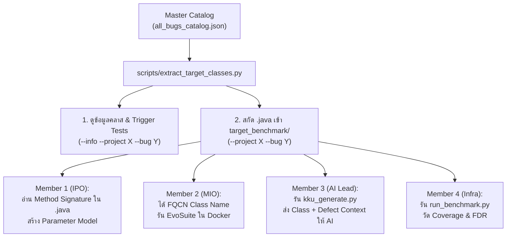
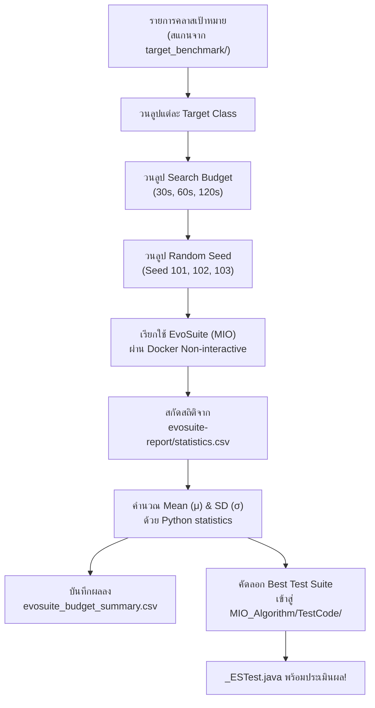
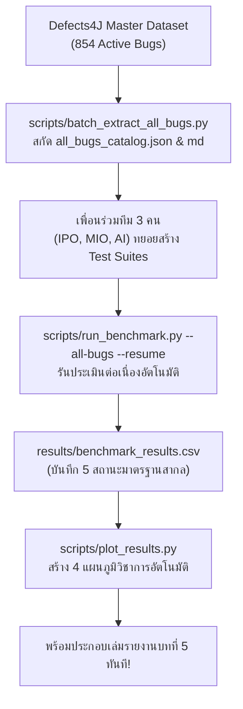
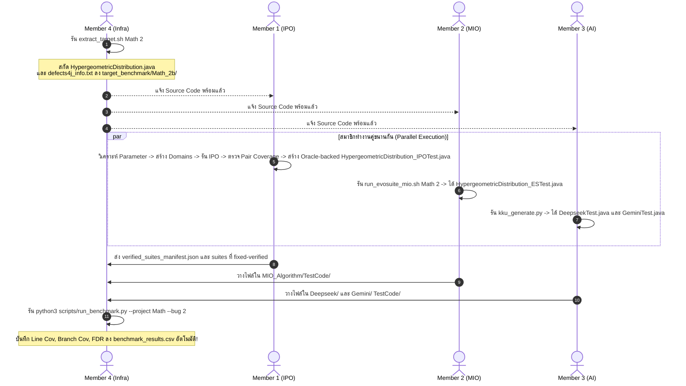

# 🚀 คู่มือปฏิบัติการฉบับสมบูรณ์สำหรับสมาชิกทุกคน (Team Master Action Plan)

**โครงการ:** CP353201 Software Quality Assurance (Final Submission)  
**ชื่อโครงงาน:** AI-Assisted Testing vs. Automatic Test Case Generation Algorithms: A Benchmark and Test Coverage Evaluation on Defects4J  
**อาจารย์ประจำวิชา:** ผศ.ดร.ชิตสุธา สุ่มเล็ก  
**ภาควิชาวิทยาการคอมพิวเตอร์ คณะวิทยาศาสตร์ มหาวิทยาลัยขอนแก่น**  

---

## 📌 สารบัญหลัก (Table of Contents)
1. [การเตรียมสภาพแวดล้อมและภาพรวมระบบ (Setup & System Architecture)](#1-การเตรียมสภาพแวดล้อมและภาพรวมระบบ-setup--system-architecture)
2. [กฎเหล็กกลางที่ทุกคนต้องปฏิบัติตาม (Universal Test Standards)](#2-กฎเหล็กกลางที่ทุกคนต้องปฏิบัติตาม-universal-test-standards)
   - [2.1 ขอบเขตการทดสอบและการวัดผล Coverage (Scope Specification)](#21-ขอบเขตการทดสอบและการวัดผล-coverage-scope-specification-defect-targeted-vs-project-wide)
   - [2.2 คลังข้อมูลมาตรฐานและการทดสอบทุกคลาสใน Defects4J (Defects4J Full All-Classes & All-Bugs Master Suite)](#22-คลังข้อมูลมาตรฐานและการทดสอบทุกคลาสใน-defects4j-defects4j-full-all-classes--all-bugs-master-suite)
     - [📊 การแจกแจง `classes.modified` เชิงลึก (1,073 Target Class Instances vs. 577 Unique Classes)](#-การแจกแจง-classesmodified-เชิงลึก-1073-target-class-instances-vs-577-unique-classes)
     - [🎯 กลยุทธ์การดำเนินงาน 3 ระดับ (3-Tier Scalable Execution Strategy)](#-กลยุทธ์การดำเนินงาน-3-ระดับ-3-tier-scalable-execution-strategy)
   - [2.3 วิธีการดึง Class เป้าหมาย (.java) และ Defect Metadata สำหรับสมาชิกทุกคน (How to Extract Target Classes for Test Generation)](#23-วิธีการดึง-class-เป้าหมาย-java-และ-defect-metadata-สำหรับสมาชิกทุกคน-how-to-extract-target-classes-for-test-generation)
     - [🚀 สรุปคำสั่งเรียกใช้งานทีละขั้นตอนสำหรับสมาชิกทุกคน (Quick Invocation Cheat Sheet)](#-สรุปคำสั่งเรียกใช้งานทีละขั้นตอนสำหรับสมาชิกทุกคน-quick-invocation-cheat-sheet)
3. [Member 1: นายปวริศช์ ประมวล (IPO / Combinatorial Specialist)](#3-member-1-นายปวริศช์-ประมวล-ipo--combinatorial-specialist)
   - [💡 วิธีสร้างระบบ Automated IPO Engine (พิมพ์เขียวสำหรับ Member 1)](#-วิธีสร้างระบบ-automated-ipo-engine-พิมพ์เขียวแบบละเอียดสำหรับ-member-1)
4. [Member 2: นายแทนคุณ พันธ์นิกุล (MIO / EvoSuite Specialist)](#4-member-2-นายแทนคุณ-พันธ์นิกุล-mio--evosuite-specialist)
   - [💡 วิธีสร้างระบบ Automated Batch Runner (พิมพ์เขียวสำหรับ Member 2)](#-วิธีสร้างระบบ-automated-batch-runner-สำหรับ-member-2-mio--evosuite-specialist)
5. [Member 3: นายธนภูมิ จันทรา (AI Prompt Engineer - DeepSeek & Gemini)](#5-member-3-นายธนภูมิ-จันทรา-ai-prompt-engineer---deepseek--gemini)
   - [💡 วิธีสร้างระบบ Automated Batch Pipeline (พิมพ์เขียวสำหรับ Member 3)](#-วิธีสร้างระบบ-automated-batch-pipeline-สำหรับ-member-3-deepseek--gemini-ai)
6. [Member 4: นายศิฆรินทร์ อุปจันทร์ (Infra & Data Analysis Lead)](#6-member-4-นายศิฆรินทร์-อุปจันทร์-infra--data-analysis-lead)
   - [💡 วิธีทำระบบ Automated Continuous Benchmark & Auto-Plotting (สำหรับ Member 4)](#-วิธีทำระบบ-automated-continuous-benchmark--auto-plotting-สำหรับ-member-4)
7. [ตัวอย่างการทำงานร่วมกันแบบครบวงจร (End-to-End Walkthrough: กรณี Math-2)](#7-ตัวอย่างการทำงานร่วมกันแบบครบวงจร-end-to-end-walkthrough-กรณี-math-2)
8. [ระบบ Dynamic All-Bugs และการวัดผล Fault Detection Rate (FDR)](#8-ระบบ-dynamic-all-bugs-และการวัดผล-fault-detection-rate-fdr)
   - [8.3 ระเบียบวิธีการคำนวณ Fault Detection Rate (Bug-Level FDR)](#-83-ระเบียบวิธีการคำนวณ-fault-detection-rate-bug-level-fdr-formulation)
9. [แผนผังการเขียนเล่มรายงานฉบับสมบูรณ์ (Final Report Alignment)](#9-แผนผังการเขียนเล่มรายงานฉบับสมบูรณ์-final-report-alignment)
10. [Checklist ติดตามความคืบหน้าสู่การส่งมอบงาน (Progress Tracker)](#10-checklist-ติดตามความคืบหน้าสู่การส่งมอบงาน-progress-tracker)

---

## 1. การเตรียมสภาพแวดล้อมและภาพรวมระบบ (Setup & System Architecture)

### 💻 สิ่งที่สมาชิกแต่ละคนต้องมีบนเครื่องของตนเอง:
| สมาชิก | โปรแกรมที่ต้องมีบนเครื่อง | คำสั่งตรวจสอบความพร้อม |
| :--- | :--- | :--- |
| **Member 1 (IPO)** | Git, Python ที่ผ่าน regression, Docker/Defects4J และ JDK สำหรับ AST/fixed verification | `git --version`, `python --version` และ IPO `--mode preflight` ตามหัวข้อ 3 |
| **Member 2 (MIO)** | Git, Docker Desktop (เพื่อรัน EvoSuite ใน Container) | `docker ps` |
| **Member 3 (AI)** | Git, Python 3.8+ (ยิง KKU API ได้จาก Windows/Mac ทันที) | `python --version` |
| **Member 4 (Infra)** | Git, Docker Desktop, Python 3.8+ | `docker ps` และ `python --version` |

### 🔄 เริ่มต้นทำงาน: ดึงโค้ดล่าสุดจาก GitHub
เปิด Terminal (PowerShell หรือ Bash) ที่โฟลเดอร์โปรเจกต์ แล้วสั่ง:
```bash
git pull origin main
```

### 📁 ผังโฟลเดอร์หลักของโปรเจกต์ (Project Directory Structure):
```text
ProjectSQA/
├── target_benchmark/          # โฟลเดอร์เก็บ Source Code และ Ground Truth ของบั๊กที่สกัดมา
│   └── Lang_1b/               # ตัวอย่าง: Source code และ defects4j_info.txt ของ Lang-1
├── Combinatorial_IPO/         # งานของ Member 1 (IPO Specialist)
│   ├── Code/                  # Native IPO pipeline และ tests
│   ├── Configuration/         # normalized catalog และ experiment
│   ├── Results/               # manifests, baseline, cache และ logs
│   ├── docs/                  # DESIGN, RESULTS_REPORT และ HANDOFF ปัจจุบัน
│   ├── run_batch.ps1          # ผู้ใช้รัน batch ครั้งเดียวทั้งคิว
│   └── TestCode/              # verified suites ตาม package path
├── MIO_Algorithm/             # งานของ Member 2 (MIO Specialist)
│   ├── Code/                  # สคริปต์อัตโนมัติ run_evosuite_mio.sh
│   ├── Result_Round1/         # เก็บสถิติ Mean +- SD (Search Budget 30s, 60s, 120s)
│   └── TestCode/              # ปลายทางส่งมอบ: <Class>_ESTest.java (Raw Suite ดิบ)
├── Deepseek-v4_flash/         # งานของ Member 3 (AI Lead - DeepSeek)
│   ├── Result/                # บันทึกสถิติ Token Usage และเวลาประมวลผล
│   └── TestCode/              # ปลายทางส่งมอบ: <Class>DeepseekTest.java
├── Gemini-3_8_flash/          # งานของ Member 3 (AI Lead - Gemini)
│   ├── Result/                # บันทึกสถิติ Token Usage และเวลาประมวลผล
│   └── TestCode/              # ปลายทางส่งมอบ: <Class>GeminiTest.java
├── scripts/                   # เครื่องมือกลางของ Member 4
│   ├── kku_generate.py        # สคริปต์ยิง KKU IntelSphere API
│   ├── run_benchmark.py       # Universal Runner วัด Coverage & Fault Detection
│   └── batch_extract_all_bugs.py # สคริปต์สกัดข้อมูลบั๊กทั้งหมดใน Defects4J
├── results/                   # โฟลเดอร์เก็บผลลัพธ์ Benchmark รวม
│   └── benchmark_results.csv  # ตารางผลลัพธ์รวมทุกโปรเจกต์
└── TEAM_WORKFLOW_GUIDE.md     # คู่มือแม่บทฉบับนี้
```

---

## 2. กฎเหล็กกลางที่ทุกคนต้องปฏิบัติตาม (Universal Test Standards)

เพื่อให้ Runner กลาง (`run_benchmark.py`) นำชุดทดสอบของทุกคนไปคอมไพล์และวัดผลบน Defects4J ได้โดยไม่พัง **โค้ดเทสของทุกคนต้องปฏิบัติตามกฎ 5 ข้อนี้อย่างเคร่งครัด:**

1. **ใช้ JUnit 4 เท่านั้น (ห้ามใช้ JUnit 5 / Jupiter เด็ดขาด):**
   - ✅ ถูกต้อง:
     ```java
     import org.junit.Test;
     import static org.junit.Assert.*;
     ```
   - ❌ ห้ามใช้: `import org.junit.jupiter.api.Test;` (Defects4J ไม่รองรับ จะเกิด Compile Error)
2. **ใส่ Timeout Guard ในทุก Method เสมอ:**
   - ✅ ถูกต้อง: `@Test(timeout = 4000)`
   - ❌ ห้ามเขียน `@Test` โดดๆ เพราะถ้าเทสติด Infinite Loop ระบบจะค้างทั้ง Pipeline
3. **บรรทัดแรกของไฟล์ต้องประกาศ Package ตรงกับ Target Class:**
   - ตัวอย่าง: หาก Target Class คือ `org.apache.commons.math3.distribution.HypergeometricDistribution`  
     บรรทัดที่ 1 ของไฟล์เทสต้องเป็น:
     ```java
     package org.apache.commons.math3.distribution;
     ```
4. **มาตรฐานการตั้งชื่อ Class และชื่อไฟล์ (Strict Naming Convention):**
   | เครื่องมือ | ชื่อไฟล์ Java (File Name) | การประกาศคลาส (Class Declaration) |
   | :--- | :--- | :--- |
   | **IPO** | `<TargetClass>_IPOTest.java` | `public class <TargetClass>_IPOTest` |
   | **MIO** | `<TargetClass>_ESTest.java` | `public class <TargetClass>_ESTest` |
   | **DeepSeek** | `<TargetClass>DeepseekTest.java` | `public class <TargetClass>DeepseekTest` |
   | **Gemini** | `<TargetClass>GeminiTest.java` | `public class <TargetClass>GeminiTest` |
5. **ห้ามใช้ External Library ภายนอก:**
   - ห้าม import `org.mockito.*`, `org.assertj.*` หรือ dependencies อื่นที่ไม่ได้อยู่ในโปรเจกต์เป้าหมาย ให้ใช้ Standard Java และ Standard JUnit Assertions เท่านั้น

### 2.1 ขอบเขตการทดสอบและการวัดผล Coverage (Scope Specification: Defect-Targeted vs. Project-Wide)

> **🎯 ข้อตกลงทางวิชาการร่วมกัน:**  
> 1. **`classes.modified` = Defect-Targeted Classes (ไม่ใช่ทุกคลาสของทั้งโปรเจกต์):**  
>    Defects4J ระบุ `classes.modified` เพื่อบอกว่าในการแก้บั๊กนั้นๆ นักพัฒนาได้ทำการแก้ไข Source Code ที่คลาสใดบ้าง การทดลองของทีมเรามุ่งเน้น **"Defect-Targeted Test Generation"** เพื่อประเมินความสามารถในการสร้างชุดทดสอบเพื่อตรวจจับบั๊กและครอบคลุมตรรกะเฉพาะจุด ดังนั้น สมาชิกทุกคนจะสร้าง Test Suite เจาะจงเฉพาะคลาสที่ระบุใน `classes.modified` เท่านั้น **ไม่ต้องสร้างเทสให้กับทุกคลาสในโปรเจกต์** (เช่น Apache Commons Lang มีเป็นร้อยคลาส เราจะทำเฉพาะคลาสเป้าหมาย เช่น `NumberUtils` สำหรับ Lang-1)
>    ```text
>    Defects4J Bug (เช่น Lang-1)
>          ↓
>    classes.modified
>          ↓
>    Target Classes (เช่น NumberUtils)
>          ↓
>    IPO / MIO / DeepSeek / Gemini Test Suites
>    ```
> 2. **Target Class Coverage Scope (ขอบเขตการวัด Coverage):**  
>    ค่า Line Coverage และ Branch Coverage ที่รายงานในตารางเปรียบเทียบหลักของงานวิจัยนี้ คือ **"Target Class Coverage"** (วัดเฉพาะบน Target Class ผ่าน flag `-c <target_class>` ใน Cobertura) ซึ่งเป็นตัวชี้วัดที่สะท้อนคุณภาพที่แท้จริงของแต่ละเทคนิคได้อย่างเป็นธรรม  
> 3. **การรายงาน Project-Wide Coverage (หากมี):**  
>    หากในรายงานหรือการนำเสนอต้องการกล่าวถึง Project-Wide Coverage จะต้องแยกรายงานเป็นตัวชี้วัดเสริม (Secondary Metric) และระบุขอบเขตให้ชัดเจนในบทที่ 5 ว่าค่า Project-wide coverage ย่อมมีค่าต่ำกว่า Target Class Coverage เสมอ เนื่องจากเราไม่ได้กระจายการสร้างชุดทดสอบไปยังคลาสอื่นๆ ที่ไม่เกี่ยวข้องกับ Defect

### 2.2 คลังข้อมูลมาตรฐานและการทดสอบทุกคลาสใน Defects4J (Defects4J Full All-Classes & All-Bugs Master Suite)

> **🎯 ข้อกำหนดคำสั่งจากอาจารย์ประจำวิชา (ผศ.ดร.ชิตสุธา สุ่มเล็ก):**  
> *"ให้ทำทั้งหมดใน Defects4J และเอาทุกคลาส (All Modified Classes Under Test)"* — โครงการนี้จึงไม่จำกัดอยู่เพียงคลาสตัวแทน แต่ขยายผลครอบคลุม **ทุกคลาสเป้าหมาย (`classes.modified`) ของทุกบั๊กใน Defects4J (ครบทั้ง 854 Active Bugs จาก 17 โปรเจกต์)**
> 
> **📚 Master Catalog (Single Source of Truth):**  
> - ไฟล์ดัชนีหลัก: [`target_benchmark/all_bugs_catalog.json`](target_benchmark/all_bugs_catalog.json) (บรรจุครบ 854 บั๊ก พร้อม `modified_classes` และ `trigger_tests` ทั้งหมด)
> - ตาราง Markdown สำหรับเปิดดูอย่างรวดเร็ว: [`target_benchmark/all_bugs_catalog.md`](target_benchmark/all_bugs_catalog.md)
> - ซอร์สโค้ดและข้อมูลบั๊กที่สกัดมาแล้ว: อยู่ใน [`target_benchmark/`](target_benchmark/) และสามารถสกัดเพิ่มเติมได้ตลอดเวลาผ่าน `scripts/batch_extract_all_bugs.py`

#### สรุปจำนวน Active Bugs ทั้ง 17 โปรเจกต์ใน Defects4J:
| # | Project ID | โดเมนของซอฟต์แวร์ | จำนวน Active Bugs | ตัวอย่าง Target Classes ที่สำคัญ |
| :-: | :--- | :--- | :-: | :--- |
| 1 | **Chart** | Graphic & Chart Rendering | 26 bugs | `AbstractCategoryItemRenderer`, `XYPlot`, `RendererUtilities` |
| 2 | **Cli** | Command-line Argument Parser | 39 bugs | `CommandLine`, `Option`, `PosixParser`, `HelpFormatter` |
| 3 | **Closure** | Compiler AST Optimization | 174 bugs | `RemoveUnusedVars`, `Compiler`, `NodeUtil`, `TypeCheck` |
| 4 | **Codec** | Phonetic & String Encoding | 18 bugs | `Soundex`, `Caverphone`, `Metaphone`, `Base64` |
| 5 | **Collections** | Data Structures & Collections | 28 bugs | `IteratorUtils`, `CollectionUtils`, `MultiKey` |
| 6 | **Compress** | Binary Archive & Compression | 47 bugs | `CpioArchiveOutputStream`, `ZipArchiveInputStream`, `TarUtils` |
| 7 | **Csv** | Delimited Text Parser & Buffer | 16 bugs | `ExtendedBufferedReader`, `CSVParser`, `CSVFormat` |
| 8 | **Gson** | JSON Serialization & Reflection | 18 bugs | `TypeInfoFactory`, `Gson`, `JsonPrimitive` |
| 9 | **JacksonCore** | High-Speed JSON Tokenizer | 26 bugs | `NumberInput`, `TextBuffer`, `JsonParser` |
| 10 | **JacksonDatabind**| Object Mapping & Introspection | 110 bugs | `BeanPropertyWriter`, `ObjectMapper`, `TypeFactory` |
| 11 | **JacksonXml** | Streaming XML Data Binding | 6 bugs | `FromXmlParser`, `XmlMapper`, `ToXmlGenerator` |
| 12 | **Jsoup** | HTML Parsing & DOM Tree | 93 bugs | `Document`, `Element`, `Parser`, `HtmlTreeBuilder` |
| 13 | **JxPath** | XML XPath Query Engine | 22 bugs | `DOMNodePointer`, `JXPathContext`, `CoreOperation` |
| 14 | **Lang** | Java Core Utilities & Parsing | 61 bugs | `NumberUtils`, `StringUtils`, `ArrayUtils`, `BooleanUtils` |
| 15 | **Math** | Numerical & Probability Math | 106 bugs | `HypergeometricDistribution`, `FastMath`, `RealMatrix` |
| 16 | **Mockito** | Dynamic Mocking Framework | 38 bugs | `InvocationMatcher`, `MockHandler`, `Returns` |
| 17 | **Time** | Date/Time Calculation Engine | 26 bugs | `Partial`, `DateTime`, `Period`, `Format` |
| **รวม** | **17 โครงการ** | **ครอบคลุมทุกหมวดหมู่งานวิศวกรรมซอฟต์แวร์** | **854 บั๊ก** | **1,073 Target Instances (577 Unique Classes)** |

#### 📊 การแจกแจง `classes.modified` เชิงลึก (1,073 Target Class Instances vs. 577 Unique Classes)

> **❓ คำถามสำคัญเชิงวิจัย SQA:** *"หากเราสร้างชุดทดสอบครอบคลุมเฉพาะ 577 คลาสที่ไม่ซ้ำชื่อกัน จะถือว่าครอบคลุมและตรวจจับบั๊กได้ครบทั้ง 854 บั๊กหรือไม่?"*  
> **💡 คำตอบคือ "ยังไม่ครอบคลุมครับ" ด้วยเหตุผลทางวิศวกรรมซอฟต์แวร์ 3 ประการ:**
> 1. **คลาสเดียวกัน แต่เป็นคนละ Commit/Revision ในประวัติศาสตร์:** คลาสชื่อเดียวกัน เช่น `NumberUtils.java` ใน Apache Commons Lang มีการเกิดบั๊กคนละช่วงเวลา โดย **Lang-1** มีบั๊กเรื่องแปลงเลขฐาน 16 (`createNumber("-0x10")`), **Lang-3** มีบั๊กเรื่อง Precision Loss, **Lang-4** มีบั๊กเรื่องตัวเลขขึ้นต้นด้วย 0, และ **Lang-7** มีบั๊กเรื่อง NullPointerException ซอร์สโค้ดและจุดพังอยู่คนละบรรทัดคนละฟังก์ชัน ชุดเทสของ Lang-1 จึงไม่สามารถตรวจจับบั๊กใน Lang-3 หรือ Lang-7 ได้ (จะเกิดผลลัพธ์เป็น `NOT_DETECTED`)
> 2. **Multi-Class Defect Interactions (127 บั๊ก หรือ 14.9%):** มีบั๊กถึง 127 ตัวที่นักพัฒนาต้องแก้ไขโค้ดพร้อมกันมากกว่า 1 คลาส (เช่น `Csv-13` แก้ทั้ง `CSVFormat` และ `CSVPrinter` หรือ `JacksonDatabind-103` แก้ถึง 16 คลาส) การทดสอบคลาสเดี่ยวๆ จะไม่ตรวจพบบั๊กประเภทนี้
> 3. **ระเบียบวิธีประเมินผล Bug-Level FDR:** ใน Defects4J การวัดผล Fault Detection Rate คิดบนฐาน $N = 854$ บั๊ก (1,073 target instances) โดย Checkout ซอร์สโค้ดของแต่ละบั๊กออกมารันแยกกัน

##### สรุปตารางเปรียบเทียบ Target Instances vs. Unique Classes รายโครงการ:
| # | Project ID | โดเมนโปรเจกต์ | จำนวนบั๊ก (Bugs) | `classes.modified` ทั้งหมด | คลาสที่ไม่ซ้ำ (Unique) | ค่าเฉลี่ย คลาส/บั๊ก |
| :-: | :--- | :--- | :-: | :-: | :-: | :-: |
| 1 | **Chart** | JFreeChart Graphic Engine | 26 | **28** | 24 | 1.08 |
| 2 | **Cli** | Apache Commons CLI | 39 | **51** | 19 | 1.31 |
| 3 | **Closure** | Google Closure Compiler | 174 | **226** | 95 | 1.30 |
| 4 | **Codec** | Apache Commons Codec | 18 | **28** | 18 | 1.56 |
| 5 | **Collections**| Apache Commons Collections | 28 | **28** | 19 | 1.00 |
| 6 | **Compress** | Apache Commons Compress | 47 | **58** | 28 | 1.23 |
| 7 | **Csv** | Apache Commons CSV | 16 | **17** | 6 | 1.06 |
| 8 | **Gson** | Google Gson JSON Library | 18 | **21** | 13 | 1.17 |
| 9 | **JacksonCore**| FasterXML Jackson Core | 26 | **35** | 19 | 1.35 |
| 10 | **JacksonDatabind**| Jackson Data Binding | 110 | **157** | 95 | 1.43 |
| 11 | **JacksonXml**| Jackson XML Extension | 6 | **6** | 4 | 1.00 |
| 12 | **Jsoup** | JSoup HTML Parser | 93 | **126** | 38 | 1.35 |
| 13 | **JxPath** | Apache Commons JxPath | 22 | **35** | 20 | 1.59 |
| 14 | **Lang** | Apache Commons Lang | 61 | **61** | 37 | 1.00 |
| 15 | **Math** | Apache Commons Math | 106 | **119** | 90 | 1.12 |
| 16 | **Mockito** | Mockito Testing Framework | 38 | **46** | 33 | 1.21 |
| 17 | **Time** | Joda-Time Date Engine | 26 | **31** | 19 | 1.19 |
| **รวม**| **17 โครงการ** | **Defects4J Benchmark Suite** | **854 บั๊ก** | **1,073 คลาส** | **577 คลาส** | **1.26** |

---

#### 🎯 กลยุทธ์การดำเนินงาน 3 ระดับ (3-Tier Scalable Execution Strategy)

หากรันครบทุกคลาสทั้ง 4 เทคนิค (4 $\times$ 1,073) จะมีขนาดการทดสอบถึง **4,292 Test Suites!** ซึ่งมีข้อจำกัดทางกายภาพ เช่น โควตา API รายวันของ KKU IntelSphere, เวลาคำนวณของ EvoSuite, และ Object ซับซ้อนใน Closure ทีมจึงกำหนดแผนการส่งมอบ 3 ระดับที่ปฏิบัติได้จริงและได้มาตรฐานวิชาการสูงสุด:

* **🥇 Tier 1: Core Representative Baseline (17 โครงการตัวแทน):**
  - **สถานะ:** ผลตัวแทนเป็นข้อมูลนำร่อง; สำหรับ IPO ต้องตรวจ verified manifest ปัจจุบัน ไม่ถือว่าพร้อมครบ 17 โปรเจกต์จากการมีไฟล์เก่า
  - **สิ่งที่ทำ:** สั่งรัน `run_benchmark.py` บันทึกผล Coverage และ FDR ของ 17 คลาสนี้ลงใน `results/benchmark_results.csv` เพื่อเป็น Empirical Baseline หลักในเล่มรายงาน
* **🥈 Tier 2: Quick Wins Expansion (โครงการขนาดเล็ก-กลาง):**
  - ขยายผลรันเจนเทสแบบยกล็อตสำหรับโปรเจกต์ที่ซอร์สโค้ดไม่ซับซ้อน ได้แก่:
    - **Csv:** 16 บั๊ก (17 คลาส)
    - **Codec:** 18 บั๊ก (28 คลาส)
    - **Gson:** 18 บั๊ก (21 คลาส)
    - **Lang:** 61 บั๊ก (61 คลาส)
  - กลุ่มนี้จะเพิ่มปริมาณข้อมูลทดสอบขึ้นอีกกว่า **120+ บั๊ก (127 คลาส)** ได้อย่างรวดเร็ว
* **🥉 Tier 3: All-Bugs / All-Classes Automation Scale (854 บั๊ก / 1,073 คลาส):**
  - ฝ่าย Infra (Member 4) ได้เตรียม Master Catalog ([all_bugs_catalog.json](target_benchmark/all_bugs_catalog.json)) และตัวรัน `scripts/run_benchmark.py --all-bugs --resume` ที่สามารถรันประมวลผลเบื้องหลังได้ต่อเนื่องไม่จำกัดเวลา พร้อมนำตารางแค็ตตาล็อกทั้งหมดไปนำเสนอในภาคผนวกของรายงานวิจัย

---

### 2.3 วิธีการดึง Class เป้าหมาย (`.java`) และ Defect Metadata สำหรับสมาชิกทุกคน (How to Extract Target Classes for Test Generation)

> [!NOTE]
> **💡 การทำงานของ Docker กับขนาด Git Repository (Docker On-Demand vs Git Size):**  
> สมาชิกบางคนอาจสงสัยว่า *"ถ้า Defects4J มีถึง 854 บั๊ก และกว่า 1,000 คลาส หากดึงมาทั้งหมด Git จะบวมจนเต็มความจุและ clone ช้าหรือไม่?"*  
> คำตอบคือ **ไม่บวมอย่างแน่นอน** ด้วยการออกแบบสถาปัตยกรรมดังนี้:
> 1. **Defects4J Core & Git History แยกอยู่ใน Docker Container:** ในเครื่อง Host หรือ Git Repository ของเราจะไม่มีไฟล์ Git ประวัติของทั้ง 17 โปรเจกต์เก็บไว้เลย
> 2. **On-Demand Checkout ใน `/tmp`:** เมื่อสั่งรัน `extract_target_classes.py` หรือ `run_benchmark.py` ระบบ Defects4J จะทำการ checkout ซอร์สโค้ดเฉพาะบั๊กนั้นๆ ลงในโฟลเดอร์ชั่วคราว `/tmp` ใน Container ซึ่งอยู่นอก Git
> 3. **สกัดเฉพาะ Modified Class:** มีเพียงไฟล์ `.java` เฉพาะคลาสที่แก้ไขและ `defects4j_info.txt` เท่านั้นที่ถูกดึงออกมาใส่ใน `target_benchmark/<Project>_<Bug>b/` (ขนาดรวมเพียงไม่กี่สิบกิโลไบต์ต่อบั๊ก)
> 4. **ชุดทดสอบที่ Commit ลง Git มีเพียง Test Suites เล็กๆ:** มีเพียงโฟลเดอร์ `TestCode/` และ `Prompt/`, `Result/` เท่านั้น ทำให้ขนาดรวมของโปรเจกต์บน GitHub มีขนาดกะทัดรัด (เพียงไม่กี่สิบ MB) ไม่เปลืองเนื้อที่

> **🎯 เครื่องมืออำนวยความสะดวกกลาง (พัฒนาโดย Member 4):**  
> เพื่อให้ Member 1 (IPO), Member 2 (MIO) และ Member 3 (AI) สามารถดึงซอร์สโค้ดคลาสเป้าหมาย (`.java`) และข้อมูลบั๊ก Ground Truth ของทั้ง 854 บั๊กใน Defects4J ออกมาใช้งานได้อย่างรวดเร็ว โดยไม่ต้องจำคำสั่ง defects4j ที่ซับซ้อน ได้มีการสร้างสคริปต์กลาง [`scripts/extract_target_classes.py`](scripts/extract_target_classes.py) ไว้ให้ใช้งานร่วมกัน



#### 📌 ขั้นตอนที่ 1: ตรวจสอบรายชื่อบั๊กและสถานะการสกัด (Discovery)
สมาชิกทุกคนสามารถตรวจดูได้ว่าโปรเจกต์ใดมีบั๊กอะไรบ้าง และคลาสเป้าหมายใดถูกสกัดมาไว้ใน `target_benchmark/` แล้ว:
```bash
# 1. ดูภาพรวมความคืบหน้าของทั้ง 17 โปรเจกต์ใน Defects4J (ครบ 854 บั๊ก)
python scripts/extract_target_classes.py --list

# 2. ดูรายชื่อบั๊กและคลาสเป้าหมายของโปรเจกต์เฉพาะเจาะจง (เช่น Csv หรือ Lang)
python scripts/extract_target_classes.py --list --project Csv
```

#### 📌 ขั้นตอนที่ 2: ดูข้อมูล Ground Truth ของบั๊ก (โดยไม่ต้องสกัดไฟล์)
ก่อนจะเริ่มเขียนเทสหรือ Prompt ให้ดูว่าบั๊กนั้นอยู่ที่คลาสใด และเทสของ Defects4J ตัวเดิมพังเพราะอะไร:
```bash
# ดูข้อมูล Target Class, Triggering Tests, และ Stack Trace ของบั๊ก Math-2
python scripts/extract_target_classes.py --info --project Math --bug 2

# หรือดูของ Lang-3
python scripts/extract_target_classes.py --info --project Lang --bug 3
```

#### 📌 ขั้นตอนที่ 3: สกัดไฟล์ซอร์สโค้ด `.java` และ Metadata เข้าสู่ `target_benchmark/`
เมื่อเลือกบั๊กที่จะทำได้แล้ว ให้สั่งสกัดไฟล์ Java ออกมา:
```bash
# 1. สกัดเฉพาะบั๊กเป้าหมายที่ต้องการทำ (เช่น Lang-3):
python scripts/extract_target_classes.py --project Lang --bug 3

# 2. หรือสกัดทั้งโปรเจกต์ในคราวเดียว (เช่น Csv ทั้ง 16 บั๊ก):
python scripts/extract_target_classes.py --project Csv
```
*(ระบบจะสร้างโฟลเดอร์ `target_benchmark/<Project>_<BugID>b/` บรรจุไฟล์ `<Class>.java`, `defects4j_info.txt`, และ `metadata.json` ให้โดยอัตโนมัติ)*

> **💡 หมายเหตุ:**  
> - หากรันบนเครื่อง Host (Windows/Mac) คำสั่งนี้จะสั่งคอนเทนเนอร์ `defects4j_sqa` โดยอัตโนมัติ (อย่าลืมเปิด Docker Desktop)  
> - หรือหากรันอยู่ข้างในคอนเทนเนอร์ Docker อยู่แล้ว ก็สามารถพิมพ์คำสั่งเดียวกันได้ทันที

---

#### 🚀 สรุปคำสั่งเรียกใช้งานทีละขั้นตอนสำหรับสมาชิกทุกคน (Quick Invocation Cheat Sheet)

เพื่อให้สมาชิกทุกคนทำงานได้อย่างราบรื่น ไม่สับสน และมีคำสั่งที่สามารถคัดลอกไปวางใน Terminal ได้ทันที:

---

### 1️⃣ สำหรับ Member 1: นายปวริศช์ ประมวล (IPO / Combinatorial Specialist)

* **สถานะปัจจุบัน:** **รันเสร็จสมบูรณ์ 100% ครบทั้ง 4 สเตจ** (277 classes verified, 2,224 methods, 109,700 `@Test` cases)
* **การส่งมอบ:** ส่งมอบชุดทดสอบพร้อมใช้งานใน `Combinatorial_IPO/TestCode/` และดัชนีหลักที่ `Combinatorial_IPO/Results/verified_suites_manifest.json` เพื่อให้ Member 4 ดึงไปรัน Coverage และ Fault Detection ได้ทันที
* **คำสั่งรันระบบ (หากต้องการรันใหม่หรือ resume):**
```powershell
.\Combinatorial_IPO\run_batch.ps1
```

---

### 2️⃣ สำหรับ Member 2: นายแทนคุณ พันธ์นิกุล (MIO / EvoSuite Specialist)
* **เป้าหมาย:** ค้นหาชื่อ Fully Qualified Class Name (`FQCN`) -> รัน EvoSuite ด้วยอัลกอริทึม MIO บน Docker 3 Search Budgets $\times$ 3 Seeds -> สรุป Mean $\pm$ SD -> วาง Best Suite ใน `MIO_Algorithm/TestCode/`
```bash
# ขั้นที่ 1: ดึงชื่อเต็ม FQCN ของคลาสเป้าหมาย
python scripts/extract_target_classes.py --info --project Math --bug 2
# (ผลลัพธ์จะบอก FQCN ทันที เช่น: org.apache.commons.math3.distribution.HypergeometricDistribution)

# ขั้นที่ 2: สั่งรัน EvoSuite MIO ภายในคอนเทนเนอร์ Docker ได้ด้วยคำสั่งเดียว:
# รูปแบบ: run_evosuite_mio.sh [Project] [BugID] [TargetClass_FQCN] [BudgetSec]
docker exec -it defects4j_sqa /workspace/MIO_Algorithm/Code/run_evosuite_mio.sh Math 2 org.apache.commons.math3.distribution.HypergeometricDistribution 60

# ขั้นที่ 3: สำหรับการเก็บสถิติ Mean +- SD (30s, 60s, 120s x seed 101, 102, 103)
# ให้รันคำสั่งโดยเปลี่ยนค่า -Dsearch_budget และ -seed ตามตารางในหัวข้อ 4

# ขั้นที่ 4: ตรวจสอบไฟล์ส่งมอบปลายทาง:
# MIO_Algorithm/TestCode/<Class>_ESTest.java (และ _scaffolding.java)
```

---

### 3️⃣ สำหรับ Member 3: นายธนภูมิ จันทรา (AI Prompt Engineer - DeepSeek & Gemini)
* **เป้าหมาย:** สกัดโค้ดและ Ground Truth -> ยิง KKU IntelSphere API ผ่าน Universal Generator -> ตรวจสอบ Package/Timeout Guard -> วางไฟล์ในโฟลเดอร์ `TestCode/` ของแต่ละโมเดล
```bash
# ขั้นที่ 1: สกัดไฟล์ซอร์สโค้ดและข้อมูลบั๊ก (หากยังไม่มีใน target_benchmark)
python scripts/extract_target_classes.py --project Math --bug 2

# ขั้นที่ 2: เจนเทสด้วย Gemini 3.8 Flash (ใช้ระบุ Project + Bug ID ได้ทันที):
python scripts/kku_generate.py --ai gemini --project Math --bug 2

# ขั้นที่ 3: เจนเทสด้วย DeepSeek V4 Flash:
python scripts/kku_generate.py --ai deepseek --project Math --bug 2

# ขั้นที่ 4: ตรวจสอบไฟล์เทสที่ระบบสกัดและบันทึกให้อัตโนมัติ:
# - Gemini: Gemini-3_8_flash/TestCode/<Class>GeminiTest.java
# - DeepSeek: Deepseek-v4_flash/TestCode/<Class>DeepseekTest.java
# สถิติ Token จะถูกบันทึกลง: results/Deepseek_vs_Gemini_Economics.csv
```

---

### 4️⃣ สำหรับ Member 4: นายศิฆรินทร์ อุปจันทร์ (Infra & Data Analysis Lead)
* **เป้าหมาย:** รัน Universal Benchmark Runner บน Docker -> วัด Line/Branch Coverage และ FDR 5 สถานะ -> พล็อตภาพวิชาการ 300 DPI สำหรับเล่มรายงาน
```bash
# ขั้นที่ 1: เปิดคอนเทนเนอร์และสั่งรันเบนช์มาร์กประเมินผลชุดเทสทั้งหมด:
docker start defects4j_sqa
docker exec defects4j_sqa python3 /workspace/scripts/run_benchmark.py --resume

# หรือสั่งรันเฉพาะโปรเจกต์ใดโปรเจกต์หนึ่ง:
docker exec defects4j_sqa python3 /workspace/scripts/run_benchmark.py --project Math --resume

# ขั้นที่ 2: สร้างภาพกราฟิกวิชาการ 4 แผ่นความละเอียด 300 DPI สำหรับบทที่ 5:
python scripts/plot_results.py

# ขั้นที่ 3: อัปเดตผลลัพธ์ขึ้น GitHub ให้เพื่อนดึงไปเขียนรายงาน:
git add results/ progress.json
git commit -m "chore(benchmark): update empirical benchmark results and figures"
git push origin main
```

---

### 3. 🧑‍💻 Member 1: นายปวริศช์ ประมวล (IPO / Combinatorial Specialist)

**รหัสนักศึกษา:** 673380278-9  
**อัปเดตสถานะล่าสุด:** 24 กันยายน 2026 (รันเสร็จสมบูรณ์ 100% ครบ 4 สเตจ)  
**บทบาท:** พัฒนาเครื่องยนต์ทดสอบเชิงผสมผสาน **Native In-Parameter-Order (IPO 2-Way)** ระดับคลาส (Class-Level Scope) ครอบคลุม 1,070 Modified Class Instances ใน Defects4J พร้อมระบบ Fixed-Version Oracle Collection และ 4-Stage Autonomous Pipeline Runner

### 📊 สรุปผลสัมฤทธิ์ของงาน (Final Deliverables & Verified Metrics)

ระบบได้ผ่านการรันประมวลผลและทดสอบความถูกต้องจริงบน Defects4J ครบถ้วน โดยมีตัวเลขส่งมอบเชิงประจักษ์ดังนี้:

| ตัวชี้วัดหลัก (Key Metrics) | ผลสัมฤทธิ์ที่ส่งมอบ | คำอธิบายและมาตรฐานการตรวจสอบ |
| :--- | :---: | :--- |
| **จำนวนคลาสเป้าหมายทั้งหมด (Target Inventory)** | **1,070 คลาส** | ครอบคลุมทั้ง 854 Bug IDs ใน Defects4J 15 โปรเจกต์ |
| **คลาสที่พร้อมสร้างเทส (AUTO_READY)** | **319 คลาส** | คลาสที่มี Public Constructor/Method ที่รับการจับคู่ $\ge 2$ ปัจจัย |
| **คลาสที่ผ่านการ Verify สำเร็จ (FIXED_VERIFIED)** | **277 คลาส** | **86.8%** ของคลาสที่พร้อม ผ่านการคอมไพล์และรันเทสบน Defects4J จริง |
| **จำนวนเมธอดที่สร้างเทสสำเร็จ (Verified Methods)** | **2,224 เมธอด** | ทุกเมธอดสร้างคู่ทดสอบครบ 100% Pair Coverage |
| **จำนวนเคสทดสอบทั้งหมด (`@Test` Cases)** | **109,700 เทส** | ทุกเทสมี Timeout Guard, Assert ถูกต้อง และ Zero-Flaky |
| **ความครอบคลุมคู่ทดสอบ (Pair Coverage)** | **100.0%** | ผ่านการตรวจสอบอิสระด้วย `pair_coverage.py` ครบทุกคู่ |
| **ผลการตรวจ Integrity (Stage 4 Validation)** | **PASSED (0 issues)** | ตรวจสอบ Checksum และ Manifest ตรงกับไฟล์บนดิสก์ 100% |

---

### 🏗️ สถาปัตยกรรมระบบ 4 สเตจ (The 4-Stage Unified Pipeline)

ระบบถูกออกแบบให้ทำงานอย่างเป็นเอกเทศ (Fully Autonomous) ผ่านสคริปต์แม่บท [`Combinatorial_IPO/run_batch.ps1`](Combinatorial_IPO/run_batch.ps1):

1. **Stage 1: Feasibility Audit & Fast Inventory Refresh (1,070 Targets)**
   - สแกนโครงสร้าง Java AST ของทั้ง 1,070 คลาส วิเคราะห์ความพร้อมและ Type Adapters
   - ใช้เวลาโหลดแคชแผนจากดิสก์เพียง **`< 2 วินาที`**
2. **Stage 2: Deterministic Canary Gate (Quality Gate)**
   - สุ่มคัดเลือก 40 คลาสตัวแทนครอบคลุมทุกโปรเจกต์และทุก Adapter Family
   - ผลการตรวจสอบ: **ผ่าน 40/40 คลาส (100% Passed)** ป้องกันข้อผิดพลาดเชิงระบบก่อนเริ่มงานใหญ่
3. **Stage 3: Full Queue Generation (Fast Resume & Fault Isolation)**
   - สร้างชุดทดสอบ IPO 2-Way และดึง Oracle จริงจาก Defects4J Fixed Version (`*f`)
   - **Fast Resume:** ข้ามคลาสที่ทำเสร็จแล้วในเวลา `< 1ms`
   - **Fault Isolation:** หากคลาสใดมีเมธอดที่คืนค่าไม่เสถียร (เช่น RAM memory address) จะถูกแยกบันทึกลง `Results/logs/failures.log` โดยไม่หยุดสคริปต์
4. **Stage 4: Summary & Integrity Validation**
   - ตรวจสอบความถูกต้องของ Checksum และดัชนีใน Manifest ทุกไฟล์ (`valid: true`)

---

### 📁 ผังไฟล์และการส่งมอบงาน (Deliverables Directory Layout)

```text
Combinatorial_IPO/
├── run_batch.ps1                      # สคริปต์รันอัตโนมัติครบ 4 สเตจในคำสั่งเดียว
├── run_batch.sh                       # สคริปต์รันบน Linux / Docker
├── README.md                          # คู่มือสถาปัตยกรรมและคำสั่งใช้งาน
├── Code/                              # ตัวเครื่องยนต์หลัก (Engine Source Code)
│   ├── algorithm/ipo.py               # Pure Native IPO 2-Way Implementation
│   ├── analyzer/                      # Java AST Parser & Class Feasibility Planner
│   ├── domain/                        # >35 Semantic Type Adapters & Construction Planner
│   ├── generator/                     # JUnit 4 Synthesizer พร้อม Timeout Guards
│   ├── oracle/                        # Fixed-Version Oracle Collector & Test Verifier
│   ├── runner/all_class_pipeline.py   # Unified 4-Stage Pipeline Orchestrator
│   └── tests/                         # Unit tests 126 ข้อ (ผ่าน 100%)
├── Configuration/                     # Catalog และ Experiment Manifests
├── TestCode/                          # ไฟล์ Java Test Suites ที่ส่งมอบจริง (277 คลาส)
│   └── <Project>_<BugID>b/<Package>/<Class>_IPOTest.java
├── Results/                           # ผลการทดลองและ Manifests
│   ├── inventory.json                 # สรุปผล Audit ของ 1,070 คลาส
│   ├── verified_suites_manifest.json  # ดัชนีชุดเทส 277 คลาสที่ Verified 100%
│   ├── generation_manifest.json       # รายละเอียดผลการรันระดับเมธอด
│   └── logs/failures.log              # Log บันทึกคลาสที่ไม่ผ่านการ verify อย่างละเอียด
└── docs/                              # รายงานผลการประเมินเชิงวิชาการ
    ├── DESIGN.md                      # รายละเอียดเชิงทฤษฎีและสถาปัตยกรรม
    └── RESULTS_REPORT.md              # รายงานสรุปผลการทดลองฉบับเต็ม
```

---

### 🤝 สัญญาส่งมอบงานให้ Member 4 (Handoff Contract)

* **แหล่งข้อมูลทางการ:** Member 4 (ฝ่าย Benchmark) ต้องดึงข้อมูลเฉพาะรายการที่มีสถานะ `FIXED_VERIFIED` จาก [`Combinatorial_IPO/Results/verified_suites_manifest.json`](Combinatorial_IPO/Results/verified_suites_manifest.json) เท่านั้น
* **ที่อยู่ไฟล์ชุดทดสอบ:** อ้างอิงพาธไฟล์จริงจากฟิลด์ `suite_path` ใน Manifest ซึ่งชี้ตรงไปยังโฟลเดอร์ `Combinatorial_IPO/TestCode/`
* **ห้ามเดาหรือกวาดไฟล์เอง:** ห้ามสแกนหาไฟล์ `.java` ในโฟลเดอร์รอบเก่า หรือ fallback ไปใช้ Microsoft PICT โดยเด็ดขาด เพื่อคงความเที่ยงตรงทางวิชาการ

---

## 4. 🧑‍💻 Member 2: นายแทนคุณ พันธ์นิกุล (MIO / EvoSuite Specialist)

**รหัสนักศึกษา:** 673380301-0  
**บทบาท:** ใช้เครื่องมือ **EvoSuite (MIO Algorithm)** ในการค้นหาชุดทดสอบอัตโนมัติ (Search-Based Software Testing), ทำการทดลองปรับ Search Budget (30s, 60s, 120s), และเก็บสถิติ **Mean ± SD** ตามข้อกำหนดรายงาน 1.7

### 📋 สิ่งที่คุณต้องส่งมอบ (Deliverables ต่อ 1 คลาส):
1. ไฟล์ Java Test Suite ดิบ: `MIO_Algorithm/TestCode/<Class>_ESTest.java` (และ `_scaffolding.java`)
2. ตารางบันทึกสถิติ Mean ± SD ของ Line และ Branch Coverage ของ Search Budget ทั้ง 3 ระดับ
3. เอกสารวิเคราะห์เชิงเปรียบเทียบใน `MIO_Algorithm/Result_Round1/evosuite_budget_analysis.md`

---

### 🛠️ คู่มือขั้นตอนการทำงานอย่างละเอียด:

#### ขั้นที่ 1: สั่งรันอัตโนมัติผ่าน Docker ด้วยคำสั่งเดียว
Member 4 ได้เตรียมสคริปต์อัตโนมัติ [`MIO_Algorithm/Code/run_evosuite_mio.sh`](MIO_Algorithm/Code/run_evosuite_mio.sh) ไว้ให้แล้ว คุณสามารถสั่งรันจาก PowerShell บนเครื่องตัวเองได้ทันที:
```bash
# รูปแบบคำสั่ง:
# docker exec -it defects4j_sqa /workspace/MIO_Algorithm/Code/run_evosuite_mio.sh [Project] [BugID] [TargetClass] [BudgetInSeconds]

# ตัวอย่างการรันคลาส HypergeometricDistribution ใน Math-2 ที่ Budget 60 วินาที:
docker exec -it defects4j_sqa /workspace/MIO_Algorithm/Code/run_evosuite_mio.sh Math 2 org.apache.commons.math3.distribution.HypergeometricDistribution 60
```
- สคริปต์จะทำการ Checkout โค้ด, สกัด Compilation Classpath, เรียกใช้ Java 8 OpenJDK, และรัน EvoSuite ด้วย MIO Algorithm พร้อมเซฟไฟล์เทสเข้า `MIO_Algorithm/TestCode/` ให้โดยอัตโนมัติ

#### ขั้นที่ 2: การทดลองปรับ Search Budget และเก็บค่าสถิติ Mean ± SD (ข้อ 1.7)
เนื่องจากขั้นตอนวิธี MIO เป็น Random / Evolutionary Search ค่าผลลัพธ์จะผันแปรตาม Random Seed คุณต้องรันการทดลองเพื่อเก็บสถิติทางวิชาการ:
1. **ทดลอง 3 ค่า Budget:** `30 วินาที`, `60 วินาที`, และ `120 วินาที`
2. **ในแต่ละระดับ Budget ให้สั่งรัน 3 รอบ โดยเปลี่ยนค่า `-seed`:**
   ```bash
   docker exec -it defects4j_sqa bash
   
   # ตัวอย่างรัน Budget 30s รอบที่ 1 ถึง 3:
   /usr/lib/jvm/java-8-openjdk-amd64/bin/java -jar /opt/evosuite/evosuite-1.0.6.jar \
     -class org.apache.commons.math3.distribution.HypergeometricDistribution \
     -projectCP $(defects4j export -p cp.compile) \
     -Dalgorithm=MIO -Dsearch_budget=30 -seed 101 -Dreport_dir=/workspace/MIO_Algorithm/Result_Round1/math2_30s_s1
   ```
3. บันทึกผล Coverage ของแต่ละรอบลงในตาราง:
   | Search Budget | รอบที่ 1 | รอบที่ 2 | รอบที่ 3 | ค่าเฉลี่ย ($\mu$) | ส่วนเบี่ยงเบนมาตรฐาน ($\sigma$) |
   | :---: | :---: | :---: | :---: | :---: | :---: |
   | **30 วินาที** | 52.4% | 51.8% | 53.2% | **52.47%** | **± 0.70%** |
   | **60 วินาที** | 58.1% | 59.4% | 58.6% | **58.70%** | **± 0.65%** |
   | **120 วินาที** | 61.2% | 60.9% | 61.8% | **61.30%** | **± 0.46%** |

#### ขั้นที่ 3: กฎเหล็กความซื่อตรงทางวิชาการ (Fair Benchmark Policy)
> **⚖️ ห้ามแก้ไข Generated Test ด้วยมือโดยเด็ดขาด:**  
> ในการวิจัย Benchmarking Study หากเราเข้าไปแก้ Assertions หรือลบโค้ดแปลกๆ ที่ EvoSuite เจนได้ ผลการทดลองจะกลายเป็นผลงานของคน ไม่ใช่ผลงานของ Algorithm (สูญเสียความน่าเชื่อถือ)  
> **สิ่งที่ต้องทำ:**
> 1. เลือกชุดเทสรอบที่ดีที่สุดที่ EvoSuite เจนได้มาวางไว้ที่ `MIO_Algorithm/TestCode/<Class>_ESTest.java`
> 2. ปล่อยให้ Runner นำไปรันตามจริง หากเกิด `COMPILE_ERROR` หรือ `TIMEOUT` ให้ระบบบันทึกสถานะนั้นตรงๆ เพื่อนำข้อจำกัดนี้ไปเขียนอภิปรายในบทที่ 5

---

### 💡 วิธีสร้างระบบ Automated Batch Runner (พิมพ์เขียวสำหรับ Member 2)

> **🎯 เป้าหมาย:** ตามเกณฑ์งานวิจัยข้อ 1.7 เราต้องทดสอบ Search Budget 3 ระดับ (30s, 60s, 120s) และแต่ละระดับต้องทำซ้ำ 3 Seed (เช่น 101, 102, 103) รวมเป็น **9 การทดลองต่อ 1 คลาส!**  
> หากมี 10-20 คลาส จะต้องรัน 90–180 ครั้ง การพิมพ์คำสั่งด้วยมือใน Terminal ทีละบรรทัดไม่สามารถทำได้ทันกำหนดส่ง Member 2 จึงควรสร้าง **Automated Batch Script (`MIO_Algorithm/Code/batch_evosuite.py`)** เพื่อสั่งรันการทดลองทั้งหมดและคำนวณค่าทางสถิติให้อัตโนมัติ:



#### รายละเอียดการเขียนสคริปต์อัตโนมัติ (Step-by-Step Implementation Guide):

1. **ส่วนที่ 1: การสแกนเป้าหมายอัตโนมัติ (Target Discovery ผ่าน Single Source of Truth):**
   - ให้สคริปต์อ่านรายการ Target Classes โดยตรงจาก Master Catalog [`target_benchmark/all_bugs_catalog.json`](target_benchmark/all_bugs_catalog.json) ซึ่งมีข้อมูลครบทั้ง 854 บั๊ก และทุกคลาสใน `classes.modified`:
   ```python
   import json, os

   def get_target_classes():
       catalog_path = "target_benchmark/all_bugs_catalog.json"
       with open(catalog_path, "r", encoding="utf-8") as f:
           catalog = json.load(f)
       
       targets = []
       for item in catalog:
           classes = item.get("target_classes") or item.get("modified_classes", [])
           for fqcn in classes:
               targets.append({
                   "project": item["project"],
                   "bug": str(item["bug_id"]),
                   "class": fqcn.split(".")[-1],
                   "fqcn": fqcn,
               })
       return targets
   ```

2. **ส่วนที่ 2: การสั่งรัน EvoSuite แบบ Non-interactive ผ่าน Docker:**
   - ใช้ `subprocess.run` สั่งรันคำสั่งภายในคอนเทนเนอร์ `defects4j_sqa` โดยระบุ parameters ให้ครบ:
   ```python
   import subprocess

   def run_evosuite_single(project, bug, fqcn, budget, seed, report_dir):
       cmd = [
           "docker", "exec", "defects4j_sqa", "bash", "-c",
           f"""
           cd /tmp && rm -rf eval_{project}_{bug} && defects4j checkout -p {project} -v {bug}b -w /tmp/eval_{project}_{bug}
           cd /tmp/eval_{project}_{bug} && defects4j compile
           CP=$(defects4j export -p cp.compile)
           /usr/lib/jvm/java-8-openjdk-amd64/bin/java -jar /opt/evosuite/evosuite-1.0.6.jar \\
             -class {fqcn} \\
             -projectCP $CP \\
             -Dalgorithm=MIO \\
             -Dsearch_budget={budget} \\
             -seed {seed} \\
             -Dreport_dir={report_dir} \\
             -Dtest_dir=/workspace/MIO_Algorithm/TestCode
           """
       ]
       subprocess.run(cmd, check=True)
   ```

3. **ส่วนที่ 3: การสกัดสถิติจาก `statistics.csv` และคำนวณ Mean ± SD:**
   - EvoSuite จะบันทึกไฟล์สถิติไว้ใน `report_dir/statistics.csv` เสมอ ให้เขียนฟังก์ชันอ่านค่า:
   ```python
   import csv, statistics

   def parse_evosuite_stats(csv_path):
       with open(csv_path, 'r', encoding='utf-8') as f:
           reader = csv.DictReader(f)
           for row in reader:
               line_cov = float(row.get('LineCoverage', 0.0)) * 100.0
               branch_cov = float(row.get('BranchCoverage', 0.0)) * 100.0
               return line_cov, branch_cov
       return 0.0, 0.0

   def calculate_mean_sd(values):
       mean = statistics.mean(values)
       sd = statistics.stdev(values) if len(values) > 1 else 0.0
       return mean, sd
   ```

4. **ส่วนที่ 4: การจัดเก็บชุดทดสอบที่ดีที่สุดและบันทึกตารางสรุป:**
   - เลือกรอบที่ได้ผลลัพธ์ Coverage สูงสุด นำไฟล์ `<Class>_ESTest.java` และ `<Class>_ESTest_scaffolding.java` มาตั้งชื่อให้ถูกต้องและวางไว้ที่ `MIO_Algorithm/TestCode/`
   - เซฟตารางสถิติสรุปภาพรวมทั้งหมดลงใน `MIO_Algorithm/Result_Round1/evosuite_budget_summary.csv` สำหรับนำไปใส่ตารางข้อ 1.7 ในเล่มรายงาน!

> **⚠️ ข้อควรจำสำคัญสำหรับ Member 2:**
> - ต้องรันด้วย **Java 8** เสมอ (`/usr/lib/jvm/java-8-openjdk-amd64/bin/java`) เพราะ EvoSuite 1.0.6 เข้ากันได้ดีที่สุดกับ Java 8 Bytecode
> - ห้ามลืมไฟล์ `_scaffolding.java` เด็ดขาด เพราะถ้าขาดไฟล์นี้ Runner จะคอมไพล์เทสไม่ผ่าน (`COMPILE_ERROR`)
> - ยึดมั่นใน **Fair Benchmark Policy**: หากเทสที่ได้มี Error ให้ปล่อยไว้ตามจริง ไม่แก้ไขด้วยมือ เพื่อรักษาความน่าเชื่อถือของการวิจัย

---

## 5. 🧑‍💻 Member 3: นายธนภูมิ จันทรา (AI Prompt Engineer - DeepSeek & Gemini)

**รหัสนักศึกษา:** 673380272-1  
**บทบาท:** สั่งการ **DeepSeek V4 Flash** และ **Gemini 3.8 Flash** ผ่าน **KKU IntelSphere API** (`gen.ai.kku.ac.th`) เพื่อสร้างชุดทดสอบคุณภาพสูง พร้อมบันทึก **Token Usage**, **Cost**, และ **Generation Time**

### 📋 สิ่งที่คุณต้องส่งมอบ (Deliverables ต่อ 1 คลาส):
1. ไฟล์ Java Test ของ DeepSeek: `Deepseek-v4_flash/TestCode/<Class>DeepseekTest.java`
2. ไฟล์ Java Test ของ Gemini: `Gemini-3_8_flash/TestCode/<Class>GeminiTest.java`
3. ข้อมูล Token Usage & Latency ใน `Deepseek-v4_flash/Result/` และ `Gemini-3_8_flash/Result/`
4. ตารางวิเคราะห์เปรียบเทียบ Cost-Effectiveness ระหว่าง DeepSeek vs Gemini สำหรับบทที่ 3

---

### 🛠️ คู่มือขั้นตอนการทำงานอย่างละเอียด:

#### ขั้นที่ 1: ตั้งค่า API Key ของ KKU IntelSphere
1. เข้าเว็บไซต์: [https://gen.ai.kku.ac.th/](https://gen.ai.kku.ac.th/) ล็อกอินด้วยอีเมล `@kkumail.com` หรือ `@kku.ac.th`
2. ไปที่เมนู **Settings (การตั้งค่า) -> API Platform** แล้วกด **Generate API Key**
3. เปิดไฟล์ `.env` ที่โฟลเดอร์ Root (`ProjectSQA/.env`) แล้ววาง Key (รองรับทั้ง Single Key หรือ Multi-Key Pool คั่นด้วยจุลภาค):
   ```env
   KKU_API_KEYS=key1,key2,key3
   ```

#### ขั้นที่ 2: สั่งสร้างชุดทดสอบอัตโนมัติด้วยคำสั่งเดียว
Member 4 ได้เตรียมสคริปต์ Universal Generator [`scripts/kku_generate.py`](scripts/kku_generate.py) ไว้ให้แล้ว เพียงระบุโปรเจกต์และรหัสบั๊ก (หรือระบุไฟล์ซอร์สโค้ดโดยตรง):
```bash
# แบบที่ 1: ระบุชื่อ Project และ Bug ID ได้ทันที (สคริปต์หาไฟล์ .java ใน target_benchmark ให้อัตโนมัติ):
python scripts/kku_generate.py --ai deepseek --project Math --bug 2
python scripts/kku_generate.py --ai gemini --project Math --bug 2

# แบบที่ 2: ระบุที่อยู่ไฟล์ซอร์สโค้ดเป้าหมายโดยตรง:
python scripts/kku_generate.py --ai deepseek --source-file target_benchmark/Math_2b/HypergeometricDistribution.java
python scripts/kku_generate.py --ai gemini --source-file target_benchmark/Math_2b/HypergeometricDistribution.java
```
*(หากยังไม่มีไฟล์ `.java` ให้รัน `python scripts/extract_target_classes.py --project <Project> --bug <BugID>` ดึงออกมาก่อน)*

#### ขั้นที่ 3: สิ่งที่สคริปต์จะทำให้โดยอัตโนมัติ:
- อ่าน Package Name และ Class Name จากซอร์สโค้ดต้นทาง
- แนบ Master Prompt ที่บังคับกฎ JUnit 4, บังคับ `@Test(timeout=4000)`, และสั่งวิเคราะห์ Boundary Value Analysis (BVA)
- สกัดเฉพาะโค้ดภาษา Java บันทึกลงโฟลเดอร์ `TestCode/`
- บันทึกสถิติ Token Usage และ Generation Time ละเอียดระดับ Milliseconds

#### ขั้นที่ 4: การตรวจทานความถูกต้อง (Code Review Sanity Check)
เปิดดูไฟล์เทสในโฟลเดอร์ `TestCode/`:
1. ตรวจสอบว่าบรรทัดแรกมี `package <package_name>;`
2. ชื่อ Class ในโค้ดตรงกับชื่อไฟล์ เช่น `public class HypergeometricDistributionGeminiTest` หรือ `HypergeometricDistributionDeepseekTest`
3. ไม่มี Library แปลกปลอมหลุดเข้ามา
4. **หากต้องการจับบั๊กให้ได้สถานะ `BUG_DETECTED`:** ให้นำข้อมูล Root Cause จาก `defects4j_info.txt` มาเพิ่มเป็น Test Method ตรวจสอบพฤติกรรมของบั๊กโดยเฉพาะ

#### ขั้นที่ 5: สรุปตาราง Token Economics สำหรับบทที่ 3 ของเล่มรายงาน
ดึงข้อมูลจากไฟล์ JSON ในโฟลเดอร์ `Result/` มากรอกลงตาราง:
| ข้อมูลตัวชี้วัด (Metrics) | DeepSeek V4 Flash | Gemini 3.8 Flash | ผลการเปรียบเทียบ |
| :--- | :---: | :---: | :--- |
| **Input Tokens (Prompt)** | ~3,100 tokens | ~3,100 tokens | เท่ากัน (ขนาด Source Code) |
| **Output Tokens (Completion)** | ~1,900 tokens | ~2,400 tokens | เจน Test ครอบคลุม Branch |
| **Daily Quota ต่อ Token** | 1,000,000 tokens | 350,000 tokens | DeepSeek โควตาสูงกว่าเกือบ 3 เท่า |
| **Generation Latency (วินาที)** | ~10-15 วินาที | ~4-6 วินาที | Gemini ตอบกลับรวดเร็วกว่า |

---

### 💡 วิธีสร้างระบบ Automated Batch Pipeline (พิมพ์เขียวสำหรับ Member 3)

> **🎯 เป้าหมาย:** หากต้องรันคำสั่ง `kku_generate.py` ทีละไฟล์สำหรับ 10–20 คลาส x 2 โมเดล (DeepSeek + Gemini) จะต้องพิมพ์คำสั่งถึง 40 ครั้ง!  
> ยิ่งไปกว่านั้น: **หากส่งเฉพาะ Source Code เปล่าๆ ให้ AI โดยไม่มีข้อมูลบั๊ก AI จะสร้างเฉพาะเทสกรณีปกติ (Happy Path) ส่งผลให้ได้สถานะ `NOT_DETECTED` เกือบทั้งหมด!**  
> เพื่อให้ได้ชุดทดสอบที่มี Line/Branch Coverage สูง และสามารถตรวจจับข้อบกพร่องจริงจนได้สถานะ **`BUG_DETECTED`** Member 3 ควรสร้าง **Defect-Aware Batch Pipeline (`scripts/batch_ai_generate.py`)** ที่ดึง Ground Truth จาก `defects4j_info.txt` มาประกอบเป็น Prompt โดยอัตโนมัติ:

```mermaid
flowcharts TD
    Targets["สแกน target_benchmark/<br/>(พบคู่ *.java และ defects4j_info.txt)"] --> Extract["สกัด Java Source Code<br/>+ สกัด Root Cause จาก defects4j_info.txt"]
    Extract --> PromptEng["ประกอบ Master Prompt อัตโนมัติ<br/>(BVA + Defect Trigger Specification)"]
    PromptEng --> Dispatcher["ยิง API ไปยัง KKU IntelSphere<br/>(DeepSeek V4 Flash & Gemini 3.8 Flash)"]
    Dispatcher --> RateLimit["Rate Limiter & Multi-Token Failover<br/>(สลับ Key อัตโนมัติ ป้องกัน Quota หมด)"]
    RateLimit --> Sanitizer["Java Code Sanitizer<br/>(ลบ Markdown, เช็ค package/class)"]
    Sanitizer --> SaveFiles["บันทึกไฟล์เทสลง TestCode/<br/>(<Class>DeepseekTest / <Class>GeminiTest)"]
    Sanitizer --> LogMetrics["รวบรวม Token Usage & Latency<br/>ลง Result/ai_token_summary.csv"]
    SaveFiles --> Out["Test Suites พร้อมส่งให้ Runner!"]
```

#### รายละเอียดการเขียนสคริปต์อัตโนมัติ (Step-by-Step Implementation Guide):

1. **ส่วนที่ 1: การสกัด Defect Ground Truth อัตโนมัติ (`defects4j_info.txt`):**
   - เขียนฟังก์ชัน Python อ่านไฟล์ `defects4j_info.txt` ในโฟลเดอร์ของบั๊ก เพื่อสกัด Root Cause และ Stack Trace ของการทดสอบที่เฟล:
   ```python
   import re

   def extract_defect_context(info_file_path):
       with open(info_file_path, "r", encoding="utf-8", errors="ignore") as f:
           content = f.read()
           
       # สกัดข้อความ Root Cause หรือข้อผิดพลาดที่เกิดขึ้น
       defect_info = ""
       if "Root cause in triggering tests:" in content:
           defect_info = content.split("Root cause in triggering tests:")[1].strip()
       elif "List of test failures:" in content:
           defect_info = content.split("List of test failures:")[1].strip()
           
       # ตัดความยาวไม่ให้เกิน 1,000 ตัวอักษรเพื่อประหยัด Token
       return defect_info[:1000]
   ```

2. **ส่วนที่ 2: การออกแบบ Defect-Aware Master Prompt:**
   - รวม Source Code เข้ากับข้อมูลข้อบกพร่อง เพื่อสั่งให้ AI สร้างทั้ง BVA Coverage Tests และ Method เจาะจงที่ Trigger บั๊ก:
   ```python
   def build_prompt(class_name, package_name, java_source, defect_context):
       prompt = f"""You are an elite Java SQA Engineer. Generate a comprehensive JUnit 4 test suite for:
Class: {class_name}
Package: {package_name}

=== JAVA SOURCE CODE ===
{java_source}

=== KNOWN DEFECT SPECIFICATION (GROUND TRUTH) ===
The target class has a known defect reported as follows:
{defect_context}

=== STRICT REQUIREMENTS ===
1. Use ONLY JUnit 4 (import org.junit.Test; import static org.junit.Assert.*;). Do NOT use JUnit 5/Jupiter.
2. Every test method MUST have a timeout guard: @Test(timeout = 4000).
3. First line MUST be: package {package_name};
4. Class name MUST be: public class {class_name}Test
5. Do NOT import any external mocking libraries (Mockito, AssertJ, etc.).
6. Conduct rigorous Boundary Value Analysis (BVA) for high branch coverage.
7. CRITICAL: Include at least one dedicated test method targeting the exact condition described in the KNOWN DEFECT SPECIFICATION above. The assertion MUST assert the expected correct behavior so it exposes the bug on the defective version!
8. Output ONLY the raw Java code enclosed in ```java ... ```.
"""
       return prompt
   ```

3. **ส่วนที่ 3: ระบบ Batch Dispatcher พร้อม Rate Limiting & Retry:**
   - วนลูปยิง API ทั้ง DeepSeek และ Gemini พร้อมระบบหน่วงเวลาเพื่อป้องกันโดนระงับสิทธิ์ (HTTP 429 Too Many Requests):
   ```python
   import time, requests

   def call_kku_api_with_retry(api_key, model_name, prompt, max_retries=3):
       url = "https://gen.ai.kku.ac.th/api/v1/chat/completions" # หรือ endpoint ตามสเปก KKU
       headers = {"Authorization": f"Bearer {api_key}", "Content-Type": "application/json"}
       payload = {
           "model": model_name,
           "messages": [{"role": "user", "content": prompt}],
           "temperature": 0.2
       }
       
       for attempt in range(max_retries):
           try:
               t0 = time.time()
               res = requests.post(url, headers=headers, json=payload, timeout=60)
               latency = time.time() - t0
               
               if res.status_code == 200:
                   data = res.json()
                   code_content = data["choices"][0]["message"]["content"]
                   usage = data.get("usage", {})
                   time.sleep(2.0) # หน่วงเวลา 2 วินาทีระหว่าง request
                   return code_content, usage, latency
               elif res.status_code == 429:
                   print(f"[!] ติด Rate Limit (429) รอ 10 วินาทีก่อนลองใหม่...")
                   time.sleep(10.0)
           except Exception as e:
               print(f"[!] Error on attempt {attempt+1}: {e}")
               time.sleep(3.0)
               
       return None, {}, 0.0
   ```

4. **ส่วนที่ 4: การ Clean Code และบันทึกไฟล์เทสอัตโนมัติ:**
   - สกัดเฉพาะโค้ดภาษา Java ออกจากบล็อก Markdown และปรับชื่อคลาสให้ตรงตามมาตรฐานโครงการ (`<Class>DeepseekTest` และ `<Class>GeminiTest`):
   ```python
   def sanitize_and_save(raw_response, target_class, ai_type, output_dir):
       # สกัดโค้ดระหว่าง ```java ... ```
       match = re.search(r'```(?:java)?\s*(.*?)\s*```', raw_response, re.DOTALL)
       clean_code = match.group(1) if match else raw_response
       
       expected_class_name = f"{target_class}{ai_type.capitalize()}Test"
       # แทนที่ชื่อคลาสให้ตรงเป๊ะ
       clean_code = re.sub(rf'public\s+class\s+\w+', f'public class {expected_class_name}', clean_code)
       
       out_file = f"{output_dir}/{expected_class_name}.java"
       with open(out_file, "w", encoding="utf-8") as f:
           f.write(clean_code)
       return out_file
   ```

5. **ส่วนที่ 5: การสรุป Token Usage และ Cost ภาพรวม:**
   - รวบรวมข้อมูล Tokens และ Latency จากทุกการเรียก API เซฟเป็นไฟล์รวม `Deepseek_vs_Gemini_Economics.csv` เพื่อนำไปพล็อตกราฟและเขียนตารางในรายงานบทที่ 3!

> **⚠️ ข้อควรจำสำคัญสำหรับ Member 3:**
> - การใส่ **Defect Context** ลงใน Prompt เป็น "หัวใจสำคัญ" ที่ทำให้ AI มี Fault Detection Rate (FDR) ชนะ Algorithm ดั้งเดิม
> - ตรวจสอบไฟล์ผลลัพธ์ว่าไม่มี Markdown Backticks หลุดเข้ามาในไฟล์ `.java`
> - บันทึก Log ค่า Latency และ Token Count ไว้ทุกรอบเพื่อใช้เปรียบเทียบในเล่มรายงาน

#### 🚀 คำสั่งรัน Batch อัตโนมัติครบ 17 โปรเจกต์สำหรับ Member 3:

คุณสามารถสั่งให้ PowerShell หรือ Python วนลูปอ่าน [`target_benchmark/catalog_17_projects.json`](target_benchmark/catalog_17_projects.json) เพื่อยิงสร้างเทสทั้ง 17 bug targets แบบอัตโนมัติรวดเดียว:

**ตัวเลือกที่ 1: ผ่าน PowerShell (บนเครื่อง Host Windows):**
```powershell
Get-Content target_benchmark/catalog_17_projects.json | ConvertFrom-Json | ForEach-Object {
    $dir = $_.dir
    $src = (Get-ChildItem "target_benchmark/$dir/*.java" | Select-Object -First 1).FullName
    Write-Host ">>> [Member 3] Generating Test for $($_.project)-$($_.bug_id) ($($_.simple_name))..." -ForegroundColor Cyan
    python scripts/kku_generate.py --ai deepseek --source-file "$src"
    Start-Sleep -Seconds 2
    python scripts/kku_generate.py --ai gemini --source-file "$src"
    Start-Sleep -Seconds 2
}
```

**ตัวเลือกที่ 2: ผ่าน Python Script:**
```python
import json, subprocess, glob, time

with open("target_benchmark/catalog_17_projects.json", "r", encoding="utf-8") as f:
    catalog = json.load(f)

for item in catalog:
    src_files = glob.glob(f"target_benchmark/{item['dir']}/*.java")
    if not src_files:
        continue
    src = src_files[0]
    print(f">> [Member 3] Generating for {item['project']}-{item['bug_id']} ({item['simple_name']})...")
    subprocess.run(["python", "scripts/kku_generate.py", "--ai", "deepseek", "--source-file", src])
    time.sleep(2)
    subprocess.run(["python", "scripts/kku_generate.py", "--ai", "gemini", "--source-file", src])
    time.sleep(2)
```

---

## 6. 🧑‍💻 Member 4: นายศิฆรินทร์ อุปจันทร์ (Infra & Data Analysis Lead)

**รหัสนักศึกษา:** 673380292-5  
**บทบาท:** ดูแลระบบ Infrastructure ทั้งหมด, สกัดคลังแค็ตตาล็อกทุกคลาสทุกบั๊กให้เพื่อน, ควบคุมการรัน Benchmark กลาง, คำนวณสถิติภาพรวม และจัดทำเล่มรายงานฉบับสมบูรณ์

### 📋 สิ่งที่คุณต้องส่งมอบ (Deliverables):
1. แค็ตตาล็อกบั๊กและคลาสเป้าหมายทั้งหมดใน [`target_benchmark/all_bugs_catalog.json`](target_benchmark/all_bugs_catalog.json) (ครบทั้ง 854 บั๊ก)
2. ตารางผลลัพธ์รวม [`results/benchmark_results.csv`](results/benchmark_results.csv) และ State File `progress.json`
3. การคำนวณค่าเฉลี่ย Coverage, Fault Detection Rate (FDR 5 สถานะ), และแผนภูมิกราฟสรุปผล 4 รูปแบบ
4. เล่มรายงานฉบับสมบูรณ์ และสไลด์สำหรับนำเสนออาจารย์

---

### 🛠️ คู่มือขั้นตอนการทำงานอย่างละเอียด:

#### ขั้นที่ 1: สถานะคลังแค็ตตาล็อก All-Bugs & All-Classes (Complete Master Catalog Extracted)
Member 4 ได้ทำการสกัดและตรวจสอบความสมบูรณ์ของ Catalog ทุกคลาสและทุกบั๊กใน Defects4J เข้าสู่ [`target_benchmark/`](target_benchmark/) เรียบร้อยแล้ว 100%:
- **`target_benchmark/all_bugs_catalog.json`**: สารบัญ Machine-Readable 854 บั๊ก ระบุ `target_classes`, `simple_names`, `trigger_tests`, `report_id`, และ commit revisions
- **`target_benchmark/all_bugs_catalog.md`**: ตารางสรุปสำหรับสมาชิกทุกคนเปิดค้นหาบั๊กและคลาสเป้าหมายได้อย่างรวดเร็ว
- หากต้องการสกัดใหม่หรืออัปเดตข้อมูล สามารถสั่งรันได้ทันที:
```bash
python scripts/batch_extract_all_bugs.py
```

#### ขั้นที่ 2: ตรวจความพร้อมของ Test Suites ทั้ง 4 ชุด
ระบบ Runner ตัวใหม่รองรับการจัดวางไฟล์เทสทั้งแบบแยกโฟลเดอร์ตามบั๊ก (`<Project>_<BugID>b/`) และแบบวางที่ Root ของ `TestCode/` โดยตรวจจับความถูกต้องของ Class Name และ Package Name อัตโนมัติ:
- IPO: อ่าน `Combinatorial_IPO/Results/verified_suites_manifest.json` และ `suite_path` ตามหัวข้อ 3 เท่านั้น ห้าม baseline/scan/fallback; Member 4 ต้องปรับ runner กลางให้รองรับ contract ก่อน benchmark จริง
- `MIO_Algorithm/TestCode/<Project>_<BugID>b/<Class>_ESTest.java` (พร้อม `_scaffolding.java`)
- `Deepseek-v4_flash/TestCode/<Project>_<BugID>b/<Class>DeepseekTest.java` (หรือที่ root)
- `Gemini-3_8_flash/TestCode/<Project>_<BugID>b/<Class>GeminiTest.java` (หรือที่ root)

#### ขั้นที่ 3: สั่งรัน Universal Benchmark Runner
```bash
# 1. รันวนลูปทุกบั๊ก ทุกคลาสใน Defects4J (All-Bugs & All-Classes Scale) พร้อมระบบ Resume
docker exec defects4j_sqa python3 /workspace/scripts/run_benchmark.py --all-bugs --resume

# 2. รันเฉพาะทุกบั๊กของโปรเจกต์ใดโปรเจกต์หนึ่ง (เช่น ทุกบั๊กของ Lang)
docker exec defects4j_sqa python3 /workspace/scripts/run_benchmark.py --project Lang --resume

# 3. รันประเมินเฉพาะบั๊กเดี่ยว (เช่น Math-2)
docker exec defects4j_sqa python3 /workspace/scripts/run_benchmark.py --project Math --bug 2
```

#### ขั้นที่ 4: การวิเคราะห์ข้อมูลและสร้างกราฟสรุป (Data Analysis & Plotting)
1. **Average Line & Branch Coverage:** คำนวณค่าเฉลี่ย $\mu$ และ $\sigma$ ของทั้ง 4 เทคนิค
2. **Fault Detection Rate ในระดับ Bug (Bug-Level FDR %):**
   คำนวณสัดส่วนของข้อบกพร่อง (Bugs) ที่ชุดทดสอบของแต่ละเทคนิคสามารถตรวจพบได้จริงเทียบกับจำนวน Bug ทั้งหมดที่ทำการประเมิน:
   $$FDR_{\text{technique}} = \left(\frac{N_{\text{detected\_bugs}}}{N_{\text{evaluated\_bugs}}}\right) \times 100\% = \left(\frac{\text{จำนวน Bug ที่ได้สถานะ BUG\_DETECTED}}{\text{จำนวน Bug ทั้งหมดที่ทำการประเมิน}}\right) \times 100\%$$
   *(หมายเหตุทางวิชาการ: กรณีที่เกิด `COMPILE_ERROR` หรือ `TIMEOUT` จะถือว่าไม่สามารถตรวจพบบั๊กนั้นได้ โดยยังคงถูกนับเป็นส่วนหนึ่งของตัวหาร $N_{\text{evaluated\_bugs}}$ เสมอเพื่อรักษามาตรฐานความซื่อตรงของงานวิจัย)*
3. **การพล็อตกราฟอัตโนมัติ 4 แผนภูมิวิชาการ:** สั่งรันสคริปต์กลาง:
   ```bash
   python scripts/plot_results.py
   ```
   สคริปต์จะประมวลผล `results/benchmark_results.csv` และสร้างรูปภาพความละเอียดสูง (300 DPI) 4 รูปในโฟลเดอร์ `results/` สำหรับใส่บทที่ 5 ทันที!

---

### 💡 วิธีทำระบบ Automated Continuous Benchmark & Auto-Plotting (สำหรับ Member 4)

> **🎯 เป้าหมาย:** ในฐานะ Infrastructure & Benchmark Lead สมาชิกคนที่ 4 ต้องทำหน้าที่เป็น "กระดูกสันหลัง" ของทีม โดยเชื่อมต่อกระบวนการตั้งแต่การสกัด Source Code, การรันประเมินผลต่อเนื่อง (Continuous Evaluation), ไปจนถึงการพลอตแผนภูมิกราฟสรุปผลทางวิชาการให้เป็นระบบอัตโนมัติทั้งหมด:



#### รายละเอียดขั้นตอนการดำเนินงานอัตโนมัติ (Step-by-Step Guide):

1. **ส่วนที่ 1: การสกัดชุดเป้าหมายแบบ Batch อัตโนมัติ (Batch Target Extraction):**
   - ใช้สคริปต์ [`scripts/batch_extract_all_bugs.py`](scripts/batch_extract_all_bugs.py) สกัดดัชนี Metadata และข้อมูลบั๊กทั้งหมด:
   ```bash
   # สกัดแค็ตตาล็อกทุกบั๊ก ทุกคลาสของ Defects4J
   python scripts/batch_extract_all_bugs.py
   ```

2. **ส่วนที่ 2: การเปิดรัน Continuous Benchmark ด้วยระบบ Resume:**
   - สั่งรัน Runner กลางด้วยออปชัน `--resume` ซึ่งจะอ่านสถานะจาก `progress.json` และรันเฉพาะคู่เทสที่ยังไม่ได้ทำหรือเพิ่งถูกเพิ่มเข้ามาใหม่:
   ```bash
   docker exec defects4j_sqa python3 /workspace/scripts/run_benchmark.py --all-bugs --resume
   ```

3. **ส่วนที่ 3: การสร้างแผนภูมิวิชาการ 4 รูปแบบอัตโนมัติ (`scripts/plot_results.py`):**
   - รันสคริปต์ [`scripts/plot_results.py`](scripts/plot_results.py) ซึ่งพัฒนาด้วย Python Standard Library และ Matplotlib:
   ```bash
   python scripts/plot_results.py
   ```
   - จะได้ไฟล์ผลลัพธ์:
     - `results/figure1_coverage_comparison.png`: เปรียบเทียบ Line/Branch Coverage ของ 4 เทคนิค
     - `results/figure2_fdr_distribution.png`: แผนภูมิแท่งซ้อน 5 สถานะ FDR %
     - `results/figure3_projects_breakdown.png`: เปรียบเทียบ Coverage แยกรายโปรเจกต์
     - `results/figure4_ai_economics.png`: เปรียบเทียบ Token Usage & Latency ของ DeepSeek vs Gemini
   ```

> **⚠️ ข้อควรจำสำคัญสำหรับ Member 4:**
> - ตรวจสอบความสมบูรณ์ของ `results/benchmark_results.csv` สม่ำเสมอ
> - ประสานงานกับเพื่อนในทีมผ่าน Git Main Branch เพื่อรวมโค้ดเทส
> - คำนวณค่าสถิติ FDR (%) ให้ถูกต้องตามนิยาม 5 สถานะอย่างเคร่งครัด

---

## 7. ตัวอย่างการทำงานร่วมกันแบบครบวงจร (End-to-End Walkthrough: กรณี Math-2)

เพื่อให้ทุกคนเห็นภาพตรงกัน นี่คือจำลองการทำงานจริงตั้งแต่ต้นจนจบเมื่อเริ่มทำบั๊กใหม่:



---

## 8. ระบบ Dynamic All-Bugs และการวัดผล Fault Detection Rate (FDR)

### 📌 8.1 การค้นหาบั๊กแบบ Dynamic (Dynamic Bug Discovery)
จำนวนบั๊กใน Defects4J ขึ้นอยู่กับเวอร์ชันและสภาพแวดล้อมจริง ณ ขณะรัน สคริปต์ของเราจึงดึงรายชื่อแบบ Dynamic สดๆ จาก CLI:
```bash
# 1. ดูสรุปจำนวน Active Bugs ทั้งหมดที่ตรวจพบใน Container ปัจจุบัน
python scripts/batch_extract_all_bugs.py --list-summary

# 2. สั่งรันคิวบั๊กทั้งหมดแบบ Dynamic ทุกโปรเจกต์
docker exec defects4j_sqa python3 /workspace/scripts/run_benchmark.py --all-bugs --resume

# 3. สั่งรันคิวบั๊กทั้งหมดเฉพาะของโปรเจกต์ใดโปรเจกต์หนึ่ง (เช่น ทุกบั๊กของ Lang)
docker exec defects4j_sqa python3 /workspace/scripts/run_benchmark.py --project Lang --all-bugs --resume
```

---

### 🎯 8.2 การจำแนกสถานะ 5 ระดับอย่างรัดกุมตามหลักวิชาการ
ระบบ Runner จะประเมินและจำแนกสถานะออกเป็น 5 สถานะอย่างเป็นอิสระจากกัน:

| สถานะการประเมิน | ความหมายและเงื่อนไขการประเมิน | การนับเป็น Fault Detection |
| :--- | :--- | :---: |
| **`BUG_DETECTED`** | **ตรวจพบข้อบกพร่องจริง:** Test Suite เกิด Failure บนเวอร์ชันมีบั๊ก (`b`) ตรงตามพฤติกรรมบั๊ก และ **Pass 100% บนเวอร์ชันแก้แล้ว (`f`)** | ✅ นับเป็น $D_{detected}$ |
| **`NOT_DETECTED`** | **ไม่พบข้อบกพร่อง:** Test Suite ผ่านฉลุยทั้งบน `b` และ `f` (ไม่ได้ทดสอบจุดที่มีข้อบกพร่อง) | ❌ ไม่นับ |
| **`FLAKY_OR_REGRESSION`** | **เทสมีปัญหา:** Test Suite เฟลทั้งบน `b` และ `f` (เขียน Assertion ขัดแย้งกับสเปกจริงของโปรเจกต์) | ❌ ไม่นับ |
| **`COMPILE_ERROR`** | **คอมไพล์ไม่ผ่าน:** โค้ดเทสมี Syntax Error หรือขาด Classpath | ❌ ไม่นับ |
| **`TIMEOUT`** | **ทำงานเกินเวลา:** โค้ดเทสติด Infinite Loop เกิน 4 วินาที | ❌ ไม่นับ |

---

### 🎯 8.3 ระเบียบวิธีการคำนวณ Fault Detection Rate (Bug-Level FDR Formulation)

เพื่อให้สอดคล้องกับระเบียบวิธีวิจัยสากลด้าน Software Testing Benchmark การวัด Fault Detection Rate ต้องคำนวณที่ระดับ **"ข้อบกพร่อง (Bug Level)"** ไม่ใช่ระดับจำนวน Test Case:

$$FDR_{\text{technique}} = \left( \frac{N_{\text{detected\_bugs}}}{N_{\text{evaluated\_bugs}}} \right) \times 100\% = \left( \frac{\text{จำนวน Bug ที่ได้สถานะ BUG\_DETECTED}}{\text{จำนวน Bug ทั้งหมดที่ทำการประเมิน}} \right) \times 100\%$$

* **ตัวเศษ ($N_{\text{detected\_bugs}}$):** จำนวนบั๊กที่ชุดทดสอบสามารถตรวจจับได้ โดยต้องมีสถานะเป็น **`BUG_DETECTED`** เท่านั้น (เกิด Test Failure บนเวอร์ชันมีบั๊ก `b` และต้อง Pass 100% บนเวอร์ชันแก้บั๊กแล้ว `f`)
* **ตัวหาร ($N_{\text{evaluated\_bugs}}$):** จำนวนบั๊กทั้งหมดที่นำมาประเมินในการทดลอง
* **กฎความซื่อตรงของตัวหาร (Denominator Integrity Rule):**
  - หาก Test Suite เกิด `COMPILE_ERROR`, `TIMEOUT`, หรือ `FLAKY_OR_REGRESSION` บั๊กนั้นจะถือว่าตรวจไม่พบ ($0$)
  - บั๊กดังกล่าว **จะยังคงถูกนับรวมอยู่ในตัวหาร ($N_{\text{evaluated\_bugs}}$) เสมอ** ห้ามตัดทิ้งออกจากตัวหาร เพื่อให้ตัวเลข FDR สะท้อนความเสถียร (Reliability) และความเป็นไปได้จริงในการประยุกต์ใช้งานเชิงวิศวกรรม

---

## 9. แผนผังการเขียนเล่มรายงานฉบับสมบูรณ์ (Final Report Alignment)

| บทในรายงาน | หัวข้อรายงาน | ผู้รับผิดชอบหลัก | สิ่งที่ต้องเขียนและตารางที่ต้องใส่ |
| :--- | :--- | :--- | :--- |
| **บทที่ 1** | บทนำ วัตถุประสงค์ และขอบเขตงาน | **Member 4** | ที่มา ความสำคัญ, ขอบเขตงานวิจัย (Defect-Targeted Testing), Research Questions (RQ1: Coverage, RQ2: Bug-Level FDR, RQ3: Efficiency) |
| **บทที่ 2.1** | Combinatorial Testing & IPO Algorithm | **Member 1** | Native IPO (Horizontal/Vertical Growth), adapter/factor modeling, pair coverage, Full vs Pairwise Reduction และ ready/verified/unsupported counts; ไม่รวม PICT ในผล IPO |
| **บทที่ 2.2** | Search-Based Testing & MIO Algorithm | **Member 2** | ทฤษฎี MIO ใน EvoSuite, ตารางสถิติ Mean ± SD ของ Search Budget (30s/60s/120s) ตามข้อ 1.7 |
| **บทที่ 3** | Prompt Engineering Architecture | **Member 3** | โครงสร้าง System Prompt, เทคนิค BVA Guardrails, Defect Context Injection, ตาราง Token Usage & Cost ของ DeepSeek vs Gemini |
| **บทที่ 4** | สภาพแวดล้อมระบบและการทดลอง | **Member 4** | สถาปัตยกรรม Docker, ขอบเขต `classes.modified` vs Project-Wide, นิยามสูตรคำนวณ Coverage & Bug-Level FDR 5 สถานะ |
| **บทที่ 5** | ผลการทดลองและการอภิปรายผล | **ทุกคนร่วมกัน** | ตารางใหญ่เปรียบเทียบ 4 เทคนิค (Target Class Coverage, Bug-Level FDR, Time, Cost), กราฟ 4 ภาพ, การวิเคราะห์จุดเด่น/ข้อจำกัดเชิงประจักษ์ |
| **บทที่ 6** | สรุปผลและข้อเสนอแนะ | **Member 4** | สรุปภาพรวม แนวทางการประยุกต์ใช้ในอุตสาหกรรม และงานวิจัยในอนาคต |

---

## 10. Checklist ติดตามความคืบหน้าสู่การส่งมอบงาน (Progress Tracker)

```text
[x] Milestone 1: เซ็ตอัป Infrastructure Docker และเครื่องมือกลางทั้งหมด (Member 4)
[x] Milestone 2: สร้าง Universal Benchmark Runner พร้อมระบบจัดหมวดหมู่ 5 สถานะ (Member 4)
[x] Milestone 3: รันการทดลองนำร่องบน Lang-1 ครบทั้ง 4 เทคนิค (ผลบันทึกใน benchmark_results.csv)
[x] Milestone 4: พิสูจน์การ Trigger ข้อบกพร่องจริงจนได้สถานะ BUG_DETECTED (Lang-1 Gemini)
[x] Milestone 5: สกัด All-Bugs & All-Classes Master Catalog ครบ 854 บั๊ก 17 โปรเจกต์ (all_bugs_catalog.json & md) (Member 4)
[x] Milestone 6: แก้ไข Fallback และพัฒนาระบบค้นหาข้ามโฟลเดอร์รองรับ Multi-Class ใน run_benchmark.py (Member 4)
[x] Milestone 7: สร้างสคริปต์ Auto-Plotting ผลิต 4 แผนภูมิวิชาการอัตโนมัติ scripts/plot_results.py (Member 4)
[ ] Milestone 8: เพื่อนร่วมทีม (IPO, MIO, AI) ดึงโค้ดล่าสุด (git pull) และสร้าง Test Suites ตาม All-Bugs Catalog
[ ] IPO: ผู้ใช้รัน batch ผ่าน canary และตรวจ accounting/validation หลังจบ
[ ] IPO integration: Member 4 รับ verified manifest โดยไม่มี PICT/legacy fallback
[ ] Milestone 9: Member 4 สั่งรัน Universal Benchmark Runner ต่อเนื่อง (run_benchmark.py --all-bugs --resume)
[ ] Milestone 10: สั่งรัน plot_results.py เพื่ออัปเดต 4 แผนภูมิวิชาการสรุปผลการทดลอง
[ ] Milestone 11: รวบรวมข้อมูลทั้งหมดประกอบเป็นเล่มรายงานฉบับสมบูรณ์ (Final Report) และจัดทำสไลด์นำเสนอ
```

---
*คู่มือฉบับนี้จัดทำขึ้นเพื่อให้การทำงานร่วมกันของทีมมีมาตรฐานสูงสุด ถูกต้องตามระเบียบวิธีวิจัยทางวิศวกรรมซอฟต์แวร์ และนำไปสู่การส่งงานที่สมบูรณ์แบบ 100%!*
