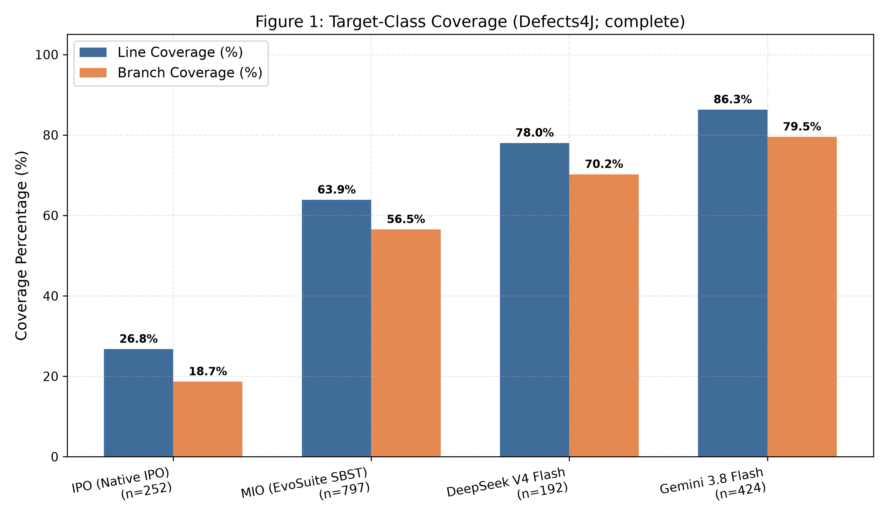

# สไลด์นำเสนอภายใน 10 นาที

ไฟล์นำเสนอ: [SQA_Presentation_10min.pptx](SQA_Presentation_10min.pptx) — เปิดใน PowerPoint เพื่อใช้กราฟและตารางที่แก้ไขได้ พร้อมบทพูดและเวลารายหน้าใน speaker notes

**หัวข้อ:** การเปรียบเทียบ Native IPO, MIO, DeepSeek และ Gemini บน Defects4J<br>
**วิชา:** CP353201 Software Quality Assurance · ภาคการศึกษา 1/2569<br>
**อาจารย์:** ผศ.ดร.ชิตสุธา สุ่มเล็ก

ต้นฉบับเนื้อหาสไลด์และบทพูดสำหรับทีม: **10 หน้าหลัก ใช้เวลา 9:30 นาที รวมเดโมทั้งสี่เทคนิค** และสำรอง 0:30 นาทีสำหรับการสลับหน้าจอหรือความล่าช้า ข้อมูลอ้างอิง snapshot 26 กันยายน 2026; การถามตอบยาวกว่านี้ต้องใช้เวลาที่อาจารย์จัดเพิ่ม

## ลำดับเวลาและผู้พูด

| หน้า | หัวข้อ | เวลา | เวลาสะสม | ผู้พูดแนะนำ |
|---|---|---:|---|---|
| 1 | ชื่อโครงการและทีม | 0:20 | 0:00–0:20 | Member 1 |
| 2 | เป้าหมายและขอบเขตจริง | 0:40 | 0:20–1:00 | Member 1 |
| 3 | การสร้าง suite ด้วย IPO และ MIO | 1:00 | 1:00–2:00 | Member 1 / 2 คนละ 0:30 |
| 4 | Prompt สำหรับ DeepSeek และ Gemini | 0:50 | 2:00–2:50 | Member 3 |
| 5 | วิธีประเมินกลางและตัวหาร | 0:50 | 2:50–3:40 | Member 4 |
| 6 | ผล coverage | 0:50 | 3:40–4:30 | Member 3 |
| 7 | ผล fault detection และ compile error | 1:00 | 4:30–5:30 | Member 4 |
| 8 | ต้นทุนการสร้างและข้อจำกัด | 0:50 | 5:30–6:20 | Member 2 |
| 9 | เดโมจริงทั้งสี่เทคนิค | 2:30 | 6:20–8:50 | Member 4 ควบคุมเครื่อง; เจ้าของเทคนิคช่วยอธิบาย |
| 10 | บทเรียนและการทำซ้ำ | 0:40 | 8:50–9:30 | Member 4 |
| — | เวลาสำรอง | 0:30 | 9:30–10:00 | ทั้งทีม |

**แนวทางจัดหน้า:** อัตราส่วน 16:9 พื้นสว่าง ตัวอักษรสีเข้ม ใช้สีเดียวกันแทนแต่ละเทคนิคทุกหน้า ไม่มีอิโมจิ หัวข้อประมาณ 32 pt ขึ้นไป เนื้อหา 22–26 pt และข้อความอ้างอิงอย่างน้อย 17 pt หนึ่งหน้ามีประเด็นหลักเดียว กราฟใช้พื้นที่ส่วนใหญ่ของหน้า คำบรรยายอยู่ใต้กราฟ เนื้อหาในช่อง “บทพูด” และภาคผนวกใช้ประกอบการซ้อม ไม่ใส่ทั้งหมดบนหน้าจอ

---

<!-- slide -->
## หน้า 1 — การสร้างชุดทดสอบอัตโนมัติบน Defects4J

**Native IPO · MIO / EvoSuite · DeepSeek V4 Flash · Gemini 3.8 Flash**

CP353201 Software Quality Assurance · มหาวิทยาลัยขอนแก่น

| ผู้จัดทำ | รหัสนักศึกษา |
|---|---|
| นายปวริศช์ ประมวล | 673380278-9 |
| นายแทนคุณ พันธ์นิกุล | 673380301-0 |
| นายธนภูมิ จันทรา | 673380272-1 |
| นายศิฆรินทร์ อุปจันทร์ | 673380292-5 |

<details><summary>บทพูด — 20 วินาที</summary>

สวัสดีครับ โครงการนี้เปรียบเทียบการสร้างชุดทดสอบด้วยอัลกอริทึมสองวิธีและ AI สองเครื่องมือบน Java Defects4J เราจะอธิบายวิธีสร้าง ผล coverage และการตรวจพบบั๊ก แล้วสาธิตการประเมินจริงครบทั้งสี่เทคนิคครับ

</details>

---

<!-- slide -->
## หน้า 2 — เป้าหมายและขอบเขตที่ประเมินได้

- เปรียบเทียบ **coverage, fault detection และต้นทุนการสร้าง suite**
- แค็ตตาล็อก **854 บั๊ก / 17 โครงการ** → 3,416 คู่บั๊ก–เทคนิค
- มี suite ที่ประเมินแล้ว **2,797 คู่**; ไม่มี suite **619 คู่ (`NO_SUITE`)**
- ครบการประเมิน suite ที่มีอยู่; ยังมีช่องที่ไม่มี suite ให้รัน

แหล่งข้อมูล: [สถิติรวม](../../results/master_descriptive_stats.json)

<details><summary>บทพูด — 40 วินาที</summary>

โจทย์กำหนดให้ทดสอบกับ Defects4J ทุกรายการ เราจึงทำบัญชีครบ 854 บั๊กใน 17 โครงการสำหรับทั้งสี่เทคนิค รวม 3,416 ช่อง แต่สร้างหรือรับรอง suite ได้ไม่ครบทุกช่อง มีผลประเมิน 2,797 ช่อง และอีก 619 ช่องไม่มี suite เราระบุส่วนที่ขาดไว้ชัดเจน ผลต่อไปจึงอ้างถึง suite ที่มีหลักฐาน ไม่กล่าวว่ารันทดสอบสำเร็จครบทั้ง 3,416 ช่องครับ

</details>

---

<!-- slide -->
## หน้า 3 — การสร้าง suite ด้วยอัลกอริทึม

| Native IPO — Member 1 | MIO / EvoSuite — Member 2 |
|---|---|
| วิเคราะห์ API → สร้าง factor และค่าของ input | กำหนดคลาสเป้าหมายและ coverage objectives |
| สร้าง combinations ให้ครอบคลุมทุกคู่ค่า (strength 2) | ค้นหาและปรับชุดทดสอบเพื่อครอบคลุมเป้าหมาย |
| สร้าง JUnit 4 และตรวจบน fixed version | ทดลอง budget 30 / 60 / 120 วินาที; seeds 101 / 102 / 103 |
| ส่งเฉพาะรายการที่ verified manifest และ hash ตรง | ส่ง test พร้อม scaffolding ที่จำเป็นให้ตัวรันกลาง |

**ผลส่งเข้า benchmark:** IPO 257 บั๊ก; MIO 834 บั๊ก

แหล่งข้อมูล: [Native IPO](../../Combinatorial_IPO/) · [MIO](../../MIO_Algorithm/)

<details><summary>บทพูด — 60 วินาที; แบ่งคนละ 30 วินาที</summary>

**Member 1:** IPO ลดจำนวนชุดค่าทดสอบด้วยการทำให้แต่ละคู่ค่าปรากฏอย่างน้อยหนึ่งครั้ง เราต้องสร้างโมเดล input และวิธีตรวจผลก่อน จึงสร้าง JUnit แล้วตรวจบน fixed version ตัวรันกลางรับเฉพาะ suite ที่ manifest ยืนยันและ hash ตรง ครอบคลุม 257 บั๊ก การครบคู่ค่าไม่ได้รับประกันว่าจะตรวจพบบั๊กทุกชนิด

**Member 2:** MIO ใน EvoSuite ใช้การค้นหาชุดทดสอบตามเป้าหมาย coverage เราทดลองสาม budgets และสาม seeds และส่ง scaffolding ที่ suite ต้องใช้ด้วย มี suite เข้า benchmark 834 บั๊ก ผล budget เป็นผลระหว่างการสร้าง ส่วน coverage และ FDR ที่นำมาเทียบสี่เทคนิคมาจากตัวรันกลางครับ

</details>

---

<!-- slide -->
## หน้า 4 — Prompt สำหรับ DeepSeek และ Gemini

**Source code + target class + defect context เมื่อมีข้อมูล → AI → JUnit 4 suite**

ข้อกำหนดหลักใน prompt:

- Java 8 / JUnit 4; package และชื่อคลาสถูกต้อง
- Assertions ตรวจค่าหรือสถานะจริง; ครอบคลุม boundary และ exception
- `@Test(timeout = 4000)`; ไม่ใช้ JUnit 5 หรือ mocking libraries
- เก็บ prompt, suite, token และเวลา generation เพื่อย้อนตรวจได้

**ข้อจำกัด:** บาง prompt ใช้ข้อมูล defect จึงเป็นการสร้าง test แบบรู้บริบทบั๊ก

หลักฐาน: [DeepSeek / Closure-105](../../Deepseek-v4_flash/Prompt/Closure_105b/actual_prompt_FoldConstants.md) · [Gemini / Chart-3](../../Gemini-3_8_flash/Prompt/Chart_3b/actual_prompt_TimeSeries.md)

<details><summary>บทพูด — 50 วินาที</summary>

AI สองเครื่องมือรับ source code และข้อกำหนดการสร้าง test ผ่าน KKU IntelSphere เราระบุ JUnit 4, package, assertion, boundary และ timeout ชัดเจน และเก็บ prompt จริงกับ suite ที่ได้ไว้ ยกตัวอย่าง prompt ของ Closure-105 ที่ลิงก์นี้ ข้อกำหนดใน prompt ไม่รับประกันว่า output จะคอมไพล์ผ่าน จึงต้องประเมินจริง อีกข้อจำกัดคือบางกรณีให้บริบท defect แก่โมเดล ผลนี้จึงไม่ใช่การค้นหาบั๊กแบบไม่รู้ข้อมูลล่วงหน้าทั้งหมดครับ

</details>

---

<!-- slide -->
## หน้า 5 — วิธีประเมินเดียวกันทั้งสี่เทคนิค

**Suite + hash → Docker / Defects4J → buggy และ fixed → coverage + สถานะ + log**

- `BUG_DETECTED`: test fail บน buggy และ suite ผ่านบน fixed
- FDR = จำนวนบั๊กที่ตรวจพบ ÷ จำนวนคู่ที่มี suite และถูกประเมิน
- Coverage: modified target classes; รวม covered ÷ total ทุกคลาสก่อนหาค่าเฉลี่ยรายเทคนิค
- Compile error และค่าที่วัดไม่ได้ไม่แทนด้วย coverage 0; `NO_SUITE` แยกไว้

แหล่งข้อมูล: [ตัวรันกลาง](../../scripts/run_benchmark.py) · [นิยามข้อมูล](../../results/DATA_DICTIONARY.md)

<details><summary>บทพูด — 50 วินาที</summary>

เราใช้ suite เดียวกันกับ buggy และ fixed version แล้วนับว่าตรวจพบเมื่อ buggy fail แต่ fixed ผ่าน นับหนึ่งบั๊กต่อเทคนิคแม้มีหลาย target classes ตัวหาร FDR รวม compile error และผลที่ fixed ไม่ผ่านด้วย ส่วน coverage ใช้เฉพาะค่าที่วัดได้และรวม covered กับ total ของ modified classes ก่อน ไม่เปลี่ยน compile error เป็นศูนย์ แต่ละผลมี suite hash และ run ID ให้ย้อนกลับไปดู log ได้ครับ

</details>

---

<!-- slide -->
## หน้า 6 — ผล coverage ของ suite ที่วัดได้



<p align="center">ค่าเฉลี่ย coverage; n = IPO 252, MIO 797, DeepSeek 192, Gemini 424</p>

**Gemini มีค่าเฉลี่ยสูงสุดในกลุ่มที่วัดได้: line 86.29% / branch 79.54%**

จำนวนและกลุ่มบั๊กที่วัดได้ต่างกันระหว่างเทคนิค จึงต้องอ่านร่วมกับ compile error

<details><summary>บทพูด — 50 วินาที</summary>

กราฟนี้แสดงค่าเฉลี่ย line และ branch coverage เฉพาะผลที่มีการวัดจริง Gemini สูงสุดที่ประมาณ 86 และ 80 เปอร์เซ็นต์ ตามด้วย DeepSeek, MIO และ IPO แต่ฐานข้อมูลแต่ละแท่งต่างกัน เช่น DeepSeek วัดได้ 192 บั๊ก ขณะที่ MIO วัดได้ 797 บั๊ก จึงไม่ควรสรุปจากความสูงของแท่งอย่างเดียว และ coverage สูงยังไม่ได้แปลว่า assertion จะตรวจพบบั๊กเสมอไป เดโมจะมีตัวอย่างนี้ครับ

</details>

---

<!-- slide -->
## หน้า 7 — การตรวจพบบั๊กและความสำเร็จในการคอมไพล์

| เทคนิค | ตรวจพบ / ประเมิน | FDR | Compile error |
|---|---:|---:|---:|
| Native IPO | 37 / 257 | 14.40% | 5 / 257 |
| MIO | 5 / 834 | 0.60% | 37 / 834 |
| DeepSeek | 11 / 853 | 1.29% | 661 / 853 |
| Gemini | 107 / 853 | 12.54% | 429 / 853 |

**รวมผลตรวจพบ 144 บั๊กไม่ซ้ำ / 853 บั๊กที่มี suite อย่างน้อยหนึ่งเทคนิค (16.88%)**

Union เป็นการรวมผลจากการรันเดิม; `NO_SUITE` 619 คู่ไม่อยู่ในตัวหาร FDR ข้างต้น

แหล่งข้อมูล: [Master dataset](../../results/master_benchmark_summary.csv) · [Analytics](../../results/advanced_analytics.json)

<details><summary>บทพูด — 60 วินาที</summary>

Gemini ตรวจพบจำนวนมากสุด 107 บั๊ก ส่วน IPO มีสัดส่วนตรวจพบสูงสุด 14.40 เปอร์เซ็นต์ แต่ IPO มี suite เพียง 257 บั๊ก จึงเป็นคนละฐานกับ Gemini ที่ 853 บั๊ก อีกด้านหนึ่ง AI มี compile error มาก โดยเฉพาะ DeepSeek 661 จาก 853 คู่ ซึ่งมีผลต่อการใช้งานจริง เมื่อนำผลตรวจพบของทุกเทคนิคมารวมแบบไม่ซ้ำ ได้ 144 บั๊ก แสดงว่าแต่ละเทคนิคช่วยตรวจพบบางกรณีเพิ่มเติมได้ ทั้งนี้ไม่ได้รัน suite ensemble ใหม่ครับ

</details>

---

<!-- slide -->
## หน้า 8 — ต้นทุนการสร้างและข้อจำกัด

- **MIO:** เพิ่ม budget 30 → 120 วินาที; generation coverage เฉลี่ย 65.73% → 70.82%
- **AI:** เวลาเฉลี่ยต่อ generation record — DeepSeek 295.54 วินาที; Gemini 89.78 วินาที
- **ไม่มี suite 619 คู่:** IPO 597, MIO 20, DeepSeek 1, Gemini 1
- **บทเรียน:** การเรียก API, dependency, oracle และการคอมไพล์มีผลต่อความสำเร็จของ suite

MIO n = 1,023 / 989 records ที่ 30 / 120 วินาที; AI n = 1,082 / 1,079 records ตามลำดับ เป็นสถิติ generation ที่แยกจาก FDR

แหล่งข้อมูล: [Analytics](../../results/advanced_analytics.json) · [Suite gap audit](../../results/suite_gap_audit.csv)

<details><summary>บทพูด — 50 วินาที</summary>

การเพิ่ม budget ของ MIO ทำให้ coverage ระหว่างสร้างสูงขึ้นในข้อมูลชุดนี้ แต่จำนวน records แต่ละ budget ต่างกัน รายละเอียดแบบจับคู่อยู่ในภาคผนวก ฝั่ง AI Gemini ใช้เวลาเฉลี่ยต่อ record ต่ำกว่า DeepSeek แต่ log ยังเชื่อมกับ benchmark run ไม่ครบ จึงไม่คำนวณต้นทุนต่อบั๊กที่ตรวจพบ ส่วน suite ที่ขาดมีทั้งยังไม่พร้อมสร้างและสร้างล้มเหลว เราเรียนรู้ว่าคุณภาพ input model, oracle และความเข้ากันได้กับ environment สำคัญพอ ๆ กับตัวสร้าง test ครับ

</details>

---

<!-- slide -->
## หน้า 9 — เดโมการประเมินจริงทั้งสี่เทคนิค

```powershell
.\scripts\demo_four_techniques.ps1
```

| เทคนิค / ตัวอย่าง | Buggy fail → fixed fail | ผลจากรอบที่บันทึกไว้ |
|---|---:|---|
| IPO / Chart-14 | 48 → 0 | BUG_DETECTED |
| MIO / Jsoup-45 | 0 → 0 | NOT_DETECTED |
| DeepSeek / Closure-105 | 2 → 0 | BUG_DETECTED |
| Gemini / Chart-3 | 2 → 0 | BUG_DETECTED |

**ชี้ให้เห็น:** suite ที่ใช้ · coverage · buggy/fixed · run ID และ hash

ตารางเป็นหลักฐานรอบก่อน; ระหว่างเดโมอธิบายตาม output สด ตัวอย่างทั้งสี่เป็นกรณีที่เลือกมา ไม่ใช่การเปรียบเทียบสี่เทคนิคบนบั๊กเดียวกัน

<details><summary>บทพูดและคิวเดโม — 150 วินาที</summary>

**0:00–0:15:** “เดโมนี้ใช้ suite ที่สร้างไว้แล้วมารันประเมินใหม่ครบสี่เทคนิค” เริ่มสคริปต์ใน terminal ที่เตรียมไว้

**0:15–1:40:** ระหว่างรัน ชี้ไฟล์ suite และอธิบายว่าตัวรันใช้ buggy/fixed ตรวจผลเดียวกัน เปิด log หรือ source ที่เตรียมไว้เฉพาะจุด ไม่อ่าน output ทุกบรรทัด เจ้าของแต่ละเทคนิคช่วยอธิบายเมื่อกรณีของตนแสดงผล

**1:40–2:15:** เมื่อผลออกครบ ชี้หนึ่งกรณี BUG_DETECTED และกรณี MIO ที่ line coverage 93.35% ในรอบก่อนแต่ไม่ตรวจพบบั๊ก เพื่ออธิบายความต่างระหว่าง coverage กับ fault detection ตรวจ run ID/hash ที่ output จริง

**2:15–2:30:** “ผลนี้แสดงขั้นตอนประเมินจริงสี่กรณี ส่วนผลรวม 854 บั๊กดูได้ใน master dataset” แล้วกลับหน้าสรุป

**จุดเปลี่ยนแผน:** หากถึง 2:00 นาทีของช่วงเดโมแล้วยังรันไม่ครบ หรือระบบมี error ให้แสดงไฟล์ผลที่บันทึกไว้ตาม [คู่มือเดโม](../demo/DEMO_GUIDE.md) และพูดให้ชัดว่าเป็นผลรอบก่อน เปิดผลครบสี่เทคนิคแล้วกลับสไลด์ภายใน 2:30 นาที ไม่ปิด terminal กลางคันเพราะสคริปต์ต้องคืนไฟล์เดิมหลังจบ

</details>

---

<!-- slide -->
## หน้า 10 — บทเรียนและหลักฐานสำหรับทำซ้ำ

- **Coverage สูงไม่รับประกันการตรวจพบบั๊ก:** ต้องมี assertion ที่แยก buggy/fixed ได้
- **ไม่มีวิธีที่ดีที่สุดทุกด้าน:** อ่าน coverage, FDR, compile error และ suite ที่ขาดร่วมกัน
- **ทำซ้ำได้จาก repository:** source, tests, prompts, configuration, Docker, master data และ run logs

[GitHub: Bigzzz0/ProjectSQA](https://github.com/Bigzzz0/ProjectSQA) · [รายงาน PDF](../final/SQA_Final_Report.pdf) · [คู่มือเดโม](../demo/DEMO_GUIDE.md)

<details><summary>บทพูด — 40 วินาที</summary>

สิ่งที่ได้เรียนรู้คือ coverage วัดว่า test เข้าไปถึงโค้ดมากแค่ไหน ส่วนการตรวจพบบั๊กต้องมี assertion ที่แยก buggy กับ fixed ได้ด้วย ผลของชุดนี้ Gemini มี coverage เฉลี่ยสูงสุด ส่วน IPO มี FDR ต่อ suite สูงสุด แต่ทั้งคู่มีข้อจำกัดต่างกัน เราเก็บ source, tests, prompt, configuration และ log พร้อมขั้นตอนรันไว้ใน GitHub เพื่อให้ตรวจและทำซ้ำได้ ขอบคุณครับ

</details>

---

## ภาคผนวกสำหรับตอบคำถาม — ไม่อยู่ใน 10 หน้าหลัก

<details><summary>A. ผลครบทั้งสี่เทคนิคและสถานะการประเมิน</summary>

| เทคนิค | มี suite / 854 | NO_SUITE | Coverage n | Line / Branch เฉลี่ย | ตรวจพบ | FDR ต่อ suite | ตรวจพบ / 854 |
|---|---:|---:|---:|---:|---:|---:|---:|
| Native IPO | 257 | 597 | 252 | 26.76% / 18.67% | 37 | 14.40% | 4.33% |
| MIO | 834 | 20 | 797 | 63.85% / 56.51% | 5 | 0.60% | 0.59% |
| DeepSeek | 853 | 1 | 192 | 78.02% / 70.22% | 11 | 1.29% | 1.29% |
| Gemini | 853 | 1 | 424 | 86.29% / 79.54% | 107 | 12.54% | 12.53% |

`NOT_DETECTED`: test ผ่านทั้งสองเวอร์ชัน; `FLAKY_OR_REGRESSION`: fixed version ไม่ผ่าน รวมกรณี buggy ผ่านแต่ fixed fail ด้วย ชื่อสถานะนี้ไม่ได้พิสูจน์ว่าทดสอบแล้วเกิดความไม่แน่นอนซ้ำหลายรอบ `TIMEOUT`: คำสั่ง coverage/test เกิน 240 วินาที ซึ่งต่างจาก timeout ของ test method ที่ 4 วินาที

Runner จำแนกจาก buggy/fixed ไม่ได้ยืนยันเชิงความหมายว่า failure ตรงกับ root cause ที่รายงานใน Defects4J

ผลตรวจพบเฉพาะเทคนิค: IPO 27, MIO 5, DeepSeek 5, Gemini 91 บั๊ก; union รวม 144 บั๊ก ผล single/multiclass เพิ่มเติมอยู่ใน [Analytics](../../results/advanced_analytics.json)

</details>

<details><summary>B. Budget, token และสถิติแบบจับคู่</summary>

| MIO budget | Records | Generation coverage เฉลี่ย | เวลา generation เฉลี่ย |
|---|---:|---:|---:|
| 30 วินาที | 1,023 | 65.73% | 68.29 วินาที |
| 60 วินาที | 1,015 | 68.73% | 90.62 วินาที |
| 120 วินาที | 989 | 70.82% | 194.41 วินาที |

Budget summary ใช้ criterion `LINE:BRANCH` และรายงาน coverage รวมค่าเดียว; ไม่ใช่การวัด line/branch แยก เวลา generation รวมขั้นตอนอื่นจึงยาวกว่า search budget ได้

Wilcoxon จับคู่ project–bug–target class: 30→60 วินาที n=1,006, p หลัง Holm=3.39×10⁻⁸⁴; 60→120 วินาที n=981, p หลัง Holm=1.54×10⁻⁶⁷ ผลนี้ยังไม่สรุป budget ที่เหมาะที่สุดทั่วไป

| AI generation | Records | Tokens เฉลี่ยต่อ record | เวลาเฉลี่ยต่อ record |
|---|---:|---:|---:|
| DeepSeek | 1,082 | 21,045.26 | 295.54 วินาที |
| Gemini | 1,079 | 20,855.06 | 89.78 วินาที |

Generation logs ไม่มี run ID ที่เชื่อม benchmark ครบ จึงไม่คำนวณ token ต่อบั๊กที่ตรวจพบ ชื่อโมเดลเป็น identifier ที่ใช้ในโครงการ ไม่ได้ยืนยัน provider model ID ทุก record

| คู่เปรียบเทียบ line coverage | Matched N | p หลัง Holm | Rank-biserial |
|---|---:|---:|---:|
| Gemini – DeepSeek | 136 | 4.92×10⁻¹² | 0.834 |
| MIO – Gemini | 399 | 7.29×10⁻³³ | -0.759 |
| MIO – DeepSeek | 183 | 0.0175 | -0.222 |
| MIO – IPO | 245 | 1.64×10⁻³⁸ | 0.993 |
| Gemini – IPO | 147 | 1.90×10⁻²⁴ | 1.000 |
| DeepSeek – IPO | 69 | 4.92×10⁻¹² | 1.000 |

เปรียบเทียบเฉพาะบั๊กที่ทั้งสองเทคนิควัด line coverage ได้ ใช้ Wilcoxon signed-rank และ Holm correction หกคู่; ค่าบวกแปลว่าเทคนิคทางซ้ายมี coverage สูงกว่า เป็น exploratory analysis ของกลุ่มที่มีข้อมูลครบ

</details>

<details><summary>C. สาเหตุที่ไม่มี suite และข้อจำกัด</summary>

- IPO 597 คู่: generation/verification error 37 และ skipped/not ready 560; ต้องพัฒนา adapter, entry point หรือวิธีตรวจผลเพิ่มเติมตาม manifest
- IPO verified manifest มี 277 class-level suite records ครอบคลุม 257 บั๊ก; inventory 1,070 class records เทียบ catalog 1,073 modified-class entries มีส่วนต่าง 3 รายการที่ยังไม่ reconcile
- MIO 20 คู่: generation failure จาก dependency/compile, EvoSuite NPE, JVM crash และ encoding ตามรายงานของ Member 2
- DeepSeek และ Gemini อย่างละ 1 คู่: ยังไม่มี suite ที่เข้าประเมินได้; ใช้เหตุรายรายการจาก [audit](../../results/suite_gap_audit.csv)
- ทุกคู่ที่ไม่มี suite คง `NO_SUITE`; ไม่ใช้เป็นหลักฐานว่าผ่านการทดสอบหรือว่าเทคนิคนั้นสร้างไม่ได้ในทุก environment

</details>

## ความสอดคล้องกับโจทย์อาจารย์

อ้างอิง [โจทย์หน้า 3 ข้อ 2.2](../reference/SQA_Project_2026_Assignment.pdf) ตารางนี้ใช้ตรวจความครบของเนื้อหานำเสนอ ไม่ใช่การรับรองว่าข้อจำกัดของการทดลองหมดไป

| สิ่งที่อาจารย์กำหนด | หน้าที่นำเสนอ | หลักฐาน |
|---|---|---|
| พัฒนาและใช้ 2 อัลกอริทึมสร้าง suite แล้วประเมิน | 3, 5–7, 9 | Native IPO / MIO source, suites, configuration และ logs |
| ใช้ prompt กับ 2 AI tools สร้าง suite แล้วประเมิน | 4–7, 9 | Prompt จริง, test code, generation logs และผลกลาง |
| ขอบเขต Defects4J ทุกรายการและการวัดผล | 2, 5–8 | Catalog 854 บั๊ก / 17 โครงการ; เปิดเผย 619 คู่ที่ไม่มี suite |
| เปรียบเทียบ วิเคราะห์ บทเรียน และปัญหาที่พบ | 6–8, 10 | Coverage, FDR, compile errors, generation costs และข้อจำกัด |
| รายงานและหลักฐานที่คนอื่นทำซ้ำได้ | 10 | DOCX/PDF, README, Docker, source, tests, prompts, config และ results |
| Presentation และ Demo ตัวอย่างสำคัญ | 1–10 โดยเฉพาะ 9 | เดโมทั้งสี่เทคนิคพร้อม buggy/fixed และหลักฐานสำรอง |
| ส่ง GitHub และ Google Classroom พร้อมชื่อและรหัส | 1, 10 | README และไฟล์ส่ง; ตัวแทนกลุ่มต้องตรวจการส่ง Classroom จริง |

## ซ้อมก่อนนำเสนอ

1. เปิด Docker, container, terminal, prompt ตัวอย่าง และผลสำรองให้พร้อมก่อนเริ่มจับเวลา อ่านเงื่อนไขเตรียมเครื่องใน [คู่มือเดโม](../demo/DEMO_GUIDE.md)
2. ซ้อมด้วยเครื่องที่จะใช้จริงอย่างน้อยหนึ่งรอบ จับเวลาตั้งแต่หน้า 1 จนจบหน้า 10; เป้าหมายไม่เกิน 9:30 นาที เวลานี้เป็นงบที่ออกแบบไว้ ต้องยืนยันด้วยการซ้อม
3. ถ้าพูดช้า ให้ตัดรายละเอียดในบทพูดและงดเปิดภาคผนวก คงวิธีสร้างของทั้งสี่เทคนิค, coverage/FDR, ข้อจำกัด และเดโมไว้
4. ถ้าเดโมเกินสองนาทีให้สลับไปหลักฐานรอบก่อนตามคู่มือ ระบุที่มาของผลตรงตามจริง และกลับหน้าสรุปภายในเวลา 8:50 ของการนำเสนอ
5. ก่อนส่งตรวจว่ารายงาน สไลด์ และ master ใช้ snapshot เดียวกัน และตัวแทนกลุ่มส่งลิงก์/ไฟล์เข้า Google Classroom แล้ว
